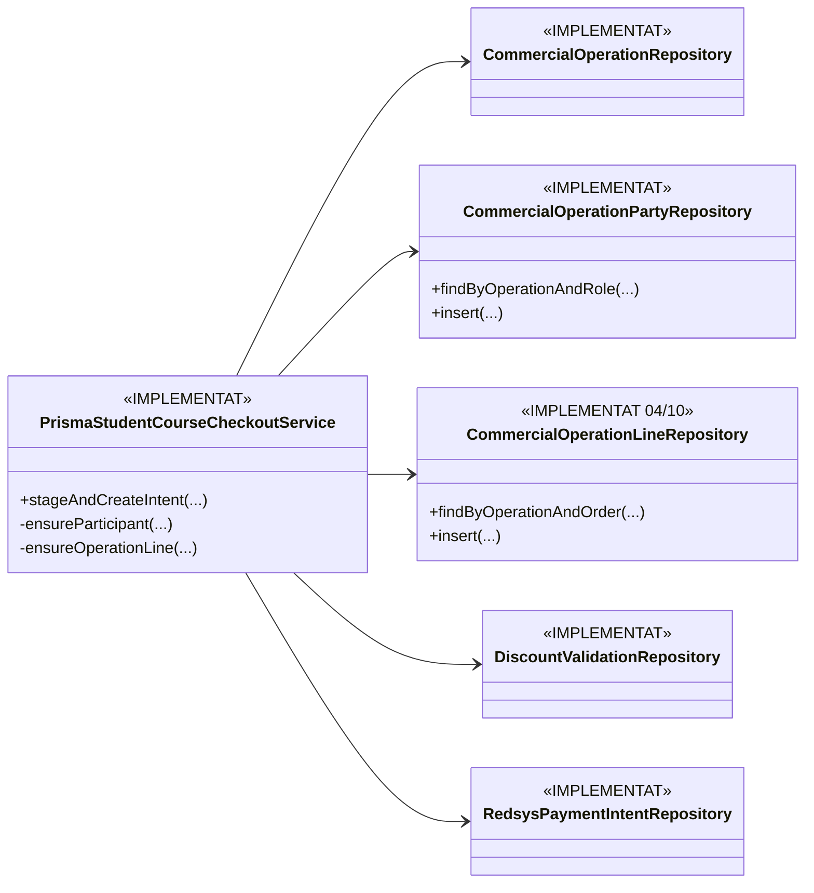
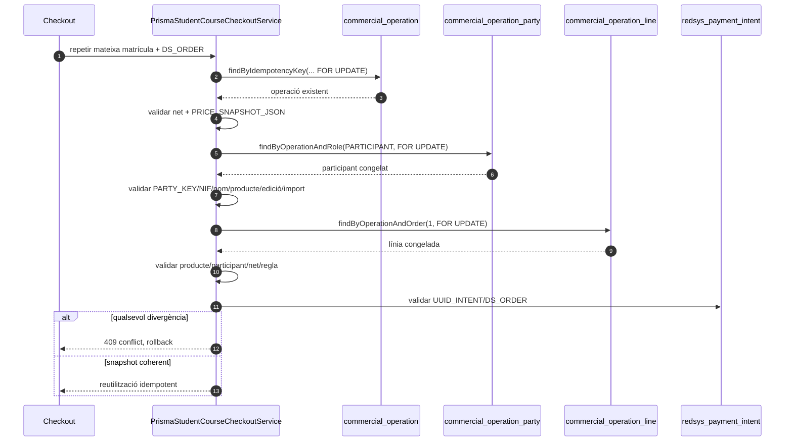

# UC-020 — Revalidació exhaustiva 04/10/2026

**Cas:** UC-020 · Aplicar Alumne PrisMa  
**Base reauditoria:** `main@6c8137ff1652ac89a1a81ad18cf79fc4689b1757`  
**Branca canònica de treball:** `refactor/uc-020-reconcile-runtime-2026-10-02` · PR #112  
**Criteri:** separar estrictament **DOCUMENTAT**, **IMPLEMENTAT**, **VERIFICAT** i **PENDENT**. Una prova històrica no acredita automàticament el HEAD actual.

## 1. Resultat de l'inventari

No falta cap categoria documental principal exigida per l'auditoria UC-020:

| Peça | Fitxer | Estat |
| --- | --- | --- |
| Fitxa funcional | `../06-fitxes-funcionals/uc-020.md` | DOCUMENTAT |
| Cas d'ús/UML integrat | `uc-020-aplicar-alumne-prisma.md` | DOCUMENTAT |
| Classes ACTUAL/FINAL | `uc-020-classes-actual-final.md` | DOCUMENTAT |
| Seqüències ACTUAL/FINAL | `uc-020-sequencies-actual-final.md` | DOCUMENTAT |
| Activitats per pàgina/apartat P01–P06 | `uc-020-activitats-pagines-actual-final.md` | DOCUMENTAT |
| Auditoria i traçabilitat | `uc-020-auditoria-tracabilitat-2026-09-29.md` | DOCUMENTAT |
| Matriu AP-01…AP-84 | `uc-020-matriu-proves-ap-01-84.md` | DOCUMENTAT |
| Evidència CI | `uc-020-evidencia-ci-2026-10-03.md` | DOCUMENTAT; històrica per commit |
| Acta de tancament | `uc-020-tancament-auditoria-2026-10-02.md` | DOCUMENTAT |
| Revalidació actual | aquest document | DOCUMENTAT 04/10 |

## 2. Diferència crítica entre `main` i PR #112

La reauditoria no considera `main` equivalent a la branca d'auditoria.

### `main` auditat

A la base indicada:

- la fitxa UC-020 encara era v1.4 i contenia estats històrics ja superats;
- `enviarInscripcio.php` encara acceptava `tipusCurs`, `tipusDescompte`, `preuCar` i `preuDescompte` provinents del navegador sense el hardening AP complet;
- `buscarAlumnePrisMa.php` conservava la branca SQL `FACTURA_RELACIONADA != NULL`;
- `PrismaStudentDiscountPolicy` continuava en `ALUMNE_PRISMA_LEGACY_V1`;
- `LegacyPrismaStudentHistoryRepository` no excloïa la matrícula actual ni congelava l'avaluació a `DATA_INSC`.

### PR #112 revalidat

La branca conté:

- policy `ALUMNE_PRISMA_WEB_LEGACY_V2`;
- exclusió de la matrícula actual i tall temporal de l'historial;
- revalidació server-side de l'alta AP i de `TIPUS_CURS`;
- rebuig AP + promoció;
- tarifa AP fail-closed davant absència/ambigüitat;
- checkout de targeta AP server-authoritative;
- P05 POST + sessió + permís + CSRF + `requestId`;
- P06 amb tipus/estat/import AP rellegits o recalculats al servidor;
- `PaymentLinkService` amb guard de classificació/estat;
- proves específiques i evidència per commit.

Per tant, **les correccions de #112 no s'han de descriure com a implementades a `main` fins que el PR sigui integrat**.

## 3. Revalidació del codi PHP/JS real per superfície

| Superfície | Codi inspeccionat | DOCUMENTAT | IMPLEMENTAT a #112 | VERIFICAT | PENDENT |
| --- | --- | --- | --- | --- | --- |
| P01 · descomptes públics | pàgina/fitxa de descompte | sí | sense mutació econòmica | inspecció | unificar origen de dades amb oferta canònica |
| P02 · inscripció | `mostrarInscripcions.min.js`, `calcularPreu.php`, `buscarAlumnePrisMa.php`, `enviarInscripcio.php` | sí | hardening AP servidor | CI històric + inspecció del HEAD | `offer_id` immutable i migració general GET/PII → POST/CSRF |
| P03 · confirmació | rutes automàtiques + estat matrícula | sí | snapshot/intenció AP | CI històric + inspecció | adoptar `payment_link` com a entrada canònica |
| P04 · pagament | `pagina_efectuar_pagament_automatic.php` → API SIF → Redsys | sí | AP server-authoritative | CI històric/simulat | E2E real preproducció i transferència unificada |
| P05 · intranet validar descompte | endpoint de resolució + boundary tests | sí | POST/permís/CSRF/requestId | CI històric de frontera | idempotència/versionat persistent multioperador |
| P06 · canvi de curs | `realitzarCanviCurs_CanviCurs.php` + preview SIF | sí | imports AP autoritatius i selector específic | inspecció; test nou pendent HEAD CI | unificar elegibilitat P06 amb policy v2 (AP-73) |

## 4. Troballes noves 04/10

| ID | Troballa | Resolució |
| --- | --- | --- |
| UC020-125 | En un reintent de checkout, l'operació/snapshot i la línia es revalidaven, però el participant només s'inseria en crear l'operació; una alteració posterior del participant no quedava contrastada explícitament. | **TANCAT CODI**: `ensureParticipant()` comprova PARTY_KEY, NIF, nom, producte, edició i import abans de reutilitzar l'operació. |
| UC020-126 | `PrismaStudentCourseCheckoutService` encara contenia SQL directe de `commercial_operation_line`. | **TANCAT REFACTOR**: nou `CommercialOperationLineRepository`; el servei conserva atomicitat però ja no escriu la línia amb SQL inline. |
| UC020-127 | PR #158 aporta part d'aquest refactor, però també perd guards ja corregits a #112 (autoacreditació/tall temporal i classificació comercial). | **DECISIÓ TANCADA**: no portar #158 sencer; només integrar millores que preservin `DATA_INSC`, exclusió de matrícula actual i `BILLABLE`. |
| UC020-128 | Els workflows del HEAD nou s'han creat però encara estan `queued`. | **PENDENT VERIFICACIÓ HEAD**: no promocionar els tests nous a VERIFICAT_CI fins observar resultat. |

## 5. Diagrama FINAL del delta 04/10

## 6. Seqüència de reintent FINAL

## 7. Estat global 04/10

### DOCUMENTAT

**COMPLET per a l'abast demanat.** No falta fitxa, classes, seqüències, activitats P01–P06, traçabilitat, matriu de proves ni evidència.

### IMPLEMENTAT

**AVANÇAT a PR #112.** El hardening monetari AP, policy v2, checkout AP, P05, P06 parcial, repositoris comercials i guards de reintent estan codificats a la branca.

### VERIFICAT

- **Sí, per evidència històrica vinculada a commits concrets:** proves UC-020 i E2E simulat documentats el 03/10.
- **Sí, per inspecció estàtica del HEAD actual:** guards d'autoritat servidor, historial temporal, participant/línia immutable i separació de repositoris.
- **No encara per CI del HEAD 04/10:** workflows actuals en cua.

### PENDENT

1. CI del HEAD actual.
2. E2E real controlat: alta AP → pàgina de pagament → intenció → Redsys/callback → worker → cobrament/factura.
3. Configuració i evidència de cutover/drain en preproducció.
4. `payment_link` / `offer_id` com a contracte canònic de P02–P04.
5. Transferència unificada amb el mateix estat comercial.
6. Idempotència/versionat persistent P05 multioperador.
7. Migració general de l'alta llegada GET+PII a POST+CSRF.
8. Model fiscal explícit per fraccionament AP; actualment fail-closed.
9. Unificar P06 amb `PrismaStudentDiscountPolicy` v2.

## 8. Criteri de tancament

L'auditoria documental i de codi queda **AUDIT_CLOSED_REVALIDATED_2026-10-04**. Això no és un `GO_PRODUCTION`: el rollout continua bloquejat fins a CI del HEAD i E2E real/preproducció.

## 9. Correcció de classificació del runtime pay

La revalidació posterior ha trobat que `codi-drive/README.md` classifica `pay-prisma-cat-canvis-verifactu` com a **candidata**, no com a còpia desplegada. A més:

- `web-actual/pagina_efectuar_pagament_automatic.php` genera Redsys directament;
- la candidata pay sí crea la intenció SIF i consumeix el seu `DS_ORDER`/import;
- el nucli SIF està implementat;
- no hi ha evidència de repo suficient per saber quina versió està desplegada a `pay.prisma.cat`.

Per això l'estat P03/P04 queda: **ACTUAL/FALLBACK inspeccionat + PONT CANDIDAT IMPLEMENTAT + DEPLOY/CUTOVER/E2E PENDENTS**.

Vegeu [inventari runtime](uc-020-inventari-runtime-pay-prisma-2026-10-04.md).
