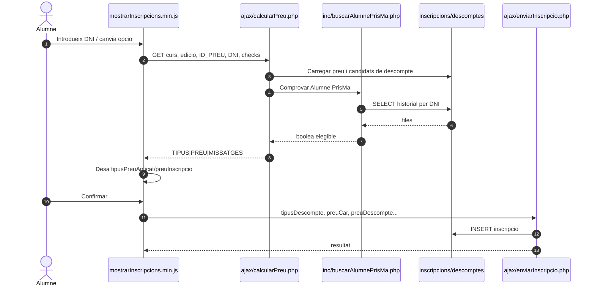
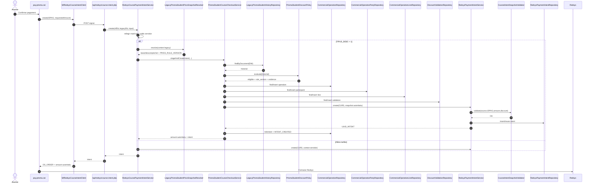
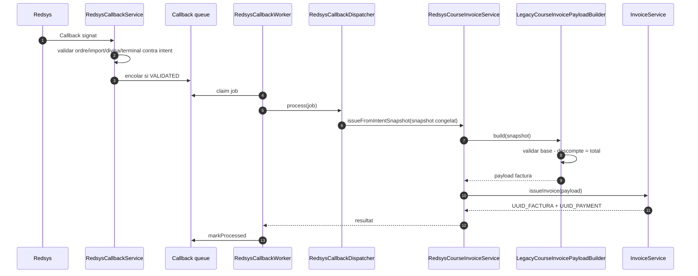

# UC-020 — Diagrames de seqüència ACTUAL i FINAL

**Data d'auditoria:** 30/09/2026

## 1. Seqüència ACTUAL — preview i alta

**Problema de frontera:** la confirmació confia en dades comercials mantingudes al navegador; no existeix una oferta servidor immutable entre preview i commit.

## 2. Seqüència FINAL — checkout CURS integrat i intenció

**Regla:** el navegador no és l'autoritat de l'import que arriba a Redsys. El servei rellegeix el context servidor; per Alumne PrisMa, el mateix snapshot comercial origina operació, validació, línia i intenció.

## 3. Seqüència FINAL — callback i factura

**Regla:** el callback no reavalua Alumne PrisMa. Consumeix la decisió congelada abans del TPV.

## 4. Invariants CURS implementats en aquesta branca

Abans de crear la intenció:

- `source_id == snapshot.inscription.ID`;
- `intent.IDPAG == snapshot.inscription.IDPAG`;
- `expected_amount == snapshot.payment.amount`;
- snapshot amb `inscription`, `course` i `payment` obligatoris;
- si existeix `discount`, exigeix `origin` i `mode`;
- `discount.base - discount.amount == payment.amount`.

## 5. Pendent

- retirar completament l'autoritat dels imports/tipus del navegador en l'**alta** llegat, anterior al checkout;
- harmonitzar el checkout CURS amb `PaymentLinkService` / `CommercialOfferService` com a model únic;
- definir pagament Alumne PrisMa fraccionat/reprès, actualment fail-closed;
- ratificar les decisions `UC20-DEC-001…006`;
- conservar evidència E2E/preproducció completa.
