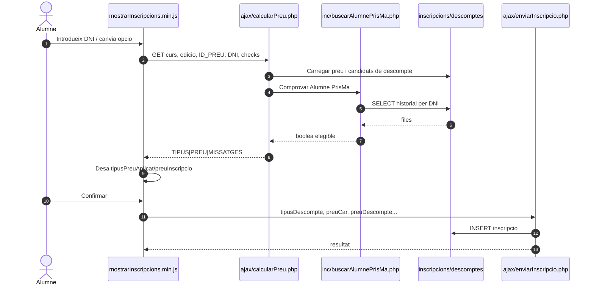
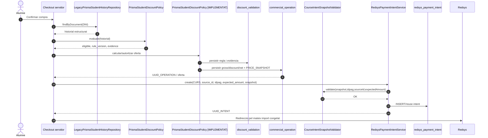
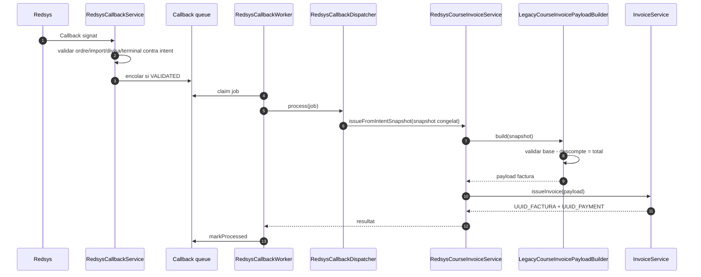

# UC-020 — Diagrames de seqüència ACTUAL i FINAL

**Data d'auditoria:** 30/09/2026

## 1. Seqüència ACTUAL — preview i alta

**Problema de frontera:** la confirmació confia en dades comercials mantingudes al navegador; no existeix una oferta servidor immutable entre preview i commit.

## 2. Seqüència FINAL — decisió comercial i intenció

## 3. Seqüència FINAL — callback i factura

**Regla:** el callback no reavalua Alumne PrisMa. Consumeix la decisió congelada abans del TPV.

## 4. Invariants CURS implementats en aquesta branca

Abans de crear la intenció:

- `source_id == snapshot.inscription.ID`;
- `intent.IDPAG == snapshot.inscription.IDPAG`;
- `expected_amount == snapshot.payment.amount`;
- snapshot amb `inscription`, `course` i `payment` obligatoris;
- si existeix `discount`, exigeix `origin` i `mode`;
- `discount.base - discount.amount == payment.amount`.

## 5. Estat de tancament

- l'alta AP llegada encara no crea una oferta SIF nativa, però **revalida al servidor** historial i tarifa abans de persistir;
- la resolució d'intranet actual ja és POST + sessió + permís + CSRF + `requestId`;
- les decisions UC20-DEC-001…006 queden tancades a `ALUMNE_PRISMA_WEB_LEGACY_V2`;
- `payment_link`, transferència i l'E2E navegador → callback → factura es mantenen com a gates de migració/rollout.

El **checkout de targeta actiu** crea operació/validació/intenció i vincula `UUID_OPERATION ↔ UUID_INTENT` via `course-intent`. El navegador pot continuar mostrant un preview llegat, però ja no pot fixar l'import AP persistit ni el que s'envia finalment a Redsys.

### 5.1. Tall temporal de l'elegibilitat

Abans de crear la intenció, `PrismaStudentCourseCheckoutService` exclou la matrícula actual de l'historial i només admet antecedents amb `DATA_INSC <= DATA_INSC` de la matrícula tarifada. Això elimina autoacreditació i elegibilitat retroactiva.
