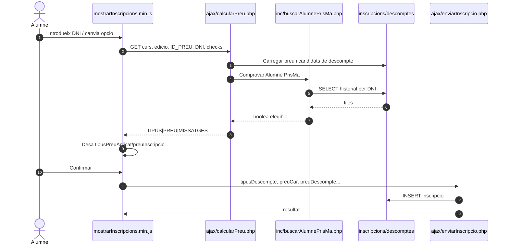
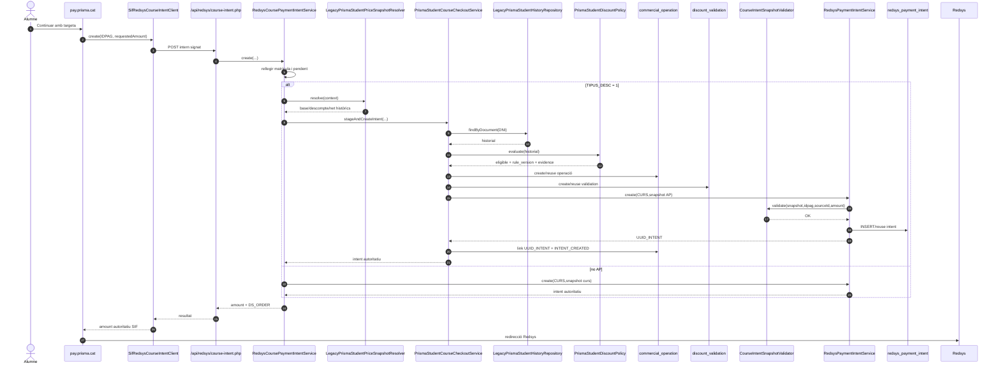
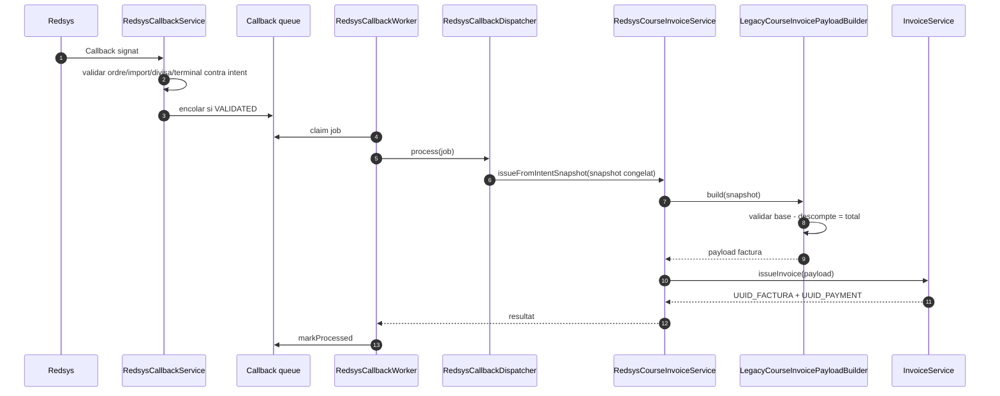

# UC-020 — Diagrames de seqüència ACTUAL i FINAL

**Data d'auditoria:** 30/09/2026 · reconciliació runtime 02/10/2026

## 1. Seqüència ACTUAL — preview i alta

**Problema de frontera:** la confirmació confia en dades comercials mantingudes al navegador; no existeix una oferta servidor immutable entre preview i commit.

## 2. Seqüència IMPLEMENTADA — pagament CURS amb Alumne PrisMa

**Important:** aquesta seqüència és executable en el camí de pagament real. El que continua llegat és la generació/acceptació de l'oferta durant preview/alta.

## 3. Seqüència FINAL — callback i factura

**Regla:** el callback no reavalua Alumne PrisMa. Consumeix la decisió congelada abans del TPV.

## 4. Invariants CURS implementats

Abans de crear la intenció:

- `source_id == snapshot.inscription.ID`;
- `intent.IDPAG == snapshot.inscription.IDPAG`;
- `expected_amount == snapshot.payment.amount`;
- snapshot amb `inscription`, `course` i `payment` obligatoris;
- si existeix `discount`, exigeix `origin` i `mode`;
- `discount.base - discount.amount == payment.amount`.

## 5. Pendent

- substituir preview/alta llegats perquè la confirmació accepti una oferta servidor i no imports/tipus del navegador;
- integrar, si es manté el disseny, `payment_link` amb les rutes actives de confirmació/pagament;
- ratificar les decisions de negoci de la policy futura;
- test E2E complet navegador → oferta → pagament → callback → factura i evidència de preproducció.
