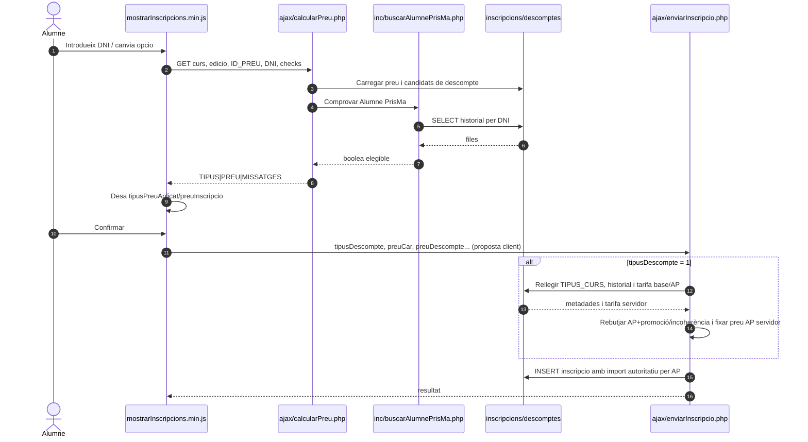
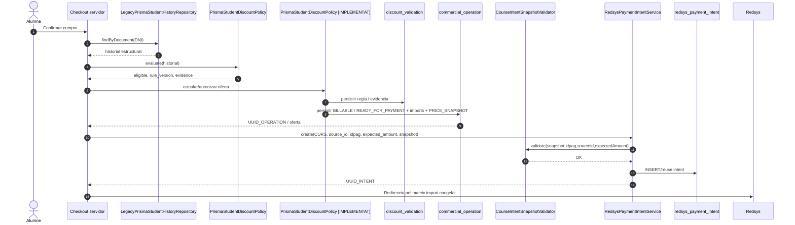
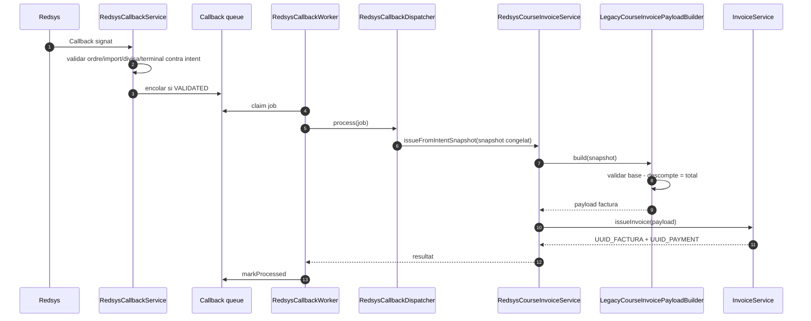
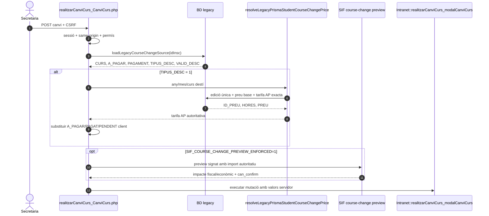
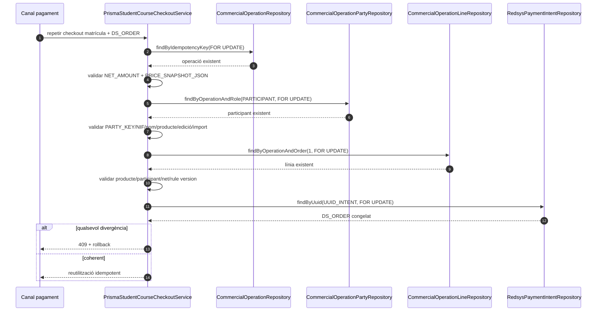

# UC-020 — Diagrames de seqüència ACTUAL i FINAL

**Data d'auditoria:** 30/09/2026

## 1. Seqüència ACTUAL — preview i alta



**Problema de frontera revalidat:** el navegador encara transporta globals comercials, però per Alumne PrisMa la confirmació rellegeix i imposa l'autoritat monetària de servidor. El buit que resta és de model: preview i commit no comparteixen encara una oferta servidor immutable/`offer_id`, i la protecció equivalent no està generalitzada a tots els tipus de descompte.

## 2. Seqüència FINAL — decisió comercial i intenció



## 2.1. Seqüència FINAL canònica — payment_link (infra implementada, wiring pendent)

```mermaid
sequenceDiagram
autonumber
actor A as Alumne
participant Web as P03/P04 canònic
participant Link as PaymentLinkService
participant CO as commercial_operation
participant Intent as RedsysPaymentIntentService
participant Bank as Redsys

A->>Web: Obrir token de pagament
Web->>Link: resolve(token)
Link->>CO: findByUuid(UUID_OPERATION)
alt CLASSIFICATION != BILLABLE
  Link-->>Web: 409 no billable
else STATUS no és READY_FOR_PAYMENT/PAYMENT_PENDING
  Link-->>Web: 409 no pagable
else Operació pagable
  Link-->>Web: UUID_OPERATION + EXPECTED_AMOUNT + estat
  Web->>Intent: crear/reutilitzar intenció des del snapshot autoritatiu
  Intent-->>Web: DS_ORDER / UUID_INTENT
  Web->>Bank: redirecció
end
```

**Estat:** el guard `PaymentLinkService → commercial_operation` és executable. L'entrada de les pantalles llegades P03/P04 encara no usa aquest servei com a ruta canònica; per això el wiring continua `PENDENT MIGRACIÓ`.

## 3. Seqüència FINAL — callback i factura



**Regla:** el callback no reavalua Alumne PrisMa. Consumeix la decisió congelada abans del TPV.

## 4. Invariants CURS implementats en aquesta branca

Abans de crear la intenció:

- `source_id == snapshot.inscription.ID`;
- `intent.IDPAG == snapshot.inscription.IDPAG`;
- `expected_amount == snapshot.payment.amount`;
- snapshot amb `inscription`, `course` i `payment` obligatoris;
- si existeix `discount`, exigeix `origin` i `mode`;
- `discount.base - discount.amount == payment.amount`.

## 5. Estat de tancament

- l'alta AP llegada encara no crea una oferta SIF nativa, però **revalida al servidor** historial i tarifa abans de persistir;
- la resolució d'intranet actual ja és POST + sessió + permís + CSRF + `requestId`;
- les decisions UC20-DEC-001…006 queden tancades a `ALUMNE_PRISMA_WEB_LEGACY_V2`;
- el guard de pagabilitat de `payment_link` ja està implementat; continuen pendents l'adopció canònica per P03/P04, la unificació de transferència i l'E2E navegador → callback → factura.

El **checkout de targeta actiu** crea operació/validació/intenció i vincula `UUID_OPERATION ↔ UUID_INTENT` via `course-intent`. El navegador pot continuar mostrant un preview llegat, però ja no pot fixar l'import AP persistit ni el que s'envia finalment a Redsys.

### 5.1. Tall temporal de l'elegibilitat

Abans de crear la intenció, `PrismaStudentCourseCheckoutService` exclou la matrícula actual de l'historial i només admet antecedents amb `DATA_INSC <= DATA_INSC` de la matrícula tarifada. Això elimina autoacreditació i elegibilitat retroactiva.


## 6. Revalidació de seqüències — 03/10/2026

- **Alta web AP:** el navegador proposa TIPUS/import, però `enviarInscripcio.php` rellegeix historial i tarifa; UC020-94 garanteix que la tarifa servidor no torna a ser sobreescrita abans de persistir.
- **Checkout targeta:** `SifRedsysCourseIntentClient` → `course-intent.php` → `RedsysCoursePaymentIntentService` → checkout AP → intenció autoritativa.
- **Payment link:** `PaymentLinkService` ja bloqueja operacions que no siguin `BILLABLE` o que no estiguin `READY_FOR_PAYMENT/PAYMENT_PENDING`; les pantalles llegades encara no hi entren canònicament.
- **Callback:** valida signatura/DS_ORDER/import/moneda/terminal contra la intenció i encola; no reavalua AP.
- **Worker/factura:** el `main` vigent disposa de prova E2E simulada de callback → worker → pagament/factura/sync/outbox.
- **Pendent:** E2E real navegador/Redsys/preproducció i migració de tots els canals a la mateixa oferta/`payment_link`.

## 7. P06 · canvi de curs — autoritat AP servidor



**Límit pendent:** aquesta frontera ja elimina l'autoritat monetària del navegador per AP i evita seleccionar una tarifa d'un altre curs/edició, però l'elegibilitat P06 continua amb la regla legacy pròpia i encara no reutilitza `PrismaStudentDiscountPolicy`.


## 8. Seqüència FINAL de reintent — 04/10/2026



Aquest delta és **IMPLEMENTAT** al HEAD 04/10 i **PENDENT_CI_HEAD**. Preserva l'exclusió de matrícula actual, `evaluation_at=DATA_INSC` i `CLASSIFICATION=BILLABLE`.
