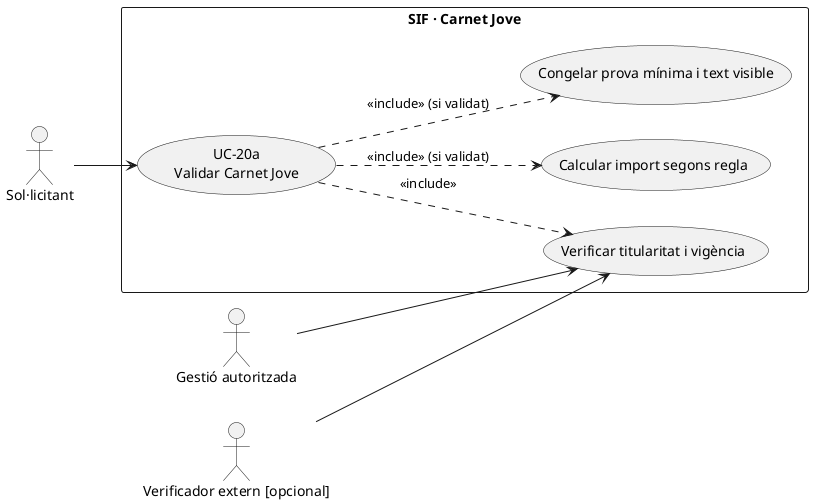
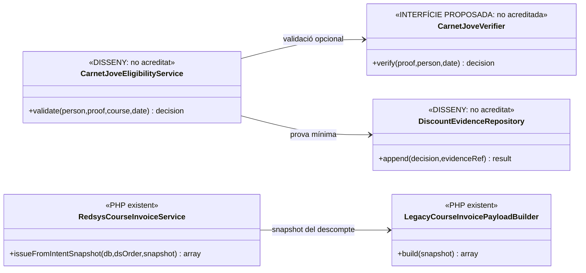
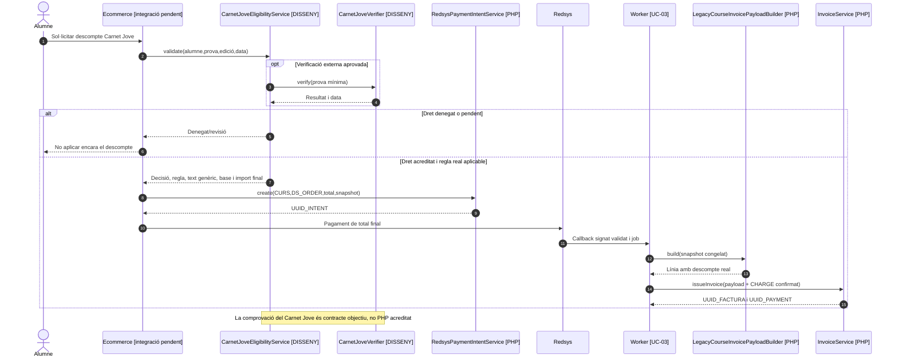

# UC-20a · Validar Carnet Jove i congelar el descompte

**Objectiu segons el catàleg:** validar el dret a descompte per **Carnet Jove** i generar un text visible adequat. La fitxa original indica literalment **«API/verificació i text visible pendents»** i classifica el cas com a `[DISSENY]`. Aquesta documentació **no** assumeix que existeixi integració amb cap API concreta ni inventa percentatge, edat, caducitat, compatibilitat o obligació de verificació en línia.

**Codi compartit comprovat:** `LegacyCourseInvoicePayloadBuilder::build()` pot incloure un bloc de descompte congelat amb `discount_origin`, import, mode, text visible i motiu intern; només valida **coherència aritmètica**, no la vigència d'un Carnet Jove ni la identitat del titular.

## 1. Fitxa específica

| Aspecte | Regla |
| --- | --- |
| Actors | Persona que demana el descompte, operador de gestió quan es necessita revisió i servei extern de verificació **només si** la integració s'aprova i existeix. |
| Entrada | Identitat de la persona, inscripció/curs/edició, data de compra i prova mínima del dret. **Les dades exactes i el mètode d'autenticació no estan especificats a la font consultada.** |
| Verificació pendent | Comprovar titularitat, vigència i aplicabilitat al producte segons la política real de PrisMa. Si hi ha API externa, definir endpoint/contracte, consentiment, disponibilitat, errors i evidència mínima; la fitxa original **no acredita API operativa**. |
| Valor comercial pendent | Percentatge/import, vigència de la promoció, límits i compatibilitat amb packs/codis/altres descomptes requereixen confirmació de negoci; **no** deduir-los del simple fet de tenir Carnet Jove. |
| Sortida de la validació | Resultat autoritzat/denegat/pendent, data, responsable o font i regla/versionat, amb base, descompte i total calculats. L'evidència privada no s'ha d'enganxar al concepte fiscal. |
| Snapshot fiscal possible | `LegacyCourseInvoicePayloadBuilder` accepta `discount.origin`, `discount.amount`, `discount.base`, `discount.text` i `discount.internal_reason`. **La cadena exacta per a `discount_origin` i el text públic final s'han de validar amb el diccionari/regla acordada**, no s'afegeixen com a valors legals inventats. |
| Efecte econòmic | La validació sola no emet factura, pagament, devolució o saldo. Quan es paga, el `CHARGE` real és del **preu final**, i l'atribució a la inscripció no ha de comptar com a diner el descompte. |

### 1.1. Flux objectiu del Carnet Jove

1. La persona indica el dret al checkout o intranet i aporta només la informació necessària; el canal comprova identificació de la persona i la relació amb `ID_INSC`.
2. El validador **pendent** comprova document/vigència i elegibilitat per aquell curs/edició; si es tria un proveïdor/API, registra només el resultat mínim, la data de verificació i la font, no credencials ni còpies de documents en el snapshot fiscal.
3. S'aplica la regla real aprovada (import, percentatge, compatibilitats, text públic i data de vigència) abans de crear intenció Redsys. El builder fiscal no valida automàticament aquestes condicions.
4. El canal congela la decisió comercial i els imports; UC-63 crea intenció pel **total final**. Si el resultat és pendent, s'ha de definir si es permet comprar a preu ordinari o s'espera la validació; no prometre un descompte que no s'ha acreditat.
5. Amb cobrament confirmat, UC-14/01 factura la inscripció a partir del snapshot; `LegacyCourseInvoicePayloadBuilder` verifica `base - descompte = total` dins la tolerància del codi i conserva els camps de descompte aportats, sense comprovar el Carnet Jove.
6. Si el dret es valida després de pagar, la qüestió és UC-90 (ajust posterior) i la classificació fiscal/econòmica pertinent: **no** reescriure el preu de la factura original ni crear un `REFUND` sense sortida real.

### 1.2. Alternatives i proves de la regla

| Cas | Tractament |
| --- | --- |
| Carnet vençut a la data efectiva de compra | No aplicar el descompte sense una regla que ho autoritzi; registrar el motiu mínim, no publicar dades del carnet. |
| Validació externa no disponible | Estat pendent/revisió o altre circuit aprovat; no interpretar error de xarxa com a dret concedit. |
| Titular del carnet diferent de l'alumne beneficiari | Revisar condicions del programa; no permetre aplicació a tercers per defecte. |
| Compra de pack o grup | Determinar participant i línia a què s'aplica, i compatibilitat amb descompte de pack; no repartir el percentatge indiscriminadament entre totes les inscripcions. |
| Text fiscal visible inadequat | Definir formulació genèrica/autoritzada abans d'emetre, mantenint les proves internes fora del PDF. |
| El callback arriba després de la caducitat del carnet | Respectar el snapshot i la regla comercial de vigència del checkout amb prova/correlació; el worker no ha de revalidar un dret diferent sense una regla expressa. |

**Proves pendents:** titularitat, dates de vigència, percentatge real, modalitat manual/API, denegació/error extern, dades mínimes, grup/pack, compatibilitat amb altres descomptes i ajust posterior. No s'han executat proves específiques de Carnet Jove en aquesta revisió.

### 1.3. Evidència del Carnet Jove i límit del circuit antic

La documentació d'estat final identifica el mètode llegat `enviarImatgeCarnetInscripcio.php` entre els circuits de descomptes, i descriu `sendMsgValidatCurosDescomptes()` com a rutina que pot validar documentació, recalcular l'import i generar enllaços de pagament. **No s'ha acreditat** que cap d'aquests mètodes consulti automàticament una API del Carnet Jove, comprovi autenticitat davant l'emissor o transfereixi un justificant a `discount_evidence` amb permisos i retenció. La fitxa ha de separar **aportar una imatge**, **validar titular/vigència segons la regla real**, **registrar la decisió** i **aplicar el preu**; són fets diferents.

Quan la petició és pendent, `A_PAGAR` del llegat o un enllaç antic no han de ser prova que el descompte està confirmat. Si el canal autoritza finalment la reducció **abans** del TPV, ha de preparar una nova oferta amb import i snapshot fiscal coherents i desactivar una URL incompatible amb el preu anterior. Si el titular ha pagat/obtingut factura amb l'import anterior, la validació posterior exigeix UC-73/74 per documentar la variació i només UC-28 si realment es retornen diners.

El document fiscal ha de conservar el concepte general de descompte i el preu que pertoca; **la imatge del carnet, identificadors privats i les notes internes de verificació no són el text públic de factura**. La custòdia i autorització de consulta de justificants són UC-116; la presència de `discount_text` i `discount_internal_reason` al payload no acredita el filtratge al PDF o al portal.

### 1.4. Proves addicionals del circuit documental (no executades)

| ID | Escenari | Resultat esperat |
| --- | --- | --- |
| CJ-01 | Imatge enviada però encara sense decisió | Descompte pendent; cap emissió a preu reduït pel sol fet de rebre el fitxer. |
| CJ-02 | Validació favorable abans del TPV | Preu, justificació mínima i snapshot congelats; URL anterior amb import incompatible inutilitzable. |
| CJ-03 | Validació denegada després de mostrar oferta | Recalcular abans de cobrar; no reutilitzar DS_ORDER amb import diferent. |
| CJ-04 | Validació després d'una factura emesa | UC-73/74 i eventual retorn real separat; cap UPDATE a la línia inicial. |
| CJ-05 | Receptor d'una factura de grup intenta obtenir imatge del carnet | Mostrar únicament informació autoritzada; no servir la prova privada per pertànyer al grup. |

## 2. UML de casos d'ús

## 3. Diagrama de classes — validador pendent i builder existent

## 4. Seqüència — decidir el descompte abans del TPV (DISSENY/PARCIAL)

## 5. Traçabilitat

[UC-20a original](../06-fitxes-funcionals/uc-020a.md) · [UC-20 descompte base](uc-020-aplicar-alumne-prisma.md) · [UC-20b privacitat](uc-020b-aplicar-descompte-sensible.md) · [UC-90 posterior original](../06-fitxes-funcionals/uc-090.md) · [UC-14 compra curs](uc-014-comprar-curs-redsys.md) · [LegacyCourseInvoicePayloadBuilder](../../sif/src/Service/LegacyCourseInvoicePayloadBuilder.php) · [Traçabilitat econòmica](00-revisio-moviments-inscripcions.md).
