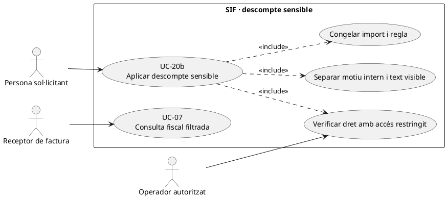
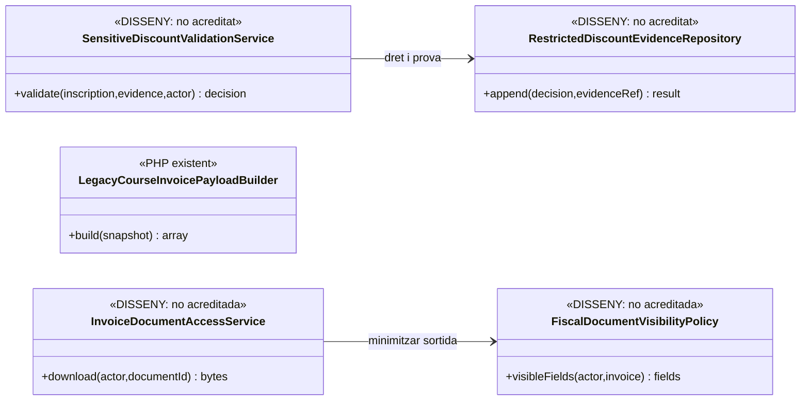
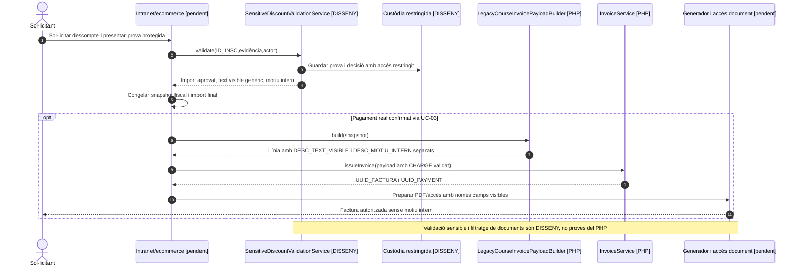

# UC-20b · Aplicar un descompte sensible amb text fiscal genèric

**Objectiu del catàleg:** autoritzar un descompte per una circumstància personal que requereix **motiu intern protegit i text visible genèric**, sense exposar la causa sensible al PDF, a la intranet de l'alumne o a un tercer que rep la factura. El catàleg qualifica UC-20b de `[DISSENY]`. La categoria exacta de cada descompte, percentatge, prova documental i text fiscal aprovat **no estan definits per la classe de facturació**.

**Evidència de codi:** `LegacyCourseInvoicePayloadBuilder::discountFields()` accepta tant `discount_text`/ `DESC_TEXT` com `discount_internal_reason`/`DESC_MOTIU_INTERN`, i la taula `factura_linia` conserva aquests camps. **Disposar de dos camps diferents no és un control de privacitat automàtic:** no s'ha acreditat un generador de PDF/QR/portal amb filtratge efectiu de `DESC_MOTIU_INTERN`, ni un servei de verificació del dret sensible.

## 1. Fitxa funcional específica

| Aspecte | Contracte |
| --- | --- |
| Actors | Persona sol·licitant i operador amb permís per comprovar el dret; altres actors veuen només import/text genèric si estan legitimats a consultar la factura. |
| Entrada i prova | `ID_INSC`, regla de descompte, data/edició, resultat de validació, import/percentatge i eventual justificant. **No** incloure diagnòstics o documents justificatius íntegres en camps de factura o en logs de pagament. |
| Separació de dades | `DESC_MOTIU_INTERN` per la justificació mínima restringida; `DESC_TEXT_VISIBLE` o `discount_text` per un text de factura genèric aprovat. El destí de la prova i els controls d'accés de la seva custòdia **estan pendents de verificar/implementar**. |
| Càlcul comercial | Aplicar import/percentatge segons la regla real i congelar base, descompte i total abans del TPV; `LegacyCourseInvoicePayloadBuilder` verifica aritmètica, **no** si la documentació és suficient ni si la regla era legal/comercialment aplicable. |
| Factura i documents | `factura_linia` conserva el snapshot monetari i el text visible. El generador de document ha de **seleccionar només els camps de visualització autoritzats** i no imprimir el motiu intern. Aquesta garantia **no està acreditada al PDF actual**. |
| Economia | Un descompte disminueix el preu **abans de cobrar**; no és una devolució o reassignació de fons. Si es valida **després** d'emetre/cobrar, UC-90 i la classificació fiscal corresponent han de decidir l'ajust i eventual retorn real. |

### 1.1. Flux objectiu

1. La persona demana el descompte pel canal segur. Només es demana la prova mínima necessària i l'operador autoritzat en valida la vigència/condició segons criteri aprovat. **No hi ha un `SensitiveDiscountValidationService` identificat al PHP consultat.**
2. La decisió queda vinculada a `ID_INSC`, actor, regla/versionat, import i evidència protegida; la UI pública no exposa el tipus sensible de justificació.
3. El canal prepara dos valors **diferents**: text genèric comprensible per al receptor fiscal i motiu intern restringit. No s'ha de copiar el nom d'un document o circumstància personal al camp `detail` o `concept` de factura.
4. El snapshot congela preu base, descompte i total; `LegacyCourseInvoicePayloadBuilder` accepta els camps `discount_text` i `discount_internal_reason` i els incorpora al payload fiscal. **Aquest pas és transport de dades, no autorització ni comprovació del seu ús al PDF.**
5. Quan Redsys confirma el pagament, UC-14/01 emet la factura amb import final i `CHARGE` real. El servei documental UC-36/55 **pendent** ha de filtrar qualsevol camp intern en servir documents o exportar dades.
6. Es conserva una traça restringida de qui ha validat i consultat l'evidència. Un canvi de circumstància posterior no altera silenciosament la línia fiscal immutable.

### 1.2. Variants i controls de privacitat

| Cas | Tractament |
| --- | --- |
| La factura s'emet a una empresa o responsable diferent de la persona beneficiària | El receptor pot veure import i text genèric quan estigui legitimat; no el motiu intern o justificant del participant. |
| Evidència sensible absent o caducada | Bloquejar descompte fins a comprovació, o deixar expedient pendent; no omplir `DESC_MOTIU_INTERN` amb dades inventades. |
| Un descompte sensible s'acumula amb promoció | La compatibilitat i l'ordre de càlcul s'han de validar abans de congelar el snapshot; el builder fiscal no resol la política. |
| PDF o exportació mostra accidentalment `discount_internal_reason` | Incidència de filtratge i control d'accés UC-07/36/80; corregir la representació sense editar el registre fiscal original ni publicar més dades. |
| L'alumne ja havia pagat sense el descompte | UC-90 valora correcció fiscal i moviment real només si hi ha devolució/aplicació aprovada; no crear un `REFUND` pel simple canvi de camp al formulari. |

**Proves pendents:** actor sense permís, dada sensible al payload vs text real de PDF, factura d'empresa/grup, exportació, log/URL, justificació caducada, descompte tardà i control d'accés per rol.

## 2. Diagrama UML de casos d'ús

## 3. Classes: transport existent i verificació/visibilitat pendents

El builder fiscal **no** invoca el validador ni el filtre de documents en la ruta inspeccionada.

## 4. Seqüència — justificació protegida i emissió final

## 5. Traçabilitat

[UC-20b original](../06-fitxes-funcionals/uc-020b.md) · [UC-20 descompte](uc-020-aplicar-alumne-prisma.md) · [UC-36 documents](uc-036-generar-consultar-documents.md) · [UC-07 consulta](uc-007-consultar-factura-estat-document.md) · [UC-90 posterior original](../06-fitxes-funcionals/uc-090.md) · [LegacyCourseInvoicePayloadBuilder](../../sif/src/Service/LegacyCourseInvoicePayloadBuilder.php) · [Migració de camps fiscals](../../sif/database/migrations/2026_09_16_000004_add_commercial_operation_and_fiscal_fields.sql).
