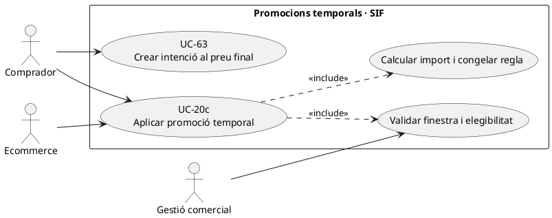
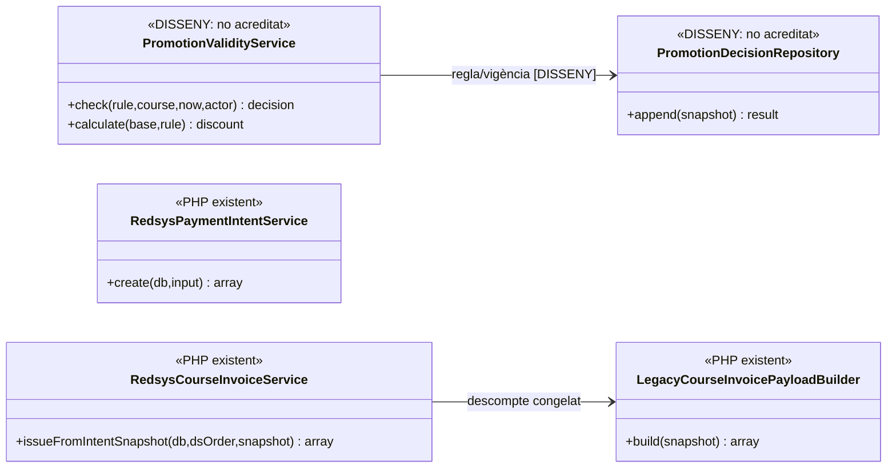
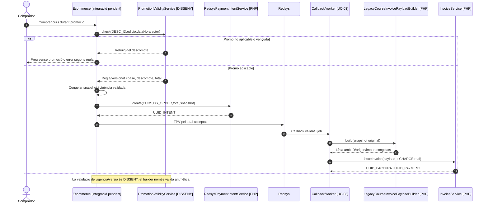

# UC-20c · Aplicar una promoció temporal abans del pagament

**Objectiu del catàleg:** conservar `DESC_ID`, import/percentatge i **vigència congelats** en el moment de la compra. Aquesta fitxa tracta una promoció aplicable per **període, curs/edició i regla**, no un codi individual que l'alumne introdueix (UC-20d). **Estat contrastat:** `LegacyCourseInvoicePayloadBuilder` pot traslladar `discount_id`, origen, mode, percentatge, import, text i motiu al payload fiscal, però **no valida el període de vigència comercial ni consulta un catàleg de promocions**. El catàleg qualifica UC-20c com a `[PARCIAL]`.

## 1. Fitxa funcional de la promoció

| Element | Contracte |
| --- | --- |
| Actors | Ecommerce/operador que configura o aplica una promoció i comprador que accepta el preu final. |
| Identitat de la regla | `DESC_ID` positiu o ID comercial equivalent, curs/edició elegibles, inici/final de vigència, regla/versionat, import o percentatge, compatibilitat amb altres descomptes. **El SQL del catàleg comercial i els límits exactes de PrisMa no han estat acreditats en el constructor fiscal.** |
| Moment clau | La vigència i el preu final s'han de validar **abans de crear la intenció TPV**, guardant hora i regla aplicable; el worker no ha de desfer arbitràriament una promoció vàlida en el snapshot d'una operació ja acceptada. |
| Snapshot del constructor existent | `discount.origin` (si no s'aporta pot reconstruir-se com `PROMOCIO_TEMPORAL`), `discount.id`, `mode`, `pct`, `amount`, `base`, `text`, `internal_reason`. `discountFields()` valida que l'ID, si existeix, sigui enter positiu. |
| Càlcul del constructor | Si falta import de descompte però hi ha base: `discount_amount=base-total`; si hi ha import però falta base: `base=total+discount_amount`. Rebutja descompte negatiu, base inferior al total i diferència `base-discount-total` superior a 0,01. **No verifica que `pct` sigui el percentatge aprovat ni que la data caigui dins la promoció.** |
| Efecte fiscal | UC-20c **prepara** un preu i origen congelats; només UC-14/01 genera factura amb els valors efectivament venuts. No s'afegeix una nova factura per un canvi posterior del calendari promocional. |
| Efecte monetari | Un descompte disminueix el **preu abans de cobrar**; no és una devolució ni un traspàs dels diners de la inscripció. El `CHARGE` i l'atribució individual es registren només quan el pagament final ha tingut lloc. |

### 1.1. Flux objectiu i parts PHP comprovades

1. El canal determina si la promoció temporal està vigent segons zona horària/data/hora acordades i si el curs/edició, comprador i altres descomptes compleixen la regla. **No s'ha identificat un `PromotionValidityService` implementat al SIF.**
2. Calcula base, percentatge/import i total final amb decimals; registra ID i versió de promoció, inici/final i evidència de l'elegibilitat abans de mostrar el preu al comprador.
3. Congela el snapshot comercial i fiscal abans del TPV amb `discount.origin=PROMOCIO_TEMPORAL`, `id`, `base`, `amount`, `mode`, `pct`, `text` i `internal_reason`, segons valors reals aprovats. **El builder no afegeix automàticament un camp de vigència a la línia fiscal**: cal traça comercial separada.
4. UC-63 crea intenció amb import final i snapshot; UC-03 valida el pagament signat i encola el worker. Si el callback arriba després d'acabar la promoció, la intenció preserva el preu acceptat conforme a la política acordada; no s'aplica una promoció nova en el worker.
5. `LegacyCourseInvoicePayloadBuilder::build()` comprova coherència aritmètica i retorna línia `INSCRIPCIO` amb descompte congelat; `InvoiceService` emet i `PaymentService`/bloc de cobrament registra l'únic ingrés real.
6. La traça econòmica per inscripció utilitza **el total ingressat**, no l'import base; un `DESC_ID` no és una referència de pagament ni un saldo.

### 1.2. Alternatives que el builder no resol

| Cas | Regla |
| --- | --- |
| Promoció venç abans de confirmar la compra | Bloquejar-ne l'aplicació o revalidar el preu abans de crear intenció; definir si una intenció iniciada dins el termini es conserva i durant quant de temps. |
| Callback tardà d'una compra amb snapshot congelat | Comparar import amb intenció, no tornar a calcular descompte a preus comercials actuals. |
| Promocions diferents amb mateix `DESC_ID` però regla alterada | Identificar versió/validesa i bloquejar reús ambigu; `discountFields()` no valida versió comercial. |
| Percentatge del snapshot no coincideix amb import | El builder valida base-import-total, **no** `pct` × base; comprovació de percentatge comercial necessària abans del TPV. |
| Pack i curs amb promoció simultània | Verificar compatibilitat i ordre d'aplicació; no extrapolar la regla de 25 % del constructor de pack a aquesta promoció. |
| Promoció concedida després d'emetre factura | UC-90/05 classifica un ajust fiscal/econòmic, no edita `DESC_IMPORT` de la factura original ni crea REFUND automàtic. |

**Proves pendents:** frontera exacta d'inici/final, zona horària, edició exclosa, percentatge i arrodoniment, concurrència amb promoció canviada, callback tardà, duplicat i traça de regla/versionat.

### 1.3. Promoció temporal del llegat: `descomptes.TIPUS` d'11 a 99

Els procediments de PrisMa identifiquen les promocions temporals amb `descomptes.TIPUS` **entre 11 i 99**, aplicades segons la taula `descomptes`. Aquest rang és una **classificació comercial històrica**, no un percentatge automàtic ni prova que una promoció concreta estigui vigent per a qualsevol curs/edició. Un codi que el comprador introdueix al camp «Codi promocional» segueix el circuit diferent de `promocions` (UC-20d).

Abans de crear la intenció Redsys, el canal ha de determinar la regla real vigent de la promoció, la seva aplicabilitat al curs/edició, `DESC_ID`, import o percentatge, base i total, i congelar la versió i data de decisió comercial. El builder fiscal pot transportar aquestes dades, però no consulta per si mateix el catàleg comercial. Si el període venç després de confirmar una oferta, no recalcular silenciosament al callback: cal aplicar la política de vigència de l'oferta congelada. Una promoció posterior a la factura original necessita decisió fiscal/econòmica pròpia, no edició directa de `factura_linia`.

### 1.4. Proves addicionals (no executades)

| ID | Escenari | Resultat |
| --- | --- | --- |
| PT-01 | `TIPUS` entre 11 i 99 amb regla aplicable a edició i data | Descompte concret, `DESC_ID`, import i vigència congelats. |
| PT-02 | `TIPUS` dins el rang però sense promoció aplicable | Cap descompte inferit del número sol. |
| PT-03 | Codi personal procedent de `promocions` | Derivar a UC-20d i comprovar titular/ús. |
| PT-04 | Canvi de regla entre checkout i callback | Respectar oferta congelada segons vigència aprovada, sense alterar import a posteriori. |

## 2. Diagrama UML de casos d'ús

## 3. Classes executables i validador promocional pendent

## 4. Seqüència — promoció al checkout i factura posterior

## 5. Traçabilitat

[UC-20c original](../06-fitxes-funcionals/uc-020c.md) · [UC-20 base](uc-020-aplicar-alumne-prisma.md) · [UC-20d codi original](../06-fitxes-funcionals/uc-020d.md) · [UC-14 curs](uc-014-comprar-curs-redsys.md) · [UC-90 ajust posterior original](../06-fitxes-funcionals/uc-090.md) · [LegacyCourseInvoicePayloadBuilder](../../sif/src/Service/LegacyCourseInvoicePayloadBuilder.php) · [RedsysPaymentIntentService](../../sif/src/Service/RedsysPaymentIntentService.php) · [Model de fons](00-revisio-moviments-inscripcions.md).
