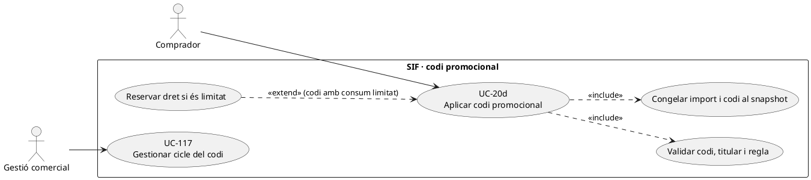
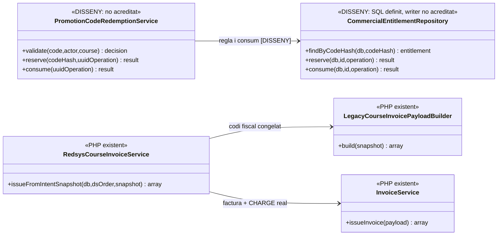
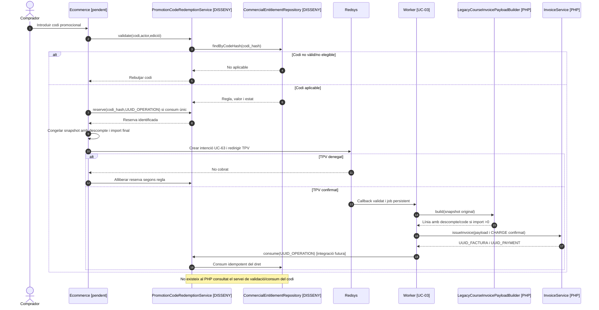

# UC-20d · Aplicar un codi promocional a una compra

**Finalitat:** validar un **codi introduït pel comprador**, determinar el dret de descompte que representa i congelar `DESC_CODI_PROMO` i l'import final abans del pagament. No equival automàticament a una promoció temporal general (UC-20c), a un saldo monetari ni a un codi regal ja cobrat (UC-18). El catàleg marca el SQL i la validació comercial finals com a pendents.

**Evidència contrastada:** `LegacyCourseInvoicePayloadBuilder` trasllada `discount.code`/`DESC_CODI_PROMO` al camp `discount_code` de línia fiscal quan hi ha un descompte monetari positiu i pot inferir l'origen `CODI_PROMO` si el codi és present. La migració defineix `commercial_entitlement` amb `CODE_HASH`, `HOLDER_PARTY_KEY`, `RULE_VERSION`, `EXPIRES_AT`, `STATUS` i `CONSUMED_UUID_OPERATION`, i el diccionari preveu `ENTITLEMENT_TYPE=PROMOTION_CODE`. **No s'ha acreditat cap `PromotionCodeRedemptionService` PHP que validi/consumeixi codis, ni que totes les promocions de PrisMa s'hagin migrat a aquesta taula.** El builder fiscal **no comprova** que el codi sigui real, vigent o de consum únic.

## 1. Fitxa funcional de codi promocional

| Aspecte | Contracte |
| --- | --- |
| Actors | Comprador, ecommerce i operador autoritzat que pot emetre o validar el codi; no donar accés a dades del titular d'un dret només per conèixer la cadena del codi. |
| Entrada | Codi normalitzat, identitat/titular quan s'exigeixi, `ID_INSC`, curs/edició, preu abans del descompte i moment de l'aplicació. Les regles de longitud, majúscules i ús compartit **no es fixen al constructor fiscal**. |
| Verificació del dret | Tipus de dret `PROMOTION_CODE` quan el circuit triat és `commercial_entitlement`, hash del codi, titular o política de codi públic, estat, vigència i límit d'usos. L'esquema només té **un** `CONSUMED_UUID_OPERATION` per dret: no suposar que modela promocions multiús amb un sol registre. |
| Descompte facturable | `discount.origin=CODI_PROMO`, `discount.code`, `base`, `amount`, `mode`, `pct` i text visible, segons regla comercial real. `LegacyCourseInvoicePayloadBuilder` calcula i valida `base-discount=total`, però **no compara l'import amb la política del codi**. |
| Reserva i consum | Si el codi té ús limitat, **reservar-lo abans del TPV i consumir-lo una sola vegada després del cobrament confirmat**, o alliberar la reserva quan l'intent s'anul·la; això és **disseny**, no lògica PHP acreditada. |
| Efecte econòmic | Aplicar un codi de **descompte** no ingressa ni mou diners; es registra només l'import final que realment paga el comprador. Si el codi representa **valor prepagat**, és un altre contracte (regal/crèdit), amb transferència interna de valor i no un descompte nou per defecte. |

### 1.1. Flux objectiu del codi

1. El comprador introdueix el codi al checkout; el servidor el normalitza i consulta la regla efectiva/titularitat i l'activitat/edició seleccionada sense retornar dades personals del titular d'un codi privat.
2. Un servei **pendent** determina si el codi és vàlid, actiu, no caducat, elegible per al curs/edició i compatible amb altres descomptes. **La presència de `DESC_CODI_PROMO` al llegat no prova aquesta validació.**
3. Calcula el preu final amb decimals i deixa una decisió amb regla/versionat, quantitat i compatibilitat; si el codi és de consum únic, reserva l'ús amb bloqueig/idempotència i vinculació a l'operació comercial.
4. UC-63 congela intenció, import final, origen `CODI_PROMO` i codi/identificador de regla en el snapshot fiscal. **La custòdia del codi en clar s'ha de limitar**: la taula de dret conserva hash, mentre que la decisió de si el codi es mostra al text fiscal s'ha de regir per privacitat i necessitat.
5. Redsys comunica callback; en autorització UC-03 el worker genera factura. `LegacyCourseInvoicePayloadBuilder` **sí que transporta** el codi i el descompte al payload, i `InvoiceService` emet/reutilitza factura i registra el cobrament real de l'import final.
6. El coordinador objectiu marca el dret `CONSUMED` només quan la compra està conciliada, i conserva el vincle a `UUID_OPERATION`/`ID_INSC`. **La factura emesa no acredita consum del codi a la taula `commercial_entitlement`** en el PHP inspeccionat.
7. Si el pagament és denegat, es conserva o allibera la reserva segons política. Un retry equivalent no pot consumir una segona vegada un codi d'un sol ús ni generar una segona factura.

### 1.2. Variants i diferències del cas UC-20c

| Situació | Regla |
| --- | --- |
| Codi no existent, caducat o assignat a una altra persona | No aplicar-lo ni revelar el titular; registrar intent fallit quan pertoqui. |
| Codi d'ús únic amb dues compres concurrents | Un únic consum lligat a una operació, la segona rep conflicte o no aplicable; la implementació efectiva dels locks és pendent. |
| Codi públic multiús | **No** fer servir un únic `CONSUMED_UUID_OPERATION` compartit com a prova de N consums; definir un model de participacions/quotes o emissions individualitzades. |
| Codi de regal amb saldo ja cobrat | UC-18/119: és aplicació d'un dret prepagat, no `discount_amount` arbitrari més un `CHARGE` del valor total. |
| Codi present al snapshot però descompte 0 | El builder afegeix `discountFields()` a la línia **només si `discount_amount > 0`**; no afirmar que la factura sempre conserva `DESC_CODI_PROMO` en una línia sense descompte. |
| El codi s'aplica després d'emetre | UC-90 i classificació fiscal/econòmica: no editar el camp `DESC_CODI_PROMO` d'una factura immutable ni retornar diners automàticament. |

**Proves pendents:** validesa i caducitat, titular/privacitat, ús únic concurrent, multiús, reintent de TPV denegat, codi amb descompte zero, import incorrecte, pack/grup, devolució i canvi de curs.

## 2. UML de casos d'ús

## 3. Diagrama de classes: builder existent i consum pendent

## 4. Seqüència — aplicar i consumir un codi d'ús únic (DISSENY/PARCIAL)

## 5. Traçabilitat

[UC-20d original](../06-fitxes-funcionals/uc-020d.md) · [UC-20c promoció temporal](uc-020c-aplicar-promocio-temporal.md) · [UC-117 cicle del dret original](../06-fitxes-funcionals/uc-117.md) · [UC-18 regal](uc-018-bescanviar-regal.md) · [UC-90 ajust posterior original](../06-fitxes-funcionals/uc-090.md) · [LegacyCourseInvoicePayloadBuilder](../../sif/src/Service/LegacyCourseInvoicePayloadBuilder.php) · [Migració commercial_entitlement](../../sif/database/migrations/2026_09_16_000005_add_operation_lifecycle_tables.sql) · [Diccionari tipus de dret](../05-governanca-operacio/24-diccionari-camps-i-valors.md).
