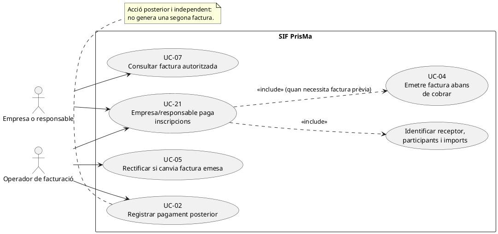
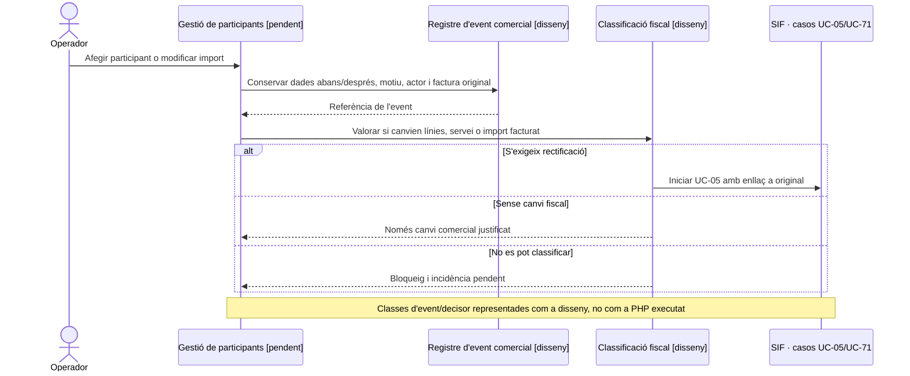

# UC-21 · Empresa o responsable paga inscripcions — fitxa i UML integrats

**Abast:** un pagador extern (empresa, escola o persona responsable) assumeix el cost d'una o més inscripcions, sovint necessita una factura **abans** de fer la transferència. Aquest cas determina **qui és el receptor fiscal, quines inscripcions queden cobertes i com s'assignarà el cobrament**; UC-04 és únicament el nucli reutilitzable d'emissió abans de cobrar i UC-02 el registre posterior del moviment.

**Estat:** el nucli d'emissió sense pagament i el registre de cobrament sobre factura ja existeixen; el catàleg general marca UC-21 `[PARCIAL]`. El codi específic de grup (`ManualGroupInvoiceService`) existeix, però la seva ruta **genera factura i moviment inicial junts**: no es pot confondre amb el flux UC-21 en què la factura precedeix el pagament.

## 1. Fitxa de cas d'ús

| Camp | Especificació del cas |
| --- | --- |
| Actor principal | Empresa o persona responsable que assumeix el pagament. L'operador autoritzat gestiona la preparació de la factura i la imputació; l'accés extern segur està pendent de verificar. |
| Disparador | Un centre, empresa o responsable sol·licita la factura per pagar una o més inscripcions; o comunica/realitza posteriorment el pagament d'aquesta factura. |
| Precondició funcional | Identificar el pagador real i el **receptor fiscal** que ha de constar a la factura, les inscripcions/participants coberts i els imports corresponents. Pagador, receptor i participant no són necessàriament la mateixa persona. |
| Document previ | Si només hi ha pressupost editable, no s'ha d'etiquetar com a factura emesa ni donar-li número fiscal. Si s'emet una factura amb número, és una factura real encara que el cobrament estigui pendent. |
| Contracte d'emissió implementat | `InvoiceBeforePaymentService::issueBeforePayment()` requereix clau idempotent o referència, prohibeix bloc `payment` no nul, força `source_channel=INTRANET` i `emesa_abans_cobrament=1`, i delega a `InvoiceService`. |
| Contracte de cobrament implementat | `PaymentService::registerPayment()` amb `allocations` cap a `uuid_factura` ja existent. No torna a invocar `issueInvoice()` si la factura ja existeix. |
| Resultat esperat | Una sola factura fiscal amb receptor i línies congelats i referències internes a les inscripcions; un o diversos moviments econòmics assignats posteriorment, amb estat de cobrament independent. |

### 1.1. Flux funcional objectiu i passos amb codi acreditat

1. L'empresa/responsable indica participants, curs/edició i dades fiscals. L'operador verifica si es tracta d'un grup d'escola/empresa o d'una persona responsable de grup particular. **La documentació de fluxos especifica que el receptor d'una factura de grup no és sempre una entitat.**
2. Es determina la fotografia de les dades de facturació, imports, descomptes i relacions d'inscripció que ha de contenir la factura. La regla funcional és que una persona pot pagar per diverses inscripcions, però cadascuna manté la seva identitat.
3. Si l'empresa necessita factura abans del pagament, el canal ha de construir el payload per a `InvoiceBeforePaymentService` sense moviment inicial; el nucli `InvoiceService` crea una factura real i la deixa amb `EMESA_ABANS_COBRAMENT=1`, `ESTAT_COBRAMENT=PENDING`, número fiscal, registre fiscal i entrada a `fiscal_queue`.
4. El receptor rep o consulta la factura per un canal amb permisos. **La generació del document i l'enllaç segur no són garanties aportades per `InvoiceBeforePaymentService`** i continuen pendents de verificar.
5. Quan s'acredita el cobrament, el canal executa UC-02/UC-22 amb la clau idempotent **del pagament** i una assignació a la factura prèvia. El SIF actualitza `ESTAT_COBRAMENT` a partir dels moviments i no genera una segona factura fiscal.
6. Si canvien les persones inscrites o l'import després de l'emissió, cal obrir una gestió posterior i classificar l'efecte fiscal (UC-05/UC-71/UC-74), no editar les línies fiscals emeses.

### 1.2. Fluxos alternatius, excepcions i llacunes

| Escenari | Comportament i criteri |
| --- | --- |
| E1. Receptor empresa/escola | Si el grup és d'una escola o empresa, la documentació indica que la factura s'emet a l'entitat; les inscripcions continuen individualitzades per participant. |
| E2. Grup d'amics o persona particular | La factura pot anar al responsable particular. **No deduir que `billing` ha de ser sempre una empresa** del fet que el cas es digui «Empresa/responsable». |
| E3. Empresa que encara no ha pagat | L'emissió genera factura real amb número fiscal i registre; el pagament continua `PENDING`. La documentació explica que el tractament històric d'exportació/comptabilització podia considerar-la cobrada: el nou model ha de mostrar els dos estats separats. |
| E4. Pagament parcial o transferència posterior | Registrar moviment i assignació sobre el mateix `uuid_factura`; el calculador econòmic determina `PARTIAL` o `PAID` segons la suma neta. |
| E5. Factura ja emesa, participants/import modificats | No tornar a construir una factura amb les dades vives: cal registrar canvi i resoldre si la factura exigeix rectificació o altra acció fiscal validada. |
| **P1. Assignació per participant** | El codi de factura de grup coneix `IDPAG`, responsable i inscripcions; **no s'ha acreditat** que UC-21 abans de cobrar tingui un orquestrador que congeli i autoritzi totes les relacions i imports per participant en aquest flux específic. |
| **P2. Dades i permisos** | Cal confirmar qui pot veure la factura i els detalls de participants: pagador, receptor i alumne no sempre comparteixen drets d'accés. |
| **P3. IDPAG i flux manual de grup** | `ManualGroupInvoiceService::issueFromLegacyGroupPayment()` demana import de pagament i `ManualGroupInvoicePayloadBuilder` adjunta un bloc de pagament inicial; **no s'ha de reutilitzar directament com si fos l'emissió abans de cobrar de UC-21**. |
| **P4. Titular de saldos** | Si posteriorment hi ha retorn/saldo, la documentació exigeix determinar el titular econòmic quan pagava una empresa o responsable. UC-29 no ho valida per si sol. |
| **P5. Pagament i receptor divergents** | L'endpoint genèric de pagaments no verifica en el servei de domini que el pagador de la transferència correspongui a l'obligació de la factura; control de gestió pendent d'integració. |

**Persistència del nucli acreditada:** `factura`, `factura_linia`, `factura_registres`, `fiscal_queue`, `fact_rels` si s'aporten; després `payment_transaction` i `payment_allocation` vinculats a la factura. **No s'ha acreditat** un esquema d'agrupació comercial específic de UC-21 amb totes les relacions de participants operatiu a la pantalla final.

**Proves localitzades, no executades:** `InvoiceBeforePaymentServiceTest` acredita un flux de factura abans de cobrar sense moviment inicial; `RegisterPaymentTest` registra posteriorment un pagament sense duplicar el registre fiscal. **No són una prova d'extrem a extrem d'una empresa amb N participants i accés extern.**

## 2. Diagrama UML de casos d'ús



El diagrama és **funcional/objectiu**: l'accés de l'empresa a la consulta i el camí de pantalla no es declaren implementats. UC-04/UC-02 tenen cadascun una fitxa i una seqüència executables pròpies.

## 3. Diagrama de classes del nucli utilitzat


**Frontera del diagrama:** `ManualGroupInvoiceService` es mostra com a contrast amb un camí diferent, no com una crida feta per `InvoiceBeforePaymentService`. No es representa cap classe fictícia per crear un «pagament d'empresa» si no consta al codi.

## 4. Seqüència — empresa sol·licita factura i paga posteriorment (objectiu + nucli implementat)

```mermaid
sequenceDiagram
autonumber
actor E as Empresa/responsable
actor O as Operador autoritzat
participant UI as Intranet/accés extern [pendent]
participant IBP as InvoiceBeforePaymentService
participant B as InvoiceBeforePaymentPayloadBuilder
participant IS as InvoiceService
participant IR as InvoiceRepository
participant PS as PaymentService
participant PR as PaymentRepository
participant DB as BD SIF
E->>O: Aporta dades fiscals i inscripcions que assumirà
O->>UI: Identificar receptor i participants; validar imports
Note over O,UI: Construcció específica i autorització per participants: pendent d'acreditar
UI->>IBP: issueBeforePayment(input sense payment)
IBP->>B: build(input)
B-->>IBP: payload INTRANET + flag emissió prèvia
IBP->>IS: issueInvoice(payload)
IS->>IR: Comprovar idempotència i crear factura si és nova
IR->>DB: INSERT factura/línies/registre fiscal/cua/relacions
IS-->>UI: uuid_factura i num_visible
UI-->>E: Factura o accés al document [canal pendent]
Note over E,DB: Factura fiscal existent i cobrament econòmic encara PENDING
E->>O: Comunica/efectua pagament
O->>UI: Validar cobrament i factura preexistent
UI->>PS: registerPayment(payload amb allocation a uuid_factura)
PS->>PR: crear o reutilitzar moviment en transacció
PR->>DB: INSERT payment_transaction i payment_allocation
PR->>DB: UPDATE factura.ESTAT_COBRAMENT
PS-->>UI: uuid_payment
UI-->>E: Resultat del cobrament [canal pendent]
Note over IS,DB: El cobrament no torna a executar issueInvoice()
```

### 4.1. Seqüència alternativa — modificació després d'emetre (disseny)



## 5. Traçabilitat

[Fitxa anterior UC-21](../06-fitxes-funcionals/uc-021.md) · [Catàleg de casos](../04-estat-final/33-casos-us-sif.md) · [Fluxos de factura abans de cobrar i grup](../03-canvis-pendents/04-fluxos-facturacio.md) · [UC-04 revisada](uc-004-emetre-factura-abans-cobrar.md) · [UC-02 revisada](uc-002-registrar-cobrament-factura.md) · [InvoiceBeforePaymentService](../../sif/src/Service/InvoiceBeforePaymentService.php) · [ManualGroupInvoiceService](../../sif/src/Service/ManualGroupInvoiceService.php) · [LegacyGroupSnapshotRepository](../../sif/src/Repository/LegacyGroupSnapshotRepository.php) · [InvoiceBeforePaymentServiceTest](../../sif/tests/Integration/InvoiceBeforePaymentServiceTest.php).

**Pendent:** validació de receptor/pagador per cada cas real, congelació de participants i descomptes al flux previ, permisos d'empresa, prova d'extrem a extrem, enllaços segurs i conciliació del cobrament.
