# UC-21 · Empresa o responsable paga inscripcions — fitxa i UML integrats

**Abast:** un pagador extern (empresa, escola o persona responsable) assumeix el cost d'una o més inscripcions, sovint necessita una factura **abans** de fer la transferència. Aquest cas determina **qui és el receptor fiscal, quines inscripcions queden cobertes i com s'assignarà el cobrament**; UC-04 és únicament el nucli reutilitzable d'emissió abans de cobrar i UC-02 el registre posterior del moviment.

**Estat:** el nucli d'emissió sense pagament i el registre de cobrament sobre factura ja existeixen; el catàleg general marca UC-21 `[PARCIAL]`. El codi específic de grup (`ManualGroupInvoiceService`) existeix, però la seva ruta **genera factura i moviment inicial junts**: no es pot confondre amb el flux UC-21 en què la factura precedeix el pagament.

## 1. Fitxa de cas d'ús

| Camp | Especificació del cas |
| --- | --- |
| Actor principal | Empresa o persona responsable que assumeix el pagament. L'operador autoritzat gestiona la preparació de la factura i la imputació; l'accés extern segur està pendent de verificar. |
| Disparador | Un centre, empresa o responsable sol·licita la factura per pagar una o més inscripcions; o comunica/realitza posteriorment el pagament d'aquesta factura. |
| Precondició funcional | Identificar el pagador real i el **receptor fiscal** que ha de constar a la factura, les inscripcions/participants coberts i els imports corresponents. Pagador, receptor i participant no són necessàriament la mateixa persona. |
| Document previ | Si només hi ha pressupost editable, no s'ha d'etiquetar com a factura emesa ni donar-li número fiscal. Si s'emet una factura amb número, és una factura real encara que el cobrament estigui pendent. |
| Contracte d'emissió implementat | `InvoiceBeforePaymentService::issueBeforePayment()` requereix clau idempotent o referència, prohibeix bloc `payment` no nul, força `source_channel=INTRANET` i `emesa_abans_cobrament=1`, i delega a `InvoiceService`. |
| Contracte de cobrament implementat | `PaymentService::registerPayment()` amb `allocations` cap a `uuid_factura` ja existent. No torna a invocar `issueInvoice()` si la factura ja existeix. |
| Resultat esperat | Una sola factura fiscal amb receptor i línies congelats i referències internes a les inscripcions; un o diversos moviments econòmics assignats posteriorment, amb estat de cobrament independent. |

### 1.1. Flux funcional objectiu i passos amb codi acreditat

1. L'empresa/responsable indica participants, curs/edició i dades fiscals. L'operador verifica si es tracta d'un grup d'escola/empresa o d'una persona responsable de grup particular. **La documentació de fluxos especifica que el receptor d'una factura de grup no és sempre una entitat.**
2. Es determina la fotografia de les dades de facturació, imports, descomptes i relacions d'inscripció que ha de contenir la factura. La regla funcional és que una persona pot pagar per diverses inscripcions, però cadascuna manté la seva identitat.
3. Si l'empresa necessita factura abans del pagament, el canal ha de construir el payload per a `InvoiceBeforePaymentService` sense moviment inicial; el nucli `InvoiceService` crea una factura real i la deixa amb `EMESA_ABANS_COBRAMENT=1`, `ESTAT_COBRAMENT=PENDING`, número fiscal, registre fiscal i entrada a `fiscal_queue`.
4. El receptor rep o consulta la factura per un canal amb permisos. **La generació del document i l'enllaç segur no són garanties aportades per `InvoiceBeforePaymentService`** i continuen pendents de verificar.
5. Quan s'acredita el cobrament, el canal executa UC-02/UC-22 amb la clau idempotent **del pagament** i una assignació a la factura prèvia. El SIF actualitza `ESTAT_COBRAMENT` a partir dels moviments i no genera una segona factura fiscal.
6. Si canvien les persones inscrites o l'import després de l'emissió, cal obrir una gestió posterior i classificar l'efecte fiscal (UC-05/UC-71/UC-74), no editar les línies fiscals emeses.

### 1.2. Fluxos alternatius, excepcions i llacunes

| Escenari | Comportament i criteri |
| --- | --- |
| E1. Receptor empresa/escola | Si el grup és d'una escola o empresa, la documentació indica que la factura s'emet a l'entitat; les inscripcions continuen individualitzades per participant. |
| E2. Grup d'amics o persona particular | La factura pot anar al responsable particular. **No deduir que `billing` ha de ser sempre una empresa** del fet que el cas es digui «Empresa/responsable». |
| E3. Empresa que encara no ha pagat | L'emissió genera factura real amb número fiscal i registre; el pagament continua `PENDING`. La documentació explica que el tractament històric d'exportació/comptabilització podia considerar-la cobrada: el nou model ha de mostrar els dos estats separats. |
| E4. Pagament parcial o transferència posterior | Registrar moviment i assignació sobre el mateix `uuid_factura`; el calculador econòmic determina `PARTIAL` o `PAID` segons la suma neta. |
| E5. Factura ja emesa, participants/import modificats | No tornar a construir una factura amb les dades vives: cal registrar canvi i resoldre si la factura exigeix rectificació o altra acció fiscal validada. |
| **P1. Assignació per participant** | El codi de factura de grup coneix `IDPAG`, responsable i inscripcions; **no s'ha acreditat** que UC-21 abans de cobrar tingui un orquestrador que congeli i autoritzi totes les relacions i imports per participant en aquest flux específic. |
| **P2. Dades i permisos** | Cal confirmar qui pot veure la factura i els detalls de participants: pagador, receptor i alumne no sempre comparteixen drets d'accés. |
| **P3. IDPAG i flux manual de grup** | `ManualGroupInvoiceService::issueFromLegacyGroupPayment()` demana import de pagament i `ManualGroupInvoicePayloadBuilder` adjunta un bloc de pagament inicial; **no s'ha de reutilitzar directament com si fos l'emissió abans de cobrar de UC-21**. |
| **P4. Titular de saldos** | Si posteriorment hi ha retorn/saldo, la documentació exigeix determinar el titular econòmic quan pagava una empresa o responsable. UC-29 no ho valida per si sol. |
| **P5. Pagament i receptor divergents** | L'endpoint genèric de pagaments no verifica en el servei de domini que el pagador de la transferència correspongui a l'obligació de la factura; control de gestió pendent d'integració. |

**Persistència del nucli acreditada:** `factura`, `factura_linia`, `factura_registres`, `fiscal_queue`, `fact_rels` si s'aporten; després `payment_transaction` i `payment_allocation` vinculats a la factura. **No s'ha acreditat** un esquema d'agrupació comercial específic de UC-21 amb totes les relacions de participants operatiu a la pantalla final.

**Proves localitzades, no executades:** `InvoiceBeforePaymentServiceTest` acredita un flux de factura abans de cobrar sense moviment inicial; `RegisterPaymentTest` registra posteriorment un pagament sense duplicar el registre fiscal. **No són una prova d'extrem a extrem d'una empresa amb N participants i accés extern.**

### 1.3. Revisió: un sol pagador, múltiples inscripcions — PENDENT

L'empresa pot pagar **una sola transferència i una sola factura** que cobreixin N persones; el registre econòmic ha de conservar `UUID_PAYMENT` **únic** i atribuir explícitament a cada `ID_INSC` el seu import, curs/edició i relació a la línia/operació. `fact_rels` informa de la relació documental, però **no** quantifica el que s'ha atribuït a cada participant. La factura prèvia sense pagament no crea cap atribució. Si un participant canvia de curs o causa baixa, només es traspassa/retorna la quantitat atribuïda al seu cas, amb titular econòmic i permisos de l'empresa validats, sense modificar el cobrament global dels altres participants.

[Registre proposat de moviments per inscripció](00-revisio-moviments-inscripcions.md).

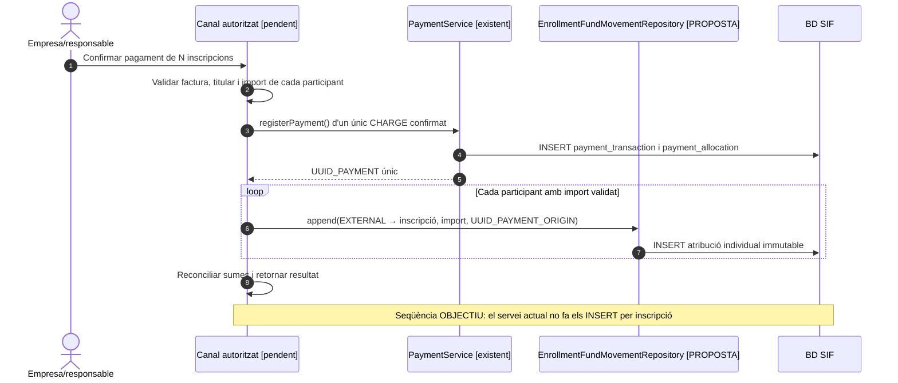

### 1.4. Contrast amb la pantalla real i control de doble facturació — integració pendent

**Evidència del circuit antic:** la pantalla «Generar factura abans de pagar» cerca per NIF/NIE, afegeix inscripcions, suma imports A_PAGAR i només permet continuar quan les seleccionades corresponen al mateix curs i edició. Després es tria l'entitat, es revisen concepte i preu i s'emet la factura. Aquesta limitació de la pantalla històrica no prohibeix en abstracte una factura multiconcepte (UC-88). La previsualització/descàrrega antiga regenera el PDF; la futura consulta SIF ha de servir el document fiscal custodiat, no reconstruir-lo a partir de dades vives.

**Variant E5-bis — empresa inscrita com a contacte i doble factura:** el xat original descriu una inscripció grupal feta per l'empresa en què el contacte ha utilitzat el CIF de l'entitat com a identificador; després d'emetre factura prèvia, la cerca per CIF a «Passar pagaments» pot iniciar indegudament una segona factura. La cerca fiscal definitiva ha d'identificar les inscripcions i llurs relacions amb UUID_FACTURA/fact_rels, IDPAG i, quan existeixi, FACTURA_RELACIONADA històric; **el CIF tot sol no identifica una factura única**. Si hi ha diverses factures legítimes del mateix CIF, cal seleccionar i validar la factura exacta, o obrir incidència; no agrupar-les ni generar-ne una altra per defecte.

**Control previ d'enllaços i concurrència (contracte objectiu, NO implementació acreditada):** abans de confirmar la cobertura d'una inscripció per una factura d'empresa, verificar factura i cobraments existents, intencions Redsys pendents i enllaços individuals; impedir noves intencions individuals incompatibles al backend i coordinar el canvi d'estat amb l'emissió. La mera ocultació d'una URL al navegador no és un bloqueig. No donar per resolta la concurrència amb un ordre ingenu «emetre factura → desactivar enllaç»: un callback individual podria confirmar-se entre els dos passos. Si una intenció individual ja s'està processant, suspendre la nova emissió fins a conciliar-la. Si l'emissió fiscal s'ha confirmat però falla la sincronització amb la intranet, **conservar la factura**, registrar incidència, mantenir la restricció de nova emissió/cobrament incompatible i reprendre la sincronització de manera idempotent; no crear factura local alternativa.

**Pagament posterior:** quan la factura preexistent cobreix les inscripcions, «Passar pagaments», la transferència o el callback autoritzat han de registrar i assignar el cobrament a aquell UUID_FACTURA (UC-02/22), no invocar el camí ManualGroupInvoiceService que emet una factura amb pagament inicial. Una factura pendent d'empresa pot conservar **el seu propi enllaç segur de pagament**, encara que els individuals incompatibles quedin inactius. El pagament parcial deixa PARTIAL i el cobrament total PAID sense alterar el número de factura ni crear un nou registre de venda per aquest únic cobrament.

**Idempotència de negoci pendent:** reutilitzar una clau no és suficient si el receptor, el conjunt d'inscripcions, les línies o els imports han canviat; el servei ha de contrastar la petició amb el snapshot original i rebutjar un conflicte, en lloc de retornar silenciosament la factura anterior. La reutilització per clau observada a InvoiceService no acredita encara aquesta comparació integral. El document i el correu al receptor s'han de distingir de la comunicació als participants: un alumne pot veure que la seva inscripció està coberta, però no la factura completa que exposi altres participants.

### 1.5. Proves d'acceptació específiques del circuit d'empresa (no executades)

| ID | Escenari | Resultat que cal acreditar |
| --- | --- | --- |
| E21-01 | Inscripció d'empresa amb factura prèvia sense pagar | Una única factura real, PENDING i cap moviment de cobrament fictici. |
| E21-02 | N inscripcions del mateix curs i edició | Receptor fiscal correcte, N relacions i imports verificats al servidor, no només al HTML. |
| E21-03 | Cercar el grup pel CIF de contacte després de la factura prèvia | S'obre la factura existent per UUID/relacions i el cobrament no emet una segona factura. |
| E21-04 | Dues factures legítimes del mateix CIF | No es confonen; selecció per inscripcions/UUID o incidència si hi ha ambigüitat. |
| E21-05 | Inscripció ja pagada, ja facturada o amb Redsys en curs | Bloqueig de cobertura incompatible i conciliació de l'estat real abans d'emetre. |
| E21-06 | Enllaç individual antic o callback tardà després d'assumir l'empresa el pagament | Cap segona factura; si existeix cobrament real, conservar-ne l'evidència i obrir conciliació. |
| E21-07 | Mateixa clau idempotent amb receptor/imports/participants diferents | Conflicte explícit, sense reutilitzar un resultat econòmic incompatible. |
| E21-08 | Dues transferències parcials sobre factura prèvia | Dos cobraments reals associats a la mateixa factura, PARTIAL i després PAID. |
| E21-09 | Fallada de la intranet o dels enllaços després del commit fiscal | Factura conservada i incidència/reintent; ni factura local alternativa ni via individual duplicada. |
| E21-10 | Alumne participant consulta la factura conjunta | No accedeix a dades d'altres participants; l'empresa/receptor només amb autorització del servidor. |
## 2. Diagrama UML de casos d'ús

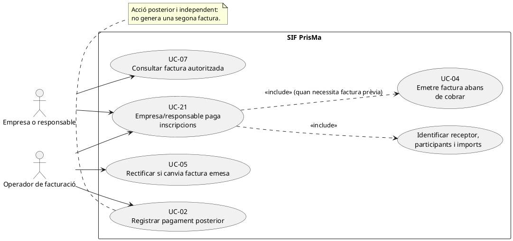

### Vista de casos d’ús per a GitHub (Mermaid)

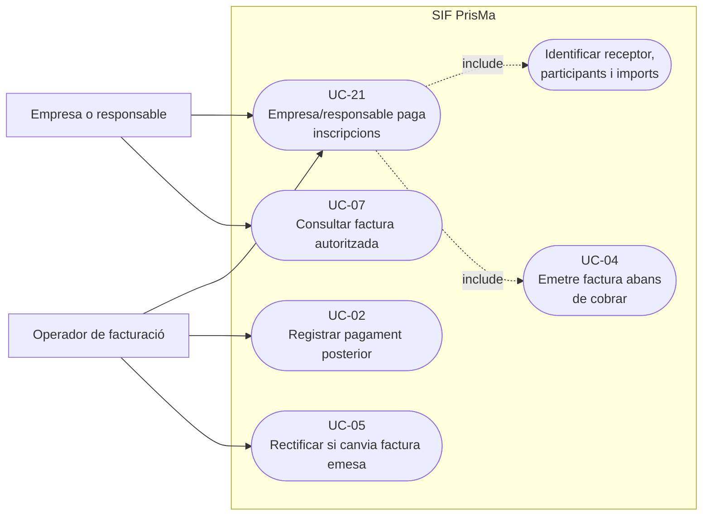

El diagrama és **funcional/objectiu**: l'accés de l'empresa a la consulta i el camí de pantalla no es declaren implementats. UC-04/UC-02 tenen cadascun una fitxa i una seqüència executables pròpies.

## 3. Diagrama de classes del nucli utilitzat

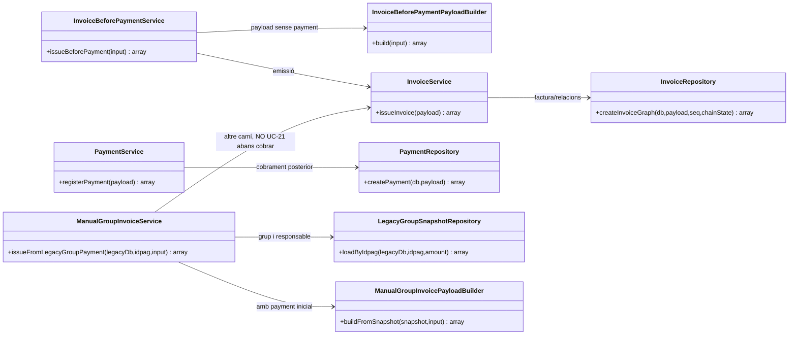

**Frontera del diagrama:** `ManualGroupInvoiceService` es mostra com a contrast amb un camí diferent, no com una crida feta per `InvoiceBeforePaymentService`. No es representa cap classe fictícia per crear un «pagament d'empresa» si no consta al codi.

### 3.1. Classes de coordinació proposades per a la cobertura de participants — NO implementades

El model executable anterior no conté una classe que protegeixi de dues factures sobre el mateix `ID_INSC` quan les peticions arriben per canals diferents. Aquest subdiagrama defineix les dependències **objectiu** de les accions 4.3/4.4 sense atribuir-ne l'existència al PHP actual.

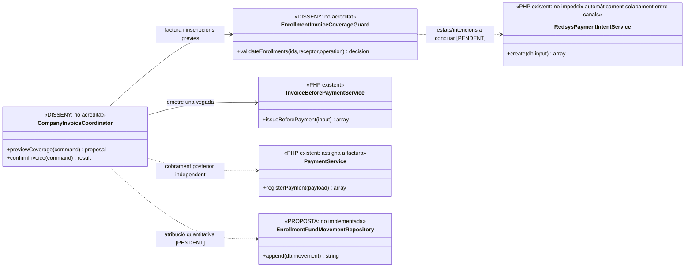
## 4. Seqüència — empresa sol·licita factura i paga posteriorment (objectiu + nucli implementat)

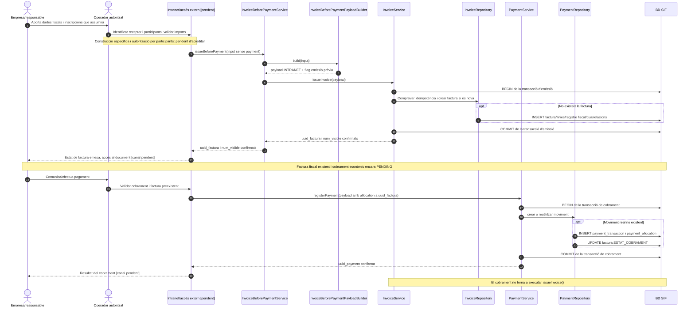

### 4.1. Seqüència alternativa — modificació després d'emetre (disseny)

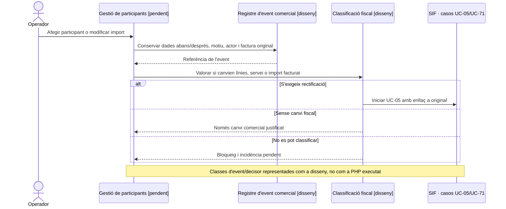

### 4.2. Seqüència addicional — cobertura segura i callback individual concurrent (OBJECTIU)

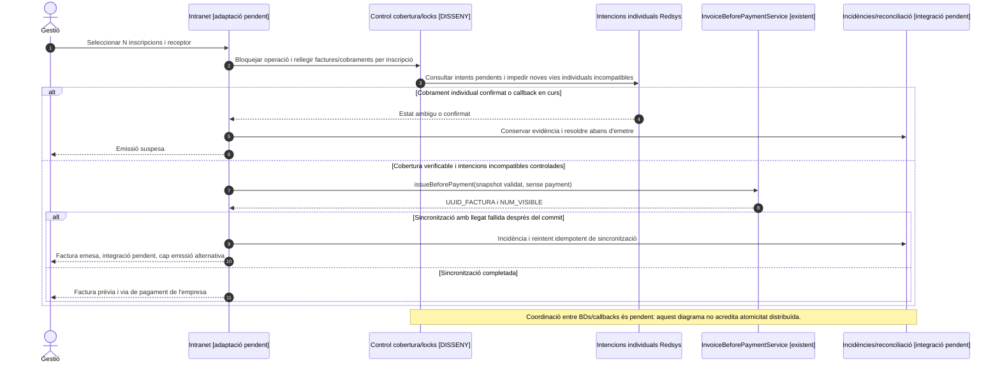
### 4.3. Acció pròpia: detectar cobertura fiscal existent abans d'emetre o pagar — OBJECTIU

La UC-21 té un disparador específic: un centre/responsable vol assumir N inscripcions. Abans d'emetre la factura d'empresa, el canal ha de diferenciar **receptor fiscal**, **pagador de l'ingrés** i **participants**. La clau idempotent de la petició d'UC-04 no identifica per si sola totes les factures prèvies amb una altra clau; `fact_rels` i les inscripcions són necessaris per detectar cobertura. Aquest control i el bloqueig dels intents TPV individuals no estan implementats pel servei `InvoiceBeforePaymentService` aïlladament.

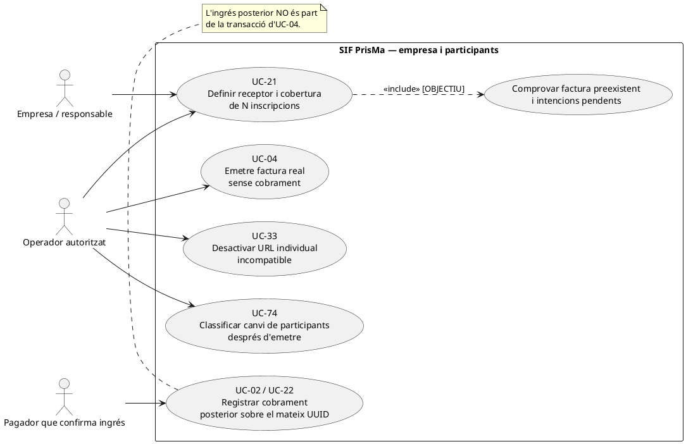

### Vista de casos d’ús per a GitHub (Mermaid)

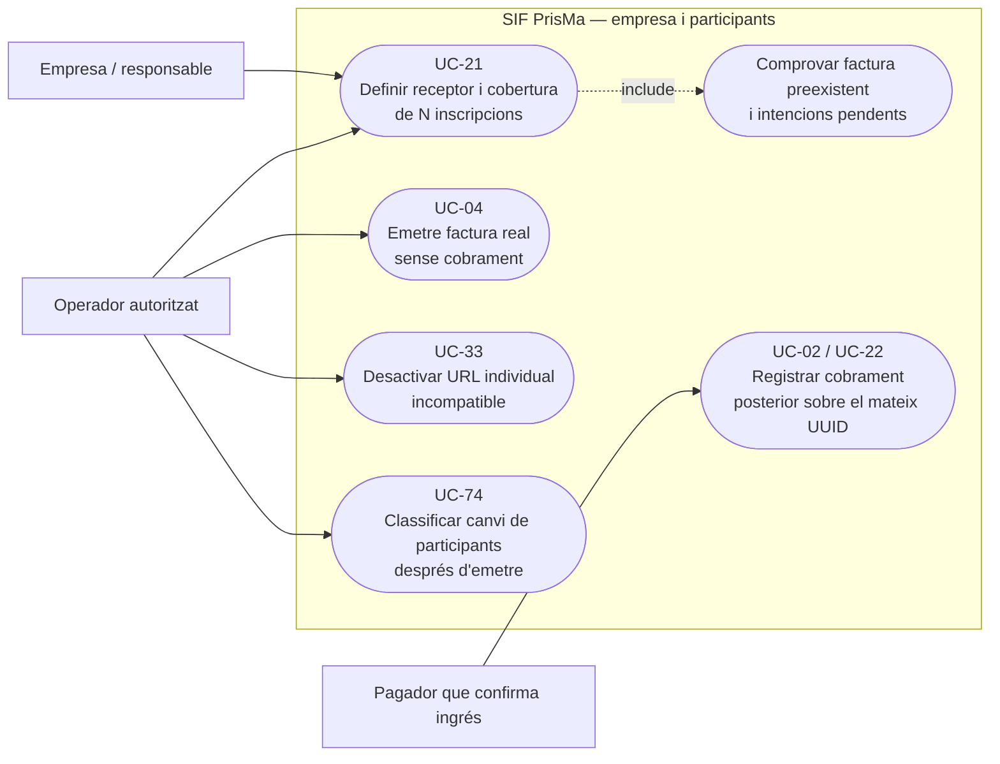

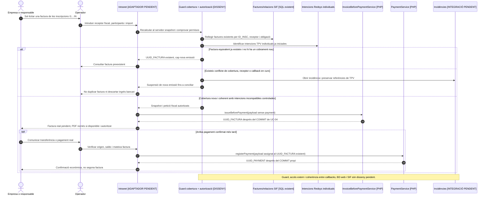

### 4.4. Acció pròpia: ingrés parcial d'empresa i atribució entre participants — OBJECTIU

Quan una empresa paga parcialment una factura que cobreix diverses inscripcions, la UC-02 només assigna import a factura. La quantitat real que correspon a **cada participant** no es pot deduir de `fact_rels`, ni repartir equitativament per defecte; `enrollment_fund_movement` continua proposta. L'operació ha de conservar un únic `UUID_PAYMENT` per ingrés extern, la mateixa factura inicial i una decisió quantitativa per inscripció quan s'implementi l'atribució.

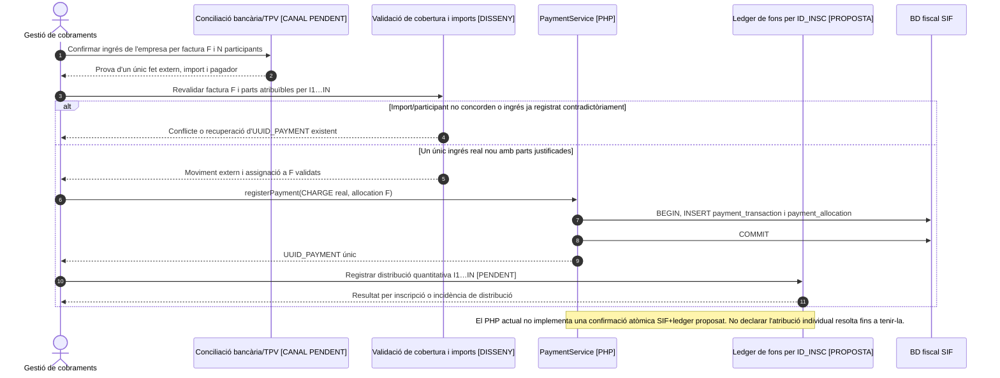

| ID de prova pendent | Escenari | Resultat exigible |
| --- | --- | --- |
| EM-21-01 | Mateixes inscripcions amb factura prèvia sota una altra clau | Recuperar factura existent o crear incidència; cap segon número fiscal. |
| EM-21-02 | Grup de 3 participants, empresa paga una part | Un `UUID_PAYMENT` per ingrés, factura comuna i atribució exacta per participant quan el ledger existeixi. |
| EM-21-03 | Intenció individual Redsys anterior a la factura d'empresa i callback tardà | Conciliar diner real sense segona factura ni perdre la reserva/estat de participant. |
| EM-21-04 | Empresa i participant tenen NIF diferent, accés al PDF des del portal | Només receptor/representant legítim autoritzat, mai exposició automàtica a tots els participants. |
| EM-21-05 | Reús de clau amb receptor o línies diferents | Rebuig per conflicte de contingut abans de donar equivalència; control pendent al nucli actual. |
## 5. Traçabilitat

[Fitxa anterior UC-21](../06-fitxes-funcionals/uc-021.md) · [Catàleg de casos](../04-estat-final/33-casos-us-sif.md) · [Fluxos de factura abans de cobrar i grup](../03-canvis-pendents/04-fluxos-facturacio.md) · [UC-04 revisada](uc-004-emetre-factura-abans-cobrar.md) · [UC-02 revisada](uc-002-registrar-cobrament-factura.md) · [InvoiceBeforePaymentService](../../sif/src/Service/InvoiceBeforePaymentService.php) · [ManualGroupInvoiceService](../../sif/src/Service/ManualGroupInvoiceService.php) · [LegacyGroupSnapshotRepository](../../sif/src/Repository/LegacyGroupSnapshotRepository.php) · [InvoiceBeforePaymentServiceTest](../../sif/tests/Integration/InvoiceBeforePaymentServiceTest.php).

**Pendent:** validació de receptor/pagador per cada cas real, congelació de participants i descomptes al flux previ, permisos d'empresa, prova d'extrem a extrem, enllaços segurs i conciliació del cobrament.
