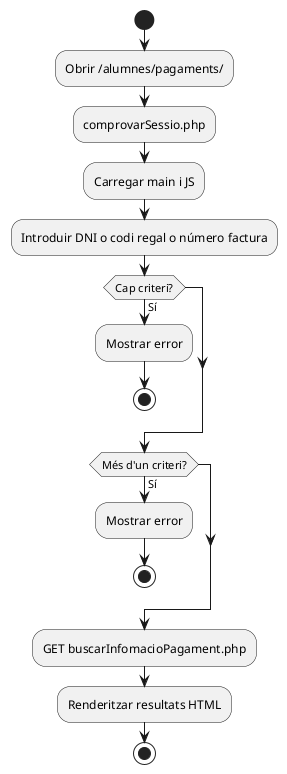
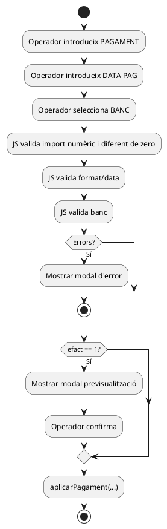
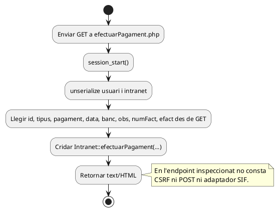
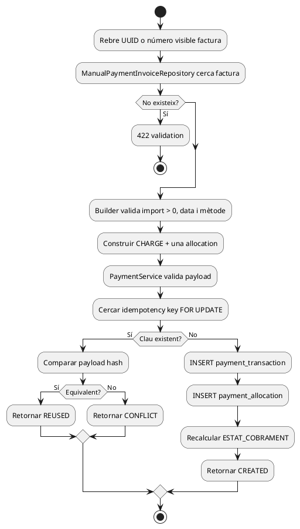
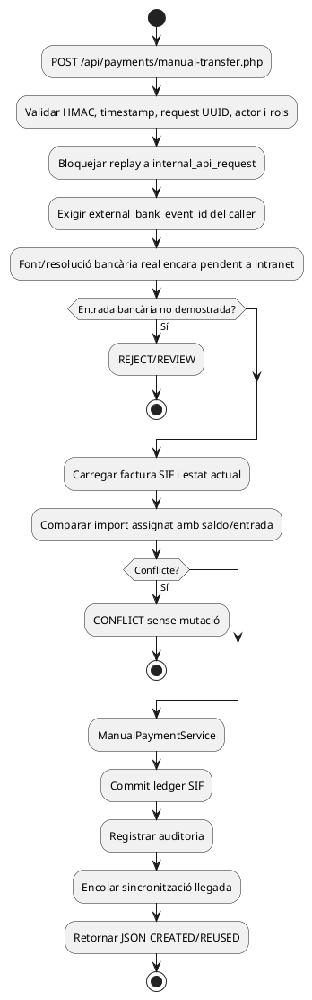
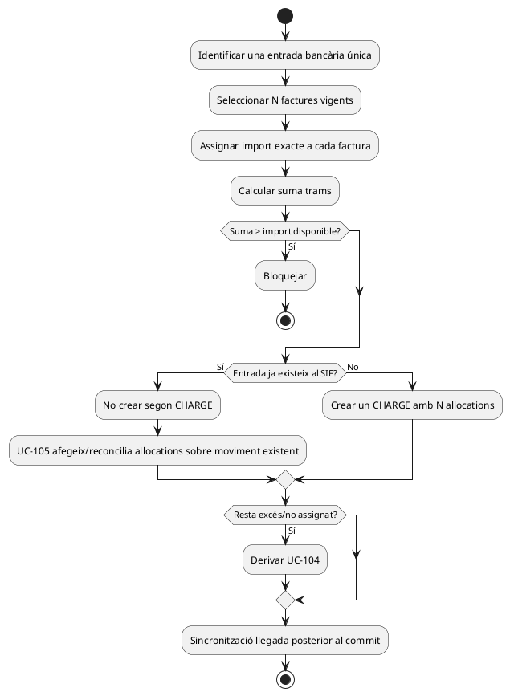
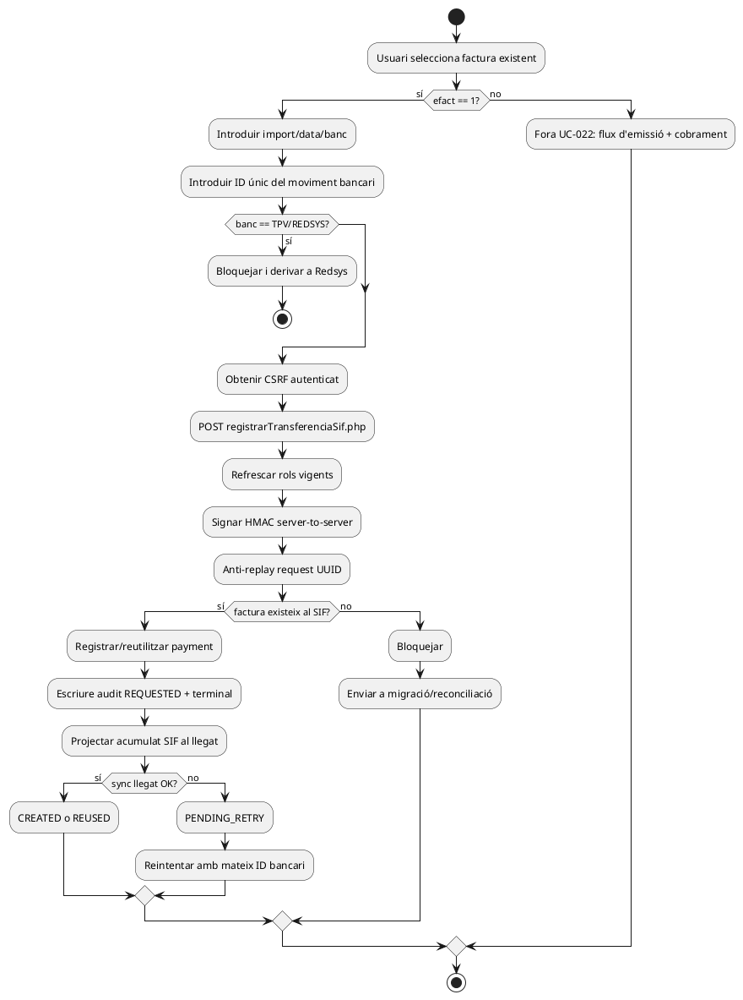

# UC-022 — Diagrames d'activitat ACTUAL i FINAL per pàgina i apartat

**Data:** 03/10/2026  
**Etiqueta ACTUAL:** codi inspeccionat, no prova de desplegament.  
**Etiqueta FINAL:** contracte objectiu, no implica implementació.

## 0. Índex

| ID | Superfície | Estat |
| --- | --- | --- |
| P01 | Intranet `/alumnes/pagaments/` — cerca | ACTUAL |
| P02 | Resultats — import/data/banc i confirmació | ACTUAL |
| P03 | `ajax/alumnes/efectuarPagament.php` | ACTUAL |
| P04 | Servei manual SIF | IMPLEMENTAT però no connectat al canal |
| P05 | Registre final una factura | FINAL / endpoint SIF parcialment implementat |
| P06 | Registre final multifactura | FINAL / UC-105 |

## 1. P01 — Cerca ACTUAL

## 2. P02 — Preparació i confirmació ACTUAL

## 3. P03 — Mutació llegat ACTUAL

## 4. P04 — Nucli SIF disponible

## 5. P05 — FINAL una factura

## 6. P06 — FINAL multifactura

## 7. Matriu de completitud

| Pàgina/apartat | ACTUAL documentat | FINAL documentat | Implementat | Verificat execució |
| --- | --- | --- | --- | --- |
| P01 cerca | sí | sí | llegat | no en aquesta auditoria |
| P02 validació/confirmació | sí | sí | llegat | no |
| P03 endpoint mutació | sí | sí | llegat | no |
| P04 servei SIF | sí | sí | sí | tests existents, no executats aquí |
| P05 adaptador autoritzat | n/a | sí | no | no |
| P06 multifactura | n/a | sí | no | no |

**Estat nou P05:** endpoint SIF + HMAC + rols + `external_bank_event_id` implementats; caller intranet, CSRF local del navegador i sincronització llegat continuen pendents.

## P07 — canal intranet segur implementat en branca

**Estat P07:** implementat en la branca; execució E2E i desplegament encara no verificats.
