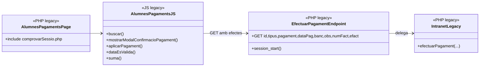
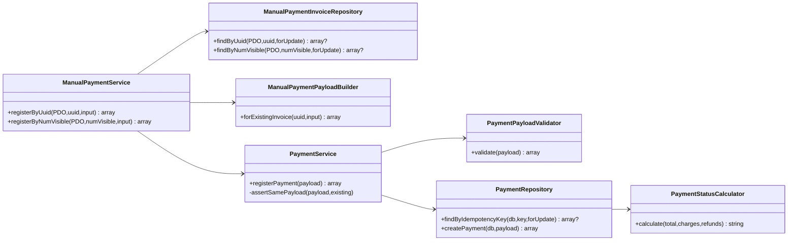
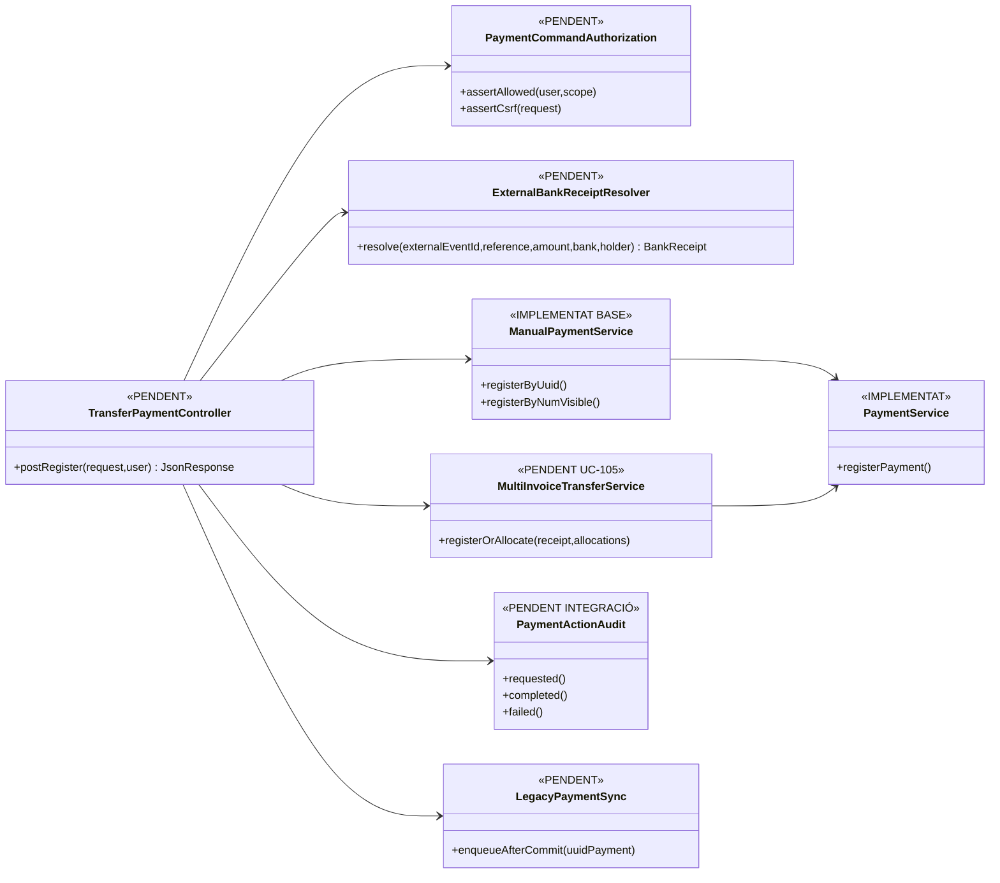

# UC-022 — Diagrames de classes/components ACTUAL i FINAL

**Data:** 03/10/2026  
**Regla:** ACTUAL = codi executable inspeccionat. FINAL = arquitectura objectiu; cada peça indica si existeix o és pendent.

## 1. ACTUAL — canal intranet llegat

**Riscos verificats:** dades econòmiques enviades pel client, verb GET per mutació, endpoint sense comprovació CSRF específica localitzada i sense adaptador SIF acreditat.

## 2. ACTUAL — nucli SIF disponible però desconnectat del canal

## 3. FINAL — adaptador autoritzat i identitat bancària

## 4. Invariants FINAL

- cap CHARGE sense prova d'entrada bancària;
- un fet bancari = una identitat externa estable;
- mateixa clau + payload diferent = CONFLICT;
- una entrada multifactura = un `payment_transaction` + N `payment_allocation`;
- sincronització llegada sempre després del commit SIF;
- el navegador no decideix import fiscal/econòmic autoritatiu;
- auditar actor, request/correlation id, factura/es, import, identitat externa i resultat.
