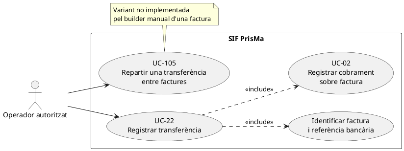
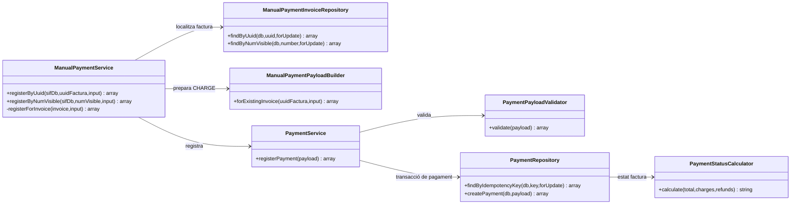
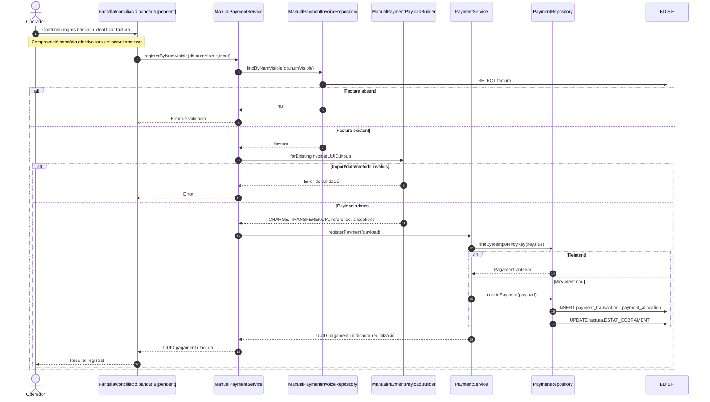

# UC-22 · Registrar una transferència rebuda — fitxa i UML integrats

**Objectiu:** vincular un cobrament bancari confirmat amb una factura SIF preexistent. És una especialització de UC-02, diferent d'emetre factura (UC-01/04), d'un pagament fraccionat consignat manualment (UC-23) i d'una devolució (UC-28).

**Codi revisat:** `ManualPaymentService`, `ManualPaymentPayloadBuilder`, `ManualPaymentInvoiceRepository`, `PaymentService` i `PaymentRepository`. L'endpoint genèric `public/api/payments/register.php` construeix `PaymentService` directament; no acredita, per si sol, la connexió de la pantalla d'intranet amb el servei manual.

## 1. Fitxa del cas d'ús

| Camp | Dades i comportament |
| --- | --- |
| Actor principal | Operador de gestió amb permisos, encara pendents d'acreditar en la integració de la pantalla. |
| Disparador | S'ha verificat l'ingrés d'una transferència i cal aplicar-lo a una factura identificada. |
| Precondició | Factura existent; confirmació bancària de l'entrada econòmica i identificació inequívoca de l'operació. **El servei no consulta el banc per verificar-la.** |
| Identificadors acceptats | UUID o número visible de la factura, localitzats amb `ManualPaymentInvoiceRepository`. |
| Entrades obligatòries del constructor | `amount`/`import`/`pagament` numèric positiu i `movement_date`/`data_pag`/`dataPag` no buida. |
| Entrades addicionals | `method=TRANSFERENCIA` per defecte (el builder també admet `MANUAL`); `reference`/`referencia`/`referencia_bancaria`, `bank`/`banc`, `notes` i `allocation_type`. |
| Efecte | Moviment `CHARGE`, `source_channel=INTRANET`, assignació `INVOICE_PAYMENT` per defecte i recàlcul de `factura.ESTAT_COBRAMENT`. |

### 1.1. Flux principal concret

1. L'operador confirma externament que l'abonament bancari existeix, en comprova l'import, la referència i el pagador, i determina a quina factura correspon. **Aquests controls de conciliació són requisits del procés objectiu, no comprovacions automàtiques presents al builder.**
2. `ManualPaymentService::registerByUuid()` o `registerByNumVisible()` rebutja un identificador buit i consulta la factura en BD; si no existeix, no passa cap moviment a `PaymentService`.
3. `ManualPaymentPayloadBuilder` normalitza l'import a dues decimals, força `movement_type=CHARGE`, `source_channel=INTRANET` i crea una única assignació per l'import a la factura.
4. Amb referència, genera `TRANSFERENCIA|REF:<referència>` com a clau idempotent; sense referència, usa mètode + factura + dia + import + banc. La **unicitat real** de la referència ha de quedar validada al circuit bancari.
5. `PaymentService::registerPayment()` valida el payload, cerca la clau en transacció i, si és nova, enregistra el moviment i l'assignació a `payment_transaction`/`payment_allocation`. Si ja existeix, retorna el mateix `uuid_payment`.
6. `PaymentRepository` calcula l'import cobrat net i actualitza l'estat de la factura; el servei manual retorna UUID de pagament i identificadors de factura.

### 1.2. Alternatives, errors i punts de control

| Escenari | Regla documentada |
| --- | --- |
| T1. Transferència parcial | L'estat de cobrament passa a `PARTIAL` si el net és positiu i inferior al total. |
| T2. Transferència que completa l'import pendent | Estat `PAID` quan el net equival al total. |
| T3. Transferència superior al pendent | El calculador pot marcar `OVERPAID`; la gestió de l'excés requereix el cas específic UC-104. |
| T4. Reintent mateixa clau | Es retorna el moviment existent; **el mètode actual no compara explícitament el nou import o la nova factura amb el moviment ja emmagatzemat** en aquesta branca. Cal comparar peticions contradictòries abans de considerar-lo resolt. |
| E1. Factura absent o identificador buit | Rebuig abans del registre econòmic. |
| E2. Import no positiu, mètode invàlid o data absent | Rebuig pel builder. |
| **P1. Diverses factures en una transferència** | El builder manual genera una assignació a una sola factura. El validador/repositori genèrics accepten diverses assignacions, però el repartiment d'una transferència entre factures necessita un cas/contracte específic (UC-105); **no està resolt per aquest constructor**. |
| **P2. Referència coincident entre operacions diferents** | Una clau per només referència pot recuperar un moviment d'una altra factura si la referència no és globalment única. Cal conciliació per import, emissor i factura i bloqueig del conflicte. |
| **P3. Canals i auditoria** | El servei no valida permisos d'usuari ni executa la conciliació bancària; el contracte final de pantalla, l'auditoria funcional i el procediment de revisió estan pendents. |

**Proves localitzades, no executades:** `ManualPaymentServiceTest::testRegistersManualPaymentAgainstExistingInvoiceByUuid`, `testRegistersManualPaymentByVisibleInvoiceNumber`, `testRejectsUnknownInvoiceBeforeRegisteringPayment`.

## 2. Diagrama UML de casos d'ús

## 3. Diagrama de classes — adaptador de transferència

## 4. Diagrama de seqüència — transferència identificada per número visible

## 5. Traçabilitat

[Fitxa anterior UC-22](../06-fitxes-funcionals/uc-022.md) · [UC-02 pagament](uc-002-registrar-cobrament-factura.md) · [ManualPaymentService](../../sif/src/Service/ManualPaymentService.php) · [ManualPaymentPayloadBuilder](../../sif/src/Service/ManualPaymentPayloadBuilder.php) · [PaymentRepository](../../sif/src/Repository/PaymentRepository.php) · [ManualPaymentServiceTest](../../sif/tests/Integration/ManualPaymentServiceTest.php).

**Pendent:** conciliació bancària, permisos, política de referències, comprovació de peticions idempotents contradictòries i assignacions múltiples.
