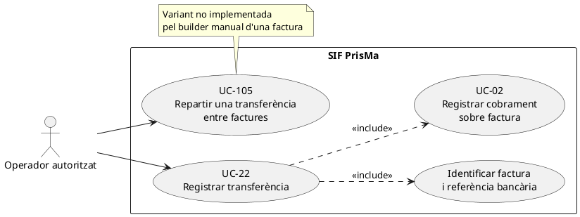
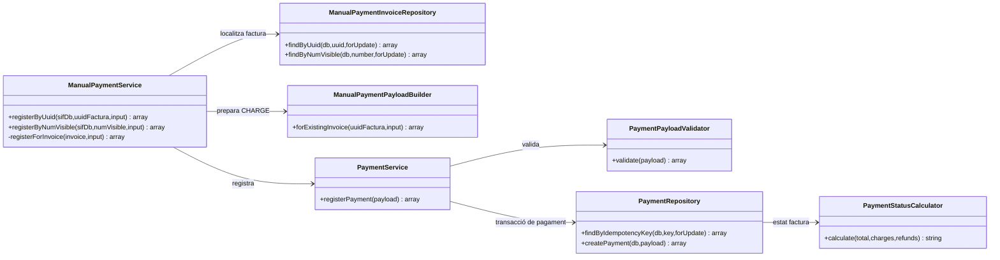
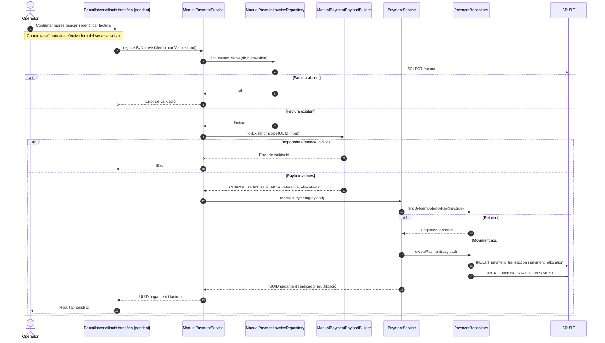
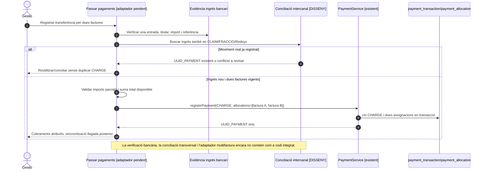
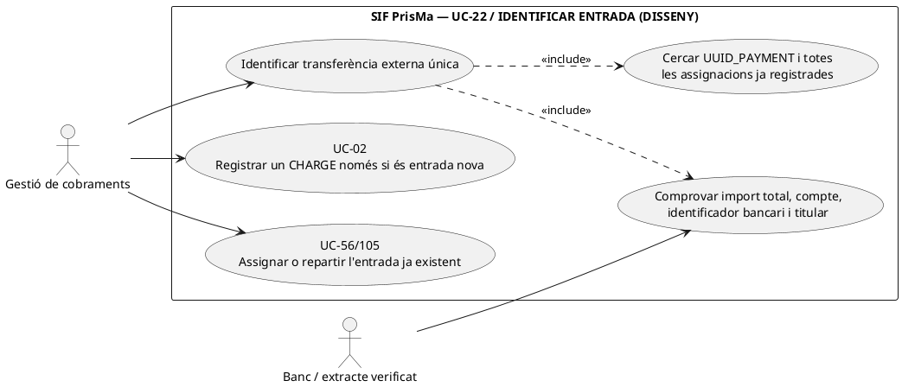
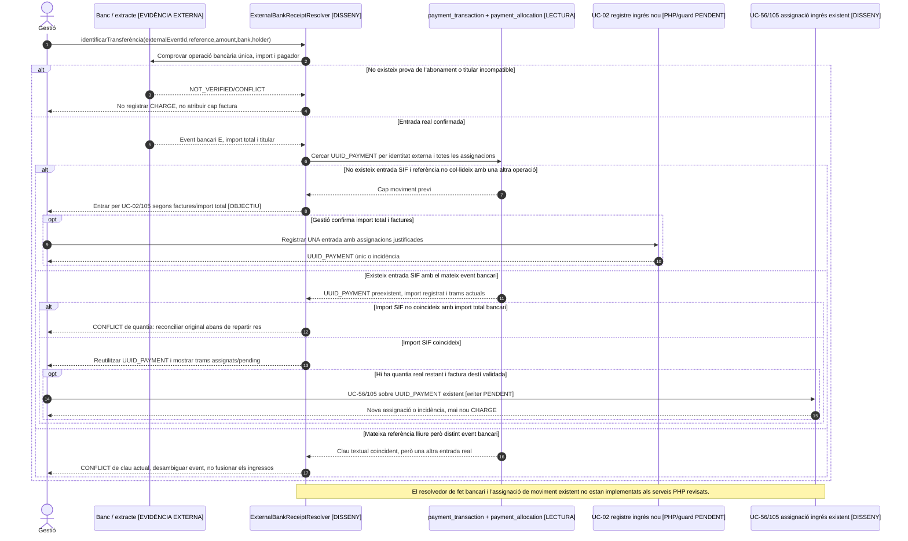

# UC-22 · Registrar una transferència rebuda — fitxa i UML integrats

**Objectiu:** vincular un cobrament bancari confirmat amb una factura SIF preexistent. És una especialització de UC-02, diferent d'emetre factura (UC-01/04), d'un pagament fraccionat consignat manualment (UC-23) i d'una devolució (UC-28).

**Codi revisat:** `ManualPaymentService`, `ManualPaymentPayloadBuilder`, `ManualPaymentInvoiceRepository`, `PaymentService` i `PaymentRepository`. L'endpoint genèric `public/api/payments/register.php` construeix `PaymentService` directament; no acredita, per si sol, la connexió de la pantalla d'intranet amb el servei manual.

## 1. Fitxa del cas d'ús

| Camp | Dades i comportament |
| --- | --- |
| Actor principal | Operador de gestió amb permisos, encara pendents d'acreditar en la integració de la pantalla. |
| Disparador | S'ha verificat l'ingrés d'una transferència i cal aplicar-lo a una factura identificada. |
| Precondició | Factura existent; confirmació bancària de l'entrada econòmica i identificació inequívoca de l'operació. **El servei no consulta el banc per verificar-la.** |
| Identificadors acceptats | UUID o número visible de la factura, localitzats amb `ManualPaymentInvoiceRepository`. |
| Entrades obligatòries del constructor | `amount`/`import`/`pagament` numèric positiu i `movement_date`/`data_pag`/`dataPag` no buida. |
| Entrades addicionals | `method=TRANSFERENCIA` per defecte (el builder també admet `MANUAL`); `reference`/`referencia`/`referencia_bancaria`, `bank`/`banc`, `notes` i `allocation_type`. |
| Efecte | Moviment `CHARGE`, `source_channel=INTRANET`, assignació `INVOICE_PAYMENT` per defecte i recàlcul de `factura.ESTAT_COBRAMENT`. |

### 1.1. Flux principal concret

1. L'operador confirma externament que l'abonament bancari existeix, en comprova l'import, la referència i el pagador, i determina a quina factura correspon. **Aquests controls de conciliació són requisits del procés objectiu, no comprovacions automàtiques presents al builder.**
2. `ManualPaymentService::registerByUuid()` o `registerByNumVisible()` rebutja un identificador buit i consulta la factura en BD; si no existeix, no passa cap moviment a `PaymentService`.
3. `ManualPaymentPayloadBuilder` normalitza l'import a dues decimals, força `movement_type=CHARGE`, `source_channel=INTRANET` i crea una única assignació per l'import a la factura.
4. Amb referència, genera `TRANSFERENCIA|REF:<referència>` com a clau idempotent; sense referència, usa mètode + factura + dia + import + banc. La **unicitat real** de la referència ha de quedar validada al circuit bancari.
5. `PaymentService::registerPayment()` valida el payload, cerca la clau en transacció i, si és nova, enregistra el moviment i l'assignació a `payment_transaction`/`payment_allocation`. Si ja existeix, retorna el mateix `uuid_payment`.
6. `PaymentRepository` calcula l'import cobrat net i actualitza l'estat de la factura; el servei manual retorna UUID de pagament i identificadors de factura.

### 1.2. Alternatives, errors i punts de control

| Escenari | Regla documentada |
| --- | --- |
| T1. Transferència parcial | L'estat de cobrament passa a `PARTIAL` si el net és positiu i inferior al total. |
| T2. Transferència que completa l'import pendent | Estat `PAID` quan el net equival al total. |
| T3. Transferència superior al pendent | El calculador pot marcar `OVERPAID`; la gestió de l'excés requereix el cas específic UC-104. |
| T4. Reintent mateixa clau | Es retorna el moviment existent; **el mètode actual no compara explícitament el nou import o la nova factura amb el moviment ja emmagatzemat** en aquesta branca. Cal comparar peticions contradictòries abans de considerar-lo resolt. |
| E1. Factura absent o identificador buit | Rebuig abans del registre econòmic. |
| E2. Import no positiu, mètode invàlid o data absent | Rebuig pel builder. |
| **P1. Diverses factures en una transferència** | El builder manual genera una assignació a una sola factura. El validador/repositori genèrics accepten diverses assignacions, però el repartiment d'una transferència entre factures necessita un cas/contracte específic (UC-105); **no està resolt per aquest constructor**. |
| **P2. Referència coincident entre operacions diferents** | Una clau per només referència pot recuperar un moviment d'una altra factura si la referència no és globalment única. Cal conciliació per import, emissor i factura i bloqueig del conflicte. |
| **P3. Canals i auditoria** | El servei no valida permisos d'usuari ni executa la conciliació bancària; el contracte final de pantalla, l'auditoria funcional i el procediment de revisió estan pendents. |

**Proves localitzades, no executades:** `ManualPaymentServiceTest::testRegistersManualPaymentAgainstExistingInvoiceByUuid`, `testRegistersManualPaymentByVisibleInvoiceNumber`, `testRejectsUnknownInvoiceBeforeRegisteringPayment`.

### 1.3. Revisió: identificar l'ingrés i les inscripcions — PENDENT

Una transferència bancària pot cobrir una o diverses inscripcions; `ManualPaymentPayloadBuilder` actual fa **una assignació a una factura**, sense `ID_INSC`. Abans de confirmar-la com a distribuïda cal validar import bancari i titular, decidir imports per participant i registrar **una atribució per inscripció** vinculada a la mateixa `UUID_PAYMENT` i, si pertoca, a l'assignació per factura. L'import atribuït per una transferència no ha de superar l'import real disponible ni repetir-se en una reclamació o un callback ja registrat. La distribució a diverses factures requereix contracte propi i no es pot deduir de les relacions `fact_rels`.

[Model i invariants de conciliació](00-revisio-moviments-inscripcions.md).

### 1.4. Contrast amb «Passar pagaments» i transferència multifactura — integració pendent

**Flux real de la intranet (xat original i documentació del procediment):** la persona operadora obre `/alumnes/pagaments/`, tria ALUMNE o GRUP i cerca amb **un sol criteri** entre NIF/NIE, codi regal i número de factura. La fila mostra `A PAGAR`, `PAGAT`, import nou `PAGAMENT`, `DATA PAG`, `BANC`, observacions, fracció i accions. El JS valida visualment import, data i banc i crida per `GET` a `ajax/alumnes/efectuarPagament.php`; aquest crida `efectuarPagament(...)` al llegat. Si hi ha una factura anterior, el llegat pot entrar a `efectuarPagamentFacturaGenerada(...)` i actualitzar `factures`/inscripcions. **Aquests passos són el circuit antic, no l'adaptador SIF ja implementat.** El canal final ha de passar a POST autoritzat, validació al servidor i sincronització del llegat després del commit SIF; no ha de modificar les dades fiscals de la factura emesa.

**T-MULTI — una transferència real paga diverses factures ja emeses (confirmat al xat original):** després d'identificar l'ingrés bancari una sola vegada, l'operador selecciona cadascuna de les factures vigents i indica l'import exacte que se li assigna. La suma de `payment_allocation.IMPORT_ASSIGNAT` ha de coincidir amb l'import real destinat a factures; si hi ha excés o import encara no assignat, cal tramitar UC-104 sense falsejar el repartiment. Es registra **un sol `payment_transaction`** amb referència bancària original i N assignacions, evitant N cobraments bancaris ficticis. `ManualPaymentPayloadBuilder` només produeix una assignació: la distribució multifactura és un contracte objectiu d'UC-105, no una capacitat acreditada de la ruta manual UC-22. La distribució entre inscripcions d'una factura de grup, quan existeixi, també necessita l'atribució monetària detallada; `fact_rels` per si sola no la quantifica.

**T-PRE — factura anterior detectada:** tant si és ordinària com `EMESA_ABANS_COBRAMENT=1`, la transferència es registra amb `registerPayment()` contra l'UUID de factura existent. Buscar per CIF, IDPAG o número visible no autoritza crear-ne una de nova quan ja hi ha cobertura de les inscripcions. Si la venda facturable encara no té factura, el circuit d'emissió simultània amb `payment` és un altre camí (UC-01), **no** una crida que faci aquest builder de factura existent.

**T-DEDUP — referència i conciliació global:** abans de seleccionar el tipus `INVOICE_PAYMENT`, `INSTALLMENT_PAYMENT` o `CLAIM_PAYMENT`, cal buscar el **fet bancari original** en tots els canals i en les operacions de cobrament ja registrades. Les claus actuals `TRANSFERENCIA|REF:<ref>` i `CLAIM|REF:<ref>` poden ser diferents per al mateix ingrés; una cerca només dins la família de claus no impedeix duplicar-lo. Amb referència absent, factura+dia+import+banc és una heurística de reintent, no prova d'unicitat bancària: exigir confirmació humana/identificador propi d'entrada bancària si hi ha col·lisió possible. Una clau igual amb factures o imports nous és conflicte, no reintent equivalent; la comparació completa del payload encara no està acreditada en PaymentService.

**T-FALLA — integració i correus:** si el SIF confirma `UUID_PAYMENT` però fallen els updates de resum al llegat, conservar el moviment i obrir incidència de sincronització/reintent idempotent. No tornar a registrar l'ingrés ni enviar una altra factura. Quan el pagament s'ha aplicat, el correu ha de donar accés autoritzat al document/PDF/QR de la factura corresponent; si hi ha una incidència documental, no prometre un PDF disponible.

### 1.5. Proves d'acceptació addicionals (no executades)

| ID | Escenari | Resultat a acreditar |
| --- | --- | --- |
| TR-01 | Transferència sobre factura ordinària i sobre factura prèvia d'empresa | Únic moviment associat a UUID_FACTURA existent; cap emissió fiscal repetida. |
| TR-02 | Una entrada bancària reparteix imports entre dues factures | Un UUID_PAYMENT real, dues assignacions explícites, suma reconciliada; variant multifactura pendent d'implementar. |
| TR-03 | Mateix ingrés cercat primer com a transferència i després com a reclamació | Detecció transversal i cap segon CHARGE, encara que canviï el prefix de la clau. |
| TR-04 | Referència bancària igual per imports o factures diferents | Conflicte i revisió, no retorn idempotent silenciós. |
| TR-05 | Transferència sense referència, mateix dia/import/banc | Dues operacions legítimes no es fusionen per una heurística; exigir identificador de banc o revisió. |
| TR-06 | Transferència superior al pendent o assignacions que no sumen import disponible | No marcar pagada la factura per força; excés/pendent explicitat i UC-104. |
| TR-07 | Error de sincronització després del commit del cobrament SIF | Moviment preservat, incidència i reintent de resum sense duplicar cobrament. |
| TR-08 | Operador sense permís o data/import modificats al navegador | Rebuig al servidor abans de registrar cap moviment. |
## 2. Diagrama UML de casos d'ús

## 3. Diagrama de classes — adaptador de transferència

## 4. Diagrama de seqüència — transferència identificada per número visible

### 4.1. Seqüència — una transferència, dues factures (OBJECTIU; no implementada pel builder manual)

### 4.2. Acció independent: identificar una transferència única abans de registrar-la per factura — DISSENY/LECTURA

**Actor/disparador:** gestió rep una línia bancària per import total, referència, compte i pagador, possiblement destinada a diverses factures. **Precondicions:** prova externa d'**una entrada real**, identitat de l'operació bancària independent de la referència lliure del remitent i permís sobre els recursos. **Postcondició:** ingrés reconegut per identitat externa, amb `UUID_PAYMENT` SIF existent o estat pendent de registre, i conjunt de factures candidates encara **sense marcar-les pagades**. Si la mateixa transferència ja consta assignada només a A, seleccionar B **no** registra un segon ingrés ni garanteix que existeixi saldo per B.

**Límit PHP contrastat:** `ManualPaymentPayloadBuilder::idempotencyKey()` usa `TRANSFERENCIA|REF:<reference>` en qualsevol factura quan `reference` és present. `PaymentService` retorna per clau el `UUID_PAYMENT` preexistent sense comprovar l'assignació nova. `ManualPaymentService` afegeix a la resposta `uuid_factura`/número de la petició actual. Per tant, una petició A/100 seguida de B/100 amb `reference=TRF-1` pot retornar en la segona un `UUID_PAYMENT_A` juntament amb `uuid_factura=B`, **sense cap fila d'assignació a B**. Vegeu la [seqüència de codi UC-02, 5.3](uc-002-registrar-cobrament-factura.md); no és una funcionalitat de repartiment, sinó una resposta inconsistent.

| Prova pendent | Escenari | Resultat exigible |
| --- | --- | --- |
| TR-09 | Entrada externa de 200 €, registre SIF `CHARGE=200` amb assignació A/100 i B pendent | Repartir els 100 restants sobre el mateix UUID després de controlar saldo; no tornar a registrar CHARGE. |
| TR-10 | Entrada bancària 200 € però registre SIF original `CHARGE=100` assignat íntegrament a A | Incidència de quantia banc/SIF; no afirmar que els 100 restants ja són un saldo del moviment de 100 fins a conciliar el registre inicial. |
| TR-11 | Alta A/100, després B/100 amb mateixa referència TRF-1 | PHP actual pot respondre UUID_PAYMENT d'A amb factura B sense assignació B; control objectiu detecta discrepància i no marca B pagada. |
| TR-12 | Dues transferències diferents tenen la mateixa referència lliure `MATRICULA` | Contrastar dos events bancaris reals; la clau textual actual no els desambigua i no s'ha de declarar que són un únic ingrés. |

## 5. Traçabilitat

[Fitxa anterior UC-22](../06-fitxes-funcionals/uc-022.md) · [UC-02 pagament](uc-002-registrar-cobrament-factura.md) · [ManualPaymentService](../../sif/src/Service/ManualPaymentService.php) · [ManualPaymentPayloadBuilder](../../sif/src/Service/ManualPaymentPayloadBuilder.php) · [PaymentRepository](../../sif/src/Repository/PaymentRepository.php) · [ManualPaymentServiceTest](../../sif/tests/Integration/ManualPaymentServiceTest.php).

**Pendent:** conciliació bancària, permisos, política de referències, comprovació de peticions idempotents contradictòries i assignacions múltiples.
