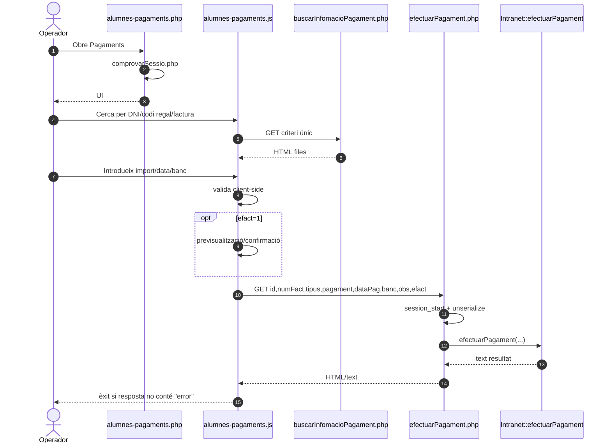
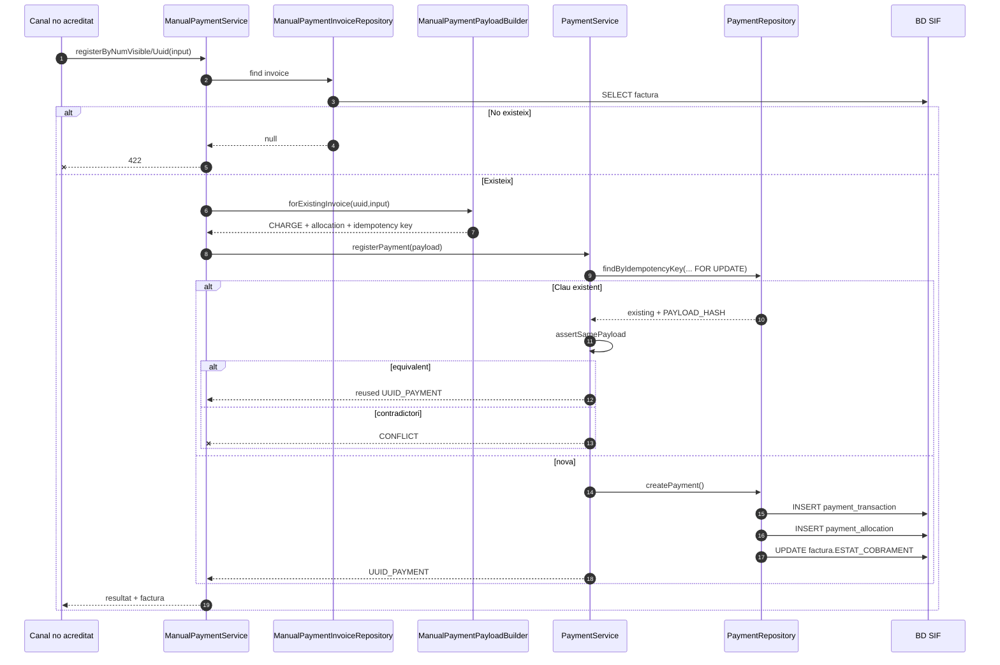
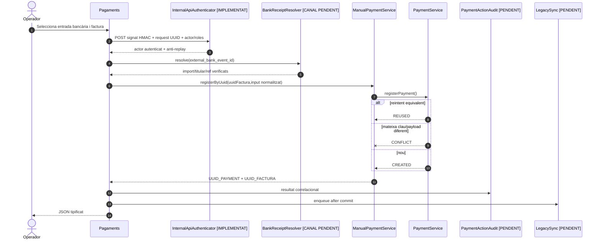
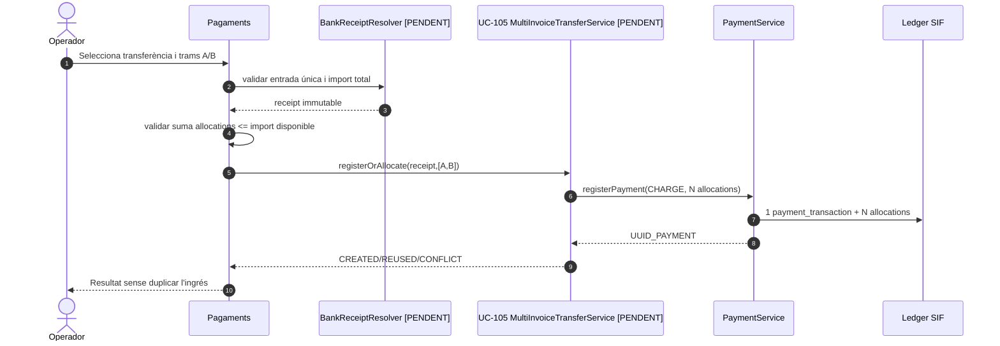
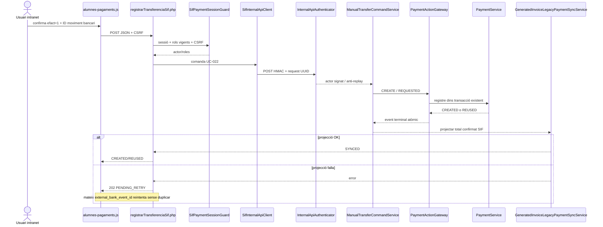

# UC-022 — Diagrames de seqüència ACTUAL i FINAL

**Data:** 03/10/2026

## 1. ACTUAL — pantalla «Pagaments» i endpoint llegat

## 2. ACTUAL — nucli SIF manual disponible

## 3. FINAL — transferència d'una sola factura

## 4. FINAL — una transferència, diverses factures

**Nota d'implementació:** el SIF ja exigeix `external_bank_event_id` i el persisteix com `PROVIDER_REF`; la resolució/obtenció d'aquest identificador des del banc encara pertany a la integració de la intranet.

## FINAL implementat en branca — factura ja generada

**Frontera:** `efact=0` continua sent emissió + cobrament i no forma part d'UC-022. Una factura absent del SIF es bloqueja i es deriva a migració/reconciliació; no s'autoemet cap substitut.
