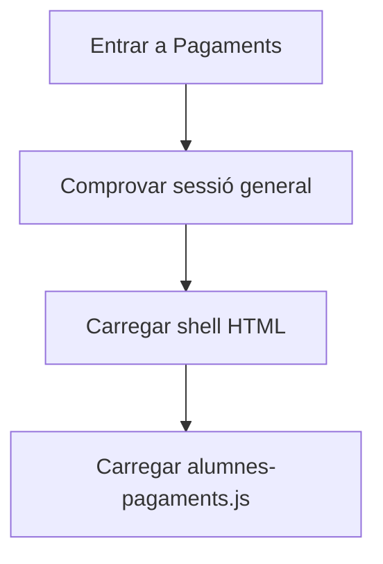
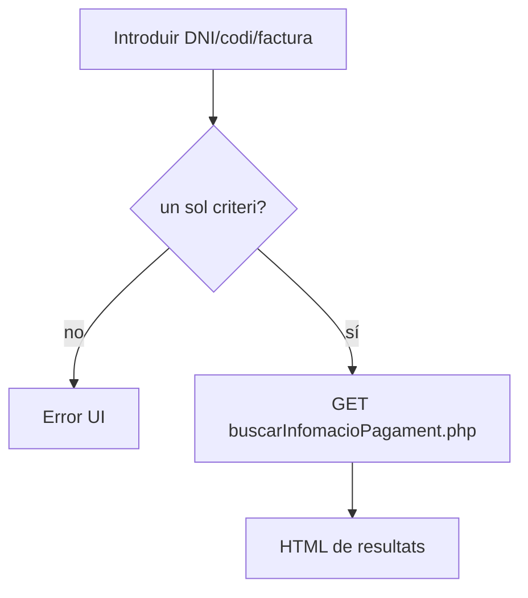
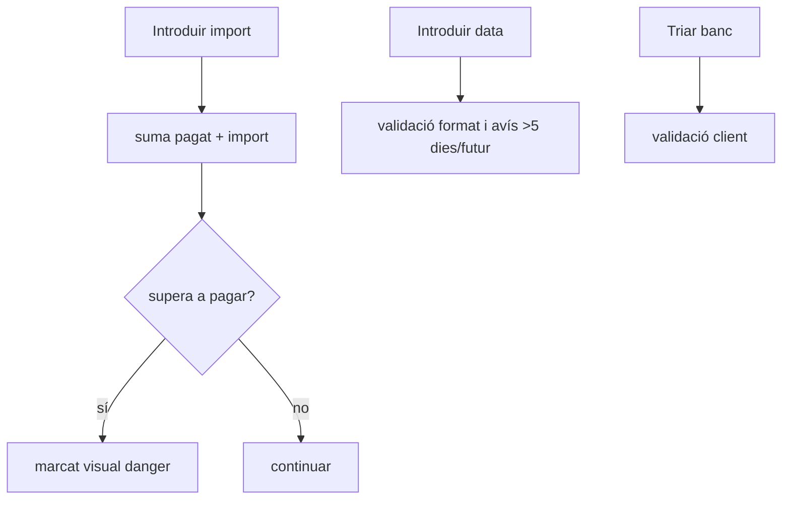
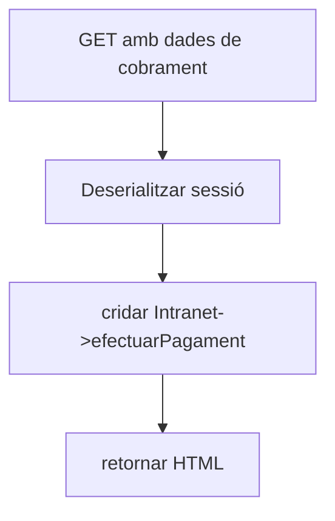
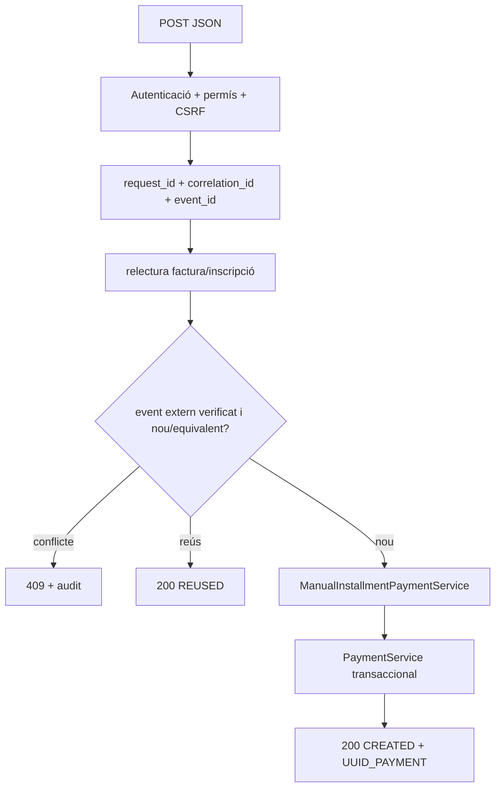

# UC-023 — Activitats per pàgina/apartat ACTUAL / FINAL

**Data:** 03/10/2026

## P01 — `alumnes-pagaments.php`

### ACTUAL

### FINAL
La pàgina pot continuar com a shell, però la mutació ha de delegar en una API de comanda autenticada i no en GET.

## P02 — cerca de cobrament

**Fitxers:** `js/alumnes-pagaments.js` + `ajax/alumnes/buscarInfomacioPagament.php`.

### ACTUAL

### FINAL
La consulta pot ser GET, però ha de retornar identificadors SIF inequívocs de factura/inscripció i estat actual.

## P03 — entrada de fracció al navegador

### ACTUAL

**Mancança:** cap d'aquestes comprovacions acredita una precondició server-side.

### FINAL
El navegador envia dades; el servidor recalcula import pendent, relació factura-inscripció, estat i elegibilitat sota lock.

## P04 — modal de confirmació

### ACTUAL
GET a `mostrarModalConfPag.php` només quan el flux ho demana.

### FINAL
La preview ha de provenir del mateix servei/guard que després valida la comanda, amb versió/etag o fingerprint per detectar estat canviat.

## P05 — `ajax/alumnes/efectuarPagament.php`

### ACTUAL

**Riscos:** GET amb efecte persistent, contracte HTML, cap clau idempotent explícita, cap versió esperada visible.

### FINAL

## P06 — endpoints històrics de dades/fracció

**Fitxers:** `guardarDadesPagament_ConsultaInformacio.php`, `guardarEnviarDadesPagament_ConsultaInformacio.php`.

### ACTUAL
Accepten per GET camps de pagament, data, IDPAG, observacions, `fraccio`, `comfraccio`, factura i recordatoris.

### FINAL
No han de crear un segon ledger paral·lel. Si segueixen existint com a UI administrativa, qualsevol canvi econòmic ha d'arribar al SIF per una comanda única i idempotent.

## P07 — servei SIF UC-023

### ACTUAL
Factura existent → builder → PaymentService → payment_transaction/allocation → estat.

### FINAL
Afegir abans del builder:
1. authorization policy;
2. destination guard ID_INSC↔factura;
3. external receipt reconciliation;
4. saldo pendent;
5. audit REQUESTED;
6. després del commit, terminal event i eventual outbox.

## Matriu de cobertura

| Pàgina/apartat | ACTUAL documentat | FINAL documentat | Implementat FINAL |
| --- | --- | --- | --- |
| P01 shell | sí | sí | no aplica/parcial |
| P02 cerca | sí | sí | parcial |
| P03 entrada client | sí | sí | no |
| P04 preview | sí | sí | no |
| P05 comanda | sí | sí | no |
| P06 endpoints històrics | sí | sí | no |
| P07 nucli SIF | sí | sí | parcial; event_id opcional en branca |
