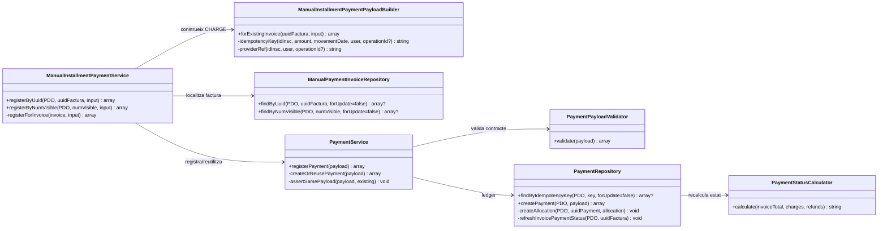
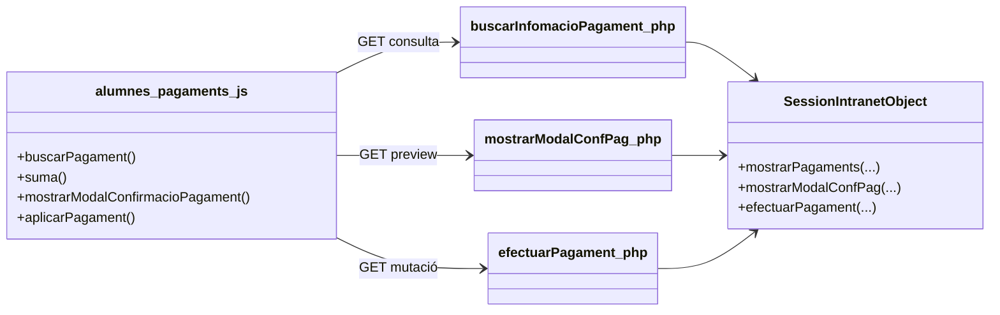
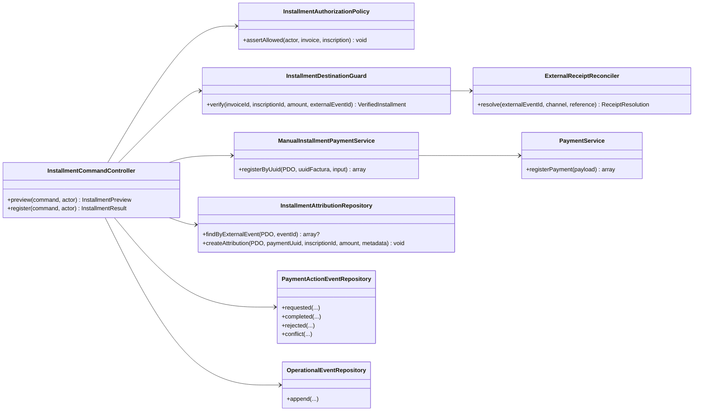

# UC-023 — Classes ACTUAL / FINAL

**Data:** 03/10/2026  
**Objectiu:** separar el model de classes que existeix avui del model necessari per tancar UC-023.

## 1. ACTUAL — nucli SIF implementat

### 1.1. Responsabilitats reals

| Classe | Implementat | No implementat aquí |
| --- | --- | --- |
| ManualInstallmentPaymentService | factura existent + delegació a PaymentService | autorització del canal, vincle ID_INSC↔factura, conciliació bancària |
| ManualInstallmentPaymentPayloadBuilder | import/data/inscripció/usuari, CHARGE manual, assignació | prova de cobrament real, saldo pendent |
| PaymentService | transacció, idempotència i conflicte de payload | semàntica específica de quota/fracció |
| PaymentRepository | moviment, assignació i estat de factura | atribució pròpia per ID_INSC |
| PaymentStatusCalculator | PENDING/PARTIAL/PAID/OVERPAID/refunds | decisió de si OVERPAID és admissible |

## 2. ACTUAL — canal intranet llegat

**Límit d'auditoria:** el repositori inspeccionat no acredita un enllaç explícit d'aquest endpoint amb `ManualInstallmentPaymentService`. Per tant no s'ha de dibuixar com si el canal ja utilitzés el nucli SIF.

## 3. FINAL — classes necessàries

## 4. Invariants FINAL

1. **Cap CHARGE sense fet econòmic identificable.**
2. **Mateix event extern + mateix payload = reús.**
3. **Mateix event extern + payload contradictori = conflicte.**
4. **Events externs diferents poden tenir mateix import/data/usuari sense col·lisionar.**
5. **ID_INSC ha d'estar cobert per la factura o relació fiscal corresponent.**
6. **La regla d'import pendent és server-side.**
7. **Un ingrés ja registrat com Redsys/transferència no es torna a crear com MANUAL.**
8. **Autorització, idempotència i ledger s'avaluen al servidor.**
9. **La UI no decideix l'èxit per text HTML sinó per resposta tipificada.**
10. **L'auditoria d'intent i resultat és correlacionable.**

## 5. Estat

| Peça FINAL | Estat |
| --- | --- |
| Identificador immutable opcional de fracció al builder | IMPLEMENTAT EN BRANCA |
| Controller POST autenticat | PENDENT |
| Authorization policy específica | PENDENT |
| Destination guard ID_INSC↔factura | PENDENT |
| Reconciliador cross-channel | PENDENT |
| Atribució monetària per inscripció | PENDENT |
| Events d'auditoria específics UC-023 | PENDENT / TRANSVERSAL |
