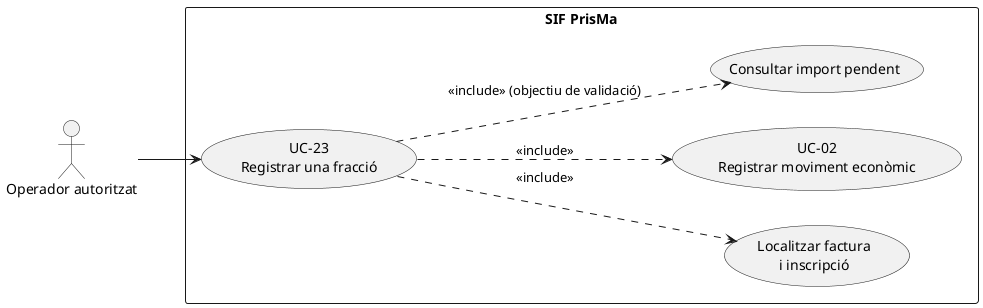
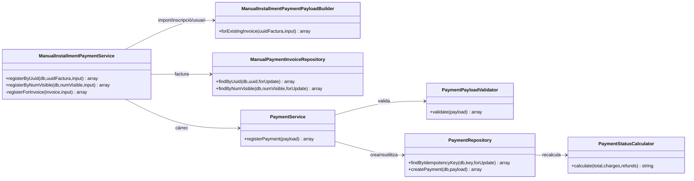
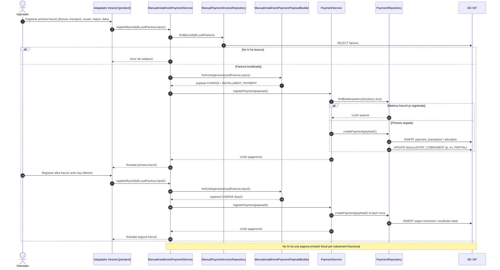

# UC-23 · Registrar una fracció de pagament — fitxa i UML integrats

**Objectiu:** registrar un cobrament parcial o una de diverses quotes d'una factura ja emesa, sense crear una altra factura per cada fracció. UC-23 especialitza UC-02. L'assignació funcional de calendaris de quotes, avisos i deute pendent **no** està resolta pel servei aquí examinat.

**Fonts executables:** `ManualInstallmentPaymentService`, `ManualInstallmentPaymentPayloadBuilder`, `ManualPaymentInvoiceRepository`, `PaymentService`, `PaymentRepository`.

## 1. Fitxa de cas d'ús

| Camp | Regla |
| --- | --- |
| Actor | Operador autoritzat d'intranet; autorització del canal final pendent d'acreditar. |
| Disparador | Es confirma el cobrament d'una fracció d'una factura existent. |
| Factura | Identificació per `UUID_FACTURA` o `NUM_VISIBLE`. |
| Camps obligatoris del builder | `amount`/`import`/`pagament` positiu; `movement_date`/`data_pag`/`dataPag`; `id_insc`/`id_inscripcio`/`inscription_id` numèric positiu; `user`/`usuari`/`created_by` no buit. |
| Moviment generat | `CHARGE`, `method=MANUAL`, `source_channel=INTRANET`, `allocation_type=INSTALLMENT_PAYMENT` per defecte, una assignació a factura. |
| Identificació del moviment | `MANUAL|FRACCIO|ID_INSC:<id>|DATA:<dia>|IMPORT:<import>|USUARI:<usuari>`. |
| Sortida | `ok`, `uuid_payment`, `idempotency_reused`, `uuid_factura` i `num_visible`; el pagament genèric actualitza `ESTAT_COBRAMENT`. |

### 1.1. Flux principal verificat

1. L'operador identifica la inscripció, la factura ja existent, l'import i la data del cobrament. **No es pot deduir del builder que les dades acadèmiques o l'entrada bancària estiguin comprovades.**
2. `ManualInstallmentPaymentService` localitza la factura per UUID o número; si no la troba, retorna error.
3. `ManualInstallmentPaymentPayloadBuilder` valida import, data, identificador d'inscripció i usuari; construeix un `CHARGE` manual amb `provider_ref=FRACCIO|ID_INSC:<id>|USUARI:<usuari>`.
4. `PaymentService` cerca el moviment per clau idempotent dins la transacció; si no existeix, `PaymentRepository` crea el moviment, una assignació i recalcula l'estat de cobrament.
5. La factura inicial conserva el número fiscal. Diferents fraccions generen moviments econòmics diferents i poden deixar-la en `PARTIAL` fins a `PAID`.

### 1.2. Alternatives, errors i punts per decidir

| Situació | Comportament |
| --- | --- |
| F1. Primer cobrament menor que el total | `PaymentStatusCalculator` calcula `PARTIAL` quan el cobrament net és positiu i inferior al total. |
| F2. Segona fracció completa el total | El calculador retorna `PAID`; cap fracció crea nova factura o nou registre fiscal. |
| F3. Reintent de la mateixa clau | El servei retorna el `uuid_payment` anterior. |
| E1. Factura desconeguda | Error de validació abans de crear moviment. |
| E2. Import no positiu, data absent, identificador d'inscripció invàlid o usuari absent | Rebuig per `ManualInstallmentPaymentPayloadBuilder`. |
| **P1. Diverses quotes idèntiques el mateix dia** | La clau només distingeix inscripció + **dia** + import + usuari, no una referència única de quota. Dues quotes legítimes del mateix import el mateix dia podrien ser interpretades com un reintent: cal un identificador de fracció/operació si el negoci admet aquest cas. |
| **P2. Fracció sobre inscripció/factura no relacionada** | El servei busca la factura per separat i el builder accepta `id_insc` d'entrada; en el camí consultat **no es comprova la correspondència real entre la inscripció i la factura**. |
| **P3. Cobrament real vs apunt manual** | `method=MANUAL` no acredita una transferència o càrrec bancari; l'origen i la justificació de cada moviment s'han de validar abans. |
| **P4. Imports totals i calendari** | No s'ha localitzat en aquest servei la validació del calendari de quotes ni un bloqueig específic d'import superior al pendent; el repositori pot calcular `OVERPAID`. |

**Proves localitzades, no executades:** `ManualInstallmentPaymentServiceTest::testRegistersInstallmentsAgainstExistingInvoiceWithoutDuplicatingFiscalRecord`, `testRegistersInstallmentByVisibleInvoiceNumber` i `testRejectsUnknownInvoiceBeforeRegisteringInstallment`.

## 2. Diagrama UML de casos d'ús

**Nota:** consultar/verificar l'import pendent abans del registre figura com a validació **objectiu**; el camí de `ManualInstallmentPaymentService` consultat no l'executa abans de delegar a `PaymentService`.

## 3. Subdiagrama de classes

## 4. Diagrama de seqüència — dues fraccions i reintent

## 5. Traçabilitat

[Fitxa original UC-23](../06-fitxes-funcionals/uc-023.md) · [UC-02 revisada](uc-002-registrar-cobrament-factura.md) · [ManualInstallmentPaymentService](../../sif/src/Service/ManualInstallmentPaymentService.php) · [ManualInstallmentPaymentPayloadBuilder](../../sif/src/Service/ManualInstallmentPaymentPayloadBuilder.php) · [PaymentService](../../sif/src/Service/PaymentService.php) · [ManualInstallmentPaymentServiceTest](../../sif/tests/Integration/ManualInstallmentPaymentServiceTest.php).

**No acreditat:** autorització, verificació de l'ingrés, validació d'import pendent o calendari de quotes i correspondència real inscripció/factura.
