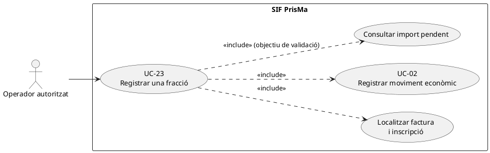
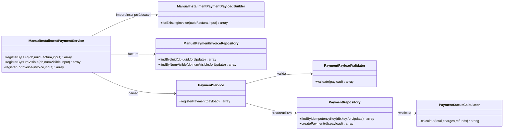
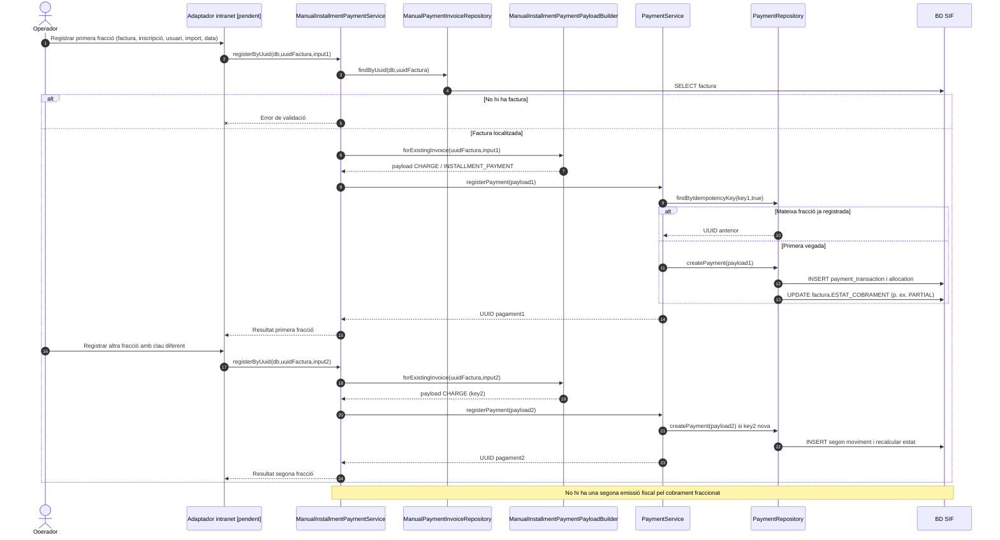
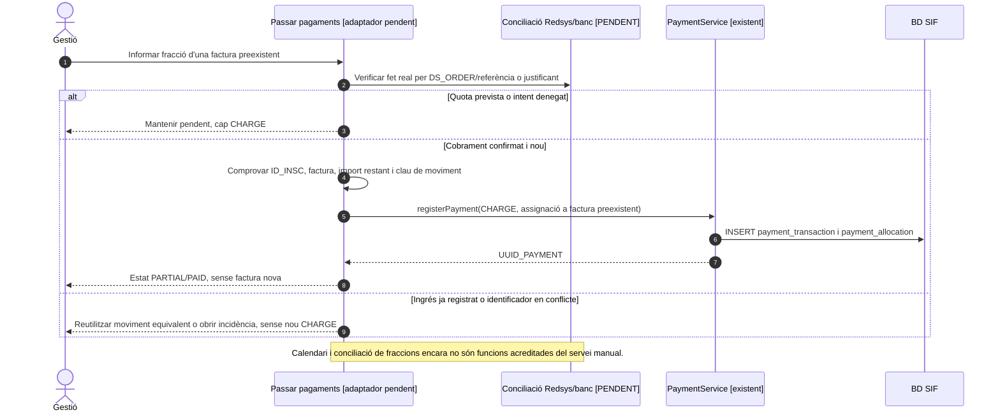

# UC-23 · Registrar una fracció de pagament — fitxa i UML integrats

**Objectiu:** registrar un cobrament parcial o una de diverses quotes d'una factura ja emesa, sense crear una altra factura per cada fracció. UC-23 especialitza UC-02. L'assignació funcional de calendaris de quotes, avisos i deute pendent **no** està resolta pel servei aquí examinat.

**Fonts executables:** `ManualInstallmentPaymentService`, `ManualInstallmentPaymentPayloadBuilder`, `ManualPaymentInvoiceRepository`, `PaymentService`, `PaymentRepository`.

## 1. Fitxa de cas d'ús

| Camp | Regla |
| --- | --- |
| Actor | Operador autoritzat d'intranet; autorització del canal final pendent d'acreditar. |
| Disparador | Es confirma el cobrament d'una fracció d'una factura existent. |
| Factura | Identificació per `UUID_FACTURA` o `NUM_VISIBLE`. |
| Camps obligatoris del builder | `amount`/`import`/`pagament` positiu; `movement_date`/`data_pag`/`dataPag`; `id_insc`/`id_inscripcio`/`inscription_id` numèric positiu; `user`/`usuari`/`created_by` no buit. |
| Moviment generat | `CHARGE`, `method=MANUAL`, `source_channel=INTRANET`, `allocation_type=INSTALLMENT_PAYMENT` per defecte, una assignació a factura. |
| Identificació del moviment | `MANUAL|FRACCIO|ID_INSC:<id>|DATA:<dia>|IMPORT:<import>|USUARI:<usuari>`. |
| Sortida | `ok`, `uuid_payment`, `idempotency_reused`, `uuid_factura` i `num_visible`; el pagament genèric actualitza `ESTAT_COBRAMENT`. |

### 1.1. Flux principal verificat

1. L'operador identifica la inscripció, la factura ja existent, l'import i la data del cobrament. **No es pot deduir del builder que les dades acadèmiques o l'entrada bancària estiguin comprovades.**
2. `ManualInstallmentPaymentService` localitza la factura per UUID o número; si no la troba, retorna error.
3. `ManualInstallmentPaymentPayloadBuilder` valida import, data, identificador d'inscripció i usuari; construeix un `CHARGE` manual amb `provider_ref=FRACCIO|ID_INSC:<id>|USUARI:<usuari>`.
4. `PaymentService` cerca el moviment per clau idempotent dins la transacció; si no existeix, `PaymentRepository` crea el moviment, una assignació i recalcula l'estat de cobrament.
5. La factura inicial conserva el número fiscal. Diferents fraccions generen moviments econòmics diferents i poden deixar-la en `PARTIAL` fins a `PAID`.

### 1.2. Alternatives, errors i punts per decidir

| Situació | Comportament |
| --- | --- |
| F1. Primer cobrament menor que el total | `PaymentStatusCalculator` calcula `PARTIAL` quan el cobrament net és positiu i inferior al total. |
| F2. Segona fracció completa el total | El calculador retorna `PAID`; cap fracció crea nova factura o nou registre fiscal. |
| F3. Reintent de la mateixa clau | El servei retorna el `uuid_payment` anterior. |
| E1. Factura desconeguda | Error de validació abans de crear moviment. |
| E2. Import no positiu, data absent, identificador d'inscripció invàlid o usuari absent | Rebuig per `ManualInstallmentPaymentPayloadBuilder`. |
| **P1. Diverses quotes idèntiques el mateix dia** | La clau només distingeix inscripció + **dia** + import + usuari, no una referència única de quota. Dues quotes legítimes del mateix import el mateix dia podrien ser interpretades com un reintent: cal un identificador de fracció/operació si el negoci admet aquest cas. |
| **P2. Fracció sobre inscripció/factura no relacionada** | El servei busca la factura per separat i el builder accepta `id_insc` d'entrada; en el camí consultat **no es comprova la correspondència real entre la inscripció i la factura**. |
| **P3. Cobrament real vs apunt manual** | `method=MANUAL` no acredita una transferència o càrrec bancari; l'origen i la justificació de cada moviment s'han de validar abans. |
| **P4. Imports totals i calendari** | No s'ha localitzat en aquest servei la validació del calendari de quotes ni un bloqueig específic d'import superior al pendent; el repositori pot calcular `OVERPAID`. |

**Proves localitzades, no executades:** `ManualInstallmentPaymentServiceTest::testRegistersInstallmentsAgainstExistingInvoiceWithoutDuplicatingFiscalRecord`, `testRegistersInstallmentByVisibleInvoiceNumber` i `testRejectsUnknownInvoiceBeforeRegisteringInstallment`.

### 1.3. Revisió: cada fracció també és una atribució monetària per inscripció — PENDENT

El builder coneix `id_insc` i l'inclou a la **clau idempotent** i a `provider_ref`, però `PaymentRepository` no desa `ID_INSC` a `payment_transaction` ni a `payment_allocation`. UC-23 ha de crear una entrada d'atribució per **cada fracció efectivament cobrada** de la inscripció i referenciar-ne el `UUID_PAYMENT`; reintentar la mateixa fracció no torna a incrementar el seu saldo. Si el pagament cobreix quotes d'inscripcions diferents, cal desglossament explícit. Un calendari de fraccions previstes no és diner cobrat: no produeix entrades `RECEIPT_ALLOCATION` abans de la confirmació.

[Proposta de registre per inscripció](00-revisio-moviments-inscripcions.md).

### 1.4. Fraccionament de negoci, diversos intents i excepció de pack — contrast amb el xat original

**Regla operativa declarada:** el primer pagament es fa habitualment abans de començar el curs i l'import s'ha d'haver completat en acabar-lo; si no hi ha pagament inicial, la gestió pot concedir una excepció justificada fins a la segona setmana (UC-96). Les quotes previstes, les reclamacions i l'estat de matrícula no són moviments de caixa: registrar només els cobraments realment confirmats. L'excepció, la durada i els avisos finals no es dedueixen de `ManualInstallmentPaymentService` i s'han de verificar en el circuit de gestió.

**F-REDSYS — un `IDPAG`, diverses operacions bancàries:** el xat original confirma que un mateix IDPAG pot aparèixer amb diversos `DS_ORDER`, per fraccionaments o intents denegats i després acceptats. IDPAG identifica el context de l'enllaç/inscripció, **no** una clau global de deduplicació de tots els cobraments. Cada cobrament Redsys real es concilia pel `DS_ORDER` corresponent i per la notificació validada (UC-03/51), mentre que una notificació denegada no genera CHARGE. Si la fracció arriba per transferència, es verifica la referència de l'entrada bancària (UC-22); no registrar la mateixa entrada després com una fracció MANUAL addicional.

**F-LEGACY — `FRACCIO` i `DATA PAG`:** al llegat, el text FRACCIO pot concatenar imports i dates dels abonaments; `PAGAMENT` acumula el pagat i `DATA PAG` pot completar-se quan la inscripció està totalment pagada. El SIF conserva cada moviment original amb data pròpia a `payment_transaction` i la seva assignació; la representació textual del llegat és només resum sincronitzat. En el modal actual «Passar pagaments» l'import introduït, la data, el banc i la columna de fracció s'han de contrastar amb la factura/inscripció real al servidor, sense derivar un CHARGE a partir d'un càlcul visual.

**F-PACK — excepció que no s'ha d'esborrar:** aquest cas UC-23 descriu **diversos cobraments d'una factura ja emesa**, que no generen noves factures. En canvi, el xat original diu que, en un pack dividit excepcionalment des de la intranet, el circuit històric pot generar **més d'una factura, segons els pagaments**. La documentació final del pack també contempla una factura per cada pagament real en aquella variant excepcional. No traslladar automàticament la regla «una factura per totes les fraccions» a aquest altre circuit: cal classificar si existeix una única factura prèvia o si són operacions/parts facturables diferents (UC-15/16), amb imports, línies i justificació aprovats. **No està acreditat aquí un orquestrador que resolgui automàticament les dues variants.**

**F-IDENT — identificar fraccions repetides:** la clau manual actual concatena ID_INSC, dia, import i usuari, però omet un identificador únic d'operació/quota i la factura. Dos cobraments legítims del mateix import i dia podrien fusionar-se; una petició amb mateix conjunt d'aquests camps però factura diferent també podria retornar el moviment anterior. Distingir reintent exacte d'ingrés nou, exigir clau estable per moviment confirmat, validar la relació inscripció/factura i les assignacions, i comparar el payload original per detectar conflictes. Són controls pendents d'integració, no garanties de l'implementat.

### 1.5. Proves d'acceptació específiques de fraccionament (no executades)

| ID | Escenari | Resultat a acreditar |
| --- | --- | --- |
| FR-01 | Dues fraccions reals contra una factura ja emesa | Dos UUID_PAYMENT, PARTIAL i PAID segons cobrament net; cap factura nova. |
| FR-02 | Un IDPAG amb dos DS_ORDER legítims acceptats | Dues fraccions diferents; cap col·lapse de les dues per IDPAG. |
| FR-03 | DS_ORDER denegat, després un altre acceptat | Cap CHARGE pel denegat; CHARGE només pel confirmat. |
| FR-04 | Dues fraccions manuals iguals el mateix dia i usuari | Identificador diferenciat del fet real; no fusionar cobraments legítims. |
| FR-05 | Mateixa clau manual sobre factura diferent | Conflicte de payload/relació, no reutilitzar una fracció aliena. |
| FR-06 | Transferència ja registrada i cercada a la columna FRACCIO | Una sola entrada bancària i cap segon CHARGE de tipus MANUAL. |
| FR-07 | Una fracció entra després de baixa, canvi o factura ja corregida | Relectura de l'estat i incidència/regularització, no imputació al destí obsolet. |
| FR-08 | Pack excepcional dividit per decisió de la intranet | Identificar explícitament el circuit de facturació del pack, sense aplicar a cegues la regla d'UC-23. |
## 2. Diagrama UML de casos d'ús

**Nota:** consultar/verificar l'import pendent abans del registre figura com a validació **objectiu**; el camí de `ManualInstallmentPaymentService` consultat no l'executa abans de delegar a `PaymentService`.

## 3. Subdiagrama de classes

## 4. Diagrama de seqüència — dues fraccions i reintent

### 4.1. Seqüència — quotes previstes, cobrament verificat i reintent (OBJECTIU)

## 5. Traçabilitat

[Fitxa original UC-23](../06-fitxes-funcionals/uc-023.md) · [UC-02 revisada](uc-002-registrar-cobrament-factura.md) · [ManualInstallmentPaymentService](../../sif/src/Service/ManualInstallmentPaymentService.php) · [ManualInstallmentPaymentPayloadBuilder](../../sif/src/Service/ManualInstallmentPaymentPayloadBuilder.php) · [PaymentService](../../sif/src/Service/PaymentService.php) · [ManualInstallmentPaymentServiceTest](../../sif/tests/Integration/ManualInstallmentPaymentServiceTest.php).

**No acreditat:** autorització, verificació de l'ingrés, validació d'import pendent o calendari de quotes i correspondència real inscripció/factura.
