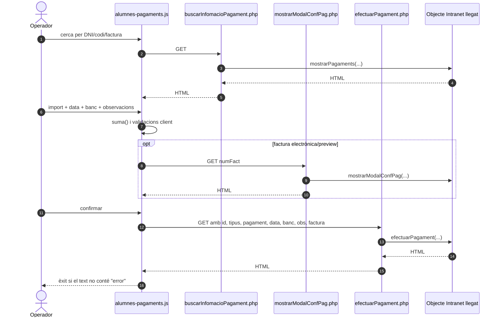
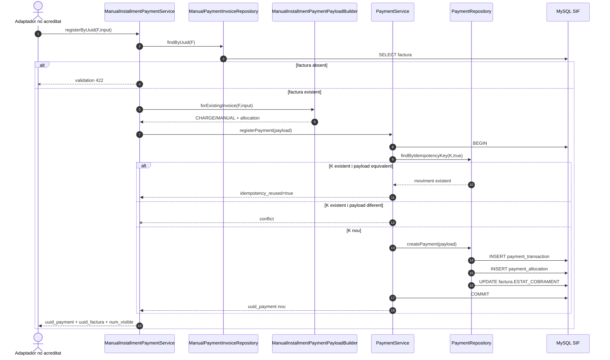
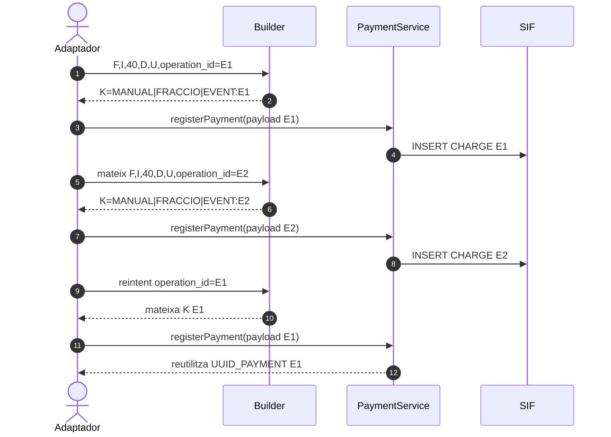
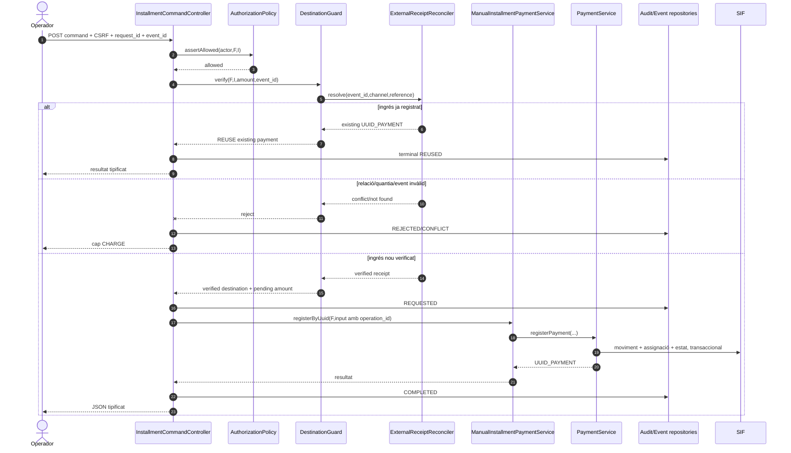
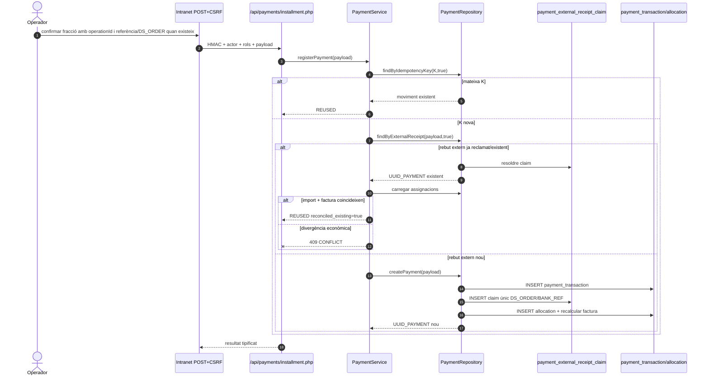

# UC-023 — Seqüències ACTUAL / FINAL

**Data:** 03/10/2026

## 1. ACTUAL — pantalla intranet llegada

**No acreditat:** que `L.efectuarPagament()` delegui a `ManualInstallmentPaymentService`.

## 2. ACTUAL — nucli SIF

## 3. ACTUAL en aquesta branca — event immutable opcional

Si no hi ha `operation_id`, es manté la clau històrica exacta.

## 4. FINAL — registre segur d'una fracció

## 5. Punts pendents

- transport POST autenticat;
- vincle factura-inscripció;
- saldo pendent server-side;
- reconciliació global de l'event bancari;
- atribució per inscripció;
- evidència E2E.

## 6. IMPLEMENTAT EN BRANCA — reconciliació cross-channel atòmica

La restricció única de `payment_external_receipt_claim` és la barrera de concurrència: dues peticions simultànies amb claus funcionals diferents no poden reclamar el mateix fet bancari com dos cobraments.

## 7. Pendents després de la implementació

- configurar URL/secrets/rols als entorns;
- activar `SIF_INSTALLMENT_PAYMENT_ENFORCED=1` a test/pre;
- conservar evidència E2E amb `verify-manual-installment-evidence.php`;
- decidir quins fluxos manuals han d'exigir obligatòriament referència bancària o DS_ORDER, perquè un `operationId` generat per la UI identifica l'intent però no prova per si sol l'existència del moviment bancari;
- retirar el fallback llegat quan el tall SIF estigui validat.
