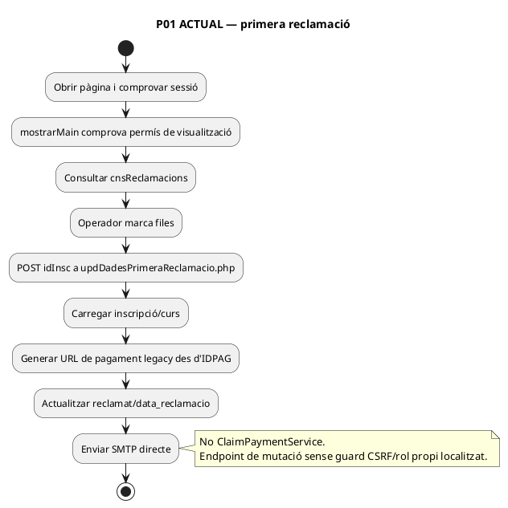
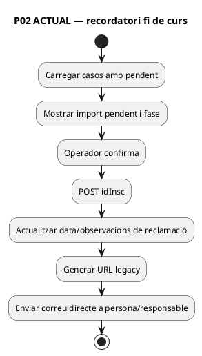
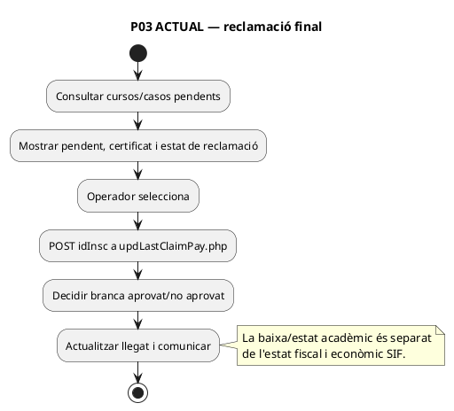
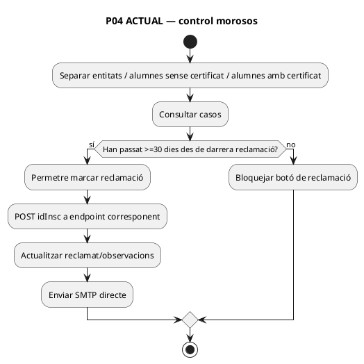
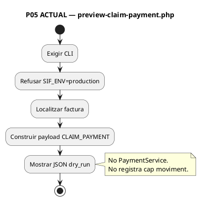
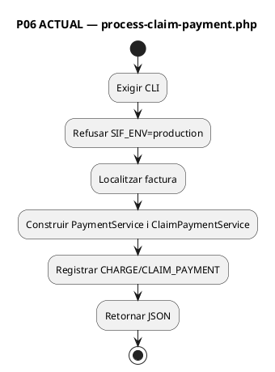

# UC-024 — Activitats ACTUAL / FINAL per pàgina i apartat

**Revisió:** 03/10/2026  
**Etiqueta ACTUAL:** codi localitzat al repositori; no prova desplegament.  
**Etiqueta FINAL:** contracte objectiu.

## 0. Superfícies

| ID | Superfície | Estat UC-024 |
| --- | --- | --- |
| P01 | Primera reclamació de pagament | Llegat, comunicació/estat; no registra CHARGE SIF |
| P02 | Recordatori pagament final | Llegat, comunicació/estat; no registra CHARGE SIF |
| P03 | Reclamació final i baixa | Llegat, decisió/comunicació; no registra CHARGE SIF |
| P04 | Control morosos | Llegat, reclamacions mensuals; no registra CHARGE SIF |
| P05 | CLI preview claim payment | SIF executable, no muta |
| P06 | CLI process claim payment | SIF executable, muta en no-producció |
| P07 | Bridge + API interna UC-024 | Implementat en branca; feature flag OFF per defecte; preproducció pendent |

## 1. P01 — Primera reclamació



## 2. P02 — Recordatori final



**Nota de reconciliació:** a `main` hi havia un handler antic `#upd-baixes → confirmaReclamacio()` sense funció definida. Aquesta branca l’elimina; el flux útil queda a `#confirma-reclamacio → confirmaRecordatori()`.

## 3. P03 — Reclamació final / baixa



## 4. P04 — Control morosos



## 5. P05 — Preview SIF



## 6. P06 — Process SIF



## 7. P07 — BRANCA IMPLEMENTADA / intranet canònica

```plantuml
@startuml
title P07 BRANCA — registrar cobrament reclamat
start
:Clicar Registrar cobrament si feature flag activa;
:Bridge valida sessió, Same-Origin/AJAX, permís i CSRF;
:Derivar claim_case_id i actor server-side;
:API HMAC resol factura + IDPAG des de fact_rels;
:Introduir identificador extern tipificat de l'ingrés;
:Resolver deduplicació intercanal;
if (Ingrés ja registrat?) then (sí)
 :Vincular UUID_PAYMENT existent a l'expedient;
else (no)
 if (Ingrés acreditat i import admès?) then (sí)
  :Registrar CHARGE amb clau idempotent per ingrés;
 else (no)
  :PENDING_REVIEW/CONFLICT;
  stop
 endif
endif
:Persistir actor/correlació/resultat LINK_CLAIM_PAYMENT;
:Commit SIF;
:Projectar net de factura al legacy amb guard de baseline/delta;
:Auditar SYNC_LEGACY;
:Retornar estat tipificat o requires_reconciliation;
note right
  Outbox de correus encara no forma part
  de la nova mutació econòmica.
end note;
stop
@enduml
```

## 8. Cobertura per pàgina

| Superfície | Consulta | Mutació llegada | SIF payment | Autorització mutació acreditada | Correu outbox |
| --- | --- | --- | --- | --- | --- |
| P01 | Sí | Sí | Sí amb feature flag | Sí al bridge | No |
| P02 | Sí | Sí | Sí amb feature flag | Sí al bridge | No |
| P03 | Sí | Sí | Sí amb feature flag | Sí al bridge | No |
| P04 | Sí | Sí | Sí amb feature flag | Sí al bridge | No |
| P05 | Sí | No | No | CLI/no-prod | N/A |
| P06 | Sí | Sí | Sí | CLI/no-prod | N/A |
| P07 BRANCA | Sí | Sí | Sí | Implementat | No; correu llegat separat |
