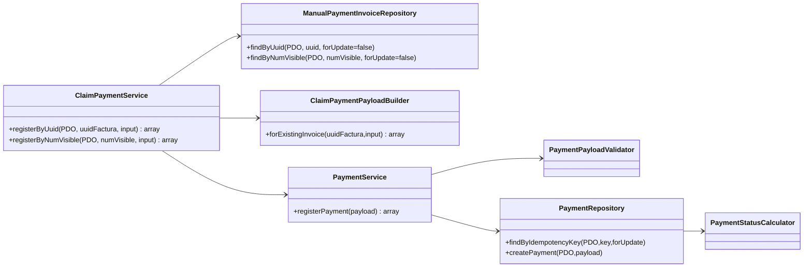
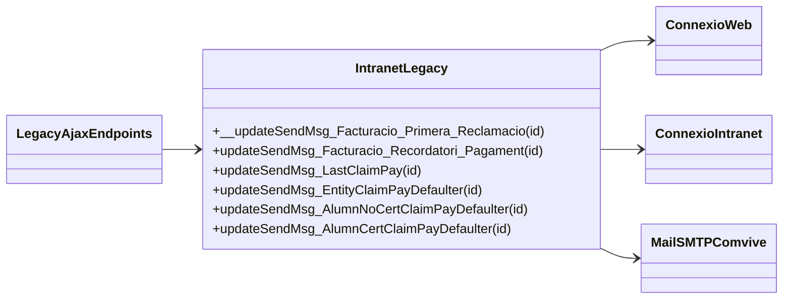
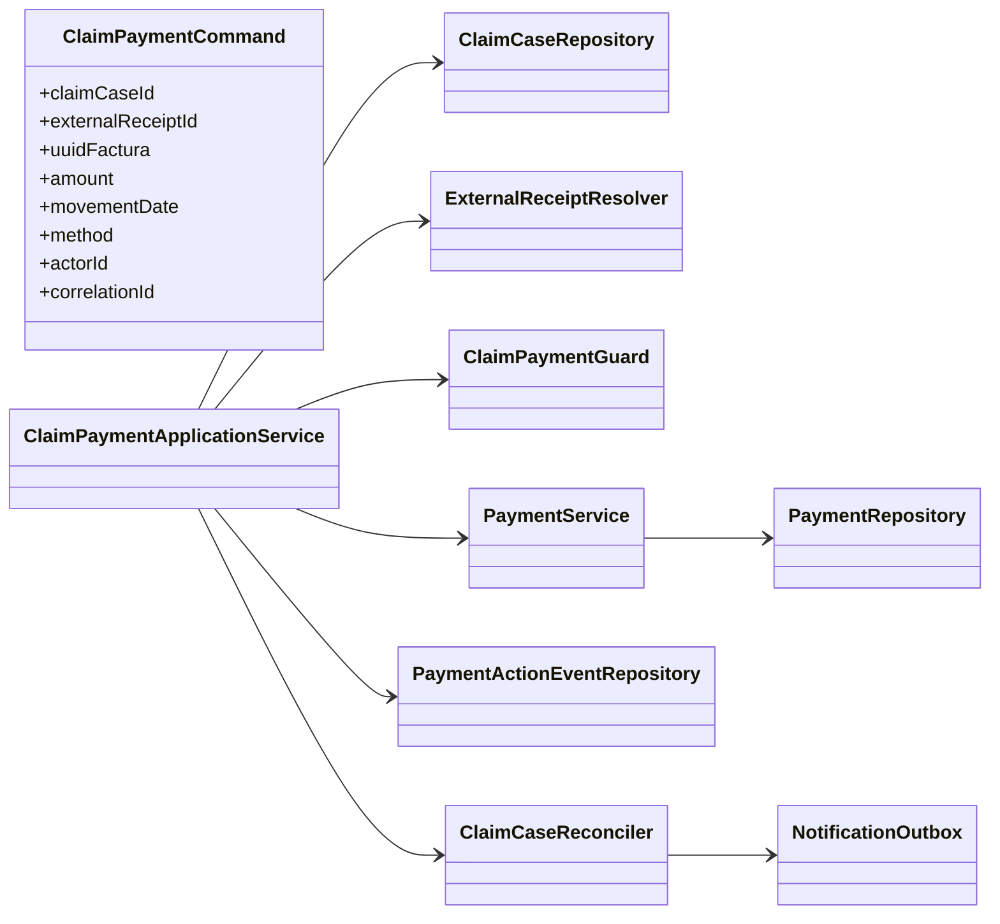

# UC-024 — Classes ACTUAL / FINAL

**Revisió:** 03/10/2026  
**ACTUAL:** lectura del codi de `main`.  
**FINAL:** arquitectura objectiu; no implica implementació.

## 1. ACTUAL — nucli SIF executable

### Observacions ACTUALS

- `ClaimPaymentService` no és cridat per les quatre pantalles llegades inspeccionades.
- `claim_reference` acaba podent alimentar `REFERENCIA_BANCARIA`.
- `created_by` no té persistència específica al moviment.
- No hi ha classe executable `ClaimCaseRepository`, `ClaimExternalReceiptResolver` ni `ClaimCaseReconciler` localitzada per UC-024.
- El saldo no es valida al servei abans de crear el `CHARGE`.

## 2. ACTUAL — frontera intranet llegada

Aquesta frontera gestiona seguiment i comunicacions, però no delega el registre econòmic a `ClaimPaymentService`.

## 3. FINAL — separació d'expedient, rebut extern i moviment SIF

## 4. Responsabilitats FINAL

| Component | Responsabilitat |
| --- | --- |
| `ClaimPaymentCommand` | transportar identitats sense confondre expedient i rebut |
| `ExternalReceiptResolver` | acreditar/deduplicar el fet econòmic entre canals |
| `ClaimPaymentGuard` | comprovar factura, saldo, estat i autorització |
| `PaymentService` | persistir moviment idempotent |
| `ClaimCaseRepository` | mantenir fase/estat de reclamació |
| `ClaimCaseReconciler` | decidir PARTIAL/SETTLED/REVIEW després del ledger |
| `PaymentActionEventRepository` | actor, request/correlation, intent i resultat |
| `NotificationOutbox` | comunicacions després del commit |

## 5. Diferències ACTUAL → FINAL

1. D'una única `reference` amb semàntica ambigua a dues identitats explícites.
2. De UI llegada desconnectada del SIF a una comanda backend autoritzada.
3. D'idempotència local per família de clau a deduplicació del fet econòmic entre canals.
4. De correu SMTP síncron a notificació traçable post-commit.
5. D'actor només al payload a actor persistent/auditable.
