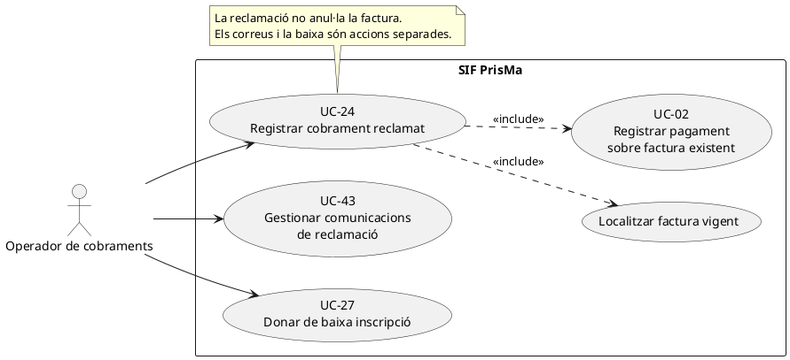
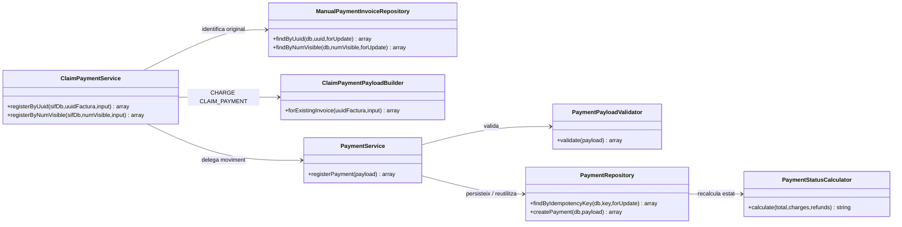
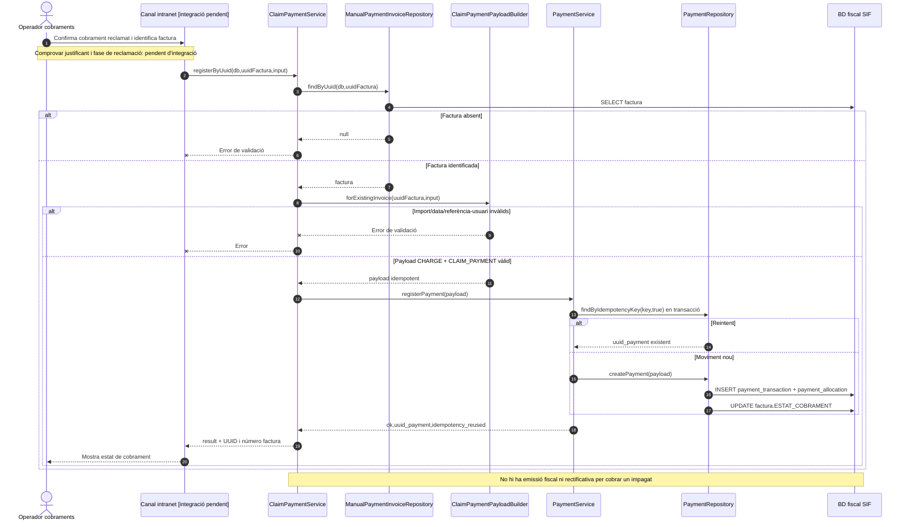

# UC-24 · Registrar un cobrament de reclamació — fitxa i UML integrats

**Identitat funcional:** registrar un cobrament **ja confirmat** després d'una reclamació per impagament, imputant-lo a la factura SIF que continua vigent. Reclamar o enviar recordatoris és una operació de comunicació diferent (UC-43). La morositat no comporta donar de baixa la inscripció (UC-27), rectificar la factura (UC-05) ni emetre una factura nova (UC-01).

**Estat contrastat:** `ClaimPaymentService`, `ClaimPaymentPayloadBuilder` i les proves de servei existeixen al repositori; la pantalla, els enllaços de cobrament i els correus finals de reclamació figuren pendents a la documentació de fluxos.

## 1. Fitxa de cas d'ús

| Camp | Especificació particular |
| --- | --- |
| Actor | Operador de facturació/cobraments, amb autorització del canal pendent d'acreditar. |
| Disparador | Un import reclamat es cobra i l'operador disposa de la justificació del cobrament. |
| Precondició econòmica | Factura SIF ja emesa i identificada; el servei analitzat no verifica per si sol el justificant bancari ni l'historial complet de la reclamació. |
| Identificació | `uuid_factura` o `num_visible`, resolts per `ManualPaymentInvoiceRepository`. |
| Camps obligatoris del constructor | Import positiu `amount`/`import`/`pagament` i `movement_date`/`data_pag`/`dataPag`. En absència de referència també és obligatori `created_by`/`user`/`usuari`. |
| Mètode | `TRANSFERENCIA` per defecte; el builder també admet `MANUAL`; `source_channel=INTRANET`. |
| Imputació | Moviment `CHARGE` i una assignació `allocation_type=CLAIM_PAYMENT` a la factura original. |
| Resultat | `ok`, `uuid_payment`, `idempotency_reused`, `uuid_factura`, `num_visible`. |

### 1.1. Flux principal comprovat al codi

1. L'operador identifica la factura i l'import confirmat. El seguiment de fases de morositat, les comunicacions i la comprovació de l'ingrés són **precondicions externes** a aquest servei.
2. `ClaimPaymentService::registerByUuid()` o `registerByNumVisible()` rebutja identificadors buits, consulta la factura i falla si no la troba.
3. `ClaimPaymentPayloadBuilder::forExistingInvoice()` crea `movement_type=CHARGE`, `source_channel=INTRANET`, mètode i assignació `CLAIM_PAYMENT`. Pren la referència d'una de les claus `claim_reference`, `reclamation_ref`, `reclamacio_ref`, `reference`, `referencia`, `referencia_bancaria`.
4. Si existeix referència, la clau idempotent serà `CLAIM|REF:<referència_normalitzada>`. Si no existeix, exigeix usuari i genera `CLAIM|FACT:<factura>|DATA:<dia>|IMPORT:<import>|USUARI:<usuari>`.
5. `PaymentService::registerPayment()` valida i cerca el moviment existent per clau idempotent; si és nou, `PaymentRepository` crea `payment_transaction`, `payment_allocation` i recalcula `ESTAT_COBRAMENT`. El servei retorna els identificadors de moviment i factura.

### 1.2. Alternatives i errors

| Escenari | Resposta observada o requisit pendent |
| --- | --- |
| R1. Cobrament complet després de reclamar | El calculador econòmic pot establir `PAID`; el cobrament no crea una nova factura fiscal. |
| R2. Cobrament parcial | El calculador pot establir `PARTIAL` i continua existint un import pendent; cal que la pantalla actualitzi l'estat de reclamació de manera diferenciada. |
| R3. Reintent equivalent | `PaymentService` retorna el mateix `uuid_payment` sense registrar dues vegades el cobrament. |
| E1. Factura absent | Rebuig per `ClaimPaymentService` abans del moviment econòmic. |
| E2. Import no positiu, data absent o mètode invàlid | Rebuig per `ClaimPaymentPayloadBuilder`. |
| E3. Sense referència ni usuari | El constructor rebutja l'operació, perquè necessita `created_by` per formar la clau de reserva. |
| **P1. Referència no unívoca** | La clau `CLAIM|REF:<referència>` no incorpora la factura ni l'import; cal comprovar que una referència no identifica cobraments diferents. |
| **P2. Reclamació vs cobrament** | El constructor pot registrar el pagament sense verificar l'existència d'un expedient de reclamació ni el seu estat; aquests passos s'han d'integrar al flux de gestió. |
| **P3. Comunicació / URL** | El servei de registre no envia el correu de reclamació ni genera un enllaç de pagament; el document de fluxos els dona per pendents. |
| **P4. Registre d'accions** | No s'ha acreditat que aquesta ruta de servei escrigui totes les traces transversals `payment_action_event` i les notificacions previstes pel disseny final. |

**Persistència executable d'aquest cas:** moviment `CHARGE` a `payment_transaction`, assignació `CLAIM_PAYMENT` a `payment_allocation`, i actualització de l'estat de cobrament de la factura. No crea número fiscal, registre `ALTA`, rectificativa ni cua fiscal.

**Proves localitzades, no executades:** `ClaimPaymentServiceTest::testRegistersClaimPaymentAgainstExistingInvoiceWithoutFiscalIssue`, `testRegistersClaimPaymentByVisibleInvoiceNumber` i `testRejectsUnknownInvoiceBeforeRegisteringClaimPayment`.

### 1.3. Revisió: el cobrament reclamat s'ha d'atribuir a l'operació correcta — PENDENT

`CLAIM_PAYMENT` és un tipus d'assignació **a factura**, no una assignació monetària al nivell de la inscripció reclamada. El registre de l'ingrés confirmat ha de conservar identificador de reclamació, `UUID_PAYMENT` i l'import atribuït a cada inscripció que es cobra. Si una reclamació és compartida per diverses inscripcions, l'import s'ha de repartir segons deute efectiu, no duplicar en cada inscripció. Reintentar una transferència ja registrada com a pagament ordinari no ha de crear un cobrament nou amb clau `CLAIM` diferent; la conciliació del fet bancari original és una validació pendent.

[Registre transversal proposat](00-revisio-moviments-inscripcions.md).

### 1.4. Fases reals de reclamació i cobrament — contrast amb el xat original

**Calendari i estats descrits per PrisMa, no pel ClaimPaymentService:** un primer pagament es demana abans de començar el curs i cal completar-lo en acabar. Quan una persona no paga a l'inici, es reclama l'import; amb justificació, pot continuar inscrita fins a la segona setmana (UC-96). Aleshores, si **no ha pagat res**, el procediment històric preveu una baixa administrativa; si hi ha algun import abonat, el cas pot continuar en seguiment. També hi ha recordatoris l'últim dia del curs, una setmana més tard i al cap d'un mes, i després la consideració de morositat amb noves reclamacions. Cada fase té un apartat propi a la intranet. **Aquests terminis són informació del funcionament explicat al xat**, no un cronograma automàtic acreditat ni una regla fiscal. La decisió de baixa es tramita separadament per UC-27/72; reclamar no és donar de baixa ni anul·lar la factura.

**R-ACADEMIC — matrícula, deute i factura:** INSC_CURS='M' correspon a morositat en el llegat; no significa factura fiscal anul·lada, pagament negat ni absència de cobrament parcial. En els casos descrits, un participant que ha completat el curs sense pagar-lo del tot pot mantenir-se en morositat i no estar disponible l'opció ordinària de baixa; aquestes condicions d'elegibilitat són de gestió i s'han de validar al servidor. El SIF ha de distingir `ESTAT_COBRAMENT` de l'estat acadèmic i de la fase de reclamació.

**R-CROSS — transferència d'un deute ja cobrat per altra via:** abans d'invocar `ClaimPaymentService` cal verificar la referència bancària, DS_ORDER/IDPAG o justificant del **cobrament efectiu**, comparar-lo també amb pagaments UC-22/23 i obrir la factura original/els imports ja aplicats. Les claus actuals `CLAIM|REF:<referència>` i `TRANSFERENCIA|REF:<referència>` no són iguals; per tant, la idempotència interna de PaymentService per **una sola clau** no prova absència de duplicat intercanal. Si el mateix ingrés ja consta, correlacionar-lo amb la reclamació i no crear un segon CHARGE; si el banc encara no l'ha confirmat, registrar seguiment, no cobrament.

**R-PART — cobrament parcial:** una fracció confirmada deixa deute pendent i la reclamació continua només per l'import net encara degut, sense emetre nova factura ni reiniciar per defecte tota la seqüència de correus. Si es paga tot, actualitzar la fase de reclamació/estat acadèmic mitjançant una acció de gestió traçada, sense identificar automàticament l'estat M amb un estat fiscal. Els correus posteriors han d'utilitzar import pendent real, URL vigent i, quan correspongui, enllaç segur al PDF/QR de la factura ja emesa; no enviar recordatoris de pagament per imports cobrats.

### 1.5. Proves d'acceptació de morositat i reclamació (no executades)

| ID | Escenari | Resultat exigible |
| --- | --- | --- |
| RC-01 | Curs sense primer pagament; excepció justificada fins a segona setmana | Pròrroga i reclamació registrades; cap CHARGE inventat. |
| RC-02 | Segona setmana: zero pagat vs import parcial abonat | Separar decisió de baixa/seguiment de l'estat fiscal; aplicar el procediment de gestió autoritzat. |
| RC-03 | Recordatoris últim dia, +1 setmana, +1 mes | Fase, data, import pendent i comunicació traçats, sense enviament sobre deute ja satisfet. |
| RC-04 | Cobrament de reclamació ja registrat com a transferència o Redsys | Conciliació intercanal i cap segon CHARGE. |
| RC-05 | Cobrament parcial d'una factura reclamada | PARTIAL i reclamació només del pendent net, sense factura fiscal nova. |
| RC-06 | Cobrament total d'inscripció en estat M | PAID per pagament real; eventual estat acadèmic separat i auditat. |
| RC-07 | Callback tardà després de baixa/canvi/rectificació | Registrar el fet real i revisar-ne l'assignació, sense reactivar inscripció automàticament. |
| RC-08 | Correus de reclamació després de pagar | No repetir URL antiga; oferir document/factura amb permís i estat econòmic actualitzat. |
## 2. Diagrama de casos d'ús — PlantUML



## 3. Subdiagrama de classes — PHP observat



## 4. Seqüència — cobrament de reclamació sobre factura existent



### 4.1. Seqüència — seguiment, cobrament parcial i conciliació (OBJECTIU)

```mermaid
sequenceDiagram
autonumber
actor O as Gestió
participant Claims as Reclamacions intranet [integració pendent]
participant Bank as Banc/Redsys
participant Rec as Conciliació intercanal [DISSENY]
participant P as ClaimPaymentService [existent]
participant DB as BD SIF
O->>Claims: Consultar deute, fase de reclamació i factura original
Claims->>DB: Llegir pendent net i cobraments ja aplicats
alt Només s'envia recordatori o hi ha promesa de pagament
 Claims-->>O: Registrar fase/termini, sense CHARGE
else Es comunica un ingrés
 Claims->>Bank: Comprovar confirmació, import i identificador real
 Claims->>Rec: Buscar mateix fet a UC-22, UC-23 i Redsys
 alt Ingrés ja registrat
  Claims-->>O: Correlacionar reclamació amb moviment existent
 else Nou ingrés verificat
  Claims->>P: registerByUuid(factura original, cobrament)
  P->>DB: CHARGE i CLAIM_PAYMENT
  P-->>Claims: UUID_PAYMENT
  Claims-->>O: Pendent recalculat; reclamació segueix o es tanca
 end
end
Note over Claims,Rec: Seguiment de fases, detecció intercanal i correus finals encara són integració pendent.
```
## 5. Traçabilitat

[Fitxa anterior UC-24](../06-fitxes-funcionals/uc-024.md) · [Catàleg UC-24](../04-estat-final/33-casos-us-sif.md) · [Fluxos de morositat](../03-canvis-pendents/04-fluxos-facturacio.md) · [ClaimPaymentService](../../sif/src/Service/ClaimPaymentService.php) · [ClaimPaymentPayloadBuilder](../../sif/src/Service/ClaimPaymentPayloadBuilder.php) · [PaymentService](../../sif/src/Service/PaymentService.php) · [ClaimPaymentServiceTest](../../sif/tests/Integration/ClaimPaymentServiceTest.php).

**No acreditat:** proves executades, estat del banc, permisos, correus i enllaços finals, conciliació amb expedient de reclamació ni desplegament.
