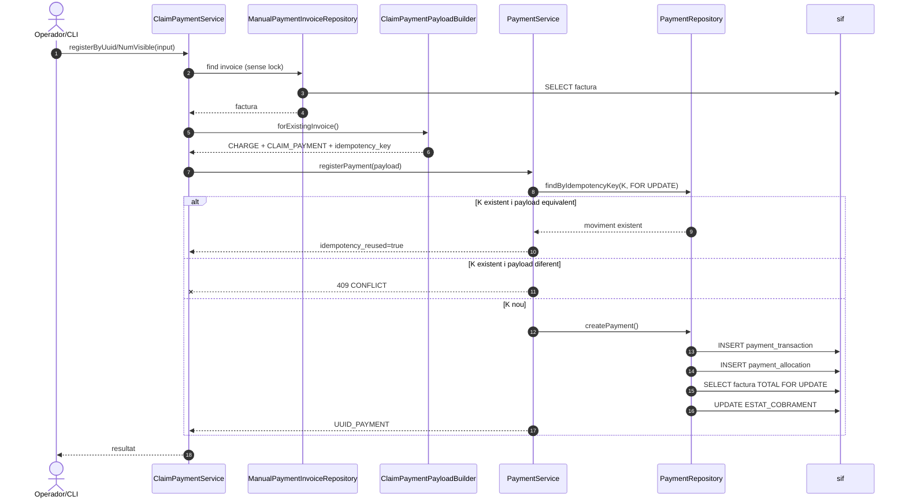
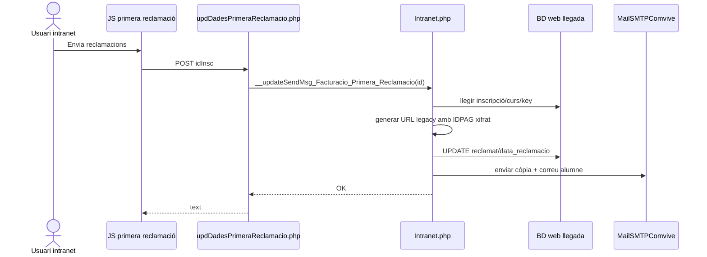
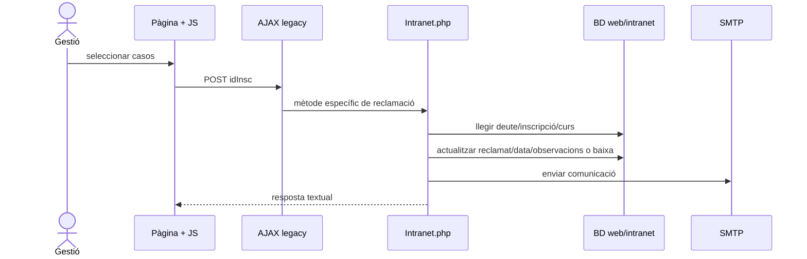
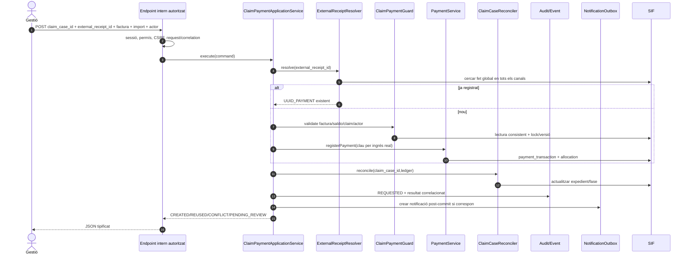
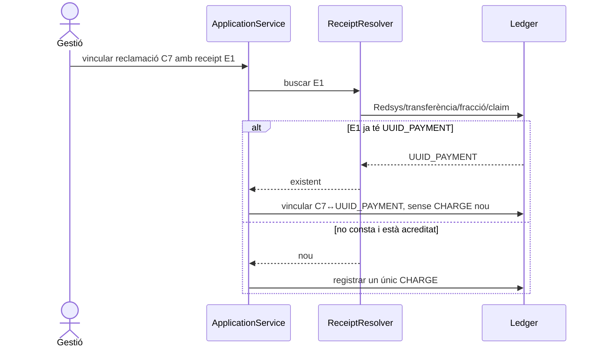

# UC-024 — Seqüències ACTUAL / FINAL

**Revisió:** 03/10/2026

## 1. ACTUAL — registre SIF per CLI/servei



## 2. ACTUAL — primera reclamació llegada



**Absència clau:** no hi ha crida al SIF ni registre de cobrament en aquesta seqüència.

## 3. ACTUAL — recordatori/reclamació final/control morosos



## 4. FINAL — registrar un ingrés real reclamat



## 5. FINAL — segon cobrament parcial del mateix expedient

```mermaid
sequenceDiagram
actor O as Gestió
participant C as ApplicationService
participant X as ReceiptResolver
participant P as PaymentService
participant DB as SIF
O->>C: E1, claim=C7, receipt=BAN-101, 40
C->>X: BAN-101 global
X-->>C: nou
C->>P: K=receipt BAN-101
P->>DB: CHARGE 40
O->>C: E2, claim=C7, receipt=BAN-205, 30
C->>X: BAN-205 global
X-->>C: nou i diferent d'E1
C->>P: K=receipt BAN-205
P->>DB: CHARGE 30
Note over C,DB: C7 és correlació d'expedient; no és la clau única dels dos ingressos.
```

## 6. FINAL — cobrament ja existent per un altre canal




## 7. BRANCA 04/10/2026 — flux implementat darrere feature flag

```mermaid
sequenceDiagram
autonumber
actor O as Operador
participant UI as claim-payment-sif.js
participant B as registerClaimPaymentSif.php
participant IC as SifInternalClaimPaymentClient
participant API as /api/claim-payments/register.php
participant AUTH as InternalApiAuthenticator
participant L as ClaimPaymentInvoiceLinkRepository
participant X as ClaimPaymentReceiptResolver
participant G as ClaimPaymentBalanceGuard
participant LG as ClaimPaymentLegacySyncService
participant PA as PaymentActionGateway
participant CP as ClaimPaymentService
participant DB as SIF
participant LEG as Legacy DB

O->>UI: Registrar cobrament
UI->>B: POST idInsc + receipt type/id + import/data + CSRF
B->>B: sessió + Same-Origin/AJAX + CSRF + permís
B->>B: derivar claim_case_id i actor
B->>IC: request signada HMAC
IC->>API: POST intern signat
API->>AUTH: autenticar + anti-replay
AUTH-->>API: actor/request_id
API->>PA: LINK_CLAIM_PAYMENT REQUESTED
PA->>L: resoldre factura d'origen + IDPAG per idInsc
L->>DB: fact_rels + factura FOR UPDATE
PA->>X: cercar rebut extern global
alt rebut existent
 X->>DB: payment_transaction + allocation
 X-->>PA: UUID_PAYMENT existent si factura/IDPAG/import coincideixen
else rebut nou BANK_REFERENCE
 PA->>LG: baseline legacy == net SIF anterior
 LG->>LEG: llegir PAGAMENT/A_PAGAR
 LG->>DB: sumar allocations de factura
 PA->>G: import <= saldo pendent
 PA->>CP: registerByUuidInTransaction()
 CP->>DB: payment_transaction + payment_allocation + estat cobrament
else DS_ORDER/PROVIDER_REF no existent
 X--xPA: CONFLICT; esperar canal autoritatiu
end
PA->>DB: event terminal SUCCEEDED/REUSED/FAILED
API->>DB: SYNC_LEGACY REQUESTED
API->>LG: syncAfterSifSuccess()
LG->>DB: net actual de la factura
LG->>LEG: validar delta i projectar PAGAMENT/DATA PAG/INSC CURS
alt projecció correcta
 API->>DB: SYNC_LEGACY SUCCEEDED
 API-->>B: ok + UUID_PAYMENT + legacy_sync
else projecció falla després del commit SIF
 API->>DB: SYNC_LEGACY FAILED
 API-->>B: 409 payment_persisted + requires_reconciliation
 Note over B,API: reintent reutilitza el mateix UUID_PAYMENT i torna a provar la projecció
end
B-->>UI: JSON
UI-->>O: resultat
```

### Garanties de la branca

- el browser no selecciona la factura;
- `claim_case_id` i rebut extern són identitats diferents;
- `DS_ORDER`/`PROVIDER_REF` només es reutilitzen si el canal autoritatiu ja els ha registrat;
- un cobrament nou no pot superar el saldo pendent;
- baseline legacy divergent bloqueja **abans** de crear un cobrament nou;
- una fallada de projecció posterior al commit SIF queda explícita i és reintentable sense duplicar el moviment.
