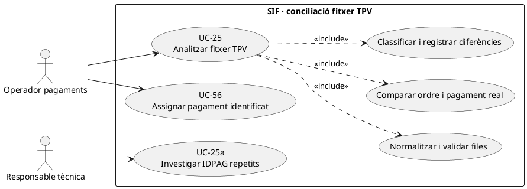
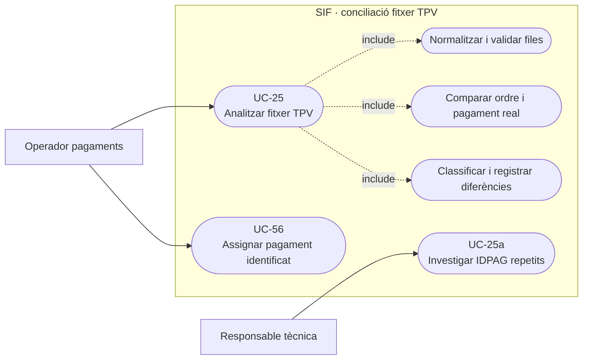
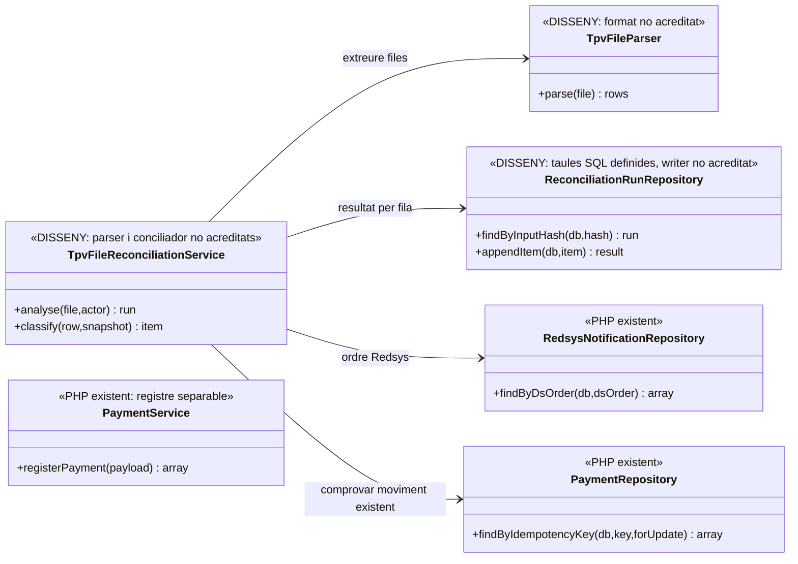
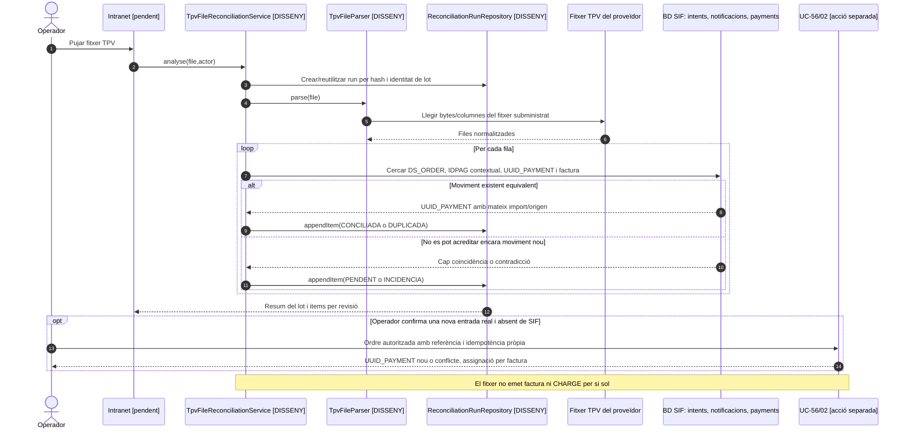

# UC-25 · Analitzar un fitxer TPV i proposar la conciliació

**Objectiu del catàleg:** identificar en el fitxer del proveïdor TPV operacions `CONCILIADA`, `DUPLICADA`, pendents o amb incidència, sense transformar automàticament una fila ambigua en un nou cobrament o factura. La documentació de fluxos indica expressament que **«el fitxer TPV no emet ni registra pagaments per si sol si hi ha qualsevol ambigüitat»**. UC-25a diagnostica `IDPAG` repetits; UC-56 cerca/assigna un cobrament identificat; UC-53 resol divergències entre sistemes.

**Estat contrastat:** existeixen `payment_transaction`, `payment_allocation`, `redsys_notifications`, `redsys_payment_intent`, `reconciliation_run` i `reconciliation_item` a SQL, i serveis executables de pagament/callback Redsys per operacions individuals. **No s'ha identificat en `sif/src` un parser/importador de fitxer TPV, un `TpvFileReconciliationService` ni una pantalla de revisió de fitxers implementats.** La conciliació de fitxers descrita és un **contracte objectiu**, no un import bancari executable.

## 1. Fitxa funcional específica

| Camp | Comportament |
| --- | --- |
| Actor | Operador de facturació/pagaments amb accés a dades bancàries, i responsable tècnica per incidències. El fitxer TPV és font externa, no instrucció autoritzada per generar pagaments automàticament. |
| Entrada | Fitxer i identificador/hash del lot, entitat/proveïdor, data, ordre/referència `DS_ORDER`, `IDPAG` quan existeixi, codi resultat, import, divisa, terminal i identificació de l'operació bancària si el proveïdor la facilita. El parser concret, columnes i formats **no s'han acreditat**. |
| Comparació | Per fila, cercar intenció Redsys, notificació `VALIDATED`/`ERROR`, job asíncron, `payment_transaction`, `payment_allocation`, factura i, quan pertoqui, `fact_rels` de la inscripció. Una coincidència d'`IDPAG` sola **no** deduplica un cobrament. |
| Resultats | `CONCILIADA` si origen i import coincideixen amb un moviment real existent; `DUPLICADA` si una entrada bancària repetida és demostrablement el mateix cobrament; `PENDENT` si manca dada o processament; `INCIDENCIA` quan hi ha import, ordre, titular o assignació contradictoris. Són **categories funcionals del catàleg**, no valors executables verificats d'un parser. |
| Persistència prevista | `reconciliation_run` per fitxer/hash/lot i `reconciliation_item` per fila, amb referència de font, `UUID_PAYMENT`/`UUID_FACTURA` quan existeixin, diferència/JSON i estat de resolució. Les taules estan definides, **el writer del fitxer no està acreditat**. |
| Efecte econòmic | Analitzar una fila no és un nou `CHARGE`. Si el banc acredita una operació real absent, UC-56/02 ha d'assegurar la seva identitat i registrar **una vegada** l'ingrés amb `payment_allocation`. Si el pagament ja existeix, s'enllaça/reconcilia, no es recrea. |
| Fons d'inscripció | En packs/grups una única fila TPV pot correspondre a **N inscripcions**; les atribucions internes han de sumar l'import real únic del moviment, sense dividir a parts iguals per defecte. El ledger per inscripció és **proposta pendent**. |

### 1.1. Flux objectiu de conciliació

1. L'operador puja el fitxer en canal autoritzat. El sistema calcula hash, conserva origen/versió/format i crea una revisió idempotent. Les credencials, PAN/CVV i informació de targeta innecessària **no** s'incorporen a la BD ni als logs.
2. El parser **pendent** normalitza cada fila en ordre, import en decimals, resultat, divisa, data i referència. Files desconegudes o malformades queden en incidència, no es «corregeixen» amb valors inventats.
3. El reconciliador consulta per `DS_ORDER` i identificació d'operació, després per `IDPAG` com a **pista contextual**, i enllaça intenció Redsys, notificació, cua, moviment existent, factura i assignacions. Distingeix denegació, autorització sense worker processat, moviment processat i possible retorn posterior.
4. Compara la fila amb el `payment_transaction` existent: import real, data/proveïdor, divisa quan disponible, `PAYLOAD_HASH`, `IDPAG`, `DS_ORDER` i estat. Una segona fila equivalent al mateix `UUID_PAYMENT` no crea una entrada nova.
5. Guarda un `reconciliation_item` amb resultat i evidència per a la fila. Els resultats han de ser reproduïbles a partir de la versió exacta del fitxer i de l'instant de la BD. Un reintent idèntic de lot no ha de crear una segona conciliació activa indistinguible.
6. Per pendents/contradiccions es requereix acció explícita: completar el job original UC-52, cercar i assignar un cobrament UC-56, investigar un `IDPAG` duplicat UC-25a o obrir incidència UC-08. **El fitxer no salta el control del callback signat**.
7. Només quan s'ha acreditat que existeix un ingrés real que **no consta** al SIF, una ordre separada autoritzada pot registrar-lo amb clau idempotent independent, comprovant que no és el mateix ingrés ja registrat per callback/worker.
8. Després de registrar o enllaçar el pagament, les assignacions a factura i les atribucions individuals d'inscripció s'han de conciliar amb el mateix import de caixa i sense duplicació.

### 1.2. Alternatives i proves específiques

| Situació | Classificació/acció |
| --- | --- |
| Fila bancària duplicada en dos fitxers | Una mateixa entrada acreditada, dos registres d'evidència de fitxer si cal, **un sol moviment bancari**. |
| `DS_ORDER` existent, import diferent del cobrament SIF | `INCIDENCIA`, no reutilitzar l'UUID com si fos una coincidència correcta. |
| `IDPAG` repetit en diverses inscripcions, però `DS_ORDER` distint | UC-25a determina si hi ha pagaments separats o mateixa compra/grup; `IDPAG` no és clau universal de deduplicació. |
| Callback validat però worker en `RETRY` | `PENDENT` d'emissió; no forçar manualment una segona factura/pagament sense comprovar job i idempotència. |
| Una fila bancària de grup de N persones | Una transacció real, N atribucions internes, amb imports específics per línia. |
| Fitxer amb devolució | Classificar moviment de sortida **real** i enllaçar `REFUND` existent o tramitar-lo per la ruta pertinent; no netejar una fila de devolució sumant-la com un ingrés. |
| File reprocessat després d'una conciliació parcial | Reutilitzar referència/hash del lot, no duplicar `reconciliation_item` sense control, ni crear `CHARGE` per cada reexecució. |

**Proves no executades:** fitxer idèntic repetit, fila `DS_ORDER` duplicada, dos `IDPAG` coincidents amb ordres diferents, import contradictory, denegació TPV, job `RETRY`, retorn, group N inscripcions, rol denegat i transacció ja assignada.

### 1.3. CSV TPV real de la intranet i comparador llegat — contrast amb el xat antic

**Pantalla i resposta actuals.** El bloc `ANALITZA FITXER` de `/alumnes/pagaments/` envia `FormData` per `POST` a `ajax/alumnes/analitzarFitxerTPV.php` i espera `state`, `msg` i, per als errors, `registresPagErrors`. `state=1` indica que **no s'han detectat incidències visibles al comparador antic**, no que s'hagin creat moviments SIF ni que el banc hagi estat conciliat íntegrament; `state=2` mostra anomalies i enllaços a la fitxa d'alumne o factura; `state=0` rebutja format/error. L'«últim anàlisi» es desa avui com a data/hora al fitxer `../../fitxers/analisis-fitxer.txt`, que no és un registre auditable per línia.

**Format efectivament llegit al PHP antic.** `$_FILES['fitxer-tpv']` es llegeix amb `fgetcsv` i el contingut es divideix per `;`; el codi comprova **13 camps** (condició `count($contentCSV)-1 == 12`). Les posicions utilitzades són **0** data (`DD/MM/YYYY` o compatible), **3** tipus (`Autorización`/`Devolución`, incloses variants de codificació), **4** número de comanda, **5** resultat que ha d'indicar autorització, **6** import CSV, **8** import en euros, **9** titular/CIF/DNI, **10** concepte i **11** import retornat si existeix. Les posicions no enumerades aquí **no tenen significat verificat en la font examinada**. El nou parser ha de validar una capçalera/versió efectiva i estructura del fitxer concret, no generalitzar aquestes posicions a tots els exportadors TPV.

**Comparació que fa el llegat.** Descarta files no autoritzades, imports/dates/ordres que considera invàlids o titulars que no tracta com a DNI; una autorització es compara amb factura `TIPUS=A` i import positiu, una devolució amb `TIPUS=R` i import negatiu. Cerca primer a `web.factures` per data de pagament, `NUM_COMANDA`, import i tipus; si no troba coincidència, ho prova per data, import, tipus i CIF sense comanda. Hi ha una **excepció codificada per un identificador fiscal concret** que exclou algunes incidències de la vista; no traslladar aquesta exclusió literal al reconciliador SIF sense identificar-ne la causa i la titularitat. Aquesta cerca **no és una prova de `payment_transaction` existent**, i una factura R històrica no equival automàticament a una devolució bancària ja registrada.

**Incompatibilitats a resoldre.** El parser antic usa `floatval` per imports i `intval($cif)` per titular, cosa que pot descartar NIF/CIF vàlids que comencen per lletra i perdre precisió decimal. La comprovació només per nombre de camps no valida MIME, contingut ni capçalera. La documentació del JS identifica un possible `if ($resposta->msg = "")` amb assignació: verificar **la versió productiva exacta** abans de considerar-lo una errada activa. El nou importador **pendent** ha de conservar hash del lot, usuari, data, referència de fila i resultat individual; no utilitzar `analisis-fitxer.txt` com a única evidència ni retornar «conciliat» quan només s'ha trobat un document antic.

**Regla de recuperació quan no es troba factura.** Abans de proposar `issueInvoice()`, cercar per `DS_ORDER` la intenció, notificació validada, job Redsys i `UUID_PAYMENT`: pot existir una factura **emesa abans de cobrar**, un callback en `RETRY` o un cobrament assignat a una altra factura/grup. En aquests casos, UC-52/56/53 reconcilien el fet real; una fila del CSV no substitueix la validació de signatura ni autoritza per si sola una emissió. Una línia TPV de **devolució** entra per la classificació de retorn UC-28 i de correcció fiscal si escau, mai com un segon `CHARGE`.

### 1.4. Proves específiques sobre el CSV antic (no executades)

| ID | Entrada / escenari | Resultat objectiu |
| --- | --- | --- |
| TP-01 | CSV d'origen llegat amb 13 camps, tipus a posició 3 i comanda a 4 | Parser versionat interpreta els camps coneguts; cap registre SIF pel simple fet de pujar-lo. |
| TP-02 | `state=1` del comparador històric però SIF sense cobrament | Revisió pendent d'assignació/execució; no donar per pagada la factura. |
| TP-03 | Titular NIF/CIF amb lletra inicial | No rebutjar per `intval`; validar identificador amb regla adequada al camp del fitxer. |
| TP-04 | Import amb diferència de cèntims després de `floatval` | Comparació decimal exacta i incidència si no coincideix. |
| TP-05 | Mateix fitxer pujat dues vegades, una fila repetida en fitxers diferents | Lot i fila traçables, un sol fet bancari i cap CHARGE repetit. |
| TP-06 | Callback validat amb job `RETRY` i fila «sense factura» al CSV | Recuperar job original; no emissió fiscal paral·lela. |
| TP-07 | Fila `Devolución` i factura R històrica | Separar moviment bancari real, document històric i decisió fiscal SIF. |
| TP-08 | Fitxer de 13 columnes amb ordre diferent o contingut no CSV | Rebuig/versió desconeguda, no desplaçar camps per endevinació. |
| TP-09 | Identificador fiscal exclòs per l'excepció del llegat | Conservar línia i evidència al SIF; revisar el motiu, no suprimir silenciosament. |

## 2. Diagrama UML de casos d'ús

### Vista de casos d’ús per a GitHub (Mermaid)

## 3. Subdiagrama de classes existent vs disseny

`PaymentService` és l'operació **separada** de registre autoritzat quan s'ha comprovat ingrés nou; **no** és cridada automàticament pel parser fictici.

## 4. Seqüència — conciliació sense duplicar ingressos (DISSENY)

## 5. Traçabilitat

[UC-25 original](../06-fitxes-funcionals/uc-025.md) · [UC-25a original](../06-fitxes-funcionals/uc-025a.md) · [UC-56 original](../06-fitxes-funcionals/uc-056.md) · [UC-53 divergències](uc-053-detectar-resoldre-divergencies.md) · [UC-03 Redsys](uc-003-processar-cobrament-redsys-asincron.md) · [UC-52 worker](uc-052-operar-cua-redsys.md) · [Document de fluxos i fitxer TPV](../03-canvis-pendents/04-fluxos-facturacio.md) · [Migració reconciliation_run/item](../../sif/database/migrations/2026_09_15_000003_add_functional_audit_control.sql) · [PaymentRepository](../../sif/src/Repository/PaymentRepository.php) · [Traça de fons](00-revisio-moviments-inscripcions.md).
