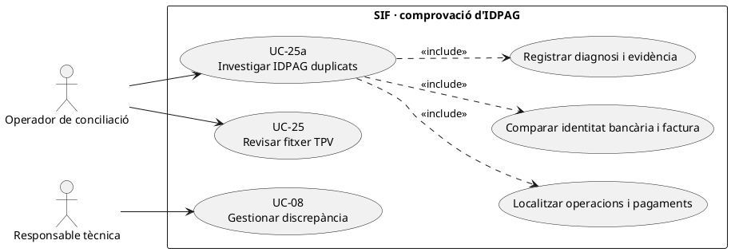
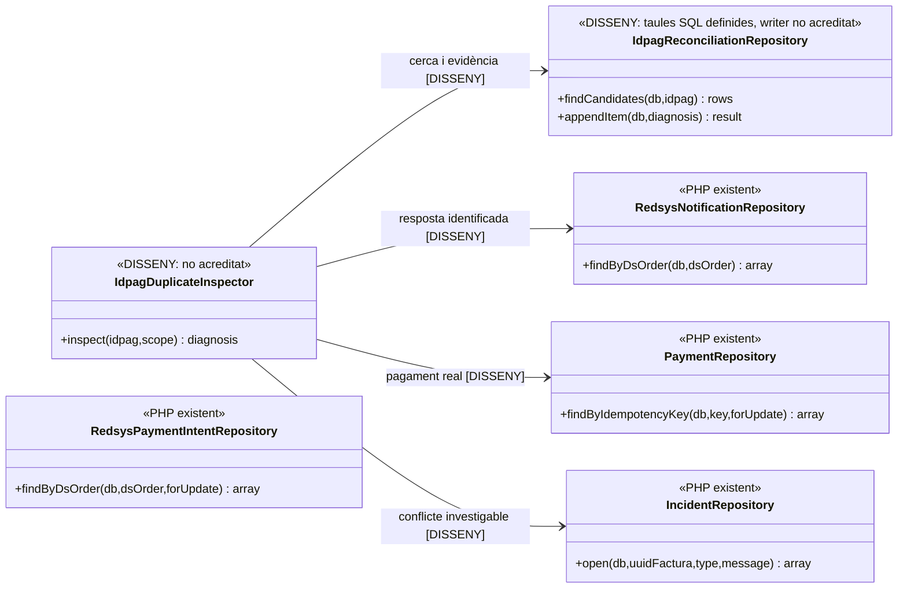
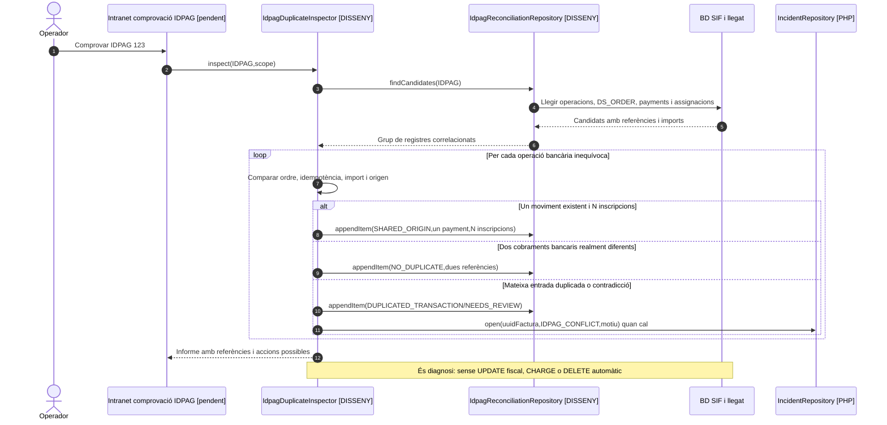
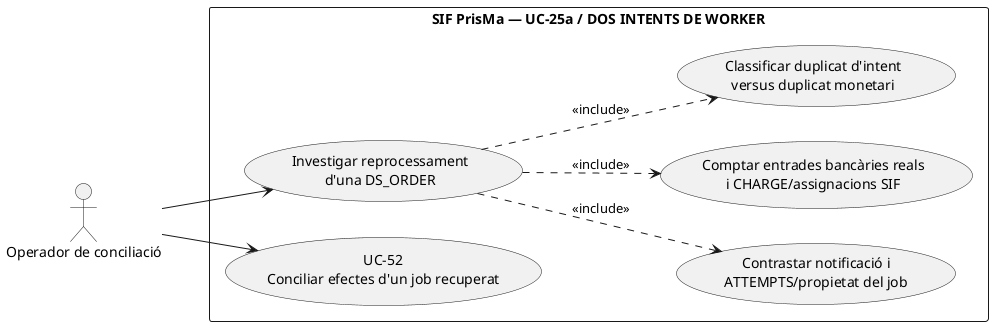

# UC-25a · Comprovar IDPAG duplicats sense duplicar cobrament

**Objectiu del catàleg:** investigar l'eina llegada de `/facturacio/comprovar-idpags/` i distingir diversos registres amb el mateix `IDPAG` d'una duplicació de **la mateixa operació econòmica**. El catàleg classifica el cas com a **disseny**, amb eina legacy identificada però integració SIF pendent.

**Estat real consultat:** `IDPAG` és un identificador d'origen operatiu als models `redsys_payment_intent`, `redsys_notifications`, `payment_transaction` i `fact_rels`. La documentació de fluxos afirma expressament **«IDPAG identifica l'origen operatiu, però no deduplica per si sol»**. El servei `RedsysCallbackService` valida la **intenció per `DS_ORDER`** i `RedsysNotificationRepository` detecta duplicats/contradiccions de notificació pel mateix ordre; `PaymentService` reutilitza per `IDEMPOTENCY_KEY`. **No s'ha identificat un servei SIF que executi la comprovació universal d'`IDPAG` duplicats del llegat.**

## 1. Fitxa específica

| Aspecte | Regla |
| --- | --- |
| Actors | Operador autoritzat de cobrament/facturació i responsable tècnica si hi ha conflicte; no és una acció de l'alumne. |
| Entrada | `IDPAG` investigat, identificadors d'inscripció/pack/grup/regal, possibles ordres `DS_ORDER`, imports reals, canal i data, factures i UUIDs de pagament; snapshot llegat quan disponible. |
| Primer criteri | Diferenciar **un sol pagament amb múltiples inscripcions** (grup/pack), **diversos pagaments diferents amb un mateix `IDPAG`** (parcials o operacions repetides legítimes) i **la mateixa transacció duplicada**. |
| Clau de comparació | `DS_ORDER` i identitat concreta del proveïdor/operació, `IDEMPOTENCY_KEY`, import, data i evidència bancària, més les assignacions a factura. Cap d'aquests camps s'ha de substituir mecànicament per `IDPAG`. |
| Resultat | `NO_DUPLICATE`, `SHARED_ORIGIN`, `DUPLICATED_TRANSACTION` o `NEEDS_REVIEW` són **resultats proposats per al comparador**, no un enum implementat avui. |
| Persistència objectiu | `reconciliation_run`/`reconciliation_item` conserven els candidats, UUID de pagament/factura, dades comparades, actor, causa i decisió; les taules existeixen però el servei writer d'UC-25a no s'ha acreditat. |
| Efecte sobre diners | La comprovació és de **lectura/diagnosi** i no crea ni esborra `payment_transaction`. Si un mateix import s'ha assignat malament, la correcció ha de fer-se en acció separada i amb traça econòmica per inscripció, no eliminant un `CHARGE` real. |

### 1.1. Flux objectiu d'investigació

1. El sistema cerca en llegat i SIF els registres de la mateixa referència `IDPAG` per inscripció/operació, `redsys_payment_intent`, `redsys_notifications`, `payment_transaction`, `payment_allocation`, `fact_rels` i documents fiscals.
2. Agrupa per **identitat de cobrament real**: ordre del proveïdor i referència de transacció, amb import, canal, data i resposta; després identifica si múltiples inscripcions comparteixen legítimament aquell pagament.
3. Per cada parell de candidats, comprova que no s'hagi creat un `CHARGE` duplicat de la mateixa entrada bancària ni una segona factura per reprocessament. També comprova si diversos `CHARGE` diferents de la mateixa inscripció representen pagaments **fraccionats reals**, no duplicats.
4. Guarda diagnosi amb evidència i idempotència del lot; si la prova no permet classificar, deixa `NEEDS_REVIEW` i bloqueja accions destructives.
5. Quan hi ha un duplicat equivalent de **notificació Redsys**, UC-51 reutilitza el registre i UC-52/03 han de reutilitzar factura/pagament; l'eina de diagnosi no torna a entrar al TPV ni reemet.
6. Si hi ha dues entrades bancàries realment diferents amb un `IDPAG` compartit, conservar ambdós `UUID_PAYMENT`, imports i assignacions, i documentar el vincle a cada inscripció.
7. Si dues files SIF es refereixen a la mateixa entrada bancària, obrir incidència i classificar la correcció. **No fer `DELETE` de la factura o del moviment com a «neteja de duplicats»** sense una acció fiscal/econòmica expressa i verificable.
8. En packs/grups, comprovar que un pagament únic s'hagi repartit internament segons imports específics de cada inscripció; la manca del ledger individual és un **buit de disseny** encara que no hi hagi cap duplicat de `IDPAG`.

### 1.2. Matriu específica de prova

| Conjunt trobat | Classificació funcional objectiu |
| --- | --- |
| Una ordre Redsys autoritzada, una factura i tres `fact_rels` d'inscripció de pack | Origen compartit legítim, **un** cobrament i tres atribucions internes quan existeixi el ledger. |
| Dues transferències bancàries diferents per pagar la mateixa inscripció, mateix `IDPAG` | Dos `CHARGE` reals si tots dos ingressos estan acreditats; no deduplicar per `IDPAG`. |
| Mateixa `DS_ORDER`, mateix import i mateix codi de resposta en dues notificacions | Duplicat equivalent de callback, UC-51; no nou pagament. |
| Mateixa `DS_ORDER`, import o resposta contradictoris | Conflicte de notificació UC-51, incidència i verificació externa; no acceptar-ne silenciosament una. |
| Dues files `payment_transaction` amb la mateixa referència de proveïdor però imports diferents | No assumir equivalència ni legitimitat: contrastar extracte/proveïdor, clau i origen abans de decidir. |
| `IDPAG` no present però `UUID_PAYMENT` i ordre inequívocs | L'absència de `IDPAG` no és prova de pagament no existent; cercar per referència i factura. |

**Proves no executades:** un cobrament de grup amb N inscripcions, dues fraccions reals amb mateix `IDPAG`, callback repetit/contradictori, referència bancària reutilitzada, captura incompleta i resolució d'una atribució individual errònia.

### 1.3. Diagnosi des del llegat sense deduplicar una compra compartida

**Eina d'origen:** el mapa de la intranet identifica `/facturacio/comprovar-idpags/` (`facturacio-comprovar-idpags.php`) com a eina de comprovació i conciliació; **no disposem en aquesta revisió del seu algoritme PHP complet**. El xat i els fluxos expliquen que `IDPAG` pot relacionar les dues inscripcions d'un pack, els membres d'un grup, una intenció denegada seguida d'una acceptada, o diferents quotes reals del mateix pagament operatiu. No confondre «IDPAG repetit a diverses files» amb «cobrament bancari duplicat».

**Mètode objectiu de diagnosi.** Mostrar per `IDPAG` inscripcions i `FACTURA_RELACIONADA` del llegat, totes les `DS_ORDER`, resposta de Redsys, import confirmat/retornat, estat de `redsys_callback_queue`, `UUID_PAYMENT` i factures SIF. Classificar separadament (a) una única ordre i N inscripcions legítimes, (b) ordres diferents amb una denegació i una acceptació, (c) dues fraccions acceptades diferents, (d) el mateix `DS_ORDER` duplicat/contradictori i (e) un cobrament confirmat amb assignació equivocada o una factura prèvia que no s'ha detectat. `IDPAG` és una pista d'agrupació; el cobrament s'identifica pel fet extern `DS_ORDER`/referència i la seva evidència.

**Operació de resultat.** El comparador informa i obre incidència quan hi ha ambigüitat; no invoca un segon `issueInvoice()`, `registerPayment()` o una devolució correctora simplement perquè el mateix IDPAG apareix dos cops. Si una operació estava coberta per factura d'empresa emesa abans del cobrament, seguir `fact_rels` i `UUID_FACTURA` per evitar que una cerca pel CIF/IDPAG desemboqui en una factura nova (UC-21/22). Si una notificació està validada però pendent de worker, recuperar UC-52 i no duplicar-la per la via manual o CSV.

**Proves complementàries no executades:** un pack amb dues inscripcions i un DS_ORDER acceptat dona «origen compartit», no duplicat; dues ordres acceptades del mateix IDPAG per fraccions conserven dos CHARGE reals; intent denegat i intent posterior acceptat no generen CHARGE pel primer; factura prèvia de grup es recupera per UUID/relacions i no es torna a emetre; job Redsys en RETRY és pendent de processar, no cobrament absent automàticament.

## 2. Diagrama UML de casos d'ús



## 3. Diagrama de classes — consulta objectiu i peces PHP existents



Els repositoris PHP existents **no ofereixen automàticament el mètode de cerca transversal per `IDPAG`**; l'inspector i les consultes d'UC-25a són treball pendent, no una crida implementada.

## 4. Seqüència — mateix IDPAG, dos supòsits diferents (DISSENY)



### 4.1. Acció independent: investigar dos intents de worker sense etiquetar-los automàticament com dos cobraments — DISSENY

**Actor/disparador:** una ordre `DS_ORDER` associada a un `IDPAG` apareix en dos intents de cua, perquè el primer job va superar els 15 minuts, un altre worker el va recuperar o es va repetir un callback equivalent. **Precondicions:** consultar `redsys_notifications`, la fila `redsys_callback_queue` amb `ATTEMPTS`/`LOCKED_BY` i resultat, factures reals, `payment_transaction` i **totes** les assignacions; la prova bancària identifica l'entrada real. **Postcondició:** diagnosi de notificació/intent duplicat, d'un únic ingrés real recuperat, de dos `CHARGE` realment persistits pel mateix fet, o d'una discrepància irresolta; **no** `DELETE`, `REFUND`, nova factura ni segon ingrés en l'acció de diagnosi.

**PHP contrastat:** `RedsysCallbackQueueRepository::recoverStaleLocks()` pot tornar un `PROCESSING` antic a `RETRY` al cap de 15 minuts; `claimNext()` incrementa `ATTEMPTS` quan el reclama de nou. Les marques finals `markProcessed/markRetry/markIncident` només filtren `ID+STATUS=PROCESSING`, no el worker propietari: dues execucions **del mateix job** poden solapar-se. Però dues execucions del handler **no proven dues transferències de diners** ni, per si soles, dos `payment_transaction`. Cal llegir els registres econòmics i `DS_ORDER`, i contrastar el banc, abans de declarar una duplicació efectiva. Les proves actuals només garanteixen que un job en PROCESSING no es reclama alhora **abans de caducar**; no reprodueixen A acabant després que B reclami el lock recuperat (UC-52).



```mermaid
sequenceDiagram
autonumber
actor O as Gestió
participant I as IdpagDuplicateInspector [DISSENY]
participant B as Evidència de Redsys/banc [EXTERN]
participant Q as redsys_notifications + callback_queue [LECTURA]
participant F as factura + fact_rels [LECTURA]
participant P as payment_transaction + allocation [LECTURA]
O->>I: inspectByDsOrder(IDPAG=I,DS_ORDER=E)
I->>B: Verificar quantes entrades bancàries reals representa E
I->>Q: Consultar notificació original, status, ATTEMPTS i resultat J
I->>F: Buscar factures fiscals realment emeses per E i cobertura prèvia
I->>P: Cercar CHARGE i assignacions de E entre tots els canals
alt Un ingrés extern i únic UUID_PAYMENT amb dos intents de job
 I-->>O: Reprocessament de cua, no duplicat monetari; revisar propietat i integració pendent
else Una entrada externa i dos UUID_PAYMENT efectivament persistits
 I-->>O: Possibilitat de doble registre de caixa; incidència i classificació de la correcció
else Una entrada externa confirmada i job PROCESSED sense UUID_PAYMENT assignat
 I-->>O: PAYMENT_MISSING/CONFLICT; recuperar/conciliar SIF, no donar per pagat
else Banc, factura, DS_ORDER o pagaments no coincideixen
 I-->>O: NEEDS_REVIEW; no neteja automàtica ni deduplicació per IDPAG
end
Note over I,P: Inspector i diagnosi transversal continuen DISSENY. Un segon worker no equival a una segona entrada bancària.
```

| Prova pendent | Escenari | Resultat exigible |
| --- | --- | --- |
| IDP-07 | A i B processen J després d'un lock recuperat; només hi ha un CHARGE real | Diagnosi d'intent repetit, no d'ingrés duplicat; comprovar resultat/propietat de cua. |
| IDP-08 | Un sol `DS_ORDER` extern amb dues files CHARGE de claus diferents | Incidència monetària per evidència real; cap esborrat o `REFUND` automàtic des de l'inspector. |
| IDP-09 | J té `STATUS=PROCESSED` però no hi ha assignació de UUID_PAYMENT a factura | Classificar com a efecte incomplet i recuperar UC-52/02, no donar per pagada la inscripció. |

## 5. Traçabilitat

[UC-25a original](../06-fitxes-funcionals/uc-025a.md) · [UC-25 fitxer TPV](uc-025-analitzar-fitxer-tpv.md) · [UC-51 callback](uc-051-callback-redsys-anomal.md) · [UC-52 worker](uc-052-operar-cua-redsys.md) · [UC-56 original](../06-fitxes-funcionals/uc-056.md) · [Fluxos de facturació](../03-canvis-pendents/04-fluxos-facturacio.md) · [Revisió de fons](00-revisio-moviments-inscripcions.md) · [Migració de reconciliació](../../sif/database/migrations/2026_09_15_000003_add_functional_audit_control.sql).
