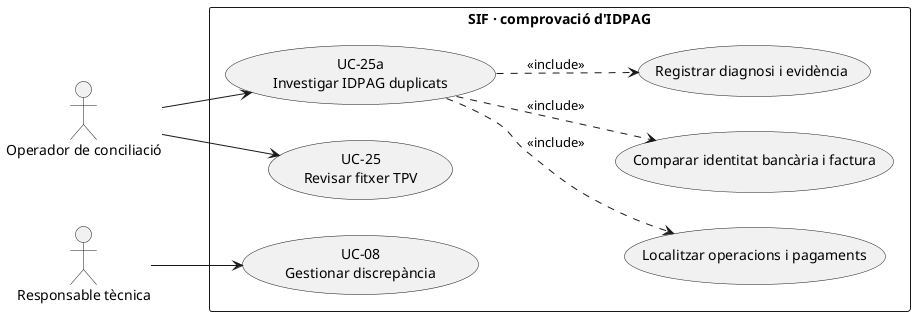
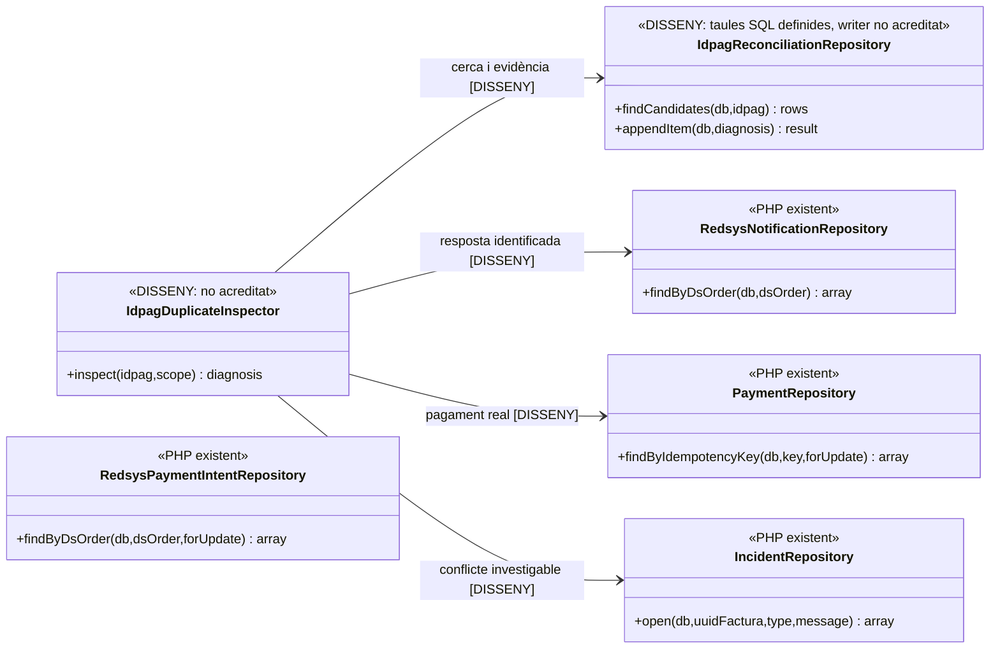
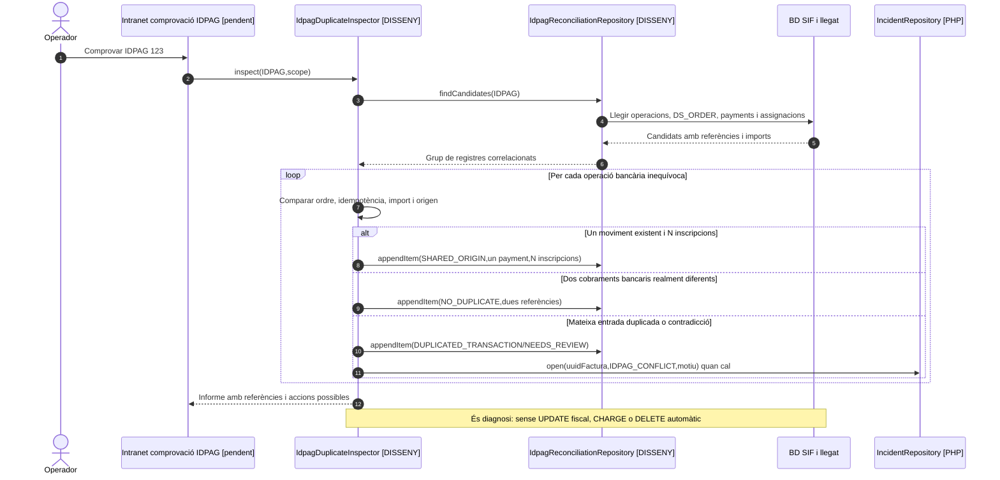

# UC-25a · Comprovar IDPAG duplicats sense duplicar cobrament

**Objectiu del catàleg:** investigar l'eina llegada de `/facturacio/comprovar-idpags/` i distingir diversos registres amb el mateix `IDPAG` d'una duplicació de **la mateixa operació econòmica**. El catàleg classifica el cas com a **disseny**, amb eina legacy identificada però integració SIF pendent.

**Estat real consultat:** `IDPAG` és un identificador d'origen operatiu als models `redsys_payment_intent`, `redsys_notifications`, `payment_transaction` i `fact_rels`. La documentació de fluxos afirma expressament **«IDPAG identifica l'origen operatiu, però no deduplica per si sol»**. El servei `RedsysCallbackService` valida la **intenció per `DS_ORDER`** i `RedsysNotificationRepository` detecta duplicats/contradiccions de notificació pel mateix ordre; `PaymentService` reutilitza per `IDEMPOTENCY_KEY`. **No s'ha identificat un servei SIF que executi la comprovació universal d'`IDPAG` duplicats del llegat.**

## 1. Fitxa específica

| Aspecte | Regla |
| --- | --- |
| Actors | Operador autoritzat de cobrament/facturació i responsable tècnica si hi ha conflicte; no és una acció de l'alumne. |
| Entrada | `IDPAG` investigat, identificadors d'inscripció/pack/grup/regal, possibles ordres `DS_ORDER`, imports reals, canal i data, factures i UUIDs de pagament; snapshot llegat quan disponible. |
| Primer criteri | Diferenciar **un sol pagament amb múltiples inscripcions** (grup/pack), **diversos pagaments diferents amb un mateix `IDPAG`** (parcials o operacions repetides legítimes) i **la mateixa transacció duplicada**. |
| Clau de comparació | `DS_ORDER` i identitat concreta del proveïdor/operació, `IDEMPOTENCY_KEY`, import, data i evidència bancària, més les assignacions a factura. Cap d'aquests camps s'ha de substituir mecànicament per `IDPAG`. |
| Resultat | `NO_DUPLICATE`, `SHARED_ORIGIN`, `DUPLICATED_TRANSACTION` o `NEEDS_REVIEW` són **resultats proposats per al comparador**, no un enum implementat avui. |
| Persistència objectiu | `reconciliation_run`/`reconciliation_item` conserven els candidats, UUID de pagament/factura, dades comparades, actor, causa i decisió; les taules existeixen però el servei writer d'UC-25a no s'ha acreditat. |
| Efecte sobre diners | La comprovació és de **lectura/diagnosi** i no crea ni esborra `payment_transaction`. Si un mateix import s'ha assignat malament, la correcció ha de fer-se en acció separada i amb traça econòmica per inscripció, no eliminant un `CHARGE` real. |

### 1.1. Flux objectiu d'investigació

1. El sistema cerca en llegat i SIF els registres de la mateixa referència `IDPAG` per inscripció/operació, `redsys_payment_intent`, `redsys_notifications`, `payment_transaction`, `payment_allocation`, `fact_rels` i documents fiscals.
2. Agrupa per **identitat de cobrament real**: ordre del proveïdor i referència de transacció, amb import, canal, data i resposta; després identifica si múltiples inscripcions comparteixen legítimament aquell pagament.
3. Per cada parell de candidats, comprova que no s'hagi creat un `CHARGE` duplicat de la mateixa entrada bancària ni una segona factura per reprocessament. També comprova si diversos `CHARGE` diferents de la mateixa inscripció representen pagaments **fraccionats reals**, no duplicats.
4. Guarda diagnosi amb evidència i idempotència del lot; si la prova no permet classificar, deixa `NEEDS_REVIEW` i bloqueja accions destructives.
5. Quan hi ha un duplicat equivalent de **notificació Redsys**, UC-51 reutilitza el registre i UC-52/03 han de reutilitzar factura/pagament; l'eina de diagnosi no torna a entrar al TPV ni reemet.
6. Si hi ha dues entrades bancàries realment diferents amb un `IDPAG` compartit, conservar ambdós `UUID_PAYMENT`, imports i assignacions, i documentar el vincle a cada inscripció.
7. Si dues files SIF es refereixen a la mateixa entrada bancària, obrir incidència i classificar la correcció. **No fer `DELETE` de la factura o del moviment com a «neteja de duplicats»** sense una acció fiscal/econòmica expressa i verificable.
8. En packs/grups, comprovar que un pagament únic s'hagi repartit internament segons imports específics de cada inscripció; la manca del ledger individual és un **buit de disseny** encara que no hi hagi cap duplicat de `IDPAG`.

### 1.2. Matriu específica de prova

| Conjunt trobat | Classificació funcional objectiu |
| --- | --- |
| Una ordre Redsys autoritzada, una factura i tres `fact_rels` d'inscripció de pack | Origen compartit legítim, **un** cobrament i tres atribucions internes quan existeixi el ledger. |
| Dues transferències bancàries diferents per pagar la mateixa inscripció, mateix `IDPAG` | Dos `CHARGE` reals si tots dos ingressos estan acreditats; no deduplicar per `IDPAG`. |
| Mateixa `DS_ORDER`, mateix import i mateix codi de resposta en dues notificacions | Duplicat equivalent de callback, UC-51; no nou pagament. |
| Mateixa `DS_ORDER`, import o resposta contradictoris | Conflicte de notificació UC-51, incidència i verificació externa; no acceptar-ne silenciosament una. |
| Dues files `payment_transaction` amb la mateixa referència de proveïdor però imports diferents | No assumir equivalència ni legitimitat: contrastar extracte/proveïdor, clau i origen abans de decidir. |
| `IDPAG` no present però `UUID_PAYMENT` i ordre inequívocs | L'absència de `IDPAG` no és prova de pagament no existent; cercar per referència i factura. |

**Proves no executades:** un cobrament de grup amb N inscripcions, dues fraccions reals amb mateix `IDPAG`, callback repetit/contradictori, referència bancària reutilitzada, captura incompleta i resolució d'una atribució individual errònia.

## 2. Diagrama UML de casos d'ús

## 3. Diagrama de classes — consulta objectiu i peces PHP existents

Els repositoris PHP existents **no ofereixen automàticament el mètode de cerca transversal per `IDPAG`**; l'inspector i les consultes d'UC-25a són treball pendent, no una crida implementada.

## 4. Seqüència — mateix IDPAG, dos supòsits diferents (DISSENY)

## 5. Traçabilitat

[UC-25a original](../06-fitxes-funcionals/uc-025a.md) · [UC-25 fitxer TPV](uc-025-analitzar-fitxer-tpv.md) · [UC-51 callback](uc-051-callback-redsys-anomal.md) · [UC-52 worker](uc-052-operar-cua-redsys.md) · [UC-56 original](../06-fitxes-funcionals/uc-056.md) · [Fluxos de facturació](../03-canvis-pendents/04-fluxos-facturacio.md) · [Revisió de fons](00-revisio-moviments-inscripcions.md) · [Migració de reconciliació](../../sif/database/migrations/2026_09_15_000003_add_functional_audit_control.sql).
