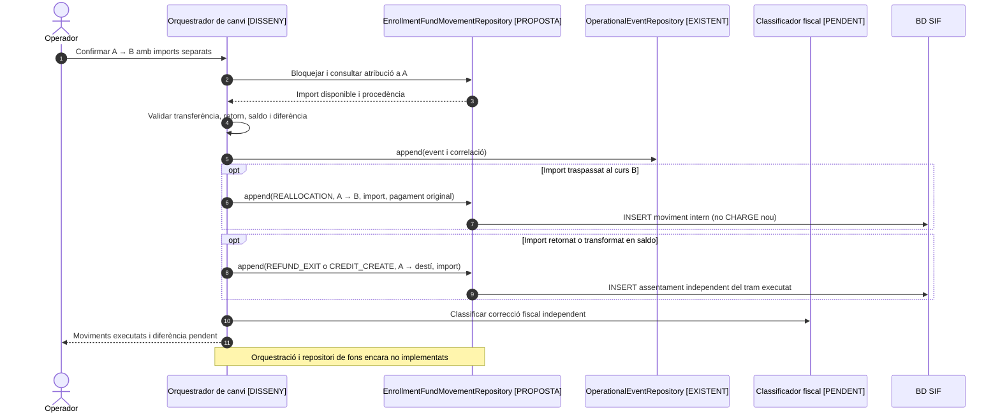
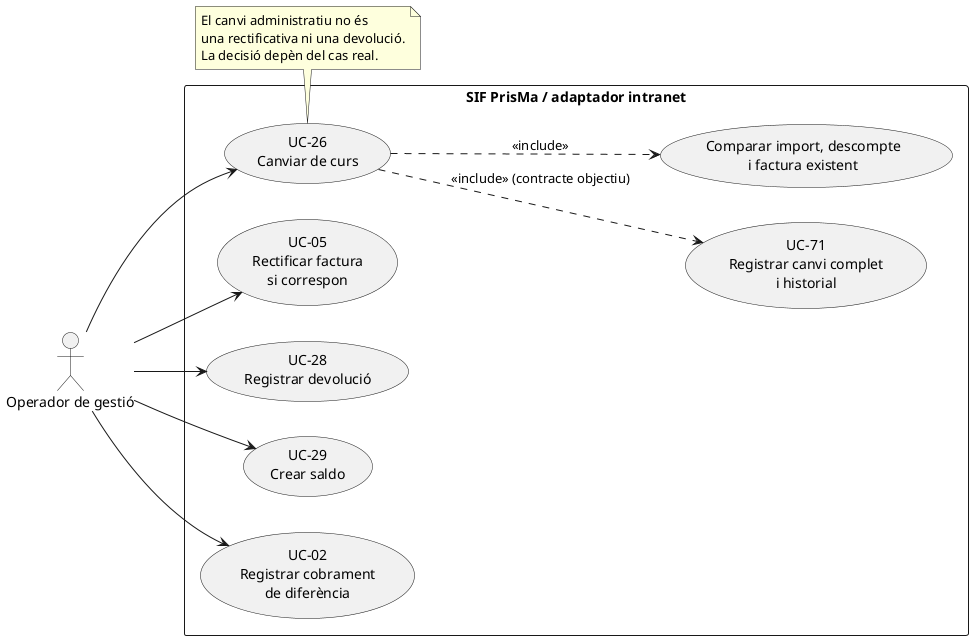
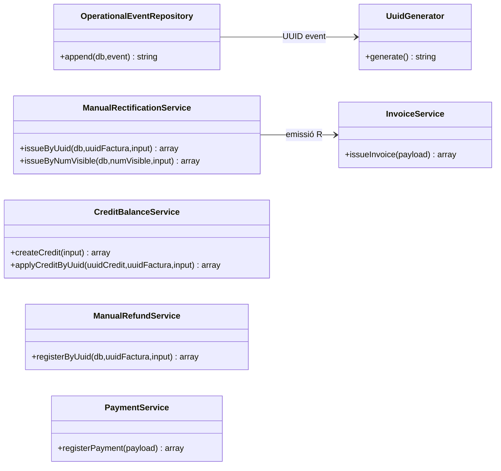
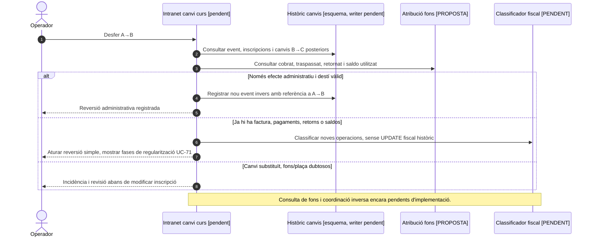

# UC-26 · Canviar de curs — fitxa i UML integrats

**Nivell del cas:** acció administrativa d'un operador que trasllada una inscripció d'un curs/edició/grup a un altre. **UC-71** concreta l'expedient complet d'històric i efectes econòmics/fiscals; UC-26 és el disparador de negoci. **Estat:** `[DISSENY/PARCIAL]` al catàleg del repositori. No s'ha identificat un `CourseChangeService` executable que coordini totes les fases; sí que existeixen `OperationalEventRepository`, l'esquema `course_change_event` i serveis fiscals/econòmics parcials. La presència d'una taula a una migració no prova que el flux ja hi escrigui.

## 1. Fitxa de cas d'ús

| Element | Especificació funcional derivada de la documentació de PrisMa |
| --- | --- |
| Actor | Operador autoritzat de gestió/intranet. |
| Disparador | Petició de moure una inscripció a un altre curs, edició o grup. |
| Precondicions | Inscripció origen identificada; destí disponible i vàlid; accés als imports, descomptes, cobraments i eventual factura de l'operació original. La verificació real de places/permisos encara no està acreditada al SIF. |
| Dades abans/després | Inscripció i curs/edició/grup origen i destí, import antic/nou, descompte antic/nou, imports ja pagats, despeses de gestió, diferència, motiu, actor i data. |
| Resultat administratiu | Inscripció traslladada amb historial del canvi i relació inequívoca origen/destí; la decisió econòmica i fiscal queda traçada sense reescriure la factura original. |
| Resultats associats | Si augmenta l'import: diferència pendent i possible cobrament posterior. Si disminueix: decisió de retorn o saldo. Si canvia una factura emesa: actuació fiscal validada. |

### 1.1. Flux objectiu documentat

1. L'operador identifica l'alumne, la inscripció actual i el curs/edició/grup de destí, indica el motiu i sol·licita una previsualització.
2. El sistema consulta l'estat actual **d'operació, cobrament i factura** i calcula l'import nou. La documentació descriu que l'operativa històrica reaplica el descompte anterior quan continua sent vàlid i detecta quan ja no correspon; el primer canvi pot ser gratuït i els següents poden comportar despeses segons el cas. **No són regles de càlcul implementades per `InvoiceService`.**
3. La previsualització detalla import antic i nou, descomptes, despeses, quantitat pagada, diferència i proposta d'efecte fiscal. Una variació de curs amb mateix import **pot continuar requerint corregir la descripció del servei en una factura emesa**.
4. Abans d'aplicar els efectes, s'ha de crear un historial/event amb les dades origen/destí, la decisió i la correlació. El repositori `OperationalEventRepository::append()` existeix i escriu `operational_event`, però **no es dona per acreditat** que la pantalla de canvi de curs el cridi o que insereixi `course_change_event`.
5. Si encara **no existeix factura**, el flux final documentat permet ajustar la inscripció i el pagament pendent amb historial, sense inventar una factura rectificativa.
6. Si ja hi ha **factura emesa** i ha canviat el servei, concepte, import o descompte amb efecte fiscal, la decisió es deriva a UC-05 o al mecanisme fiscal que correspongui segons classificació aprovada; la factura anterior no s'edita.
7. Si el curs és més car, es registra la diferència pendent i el seu enllaç/operació de cobrament. El pagament d'aquesta diferència ha d'estar relacionat amb el canvi (`SOURCE_TYPE=CANVI_CURS_DIFERENCIA` segons els fluxos documentats), **no** amb una inscripció ordinària nova sense relació.
8. Si el curs és més barat, s'acorda devolució real UC-28, saldo UC-29 o distribució justificada. L'event de canvi ha de conservar les referències als moviments i factures resultants.

### 1.2. Variants i punts a resoldre

| Situació | Tractament concret |
| --- | --- |
| Sense factura SIF emesa | Actualització administrativa amb històric i recàlcul del deute; no es crea rectificativa d'una factura inexistent. |
| Mateix preu però curs diferent | Revisar el concepte/servei documentat a la factura ja emesa; el mateix total no implica automàticament absència d'efecte fiscal. |
| Curs més car | Registrar diferència; separar decisió fiscal de cobrament; vincular el cobrament posterior a l'event de canvi i a la factura corresponent. |
| Curs més barat amb import ja cobrat | Determinar import retornable i qui és el titular; UC-28 devolució o UC-29 saldo; si s'ha alterat el servei/import facturat, tractar UC-05. |
| Descompte antic ja no aplicable | Recalcular segons les condicions del nou curs, conservar abans/després i justificació; no modificar silenciosament `A_PAGAR`. |
| Despeses de gestió o descompte excepcional | Conservar import i motiu; la documentació identifica que històricament les despeses podien quedar incloses en l'import final sense línia separada: la representació fiscal de la despesa queda pendent de validar. |
| **P1. Coordinació transaccional** | No existeix un orquestrador SIF final acreditat que garanteixi conjuntament event, canvi administratiu, decisió fiscal, moviment econòmic i sincronització amb llegat. |
| **P2. Duplicats i concurrència** | Definir la clau idempotent d'una sol·licitud de canvi, versió de la inscripció i bloqueig de la mateixa plaça/operació. No donar per existent en el codi consultat. |
| **P3. Relació d'objectes** | La migració defineix `course_change_event` amb `SOURCE_ENROLLMENT_ID`, `TARGET_ENROLLMENT_ID`, `SOURCE_COURSE_ID`, `TARGET_COURSE_ID`, imports, despeses, diferència, decisions econòmica/fiscal i UUIDs resultants. **No s'ha identificat aquí un repositori PHP que persisteixi aquesta taula.** |

**Separació d'estats:** l'event administratiu no demostra que el cobrament o la rectificativa s'hagin completat. Una operació pot tenir trasllat pendent, diferència per cobrar o incidència fiscal; els UUIDs de resultats només s'omplen quan existeixen.

### 1.3. Recorregut real del modal i variants de reversió — contrast amb el xat original

**Pantalla llegada declarada:** des de «Consulta i modifica dades d'un alumne», la segona icona de la inscripció inicia el canvi. L'operador pot seleccionar any, mes i curs de destí; es recalcula A_PAGAR a partir del nou curs i del descompte original, quan encara és aplicable. Si deixa de ser-ho, el resultat es recalcula segons el nou curs. Les fórmules, els valors del descompte i els permisos exactes són pendents de contrastar amb el codi PHP que s'executa a producció; no els inferim de la pantalla.

Les despeses de gestió depenen del tipus i historial de canvi: el primer **pot** ser gratuït, i els següents **poden** generar despeses. No fixar una tarifa ni una gratuïtat universal sense la regla real. El sistema llegat permet puntualment ajustar A_PAGAR i les despeses calculades; al flux objectiu cal conservar preu calculat/preu autoritzat, despesa calculada/despesa autoritzada, actor, motiu i aprovació quan correspongui (UC-94). L'ajust no pot reescriure una factura emesa. Abans de confirmar, mostrar import anterior, nou, cobrat, pendent, despeses, diferència, possible saldo/retorn i classificació fiscal diferenciats.

**C-REV — desfer un canvi (funció de gestió llegada declarada; integració SIF pendent):** el xat original indica que des de la fitxa es pot modificar INSC_CURS per desfer un canvi. Abans d'executar-ho al SIF cal identificar l'event A→B que es vol revertir, la vigència d'A i B, la plaça disponible, el possible canvi posterior B→C, els fons traspassats, la diferència cobrada o pendent, els saldos/retorns i les factures o rectificatives ja produïdes. Si és estrictament administratiu, registrar una **nova actuació inversa** que referenciï l'anterior; si hi ha efectes econòmics o fiscals, impedir un simple UPDATE d'estat i derivar a UC-71 i als casos correctors necessaris. No donar per establerta una transformació fixa C→1 per a totes les files: cal comprovar inscripció d'origen/destí i la codificació real.

**C-DIF — pagament de diferència de curs:** crear un enllaç o una obligació pendent **no** és registrar un cobrament. Quan Redsys confirma la diferència, l'adaptador ha de relacionar DS_ORDER/IDPAG i l'event de canvi vigent, evitar una factura ordinària inconnexa i imputar els fons només després del cobrament verificat. Si el canvi s'ha revertit o substituït quan arriba el callback, conservar l'evidència i obrir conciliació sense atribuir l'import al destí antic. El SOURCE_TYPE = CANVI_CURS_DIFERENCIA és el contracte documental; la integració del callback encara s'ha de demostrar.

### 1.3.1. Proves específiques de canvi (no executades)

| ID | Escenari | Resultat exigible |
| --- | --- | --- |
| CC-01 | Mateix curs, nou any o edició | Origen/destí conservats, preu/desc. revalidats i factura analitzada separadament. |
| CC-02 | Descompte original aplicable o no aplicable al destí | Reaplicació o recàlcul justificat al servidor; cap còpia silenciosa. |
| CC-03 | Primer canvi gratuït segons condicions i segon amb despesa | Regla i valor real acreditats, sense tarifa inventada. |
| CC-04 | Ajust manual de preu o despesa | Valor calculat i autoritzat, motiu/actor i cap edició de factura fiscal emesa. |
| CC-05 | Mateix import però servei facturat diferent | Classificació fiscal explícita, no només comparació de totals. |
| CC-06 | Curs més car amb diferència pendent | Cap CHARGE nou fins al cobrament confirmat; enllaç a event vigent. |
| CC-07 | Curs més barat amb pagament previ | Traspàs dels fons disponibles i decisió individual de retorn/saldo, sense doble ús. |
| CC-08 | Desfer A→B sense factura ni moviment posterior | Nou event de reversió i validació de plaça; cap eliminació d'historial. |
| CC-09 | Desfer A→B amb factura/retorn/saldo executat | Bloqueig del simple canvi INSC_CURS i noves accions correlacionades. |
| CC-10 | Callback de diferència després de revertir el canvi | Incidència/conciliació, sense imputació automàtica al destí antic. |
### 1.4. Revisió: un traspàs de fons ja cobrats no és un cobrament nou — DISSENY PENDENT

Per **cada canvi** cal distingir quatre magnituds: import cobrat i atribuït a la inscripció origen; quantitat efectivament **traspassada al destí**; diferència **pendent de cobrar**; i import **retornat o convertit en saldo**. `course_change_event.DIFFERENCE_AMOUNT` recull una diferència comercial, però no registra cada traspàs. Si es transfereixen 80 € d'A a B, es necessita una fila `REALLOCATION` `A → B` vinculada al cobrament original i a l'event, **sense un segon `payment_transaction CHARGE`**. La diferència només genera `CHARGE` i una nova atribució quan es cobra efectivament. Si hi ha retorn i saldo, cada part necessita un moviment propi i cap suma de sortides pot superar l'atribució disponible a A. La factura i la correcció fiscal es tracten independentment.

[Model de dades i exemple d'origen/destí](00-revisio-moviments-inscripcions.md).



## 2. Diagrama UML de casos d'ús — contracte de negoci



## 3. Diagrama de classes — components reals i límit del model



**Límit essencial:** les classes del diagrama **existeixen**, però **no hi ha fletxes d'un `CourseChangeService` implementat cap a totes elles**. Són serveis independents a integrar al contracte UC-26/UC-71. `course_change_event` és una taula SQL definida en migració i no es presenta com a classe PHP executable.

## 4. Diagrama de seqüència — previsualitzar i decidir canvi (DISSENY)

```mermaid
sequenceDiagram
autonumber
actor O as Operador
participant UI as Intranet canvi de curs [integració pendent]
participant Legacy as Gestió d'inscripcions [llegat]
participant Event as OperationalEventRepository [classe existent]
participant ChangeDB as course_change_event [esquema, writer pendent]
participant Fiscal as Classificador d'impacte [disseny]
participant Rect as ManualRectificationService [nucli parcial]
participant Refund as ManualRefundService [nucli parcial]
participant Credit as CreditBalanceService [nucli parcial]
participant Pay as PaymentService [nucli parcial]
O->>UI: Seleccionar inscripció, curs destí, motiu
UI->>Legacy: Llegir origen, destí, descompte, cobrat i factura
Legacy-->>UI: Snapshots abans/després
UI->>Fiscal: Classificar impacte econòmic i fiscal
Fiscal-->>UI: Comparativa i accions proposades
UI-->>O: Previsualització amb import/diferència i efectes
O->>UI: Confirmar canvi
Note over UI,Event: Coordinació, permisos, locks i idempotència no acreditats en un servei únic
UI->>Event: append(event abans/després, actor, correlació) [objectiu d'integració]
Event-->>UI: UUID_OPERATIONAL_EVENT
UI->>ChangeDB: INSERT historial origen/destí, imports i decisions [writer pendent]
alt Encara no existeix factura
 UI->>Legacy: Ajustar inscripció i import pendent amb historial
else Factura emesa i canvia servei/import
 UI->>Rect: Iniciar UC-05 segons classificació aprovada
 Note over Rect,Fiscal: El servei R actual no resol el decisor fiscal de tot el canvi
end
alt Diferència positiva
 UI->>Pay: Registrar UC-02 només quan arribi cobrament posterior
else Import retornable
 alt Retorn real
  UI->>Refund: Iniciar UC-28 després de confirmar retorn
 else Saldo
  UI->>Credit: Iniciar UC-29 amb titular justificat
 end
end
UI-->>O: Resultat i tasques/UUIDs pendents
```

**No s'ha d'interpretar aquest diagrama com a execució ja demostrada:** les fletxes de l'adaptador a l'historial i al classificador són les connexions funcionals que cal implementar. Els serveis de rectificació, devolució i saldo són peces existents, però no acrediten que el canvi complet funcioni en producció.

### 4.1. Seqüència alternativa — desfer el canvi (OBJECTIU, no codi executat)


## 5. Traçabilitat i decisions pendents

[Fitxa anterior UC-26](../06-fitxes-funcionals/uc-026.md) · [UC-71 canvi complet](../06-fitxes-funcionals/uc-071.md) · [Fluxos de canvi de curs](../03-canvis-pendents/04-fluxos-facturacio.md) · [Matriu de transformació](../04-estat-final/38-matriu-transformacio-funcional-verifactu.md) · [Seqüència general existent](../04-estat-final/32-diagrames-sequencia-sif.md) · [OperationalEventRepository](../../sif/src/Repository/OperationalEventRepository.php) · [Migració dels events](../../sif/database/migrations/2026_09_15_000003_add_functional_audit_control.sql) · [UC-05 rectificació](uc-005-rectificar-factura.md) · [UC-28 devolució](uc-028-registrar-devolucio.md) · [UC-29 saldo](uc-029-crear-saldo.md).

**Pendents:** validar les fórmules reals de canvi i descomptes amb codi de gestió, fer traça del recorregut complet de la pantalla, implementar/persistir l'event amb coordinació transaccional, concretar el classificador fiscal i executar proves de diferents imports, pagaments parcials, mateix preu i canvis successius.
