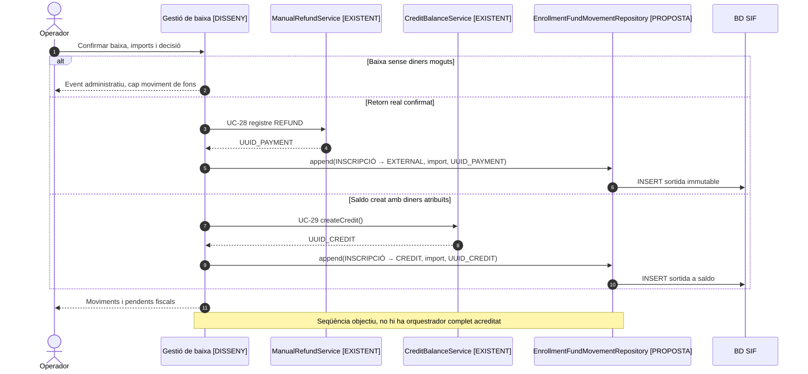
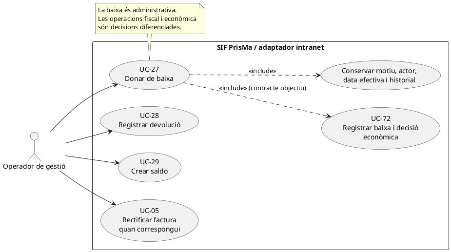
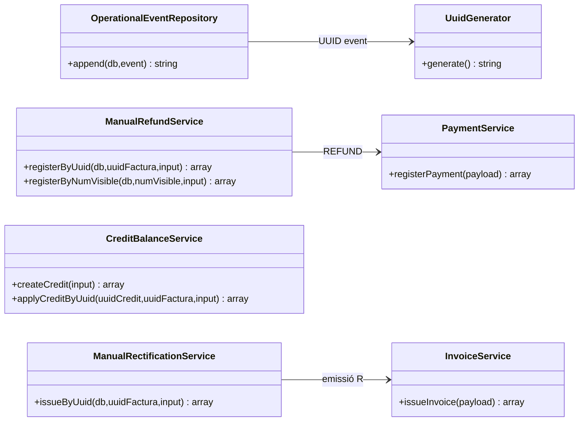
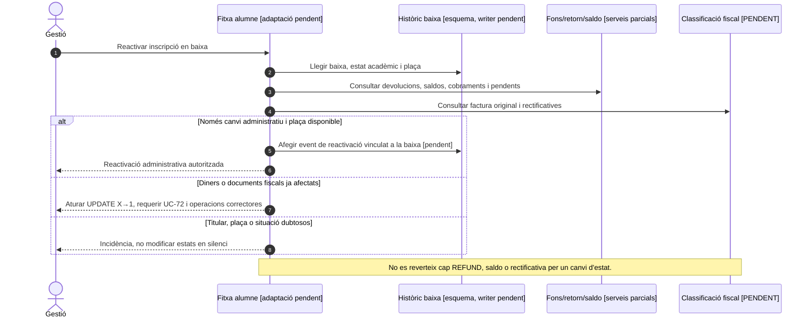

# UC-27 · Donar de baixa una inscripció — fitxa i UML integrats

**Funció:** executar una **baixa administrativa** d'una inscripció i conservar-ne el motiu, actor, dates i estat. **UC-72** representa l'expedient complet amb la **decisió econòmica posterior**. La baixa no és sinònim de morositat, `REFUND`, saldo, factura rectificativa ni registre AEAT d'anul·lació.

**Estat:** `[DISSENY/PARCIAL]` al catàleg del repositori. La documentació identifica una acció històrica de baixa a la intranet i l'esquema `enrollment_cancellation_event`, però **no s'ha identificat un orquestrador SIF de baixa implementat** que integri pantalla, event, decisió econòmica, efecte fiscal i notificacions. Els serveis `ManualRefundService`, `CreditBalanceService` i `ManualRectificationService` són operacions posteriors independents.

## 1. Fitxa del cas d'ús

| Camp | Especificació específica de PrisMa |
| --- | --- |
| Actor principal | Operador autoritzat de gestió; decisions econòmiques comunicades pel client quan pertoqui. |
| Disparador | Sol·licitud de baixa d'una inscripció o decisió administrativa de cancel·lar-la. |
| Precondicions | Identificar inscripció/edició, estat acadèmic, motiu i data efectiva, import facturat, import cobrat i si existeix factura SIF. No deduir que la baixa implica devolució. |
| Resultat administratiu | Registrar l'event de baixa i reflectir el nou estat d'inscripció conservant els estats econòmic i fiscal com a dimensions separades. |
| Dades de traça | Inscripció, motiu, actor, data de decisió i efectivitat, snapshots abans/després, UUID d'event, correlació, decisió econòmica i efecte fiscal quan es determinin. |
| Resultats econòmics possibles | `RETORN` / moviment UC-28; `SALDO` / creació UC-29; `NO_RETORN` quan la decisió és conservar l'import amb justificació; eventual combinació justificada de retorn i saldo. |
| Resultat fiscal | Si el servei facturat queda reduït o anul·lat, valorar UC-05; si la factura continua reflectint servei prestat o import no retornable, la documentació admet conservar-la sense rectificativa. El registre `RegistroAnulacion` **no** és una baixa d'alumne. |

### 1.1. Flux funcional documentat i components existents

1. L'operador recupera la inscripció i la situació econòmica/fiscal, demana una baixa i indica motiu i data efectiva. La documentació de fluxos descriu que, històricament, la baixa pot marcar l'estat d'inscripció sense modificar immediatament ni pagament ni factura.
2. El sistema ha de registrar un event administratiu amb dades abans/després i correlació. `OperationalEventRepository::append()` existeix i persisteix l'event genèric; **no s'acredita** una crida des de la baixa de la intranet ni un writer PHP específic de `enrollment_cancellation_event`.
3. La baixa es reflecteix en la inscripció llegada mitjançant una adaptació controlada, sense reescriure factures fiscals ja emeses ni confondre la cancel·lació acadèmica amb un moviment econòmic.
4. Després es determina la **decisió econòmica**: cap retorn, devolució confirmada o saldo a favor. La documentació de PrisMa explica que, en un retorn monetari, històricament Adam podia tramitar-lo manualment i després generar la rectificativa quan corresponia. El SIF objectiu ha de conservar les referències de tots els passos i no donar per retornats diners només perquè hi ha un event de baixa.
5. **UC-28** registra un `REFUND` si el retorn s'ha fet i s'ha comprovat; **UC-29** crea un `credit_balance` si la decisió és conservar l'import com a saldo. Si el client tria retorn parcial més saldo, es documenten ambdós imports evitant duplicar el mateix dret econòmic.
6. Es classifica l'efecte sobre la factura original: UC-05, si l'import/servei facturat ha canviat i la correcció és procedent; cap rectificativa si no s'ha alterat el servei/obligació facturada segons criteri validat. Les incidències fiscals dubtoses es deixen pendents de revisió.

### 1.2. Escenaris i riscos

| Cas | Regla de negoci |
| --- | --- |
| B1. Baixa abans d'emetre factura SIF | Registrar la cancel·lació administrativa; no crear una rectificativa d'una factura inexistent. La gestió de pagaments previs sense factura ha de classificar-se independentment. |
| B2. Baixa després d'emetre factura, sense retorn ni saldo | Es conserva la factura si segueix reflectint l'obligació/servei corresponent; cal motiu i decisió explícita, no una rectificativa automàtica. |
| B3. Devolució total o parcial | Comprovar retorn real i registrar UC-28; si es redueix o anul·la l'import/servei facturat, iniciar UC-05. Una devolució parcial pot afectar una línia concreta quan sigui identificable. |
| B4. Saldo a favor | Registrar UC-29 a nom del titular econòmic correcte; si la factura original queda reduïda o anul·lada, valorar rectificativa en aquell moment. Ús futur amb UC-29a. |
| B5. Retorn i saldo combinats | Documentar l'import de cada part, titular i relació a l'event original; evitar comptabilitzar dues vegades el mateix import. |
| **P1. Titular econòmic** | Si l'inscrit és alumne però va pagar una empresa/responsable, el titular del dret de devolució o saldo no es dedueix automàticament de l'inscripció. |
| **P2. Canals de devolució** | La documentació cita Redsys, transferència i registre manual com a orígens de retorn; `ManualRefundService` cobreix el **registre** per transferència/manual, no executa per si sol un reemborsament Redsys. |
| **P3. Històric i idempotència** | Falten evidències d'una coordinació que garanteixi una sola baixa confirmada per sol·licitud, control de concurrència, event complet, notificació després del commit i recuperació d'una fase econòmica fallida. |
| **P4. Manca de correspondència de classes** | No s'ha localitzat un `EnrollmentCancellationService` executable equivalent al flux general del diagrama. `enrollment_cancellation_event` és una taula SQL definida a la migració, no un servei PHP. |

### 1.3. Esquema disponible i relacions

La migració `2026_09_15_000003_add_functional_audit_control.sql` defineix `enrollment_cancellation_event` amb `UUID_CANCELLATION`, `UUID_OPERATIONAL_EVENT`, `ENROLLMENT_ID`, `CANCELLATION_REASON`, `EFFECTIVE_AT`, `ECONOMIC_DECISION`, `RETURN_AMOUNT`, `CREDIT_AMOUNT`, `NON_RETURN_REASON`, `FISCAL_DECISION`, `UUID_RECTIFYING_INVOICE`, `UUID_REFUND_PAYMENT` i `UUID_CREDIT`. L'estructura permet enllaçar la baixa, la factura rectificativa, el moviment de retorn i el saldo, però **la simple definició de la taula no acredita insercions ni desplegament**.

### 1.4. Revisió: baixa administrativa i sortida de diners són accions diferents — DISSENY PENDENT

La baixa, o la simple decisió d'un futur retorn, **no crea** una devolució ni una sortida del saldo de la inscripció. Quan un retorn monetari s'ha confirmat, cal una fila `INSCRIPCIÓ → EXTERNAL` vinculada al `payment_transaction REFUND`; quan es destina diner cobrat a saldo, cal una fila `INSCRIPCIÓ → CREDIT` vinculada al `UUID_CREDIT`. Si hi ha retorn parcial i saldo, es registren **dos moviments** i se'n controla la suma contra els fons disponibles. `enrollment_cancellation_event` conserva motiu, decisió i UUIDs globals, però no és el detall quantitatiu de totes les sortides. Cal validar el titular si el pagador era una empresa/responsable.

[Revisió de fons per inscripció](00-revisio-moviments-inscripcions.md).



### 1.5. Baixa llegada i reactivació d'una inscripció — contrast amb el xat original

El xat original identifica INSC_CURS amb valors 0 (no matriculat), 1 (matriculat), X (baixa), C (canvi de curs) i M (morós). L'operació de baixa històrica marca primer l'estat de la inscripció; **en el moment de clicar baixa no modifica necessàriament pagament o factura ni crea una rectificativa**. Després de parlar amb el client es determina si hi ha devolució, saldo o no retorn (UC-72). Aquests codis són vocabulari del llegat aportat per l'usuària, no enums fiscals del SIF ni prova dels valors de totes les taules.

**B-REV — reactivar una baixa (acció llegada declarada, adaptació SIF PENDENT):** des de la fitxa de l'alumne es pot modificar l'estat per reactivar una inscripció; això **no** desfà els efectes ja executats de la baixa. El flux objectiu ha de consultar l'event de baixa, l'estat vigent de la plaça i del curs, si hi ha retorn aprovat o executat, saldo creat/consumit, factura rectificada, deute, comunicacions i accés acadèmic. Si només canvia l'estat administratiu, autoritzar-lo segons permisos i disponibilitat i registrar **un event nou que enllaci amb la baixa anterior**. Si hi ha efectes econòmics o fiscals, rebutjar un simple canvi X→1 i obrir la regularització corresponent (UC-72/28/29/05), sense reconstruir fictíciament un cobrament o esborrar un document.

**Frontera amb regals i morositat:** al xat s'explica que un regal habitualment es resol per canvi de curs i que, en determinades reclamacions, l'alumne queda en estat morós sense opció de baixa ordinària. Aquestes pautes no són una prohibició universal: l'elegibilitat final per rol, estat i cas s'ha de contrastar amb el codi i les decisions de gestió. UC-12/95/96 regeixen deute/reclamació; el valor M no és una devolució ni una anul·lació fiscal.

### 1.5.1. Proves d'acceptació pròpies de baixa/reactivació (no executades)

| ID | Escenari | Evidència exigible |
| --- | --- | --- |
| B-01 | Baixa confirmada, decisió econòmica encara pendent | Inscripció baixa, factura i cobrament originals intactes; cap REFUND automàtic. |
| B-02 | Reactivar baixa purament administrativa | Nou event amb motiu, autor, data, baixa d'origen i plaça validada. |
| B-03 | Reactivar després de retorn, saldo consumit o rectificativa | Impedir simple canvi d'INSC_CURS; mostrar fases i requerir regularització expressa. |
| B-04 | Baixa o reactivació amb deute/morositat o regal | Decisió de gestió segons regles reals, no confondre X, C, M amb situació fiscal. |
| B-05 | Callback de pagament que arriba després de la baixa | Conservar el cobrament real, obrir conciliació i no reactivar la inscripció automàticament. |
## 2. Diagrama UML de casos d'ús



## 3. Diagrama de classes — nuclis PHP existents



**Aquest és un subdiagrama de peces reutilitzables, no el diagrama d'un orquestrador de baixa ja implementat.** Les classes `OperationalEventRepository`, `ManualRefundService`, `CreditBalanceService` i `ManualRectificationService` existeixen però el codi consultat no demostra una crida coordinada des de la pantalla de baixa. L'entitat persistida `enrollment_cancellation_event` no és una classe PHP.

## 4. Seqüència — baixa i decisió econòmica (DISSENY/PARCIAL)

```mermaid
sequenceDiagram
autonumber
actor O as Operador
participant UI as Intranet: baixa [integració pendent]
participant Legacy as Inscripció llegada
participant Ev as OperationalEventRepository [existeix]
participant BDB as enrollment_cancellation_event [taula, writer pendent]
participant Decide as Decisor econòmic/fiscal [disseny]
participant Refund as ManualRefundService [nucli existent]
participant Credit as CreditBalanceService [nucli existent]
participant Rect as ManualRectificationService [nucli parcial]
O->>UI: Demanar baixa (inscripció, motiu, data)
UI->>Legacy: Consultar estat acadèmic, pagament i factura
Legacy-->>UI: Snapshot abans
UI-->>O: Previsualitzar baixa i efectes previstos
O->>UI: Confirmar baixa administrativa
Note over UI,Ev: Coordinació, permisos, idempotència i transacció conjunta pendents
UI->>Ev: append(event administratiu i snapshots) [integració objectiu]
Ev-->>UI: UUID_OPERATIONAL_EVENT
UI->>BDB: INSERT referència de baixa i motiu [writer pendent]
UI->>Legacy: Actualitzar estat de la inscripció amb traça [adaptació pendent]
UI->>Decide: Determinar retorn, saldo o no retorn i impacte fiscal
alt Retorn confirmat
 Decide->>Refund: Iniciar UC-28 amb factura original
 Refund-->>UI: UUID_REFUND_PAYMENT
else Saldo acordat
 Decide->>Credit: createCredit() [UC-29]
 Credit-->>UI: UUID_CREDIT
else No retorn justificat
 Decide-->>UI: Conservar motiu i import no retornable
else Manca una decisió
 Decide-->>UI: Estat pendent sense moviment econòmic fictici
end
opt Servei/import facturat es redueix o anul·la
 Decide->>Rect: Iniciar UC-05 amb criteri fiscal validat
 Rect-->>UI: UUID_RECTIFYING_INVOICE
end
UI-->>O: Resultats i pendents correlacionats
```

**Atenció:** `OperationalEventRepository::append()` i els serveis econòmics són codi consultat, però **la seqüència global és la proposta funcional documentada**. La baixa administrativa no garanteix que s'hagi registrat una devolució real, creat saldo o produït una rectificativa.

### 4.1. Seqüència alternativa — reactivar baixa (OBJECTIU, no integració executable)


## 5. Traçabilitat

[Fitxa base UC-27](../06-fitxes-funcionals/uc-027.md) · [Fitxa UC-72](../06-fitxes-funcionals/uc-072.md) · [Fluxos de baixa](../03-canvis-pendents/04-fluxos-facturacio.md) · [Estat final d'operació](../04-estat-final/18-estat-final-operacio-incidencies.md) · [Seqüències del SIF](../04-estat-final/32-diagrames-sequencia-sif.md) · [OperationalEventRepository](../../sif/src/Repository/OperationalEventRepository.php) · [Migració d'events](../../sif/database/migrations/2026_09_15_000003_add_functional_audit_control.sql) · [UC-28 devolució](uc-028-registrar-devolucio.md) · [UC-29 saldo](uc-029-crear-saldo.md) · [UC-05 rectificativa](uc-005-rectificar-factura.md).

**Pendent de validar:** recorregut exacte del codi llegat de baixa, autoria i dates, justificants, titular del retorn, permisos, deduplicació, inscripció real de l'event i proves de gestió fins a la correcció fiscal.
