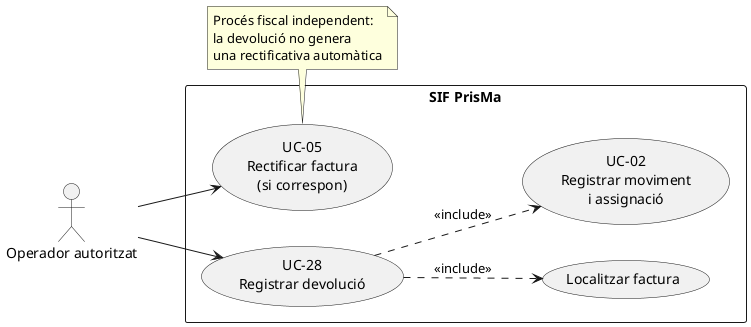
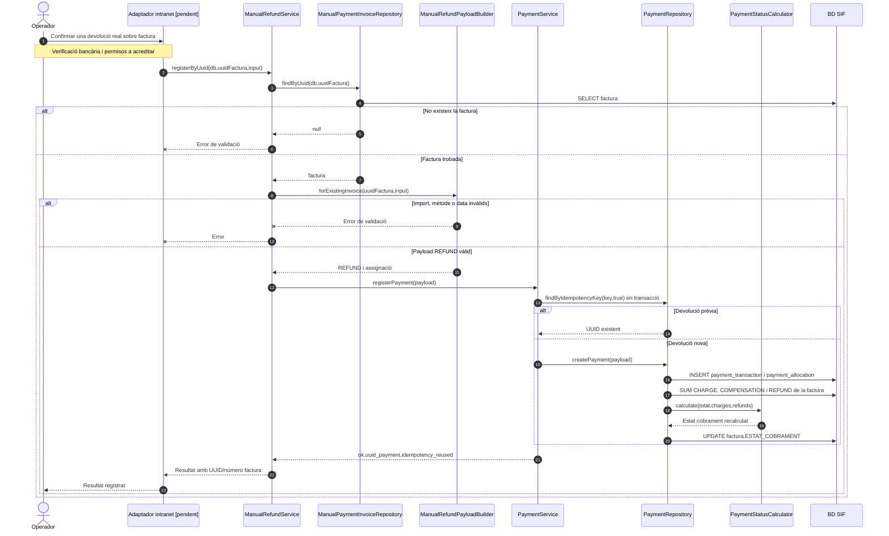
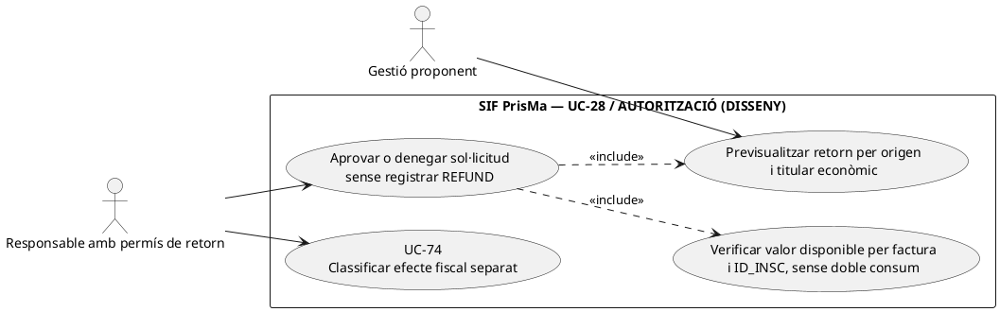
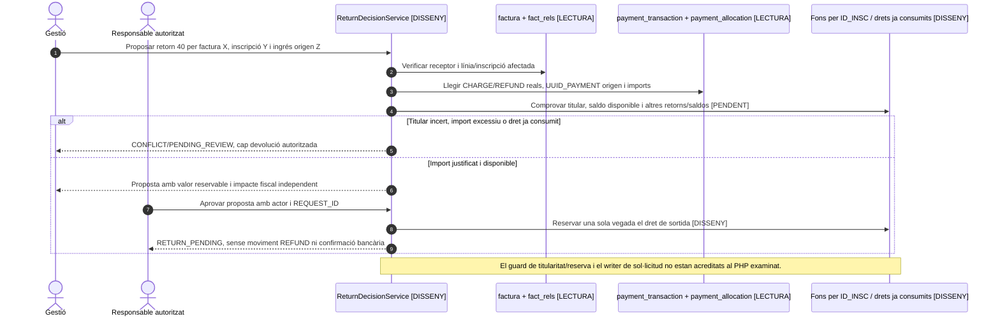
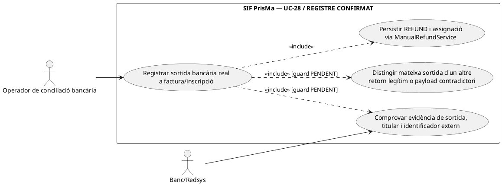
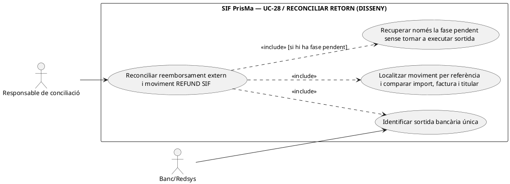

# UC-28 · Registrar una devolució — fitxa i UML integrats

**Abast:** moviment econòmic de sortida vinculat a una factura existent; una rectificativa fiscal, si correspon, és **UC-05** i no neix automàticament del registre de devolució. **Estat del codi:** `ManualRefundService` i constructor de payload disponibles; integració final de pantalla, comprovació del reemborsament bancari i decisió fiscal no acreditades. Vegeu també UC-06 (visió de les tres opcions econòmiques) i UC-02 (registre comú del moviment).

## 1. Fitxa de cas d'ús

| Camp | Especificació de UC-28 |
| --- | --- |
| Actor principal | Operador autoritzat; execució final des de la intranet pendent de verificació. |
| Disparador | Hi ha una devolució monetària real que s'ha d'enregistrar sobre una factura determinada. |
| Identificació de factura | UUID de factura o número visible; el repositori ha de retornar una factura SIF existent. |
| Entrades requerides pel constructor | Import `amount`/`import`/`refund` numèric **positiu**, `movement_date`/`data_pag`/`dataPag`, referència de factura. |
| Dades opcionals | `method` (`TRANSFERENCIA` per defecte o `MANUAL`), `reference` bancària, `bank`, `notes` i `allocation_type`. |
| Resultat esperat del servei | `uuid_payment`, `uuid_factura`, `num_visible`, `ok`, `idempotency_reused`. No retorna el nou estat de cobrament directament. |
| Persistència | `payment_transaction` amb `TIPUS_MOVIMENT=REFUND`, `payment_allocation` amb tipus `INVOICE_REFUND` per defecte; recàlcul de `factura.ESTAT_COBRAMENT`. |

### 1.1. Flux principal verificat

1. L'operador identifica la factura i aporta les dades de la devolució; **l'acreditació del reemborsament real ha de provenir del canal de negoci/banc**, no del servei PHP per si sol.
2. `ManualRefundService::registerByUuid()` o `registerByNumVisible()` cerca la factura amb `ManualPaymentInvoiceRepository`; si no existeix, rebutja l'operació.
3. `ManualRefundPayloadBuilder::forExistingInvoice()` fixa `movement_type=REFUND`, `source_channel=INTRANET`, mètode, import positiu, data i una assignació a la factura. Amb referència crea la clau `REFUND|REF:<referència>`; sense referència la deriva de factura/data/import/banc.
4. `PaymentService::registerPayment()` valida, cerca idempotència i obre transacció; si el moviment no existeix, `PaymentRepository::createPayment()` insereix moviment i assignació.
5. `PaymentRepository` recalcula el cobrament: suma càrrecs i compensacions, descompta devolucions i actualitza l'estat de la factura. Confirma i retorna identificadors econòmics; no emet cap factura fiscal nova.

### 1.2. Escenaris i errors específics

| Cas | Tractament |
| --- | --- |
| D1. Devolució parcial | Si existeixen càrrecs i la devolució deixa import net positiu, `PaymentStatusCalculator` pot retornar `PARTIALLY_REFUNDED`. |
| D2. Devolució íntegra | Si existeix devolució i l'import net queda a zero o menys, el calculador retorna `REFUNDED`. |
| D3. Reintent de la mateixa referència/clau | `PaymentService` reutilitza el `uuid_payment`; no crea una altra devolució. Cal validar que la referència bancària identifica realment la mateixa operació. |
| E1. Factura no trobada | Error de validació abans d'inscriure moviments. |
| E2. Import no positiu, data absent o mètode fora dels dos admesos | Rebuig pel constructor específic. |
| P1. Import de devolució superior al cobrat | **No es veu una comprovació específica del màxim ja cobrat en el camí `ManualRefundService → PaymentService` consultat.** Cal definir-la/implementar-la abans d'operar de manera general. |
| P2. Classificació fiscal | Una baixa o reducció del servei pot requerir UC-05; aquest servei **no emet ni vincula** rectificatives. |
| P3. Seguiment bancari i auditoria | La inserció del moviment no demostra que el banc hagi retornat diners ni que la traça transversal prevista estigui completa. |

**Proves localitzades, no executades:** `ManualRefundServiceTest::testRegistersManualRefundAgainstExistingInvoiceByUuid`, `testRegistersFullRefundByVisibleInvoiceNumber` i `testRejectsUnknownInvoiceBeforeRegisteringRefund`.

### 1.3. Revisió: registrar la sortida dels fons de la inscripció correcta — PENDENT

`REFUND` i `payment_allocation` assenyalen una **factura**. Si una factura és d'una empresa amb diversos participants, o si hi ha hagut canvi de curs, no determinen automàticament **de quina inscripció surt** l'import. UC-28 ha d'identificar l'atribució disponible de la inscripció origen, vincular el `UUID_PAYMENT` del retorn real i registrar `INSCRIPCIÓ → EXTERNAL` per l'import efectiu. Una devolució conjunta requereix una sortida per inscripció, però no múltiples cobraments/retorns bancaris ficticis. El servei manual actual no comprova l'import retornable per inscripció ni construeix aquesta traça. La rectificativa, si correspon, és UC-05 per separat.

[Esquema i controls proposats](00-revisio-moviments-inscripcions.md).

### 1.4. Del retorn acordat al retorn acreditat: intranet, TPV i receptor — contrast amb el xat original

**D-ETAPES — tres fets diferenciats:** el xat descriu que l'operador pot marcar primer una baixa o canvi de curs i acordar posteriorment un retorn. Adam/Pablo poden **executar o registrar** una devolució manual segons el procediment intern; la pantalla històrica «Consulta - Edita - Anul·la factura» presenta `A TORNAR`, `DATA DEVOLUCIO` i observacions. Un import previst a `A TORNAR`, una data introduïda o una factura rectificativa **no acrediten per si sols un retorn bancari executat**. Només després de verificar el fet extern, el canal registra `REFUND` amb el justificant/referència i la relació a la factura/inscripció d'origen. L'ordre històric del tràmit fiscal no s'ha d'interpretar com una regla universal per a tots els escenaris.

**D-CANAL — TPV, transferència o manual:** `ManualRefundService` només registra el moviment en el SIF; no ordena un reemborsament Redsys ni acredita que s'hagi fet. Si una devolució de Redsys apareix en l'anàlisi del fitxer TPV o en un callback, identificar DS_ORDER/operació i consultar si ja s'ha registrat per una altra via. No crear un segon `REFUND` manual pel mateix retorn només perquè els prefixes de deduplicació són diferents. La factura històrica negativa `R` i el valor negatiu d'un fitxer TPV no substitueixen la classificació de la rectificativa fiscal i del moviment real per separat.

**D-LÍMITS I TITULAR:** abans d'autoritzar, comprovar el cobrament real disponible **per inscripció** i el titular econòmic, sobretot en packs, empreses, grups i USOC. Un retorn d'una línia d'una factura conjunta no ha d'excedir la part atribuïda a la inscripció afectada ni duplicar imports ja retornats o convertits en saldo. Si l'import excedeix el disponible, bloquejar i obrir incidència; el `PaymentStatusCalculator` pot recalcular l'estat però no és una prova de límit econòmic ni autorització de retorn.

**D-FISCAL I ERRORS:** el registre econòmic de `REFUND` i una eventual UC-05 tenen claus i resultats diferents. Si el banc confirma el retorn però falla el registre SIF, conservar evidència i gestionar conciliació/reintent idempotent; si SIF confirma el moviment però falla la sincronització del llegat, no repetir la sortida bancària. La política i els imports que cal rectificar depenen de la variació real del servei/factura i de la decisió fiscal validada, no només de l'estat acadèmic.

### 1.5. Proves d'acceptació afegides (no executades)

| ID | Cas | Resultat exigible |
| --- | --- | --- |
| DV-01 | Baixa confirmada però client encara no ha rebut diners | Cap REFUND fins a evidència de retorn; decisió pendent per separat. |
| DV-02 | Reemborsament Redsys ja registrat i intent de registre manual | Correlació al mateix moviment, no segon REFUND. |
| DV-03 | Retorn parcial d'un participant de factura de grup | Titular i import per inscripció verificats; altres participants intactes. |
| DV-04 | Retorn superior a fons cobrats disponibles | Bloqueig, sense pagar de nou ni saldo negatiu fictici. |
| DV-05 | Retorn parcial combinat amb saldo | Dues sortides diferenciades i suma no superior al fons disponible. |
| DV-06 | Retorn bancari complet, fallada en registrar-lo al SIF | Incidència amb referència externa; reintent idempotent, sense segon retorn bancari. |
| DV-07 | SIF confirma REFUND però falla el resum de la intranet | Moviment conservat, sincronització posterior sense duplicar-lo. |
## 2. Diagrama UML de casos d'ús



## 3. Diagrama de classes del cas — implementació observada


## 4. Diagrama de seqüència principal: devolució manual



### 4.1. Seqüència — devolució acordada i retorn acreditat (OBJECTIU)

```mermaid
sequenceDiagram
autonumber
actor O as Gestió
participant UI as Baixa/Factura intranet [adaptació pendent]
participant Ext as Banc/Redsys/retorn real
participant R as Conciliació/autorització [PENDENT]
participant S as ManualRefundService [registre existent]
participant DB as BD SIF
O->>UI: Aprovar retorn de la part atribuïda
UI->>R: Validar titular i imports cobrats menys sortides
UI-->>O: Retorn pendent, encara no REFUND
Ext-->>UI: Evidència del reemborsament executat
UI->>R: Buscar mateixa operació en registres Redsys/manuals
alt Ja s'ha registrat el retorn
 R-->>UI: UUID_PAYMENT existent; no crear un segon REFUND
else Retorn real nou i validat
 UI->>S: Registrar REFUND amb referència i factura/part afectada
 S->>DB: INSERT payment_transaction i payment_allocation
 S-->>UI: UUID_PAYMENT
 UI-->>O: Retorn registrat; efecte fiscal UC-05 separat si correspon
end
Note over UI,R: Autorització per inscripció i conciliació externa encara no acreditades al servei manual.
```
### 4.2. Acció independent: autoritzar un retorn pendent sense afirmar que els diners han sortit — DISSENY

**Actor i disparador:** gestió rep una petició de devolució després d'una baixa, un canvi o una diferència d'import. **Entrades:** operació comercial, `ID_INSC`, factura, `UUID_PAYMENT` de l'ingrés real que origina el dret, titular econòmic/pagador, import en cèntims, causa, altres retorns i saldos ja concedits. **Precondicions:** comprovar qui va aportar els diners, el valor disponible per origen/inscripció i si hi ha rectificativa o decisió fiscal independent. **Postcondició:** ordre/decisió `RETURN_PENDING` **proposada**, actor i prova; **cap** `payment_transaction REFUND` fins a una sortida externa confirmada. Ni el camp llegat `A TORNAR` ni el payload de `ManualRefundService` implementen aquesta aprovació.





### 4.3. Acció independent: registrar un retorn extern efectivament confirmat — PHP existent + guard pendent

**Actor/disparador:** la persona responsable disposa d'evidència del retorn bancari/TPV **executat**, no només d'una ordre pendent. **Entrades objectiu:** identificador invariable de l'operació bancària de sortida, canal i compte/pagador legitimat, import, divisa, data real, factura i trams per `ID_INSC`, `UUID_PAYMENT` de l'ingrés origen i decisió aprovada. **Postcondició:** un únic `REFUND` amb assignació coherent a la factura i traça d'atribució a l'origen econòmic; cap segon retorn al banc com a efecte de registrar-lo. El PHP actual només admet `UUID_FACTURA`/número, data/import i referència/banc opcionals: **no comprova l'evidència del banc, no rep titular del retorn ni UUID de l'ingrés original i no verifica límit retornable**.

**Contrast exacte d'idempotència:** `ManualRefundPayloadBuilder::idempotencyKey()` usa `REFUND|REF:<reference>` si hi ha referència; sense referència, `REFUND|FACT:<num>|DATA:<YYYY-MM-DD>|IMPORT:<amount>|BANC:<bank>`. Dos retorns bancaris distints de 40 € per una mateixa factura el mateix dia i banc **col·lideixen** en el segon format; una referència reutilitzada en dues factures **col·lideix** en el primer. `PaymentService::createOrReusePayment()` retorna el moviment antic sense comparar `PAYLOAD_HASH` (que `PaymentRepository` sí que desa), `IMPORT` o `payment_allocation.UUID_FACTURA`. La unicitat per clau protegeix només la clau, no la identitat semàntica d'un retorn bancari. Una referència d'origen i una de sortida tampoc s'han de confondre.



```mermaid
sequenceDiagram
autonumber
actor O as Conciliació bancària
participant B as Banc/Redsys / justificant sortida [EXTERN]
participant G as RefundEvidenceGuard [DISSENY]
participant R as ManualRefundService [PHP]
participant K as ManualRefundPayloadBuilder [PHP]
participant P as PaymentService [PHP]
participant DB as payment_transaction/allocation [SQL]
O->>B: Comprovar sortida real E, titular, import 40 i referència externa
B-->>O: Identificador bancari E i efecte confirmat
O->>G: validate(E,requestId,originPayment,uuidFactura,ID_INSC,40)
G->>DB: Cercar REFUND existent per operació E i calcular límit del dret origen
alt E ja correspon al mateix retorn amb dades equivalents
 DB-->>G: UUID_PAYMENT preexistent + assignació/titular coherents
 G-->>O: Reutilitzar UUID; cap nou REFUND
else Referència/clau repetida amb import o factura diferents
 DB-->>G: CONFLICT semàntic
 G-->>O: Revisió; no assumir que l'antic UUID retorna diners d'aquesta factura
else E nova, sortida acreditada i dret suficient
 G->>R: registerByUuid(sifDb,uuidFactura,input amb E/40) [PHP]
 R->>K: forExistingInvoice(uuidFactura,input)
 K-->>R: REFUND, IDEMPOTENCY_KEY, una assignació
 R->>P: registerPayment(payload)
 P->>DB: BEGIN, cerca per clau; INSERT REFUND/assignació si no existeix
 DB-->>P: UUID_PAYMENT o reús
 P-->>R: UUID_PAYMENT
 R-->>G: UUID_PAYMENT, UUID_FACTURA
 G->>DB: Comprovar contingut/assignació i registrar origen+decisió [DISSENY]
 G-->>O: Sortida acreditada i registrada o incidència si divergeix
end
Note over G,DB: Només el registre SIF és PHP real. El guard, el límit, la conciliació bancària i la vinculació a ID_INSC són disseny pendent.
```

### 4.4. Acció independent: reconciliar retorn extern amb SIF després de pèrdua de resposta — DISSENY

**Actor/disparador:** el banc ha confirmat un reemborsament però el registre SIF ha fallat, no s'ha rebut la resposta del servei o existeix una devolució SIF sense evidència externa correlacionable. **Postcondició:** distingir `EXTERNAL_CONFIRMED/SIF_PENDING`, `SIF_CONFIRMED/EXTERNAL_UNVERIFIED` i `RECONCILED` com a **estats objectiu d'expedient, no enums actuals**. Consultar primer el banc i els moviments existents, recuperar el mateix retorn amb una identitat externa invariable i comparar factura/import/origen; **no reenviar automàticament una ordre al banc ni crear un altre `REFUND` per tornar a intentar la sincronització llegada**.



```mermaid
sequenceDiagram
autonumber
actor R as Responsable conciliació
participant C as RefundReconciliationService [DISSENY]
participant B as Banc/Redsys [EXTERN]
participant S as payment_transaction/allocation [LECTURA]
participant M as ManualRefundService [PHP: només registra]
participant L as Projecció llegada UC-47 [PHP/PENDENT]
R->>C: reconcile(externalRefundId,originPayment,uuidFactura)
C->>B: Verificar operació de sortida i estatus real
C->>S: Cercar REFUND existent, import i factura assignada
alt Banc no confirma sortida, SIF tampoc té REFUND
 C-->>R: RETURN_PENDING; no moviment inventat
else Banc confirma, SIF manca
 C->>M: registerByUuid(...,referència externa original) [guard PENDENT]
 M-->>C: UUID_PAYMENT o conflicte semàntic
 C->>S: Rellegir import/factura/origen i verificar un sol retorn
 C-->>R: RECONCILED o incidència amb banc ja confirmat
else SIF té REFUND però no es verifica sortida externa
 C-->>R: EXTERNAL_UNVERIFIED; investigar, no executar automàticament un segon retorn
else Banc i SIF coincideixen en operació/import/factura/titular
 C->>L: Reparar només resum llegat si cal, mateix UUID_PAYMENT
 C-->>R: RECONCILED sense nou CHARGE/REFUND
end
Note over C,M: No s'ha acreditat un servei PHP de conciliació de retorns ni API que executi devolució bancària.
```

| ID de prova pendent | Escenari | Resultat exigible |
| --- | --- | --- |
| DV-28-08 | Dues devolucions bancàries reals de 40 € sobre la mateixa factura, el mateix dia i banc, sense referència | Identitats externes diferents; no fusionar-les per la clau derivada de dia/import. |
| DV-28-09 | Mateixa `reference` en una petició per factura A/40 i una altra per factura B/80 | Detectar contradicció d'assignació/import; no retornar silenciosament el UUID de la primera com a «devolució B». |
| DV-28-10 | `REFUND` de 120 € sobre factura amb només 40 € de fons retornables atribuïts | Guard objectiu impedeix registrar un retorn fictici/excessiu; el camí PHP actual no demostra aquest límit. |
| DV-28-11 | Banc confirma retorn, resposta SIF es perd i operador repeteix el tràmit | Buscar el mateix identificador bancari i reusar/reconciliar; no repetir la sortida externa. |
| DV-28-12 | Pagament inicial empresa per grup, sol·licitud de retorn d'un participant | Identificar titular econòmic i fons d'`ID_INSC`; no pagar automàticament el participant. |
| DV-28-13 | SIF registra `REFUND` però justificant extern no existeix | Estat d'incidència, no declarar reemborsament bancari acreditat pel sol `ESTAT=CONFIRMED` de `payment_transaction`. |

## 5. Traçabilitat i límits

[Fitxa antiga UC-28](../06-fitxes-funcionals/uc-028.md) · [UC-02 revisada](uc-002-registrar-cobrament-factura.md) · [UC-05 revisada](uc-005-rectificar-factura.md) · [ManualRefundService](../../sif/src/Service/ManualRefundService.php) · [ManualRefundPayloadBuilder](../../sif/src/Service/ManualRefundPayloadBuilder.php) · [PaymentService](../../sif/src/Service/PaymentService.php) · [PaymentRepository](../../sif/src/Repository/PaymentRepository.php) · [PaymentStatusCalculator](../../sif/src/Domain/PaymentStatusCalculator.php) · [ManualRefundServiceTest](../../sif/tests/Integration/ManualRefundServiceTest.php).

**No s'ha validat el desplegament, la sortida bancària real ni l'execució dels tests.**
