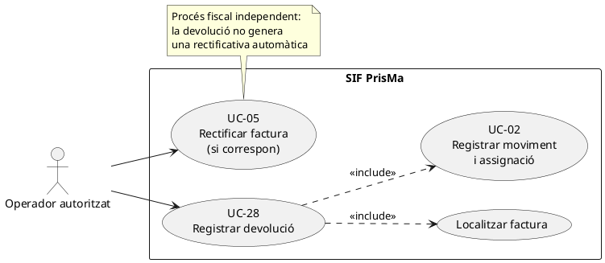
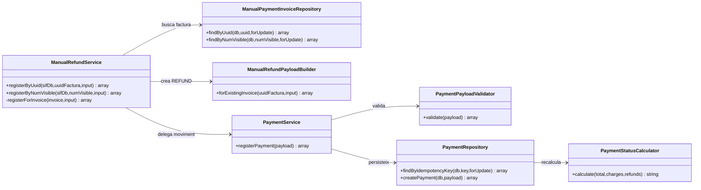
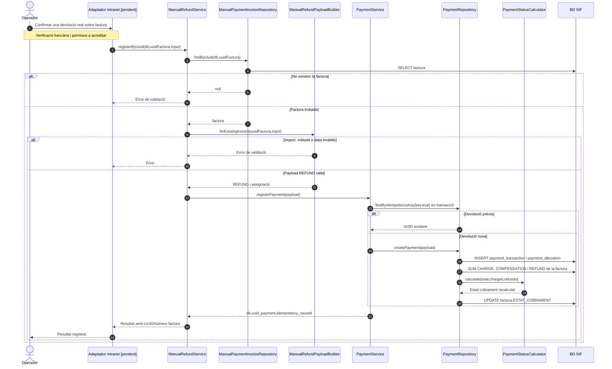

# UC-28 · Registrar una devolució — fitxa i UML integrats

**Abast:** moviment econòmic de sortida vinculat a una factura existent; una rectificativa fiscal, si correspon, és **UC-05** i no neix automàticament del registre de devolució. **Estat del codi:** `ManualRefundService` i constructor de payload disponibles; integració final de pantalla, comprovació del reemborsament bancari i decisió fiscal no acreditades. Vegeu també UC-06 (visió de les tres opcions econòmiques) i UC-02 (registre comú del moviment).

## 1. Fitxa de cas d'ús

| Camp | Especificació de UC-28 |
| --- | --- |
| Actor principal | Operador autoritzat; execució final des de la intranet pendent de verificació. |
| Disparador | Hi ha una devolució monetària real que s'ha d'enregistrar sobre una factura determinada. |
| Identificació de factura | UUID de factura o número visible; el repositori ha de retornar una factura SIF existent. |
| Entrades requerides pel constructor | Import `amount`/`import`/`refund` numèric **positiu**, `movement_date`/`data_pag`/`dataPag`, referència de factura. |
| Dades opcionals | `method` (`TRANSFERENCIA` per defecte o `MANUAL`), `reference` bancària, `bank`, `notes` i `allocation_type`. |
| Resultat esperat del servei | `uuid_payment`, `uuid_factura`, `num_visible`, `ok`, `idempotency_reused`. No retorna el nou estat de cobrament directament. |
| Persistència | `payment_transaction` amb `TIPUS_MOVIMENT=REFUND`, `payment_allocation` amb tipus `INVOICE_REFUND` per defecte; recàlcul de `factura.ESTAT_COBRAMENT`. |

### 1.1. Flux principal verificat

1. L'operador identifica la factura i aporta les dades de la devolució; **l'acreditació del reemborsament real ha de provenir del canal de negoci/banc**, no del servei PHP per si sol.
2. `ManualRefundService::registerByUuid()` o `registerByNumVisible()` cerca la factura amb `ManualPaymentInvoiceRepository`; si no existeix, rebutja l'operació.
3. `ManualRefundPayloadBuilder::forExistingInvoice()` fixa `movement_type=REFUND`, `source_channel=INTRANET`, mètode, import positiu, data i una assignació a la factura. Amb referència crea la clau `REFUND|REF:<referència>`; sense referència la deriva de factura/data/import/banc.
4. `PaymentService::registerPayment()` valida, cerca idempotència i obre transacció; si el moviment no existeix, `PaymentRepository::createPayment()` insereix moviment i assignació.
5. `PaymentRepository` recalcula el cobrament: suma càrrecs i compensacions, descompta devolucions i actualitza l'estat de la factura. Confirma i retorna identificadors econòmics; no emet cap factura fiscal nova.

### 1.2. Escenaris i errors específics

| Cas | Tractament |
| --- | --- |
| D1. Devolució parcial | Si existeixen càrrecs i la devolució deixa import net positiu, `PaymentStatusCalculator` pot retornar `PARTIALLY_REFUNDED`. |
| D2. Devolució íntegra | Si existeix devolució i l'import net queda a zero o menys, el calculador retorna `REFUNDED`. |
| D3. Reintent de la mateixa referència/clau | `PaymentService` reutilitza el `uuid_payment`; no crea una altra devolució. Cal validar que la referència bancària identifica realment la mateixa operació. |
| E1. Factura no trobada | Error de validació abans d'inscriure moviments. |
| E2. Import no positiu, data absent o mètode fora dels dos admesos | Rebuig pel constructor específic. |
| P1. Import de devolució superior al cobrat | **No es veu una comprovació específica del màxim ja cobrat en el camí `ManualRefundService → PaymentService` consultat.** Cal definir-la/implementar-la abans d'operar de manera general. |
| P2. Classificació fiscal | Una baixa o reducció del servei pot requerir UC-05; aquest servei **no emet ni vincula** rectificatives. |
| P3. Seguiment bancari i auditoria | La inserció del moviment no demostra que el banc hagi retornat diners ni que la traça transversal prevista estigui completa. |

**Proves localitzades, no executades:** `ManualRefundServiceTest::testRegistersManualRefundAgainstExistingInvoiceByUuid`, `testRegistersFullRefundByVisibleInvoiceNumber` i `testRejectsUnknownInvoiceBeforeRegisteringRefund`.

### 1.3. Revisió: registrar la sortida dels fons de la inscripció correcta — PENDENT

`REFUND` i `payment_allocation` assenyalen una **factura**. Si una factura és d'una empresa amb diversos participants, o si hi ha hagut canvi de curs, no determinen automàticament **de quina inscripció surt** l'import. UC-28 ha d'identificar l'atribució disponible de la inscripció origen, vincular el `UUID_PAYMENT` del retorn real i registrar `INSCRIPCIÓ → EXTERNAL` per l'import efectiu. Una devolució conjunta requereix una sortida per inscripció, però no múltiples cobraments/retorns bancaris ficticis. El servei manual actual no comprova l'import retornable per inscripció ni construeix aquesta traça. La rectificativa, si correspon, és UC-05 per separat.

[Esquema i controls proposats](00-revisio-moviments-inscripcions.md).

## 2. Diagrama UML de casos d'ús

## 3. Diagrama de classes del cas — implementació observada

## 4. Diagrama de seqüència principal: devolució manual

## 5. Traçabilitat i límits

[Fitxa antiga UC-28](../06-fitxes-funcionals/uc-028.md) · [UC-02 revisada](uc-002-registrar-cobrament-factura.md) · [UC-05 revisada](uc-005-rectificar-factura.md) · [ManualRefundService](../../sif/src/Service/ManualRefundService.php) · [ManualRefundPayloadBuilder](../../sif/src/Service/ManualRefundPayloadBuilder.php) · [PaymentService](../../sif/src/Service/PaymentService.php) · [PaymentRepository](../../sif/src/Repository/PaymentRepository.php) · [PaymentStatusCalculator](../../sif/src/Domain/PaymentStatusCalculator.php) · [ManualRefundServiceTest](../../sif/tests/Integration/ManualRefundServiceTest.php).

**No s'ha validat el desplegament, la sortida bancària real ni l'execució dels tests.**
