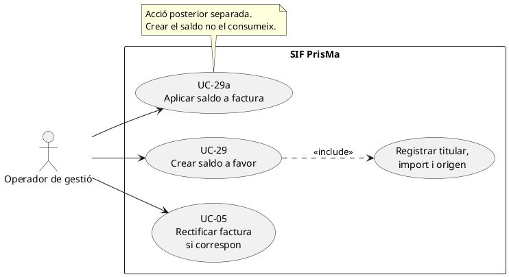
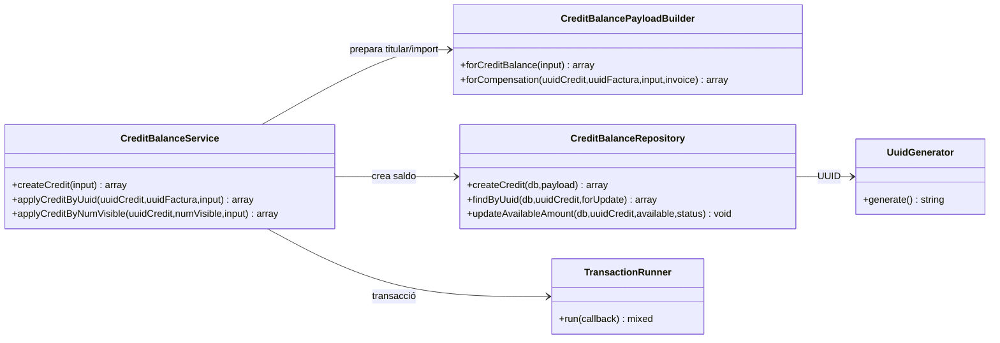
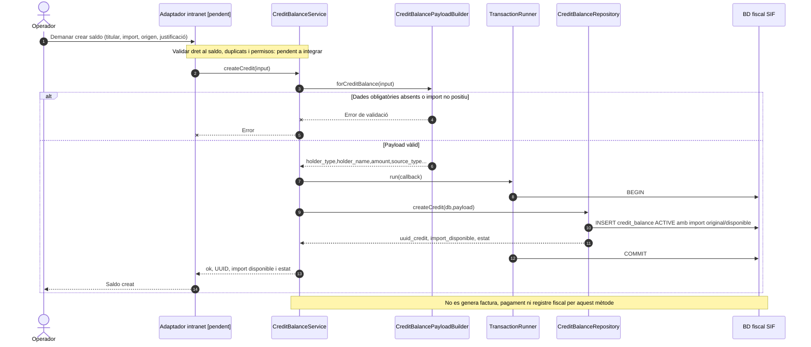
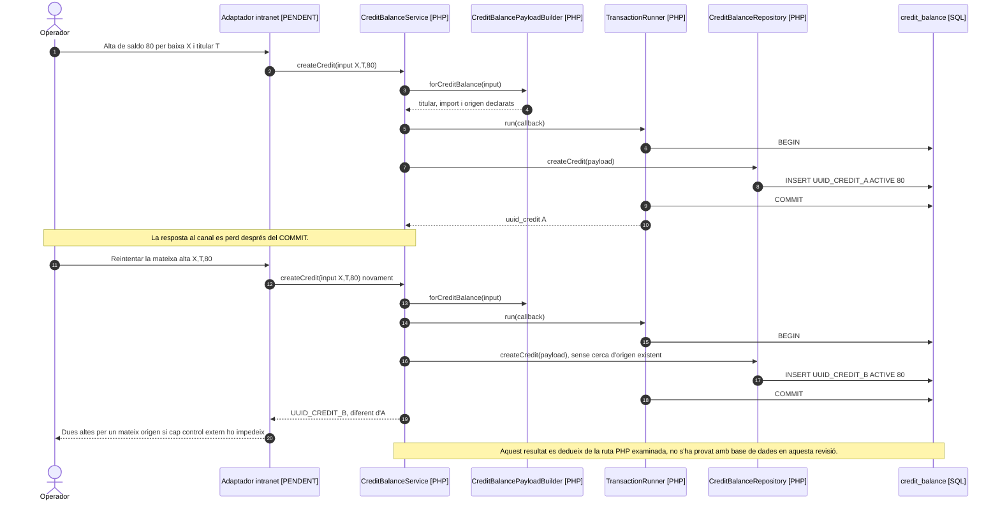
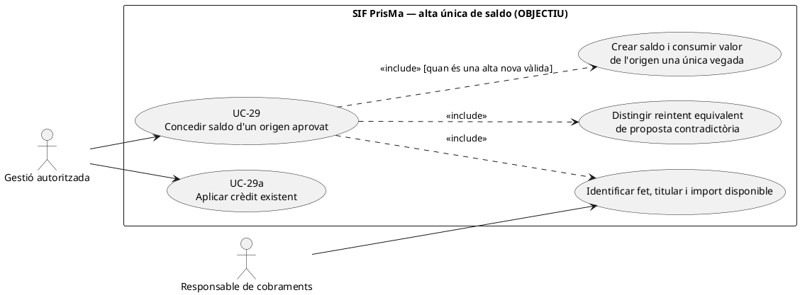
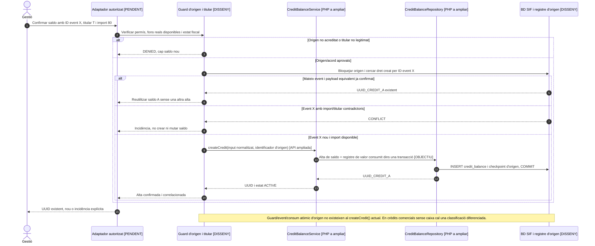

# UC-29 · Crear un saldo a favor — fitxa i UML integrats

**Abast:** constituir un saldo reutilitzable a favor d'un titular; **no** equival a fer una transferència de devolució, aplicar el saldo a una factura ni rectificar fiscalment l'operació d'origen. Relacions: UC-06 (decisió econòmica), UC-29a (ús posterior), UC-05 (rectificació si correspon), UC-27/72 (baixa), UC-26/71 (canvi de curs).

**Estat tècnic verificat:** `CreditBalanceService::createCredit()`, `CreditBalancePayloadBuilder::forCreditBalance()` i `CreditBalanceRepository::createCredit()` al codi. La justificació de l'origen, els permisos i la comprovació de saldo no duplicat no estan implementats explícitament en aquesta ruta.

## 1. Fitxa de cas d'ús

| Camp | Especificació |
| --- | --- |
| Actor principal | Operador de gestió autoritzat, a través de canal encara pendent d'acreditar. |
| Disparador | Una decisió econòmica documentada atribueix un import a reutilitzar en el futur. |
| Entrades obligatòries segons el constructor | `holder_type`/`tipus_titular`; `holder_name`/àlies; `amount`/`import` numèric i estrictament positiu; `source_type`/`origen`. |
| Entrades opcionals | `holder_id`, `source_id`, `holder_nif_cif`, `uuid_factura_origen`, `uuid_factura_rectificativa`, `review_after`. |
| Postcondició del nucli | Un registre `credit_balance` amb `UUID_CREDIT` nou, `IMPORT_ORIGINAL = IMPORT_DISPONIBLE = amount`, `ESTAT = ACTIVE`; retorn d'UUID, import disponible i estat. |
| Moviments no generats | El camí `createCredit()` **no** crea `payment_transaction`, `payment_allocation`, `factura`, `factura_registres` o una nova remissió AEAT. |

### 1.1. Flux principal real

1. Operador determina el titular correcte, l'import i l'origen justificat del dret de saldo; aquestes comprovacions de negoci **no estan implementades al builder**.
2. `CreditBalanceService::createCredit(input)` prepara el payload amb `CreditBalancePayloadBuilder`; si falta un camp obligatori o l'import no és positiu, rebutja la petició.
3. `TransactionRunner` inicia la transacció; `CreditBalanceRepository::createCredit()` genera UUID i insereix el saldo actiu.
4. La transacció es confirma i el servei retorna `ok`, `uuid_credit`, `import_disponible` i `estat`.
5. Qualsevol aplicació posterior requereix un nou cas, UC-29a, amb identificació explícita de la factura receptora i comprovació de l'import pendent.

### 1.2. Alternatives, dades i riscos

| Situació | Comportament / estat de verificació |
| --- | --- |
| C1. Titular alumne | El test documenta `holder_type=student`, normalitzat a `STUDENT`, amb identificador i NIF; **no** afirma que aquest sigui l'únic tipus de titular admès. |
| C2. Origen baixa o canvi de curs | `source_type` i `source_id` permeten conservar l'origen declarat. El codi aquí **no comprova** que la baixa o el canvi s'hagin executat ni que l'import coincideixi amb el seu resultat econòmic. |
| C3. Saldo associat a factura o rectificativa | Els UUID es poden aportar i conservar; l'existència o la coherència amb la decisió fiscal requereixen contrast específic. |
| E1. Import zero, negatiu o no numèric | Error de validació. |
| E2. Titular, nom o tipus d'origen absent | Error de validació. |
| **P1. Duplicats** | `createCredit()` genera un UUID nou a cada invocació i, en aquesta ruta, **no es veu una clau idempotent ni una comprovació d'origen únic**. Repetir l'acció pot crear un segon saldo; cal definir la prevenció i la recuperació abans de donar per tancat el cas. |
| **P2. Titular i autorització** | No s'ha acreditat que el titular declarat sigui qui legalment/econòmicament té dret al saldo, especialment si pagava una empresa o responsable. |
| **P3. Caducitat o revisió** | `review_after` s'emmagatzema, però aquest mètode no aplica automàticament cap expiració o validació quan arriba la data. |
| **P4. Auditoria** | El camí analitzat no registra explícitament l'esdeveniment funcional transversal descrit en el disseny d'operació del SIF. |

**Prova existent al repositori, no executada ara:** `CreditBalanceServiceTest::testCreatesCreditBalanceWithoutFiscalOrPaymentSideEffects`.

### 1.3. Revisió: cal rastrejar de quina inscripció surt el saldo — PENDENT

Si el saldo prové d'import **cobrat i atribuït** a una inscripció, la creació de `credit_balance` ha de correlacionar-se amb una fila `INSCRIPCIÓ → CREDIT` del mateix import, vinculada al cobrament original i a l'event de canvi o baixa. No es pot crear saldo per una quantitat superior a la que queda a l'origen després d'altres traspassos i devolucions. Si el crèdit es concedeix **sense cobrament previ** com a avantatge comercial, no s'ha d'inventar una entrada de caixa: necessita una classificació econòmica diferenciada. `CreditBalanceService::createCredit()` crea el saldo actual, però no aquest assentament per inscripció ni la comprovació de duplicats per origen.

[Revisió transversal de fons](00-revisio-moviments-inscripcions.md).

### 1.4. Titular, saldo antic i alta única — contrast amb el xat original

**C-ORIGEN — diners cobrats o bonificació:** si el client prefereix conservar diners ingressats després d'una baixa, canvi de curs o excés de cobrament, el saldo neix de la seva decisió documentada sobre un import encara disponible. Aquest crèdit no és una segona entrada de caixa ni una reducció silenciosa d'A_PAGAR. Si la gestió concedeix un avantatge comercial **sense ingrés previ**, no atribuir-lo com si fos un crèdit procedent de diners del client: cal classificar la bonificació i els seus efectes per separat.

**C-TITULAR — alumne, empresa o responsable:** el titular de `credit_balance` ha de coincidir amb qui tingui el dret econòmic justificat; quan paga una empresa, un responsable o USOC, no es pressuposa que tot el saldo pertoqui a l'alumne inscrit. Conservar origen (UUID de cobrament, factura i inscripció afectada), import cobrat disponible, event de baixa/canvi, persona que aprova, motiu i eventual rectificativa. Els camps opcionals del builder no demostren per si sols la validació d'aquestes relacions.

**C-ANTIC — revisió manual, NO caducitat automàtica:** l'usuària indica que el saldo d'una baixa no caduca automàticament. Secretaria revisa manualment els saldos molt antics, **per exemple superiors a cinc anys**, abans d'utilitzar-los o decidir-ne el tractament. El llindar dels cinc anys és una pauta de revisió, **no** una data de venciment que autoritzi `EXPIRED`, eliminació del registre o pèrdua de drets per si sola. `review_after` es pot desar al builder actual, però no acredita una alerta o revisió automàtica implementada.

**C-ÚNIC — doble clic/repetició:** `CreditBalanceService::createCredit()` genera un nou UUID per invocació i no acredita deduplicació per event d'origen. La pantalla ha de determinar si existeix ja un saldo procedent de la mateixa quantitat/event/inscripció i evitar una segona alta; si ja s'ha creat però ha fallat la sincronització, recuperar UUID_CREDIT existent i no repetir la conversió dels mateixos fons. Després de crear crèdit, la seva aplicació és UC-29a, no un segon `CHARGE` real.

### 1.5. Proves d'acceptació addicionals (no executades)

| ID | Escenari | Resultat exigible |
| --- | --- | --- |
| SA-01 | Baixa amb 80 € cobrats i decisió de saldo de 80 € | Un crèdit del titular justificat; fons d'origen disponibles reduïts sense segon CHARGE. |
| SA-02 | Baixa pagada per una empresa | Saldo a titular econòmic justificat, no assignat automàticament a alumne. |
| SA-03 | Crear dues vegades saldo per mateixa baixa/import | Un únic UUID_CREDIT o bloqueig de conflicte; cap duplicació de valor. |
| SA-04 | Retorn monetari parcial i saldo de la resta | Suma de sortides acotada pels diners efectivament cobrats de l'origen. |
| SA-05 | Saldo de més de cinc anys | Revisió manual i historial; no caducitat ni supressió automàtiques. |
| SA-06 | Bonificació comercial sense ingrés | Classificació diferenciada; cap entrada de caixa fictícia. |
## 2. Diagrama UML de casos d'ús

## 3. Subdiagrama de classes — creació i cas vinculat

La creació de saldo no invoca `PaymentService` ni `InvoiceService`; les relacions opcionals a UUID de factures són dades, no una nova emissió.

## 4. Diagrama de seqüència — crear saldo

### 4.1. Acció específica: reintentar l'alta d'un saldo quan la primera resposta s'ha perdut

**Contrast executable:** `CreditBalanceService::createCredit()` construeix el payload i, per cada crida, `CreditBalanceRepository::createCredit()` genera un `UUID_CREDIT` **nou** i insereix un registre `ACTIVE`; aquesta ruta no cerca `source_type/source_id`, `UUID_FACTURA_ORIGEN`, titular ni una clau d'operació anterior abans d'inserir. La transacció evita un registre a mitges per crida, però **no evita dues altes diferents del mateix dret** després d'un doble clic o d'una resposta perduda. El fet que una baixa i un canvi de curs comparteixin import no els converteix automàticament en la mateixa font: el guard s'ha de basar en un **event econòmic únic**, la quantitat de valor disponible i el titular real.

### 4.2. Acció objectiu: confirmar el dret econòmic i recuperar l'alta idempotent

**Precondicions:** event/decisió econòmica identificable; comprovació servidor de titular/pagador legítim, import encara disponible de l'origen, rectificació fiscal quan pertoqui i absència de retorn o saldo previ contradictoris. **Actor que inicia:** gestió autoritzada; no donar accés a crear saldos per conèixer només un ID de factura. **Postcondició:** saldo creat una vegada i correlacionat a l'event únic de procedència; un reintent exacte recupera el mateix UUID; una petició amb el mateix ID d'event i import o titular diferent genera conflicte, no modifica el saldo anterior.

| Prova pendent | Entrada | Resultat exigible |
| --- | --- | --- |
| SA-07 | Doble clic sobre el mateix event de baixa després de COMMIT i resposta perduda | Un únic UUID_CREDIT i import de dret no duplicat. |
| SA-08 | Mateix ID d'event amb nou import/titular | Conflicte i traça, sense segona alta ni canvi silenciós de titular. |
| SA-09 | Dos events legítims diferents de 80 al mateix titular | Dos saldos amb origen separat, sense fusionar-los pel sol import. |
| SA-10 | Una mateixa entrada externa es resol simultàniament com a retorn i saldo | Bloqueig/conciliació de valor d'origen; no retorn i crèdit pel mateix tram de fons. |
| SA-11 | Crèdit comercial sense cobrament real | Tipus d'origen específic, sense CHARGE bancari ni atribució fictícia de diners. |
## 5. Traçabilitat

[Fitxa original UC-29](../06-fitxes-funcionals/uc-029.md) · [Cas general UC-06](../04-estat-final/33-casos-us-sif.md) · [CreditBalanceService](../../sif/src/Service/CreditBalanceService.php) · [CreditBalancePayloadBuilder](../../sif/src/Service/CreditBalancePayloadBuilder.php) · [CreditBalanceRepository](../../sif/src/Repository/CreditBalanceRepository.php) · [CreditBalanceServiceTest](../../sif/tests/Integration/CreditBalanceServiceTest.php).

**Pendent de validar:** origen econòmic acreditat, titular legítim, idempotència/duplicats, permisos, auditoria, flux de pantalla i desplegament.
