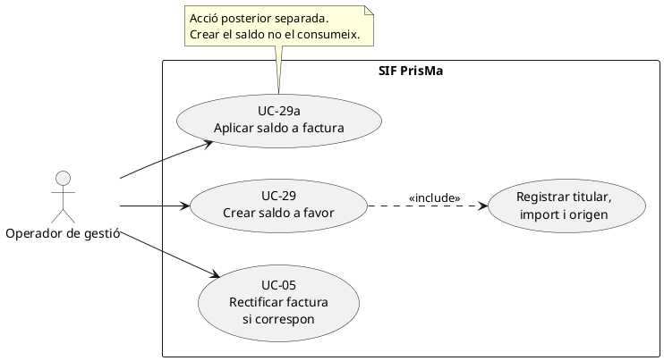
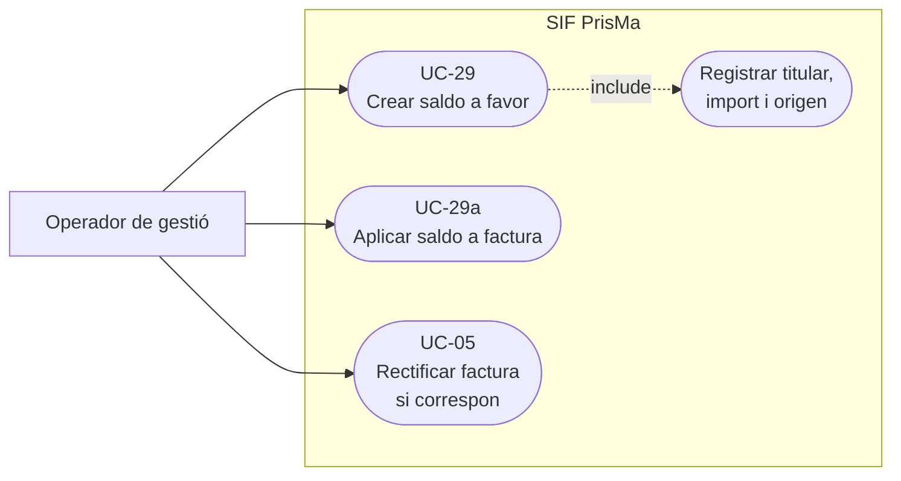
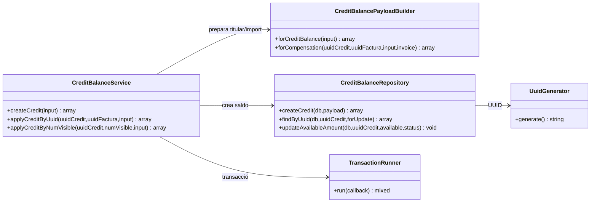
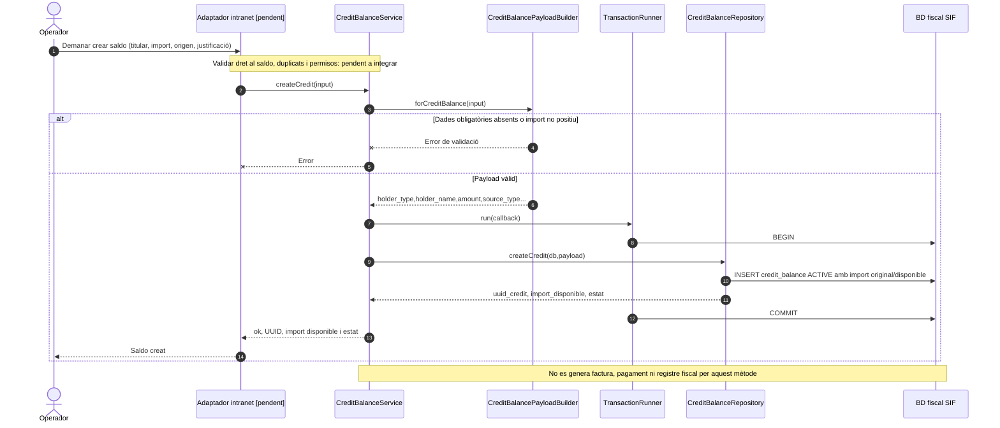
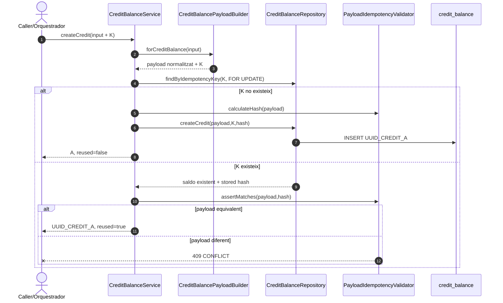
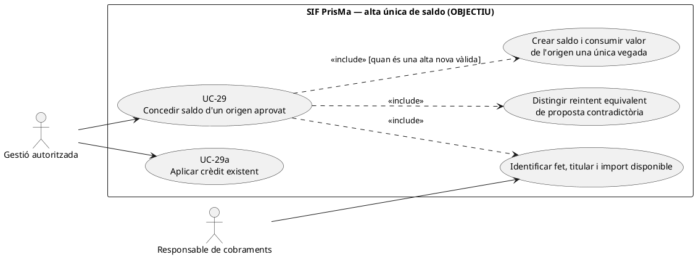

# UC-29 · Crear un saldo a favor — fitxa i UML integrats

**Abast:** constituir un saldo reutilitzable a favor d'un titular; **no** equival a fer una transferència de devolució, aplicar el saldo a una factura ni rectificar fiscalment l'operació d'origen. Relacions: UC-06 (decisió econòmica), UC-29a (ús posterior), UC-05 (rectificació si correspon), UC-27/72 (baixa), UC-26/71 (canvi de curs).

**Estat tècnic reconciliat 2026-10-03:** `CreditBalanceService::createCredit()`, `CreditBalancePayloadBuilder::forCreditBalance()` i `CreditBalanceRepository` existeixen. En la branca d'auditoria UC-006 s'ha afegit idempotència tècnica **optativa** per clau de caller + hash canònic, amb reús del mateix `UUID_CREDIT` i conflicte si el payload canvia. La justificació/consum del dret d'origen, els permisos i la derivació obligatòria de la clau de negoci continuen pendents.

## 1. Fitxa de cas d'ús

| Camp | Especificació |
| --- | --- |
| Actor principal | Operador de gestió autoritzat, a través de canal encara pendent d'acreditar. |
| Disparador | Una decisió econòmica documentada atribueix un import a reutilitzar en el futur. |
| Entrades obligatòries segons el constructor | `holder_type`/`tipus_titular`; `holder_name`/àlies; `amount`/`import` numèric i estrictament positiu; `source_type`/`origen`. |
| Entrades opcionals | `idempotency_key`, `holder_id`, `source_id`, `holder_nif_cif`, `uuid_factura_origen`, `uuid_factura_rectificativa`, `review_after`. |
| Postcondició del nucli | Sense clau: crea un `UUID_CREDIT` nou. Amb clau: crea una vegada o reutilitza el mateix `UUID_CREDIT` si el payload és equivalent; mateixa clau amb payload diferent → conflicte. `IMPORT_ORIGINAL = IMPORT_DISPONIBLE = amount` a l'alta i `ESTAT = ACTIVE`. |
| Moviments no generats | El camí `createCredit()` **no** crea `payment_transaction`, `payment_allocation`, `factura`, `factura_registres` o una nova remissió AEAT. |

### 1.1. Flux principal real

1. Operador determina el titular correcte, l'import i l'origen justificat del dret de saldo; aquestes comprovacions de negoci **no estan implementades al builder**.
2. `CreditBalanceService::createCredit(input)` prepara el payload amb `CreditBalancePayloadBuilder`; si falta un camp obligatori o l'import no és positiu, rebutja la petició.
3. `TransactionRunner` inicia la transacció; `CreditBalanceRepository::createCredit()` genera UUID i insereix el saldo actiu.
4. La transacció es confirma i el servei retorna `ok`, `uuid_credit`, `import_disponible` i `estat`.
5. Qualsevol aplicació posterior requereix un nou cas, UC-29a, amb identificació explícita de la factura receptora i comprovació de l'import pendent.

### 1.2. Alternatives, dades i riscos

| Situació | Comportament / estat de verificació |
| --- | --- |
| C1. Titular alumne | El test documenta `holder_type=student`, normalitzat a `STUDENT`, amb identificador i NIF; **no** afirma que aquest sigui l'únic tipus de titular admès. |
| C2. Origen baixa o canvi de curs | `source_type` i `source_id` permeten conservar l'origen declarat. El codi aquí **no comprova** que la baixa o el canvi s'hagin executat ni que l'import coincideixi amb el seu resultat econòmic. |
| C3. Saldo associat a factura o rectificativa | Els UUID es poden aportar i conservar; l'existència o la coherència amb la decisió fiscal requereixen contrast específic. |
| E1. Import zero, negatiu o no numèric | Error de validació. |
| E2. Titular, nom o tipus d'origen absent | Error de validació. |
| **P1. Duplicats** | **Parcialment resolt en aquesta branca:** si el caller aporta `idempotency_key`, el servei guarda hash canònic, reutilitza el mateix UUID en reintent equivalent i rebutja payload contradictori. Continua pendent que UC-006 derivi/exigeixi una clau per dret econòmic i consumeixi el mateix origen una sola vegada. Sense clau, es conserva el comportament compatible de nova alta. |
| **P2. Titular i autorització** | No s'ha acreditat que el titular declarat sigui qui legalment/econòmicament té dret al saldo, especialment si pagava una empresa o responsable. |
| **P3. Caducitat o revisió** | `review_after` s'emmagatzema, però aquest mètode no aplica automàticament cap expiració o validació quan arriba la data. |
| **P4. Auditoria** | El camí analitzat no registra explícitament l'esdeveniment funcional transversal descrit en el disseny d'operació del SIF. |

**Prova existent al repositori, no executada ara:** `CreditBalanceServiceTest::testCreatesCreditBalanceWithoutFiscalOrPaymentSideEffects`.

### 1.3. Revisió: cal rastrejar de quina inscripció surt el saldo — PENDENT

Si el saldo prové d'import **cobrat i atribuït** a una inscripció, la creació de `credit_balance` ha de correlacionar-se amb una fila `INSCRIPCIÓ → CREDIT` del mateix import, vinculada al cobrament original i a l'event de canvi o baixa. No es pot crear saldo per una quantitat superior a la que queda a l'origen després d'altres traspassos i devolucions. Si el crèdit es concedeix **sense cobrament previ** com a avantatge comercial, no s'ha d'inventar una entrada de caixa: necessita una classificació econòmica diferenciada. `CreditBalanceService::createCredit()` crea el saldo actual, però no aquest assentament per inscripció ni la comprovació de duplicats per origen.

[Revisió transversal de fons](00-revisio-moviments-inscripcions.md).

### 1.4. Titular, saldo antic i alta única — contrast amb el xat original

**C-ORIGEN — diners cobrats o bonificació:** si el client prefereix conservar diners ingressats després d'una baixa, canvi de curs o excés de cobrament, el saldo neix de la seva decisió documentada sobre un import encara disponible. Aquest crèdit no és una segona entrada de caixa ni una reducció silenciosa d'A_PAGAR. Si la gestió concedeix un avantatge comercial **sense ingrés previ**, no atribuir-lo com si fos un crèdit procedent de diners del client: cal classificar la bonificació i els seus efectes per separat.

**C-TITULAR — alumne, empresa o responsable:** el titular de `credit_balance` ha de coincidir amb qui tingui el dret econòmic justificat; quan paga una empresa, un responsable o USOC, no es pressuposa que tot el saldo pertoqui a l'alumne inscrit. Conservar origen (UUID de cobrament, factura i inscripció afectada), import cobrat disponible, event de baixa/canvi, persona que aprova, motiu i eventual rectificativa. Els camps opcionals del builder no demostren per si sols la validació d'aquestes relacions.

**C-ANTIC — revisió manual, NO caducitat automàtica:** l'usuària indica que el saldo d'una baixa no caduca automàticament. Secretaria revisa manualment els saldos molt antics, **per exemple superiors a cinc anys**, abans d'utilitzar-los o decidir-ne el tractament. El llindar dels cinc anys és una pauta de revisió, **no** una data de venciment que autoritzi `EXPIRED`, eliminació del registre o pèrdua de drets per si sola. `review_after` es pot desar al builder actual, però no acredita una alerta o revisió automàtica implementada.

**C-ÚNIC — doble clic/repetició:** la branca UC-006 ja permet que el caller enviï `idempotency_key`; un reintent equivalent reutilitza el `UUID_CREDIT` i una variant contradictòria retorna conflicte. Això resol el duplicat **tècnic** quan la clau és estable. Encara falta que la pantalla/orquestrador construeixi la clau a partir d'un event/dret econòmic únic i bloquegi el valor d'origen, de manera que dues claus diferents no puguin convertir el mateix tram en dos saldos. Després de crear crèdit, la seva aplicació és UC-29a, no un segon `CHARGE` real.

### 1.5. Proves d'acceptació addicionals (no executades)

| ID | Escenari | Resultat exigible |
| --- | --- | --- |
| SA-01 | Baixa amb 80 € cobrats i decisió de saldo de 80 € | Un crèdit del titular justificat; fons d'origen disponibles reduïts sense segon CHARGE. |
| SA-02 | Baixa pagada per una empresa | Saldo a titular econòmic justificat, no assignat automàticament a alumne. |
| SA-03 | Crear dues vegades saldo per mateixa baixa/import | Un únic UUID_CREDIT o bloqueig de conflicte; cap duplicació de valor. |
| SA-04 | Retorn monetari parcial i saldo de la resta | Suma de sortides acotada pels diners efectivament cobrats de l'origen. |
| SA-05 | Saldo de més de cinc anys | Revisió manual i historial; no caducitat ni supressió automàtiques. |
| SA-06 | Bonificació comercial sense ingrés | Classificació diferenciada; cap entrada de caixa fictícia. |
## 2. Diagrama UML de casos d'ús

```plantuml
@startuml
left to right direction
actor "Operador de gestió" as O
rectangle "SIF PrisMa" {
 usecase "UC-29\nCrear saldo a favor" as Create
 usecase "Registrar titular,\nimport i origen" as Init
 usecase "UC-29a\nAplicar saldo a factura" as Apply
 usecase "UC-05\nRectificar factura\nsi correspon" as Rect
}
O --> Create
Create ..> Init : <<include>>
O --> Apply
O --> Rect
note bottom of Apply
  Acció posterior separada.
  Crear el saldo no el consumeix.
end note
@enduml
```

### Vista de casos d’ús per a GitHub (Mermaid)

```mermaid
flowchart LR
  actor_0["Operador de gestió"]
  subgraph SIF_BOX["SIF PrisMa"]
    uc_0(["UC-29<br/>Crear saldo a favor"])
    uc_1(["Registrar titular,<br/>import i origen"])
    uc_2(["UC-29a<br/>Aplicar saldo a factura"])
    uc_3(["UC-05<br/>Rectificar factura<br/>si correspon"])
  end
  actor_0 --> uc_0
  uc_0 -.->|include| uc_1
  actor_0 --> uc_2
  actor_0 --> uc_3
```

## 3. Subdiagrama de classes — creació i cas vinculat

```mermaid
classDiagram
direction LR
class CreditBalanceService {
 +createCredit(input) array
 +applyCreditByUuid(uuidCredit,uuidFactura,input) array
 +applyCreditByNumVisible(uuidCredit,numVisible,input) array
}
class CreditBalancePayloadBuilder {
 +forCreditBalance(input) array
 +forCompensation(uuidCredit,uuidFactura,input,invoice) array
}
class CreditBalanceRepository {
 +createCredit(db,payload) array
 +findByUuid(db,uuidCredit,forUpdate) array
 +updateAvailableAmount(db,uuidCredit,available,status) void
}
class TransactionRunner {
 +run(callback) mixed
}
class UuidGenerator {
 +generate() string
}
CreditBalanceService --> CreditBalancePayloadBuilder : prepara titular/import
CreditBalanceService --> TransactionRunner : transacció
CreditBalanceService --> CreditBalanceRepository : crea saldo
CreditBalanceRepository --> UuidGenerator : UUID
```

La creació de saldo no invoca `PaymentService` ni `InvoiceService`; les relacions opcionals a UUID de factures són dades, no una nova emissió.

## 4. Diagrama de seqüència — crear saldo

```mermaid
sequenceDiagram
autonumber
actor O as Operador
participant UI as Adaptador intranet [pendent]
participant S as CreditBalanceService
participant B as CreditBalancePayloadBuilder
participant T as TransactionRunner
participant R as CreditBalanceRepository
participant DB as BD fiscal SIF
O->>UI: Demanar crear saldo (titular, import, origen, justificació)
Note over UI,S: Validar dret al saldo, duplicats i permisos: pendent a integrar
UI->>S: createCredit(input)
S->>B: forCreditBalance(input)
alt Dades obligatòries absents o import no positiu
 B--xS: Error de validació
 S--xUI: Error
else Payload vàlid
 B-->>S: holder_type,holder_name,amount,source_type...
 S->>T: run(callback)
 T->>DB: BEGIN
 S->>R: createCredit(db,payload)
 R->>DB: INSERT credit_balance ACTIVE amb import original/disponible
 R-->>S: uuid_credit, import_disponible, estat
 T->>DB: COMMIT
 S-->>UI: ok, UUID, import disponible i estat
 UI-->>O: Saldo creat
end
Note over S,DB: No es genera factura, pagament ni registre fiscal per aquest mètode
```

### 4.1. Acció específica: reintentar l'alta amb idempotència tècnica

**Contrast executable de la branca UC-006:** quan el caller aporta `idempotency_key`, `CreditBalanceService::createCredit()` cerca la clau amb lock, valida el hash canònic i evita una segona alta equivalent. Si la mateixa clau arriba amb import, titular, origen o altres dades diferents, retorna conflicte. Quan no s'aporta clau, es conserva el comportament anterior i cada invocació és una alta independent.

```mermaid
sequenceDiagram
autonumber
actor O as Caller/Orquestrador
participant S as CreditBalanceService
participant B as CreditBalancePayloadBuilder
participant R as CreditBalanceRepository
participant H as PayloadIdempotencyValidator
participant DB as credit_balance
O->>S: createCredit(input + K)
S->>B: forCreditBalance(input)
B-->>S: payload normalitzat + K
S->>R: findByIdempotencyKey(K, FOR UPDATE)
alt K no existeix
  S->>H: calculateHash(payload)
  S->>R: createCredit(payload,K,hash)
  R->>DB: INSERT UUID_CREDIT_A
  S-->>O: A, reused=false
else K existeix
  R-->>S: saldo existent + stored hash
  S->>H: assertMatches(payload,hash)
  alt payload equivalent
    S-->>O: UUID_CREDIT_A, reused=true
  else payload diferent
    H--xO: 409 CONFLICT
  end
end
```

**Límit:** K és una dada de caller. Encara no hi ha una regla genèrica que la derivi d'un dret de baixa/canvi ni un consum atòmic de l'origen al ledger d'inscripcions.

### 4.2. Acció objectiu: confirmar el dret econòmic i recuperar l'alta idempotent

**Precondicions:** event/decisió econòmica identificable; comprovació servidor de titular/pagador legítim, import encara disponible de l'origen, rectificació fiscal quan pertoqui i absència de retorn o saldo previ contradictoris. **Actor que inicia:** gestió autoritzada; no donar accés a crear saldos per conèixer només un ID de factura. **Postcondició:** saldo creat una vegada i correlacionat a l'event únic de procedència; un reintent exacte recupera el mateix UUID; una petició amb el mateix ID d'event i import o titular diferent genera conflicte, no modifica el saldo anterior.

```plantuml
@startuml
left to right direction
actor "Gestió autoritzada" as G
actor "Responsable de cobraments" as C
rectangle "SIF PrisMa — alta única de saldo (OBJECTIU)" {
 usecase "UC-29\nConcedir saldo d'un origen aprovat" as Create
 usecase "Identificar fet, titular i import disponible" as Origin
 usecase "Distingir reintent equivalent\nde proposta contradictòria" as Dedup
 usecase "Crear saldo i consumir valor\nde l'origen una única vegada" as Commit
 usecase "UC-29a\nAplicar crèdit existent" as Apply
}
G --> Create
C --> Origin
Create ..> Origin : <<include>>
Create ..> Dedup : <<include>>
Create ..> Commit : <<include>> [quan és una alta nova vàlida]
G --> Apply
@enduml
```

```mermaid
sequenceDiagram
autonumber
actor G as Gestió
participant A as Adaptador autoritzat [PENDENT]
participant D as Guard d'origen i titular [DISSENY]
participant C as CreditBalanceService [idempotència tècnica implementada]
participant R as CreditBalanceRepository [K/hash implementats]
participant DB as BD SIF i registre d'origen [DISSENY]
G->>A: Confirmar saldo amb ID event X, titular T i import 80
A->>D: Verificar permís, fons reals disponibles i estat fiscal
alt Origen no acreditat o titular no legitimat
 D-->>A: DENIED, cap saldo nou
else Origen/acord aprovats
 D->>DB: Bloquejar origen i cercar dret creat per ID event X
 alt Mateix event i payload equivalent ja confirmat
  DB-->>D: UUID_CREDIT_A existent
  D-->>A: Reutilitzar saldo A sense una altra alta
 else Event X amb import/titular contradictoris
  DB-->>D: CONFLICT
  D-->>A: Incidència, no crear ni mutar saldo
 else Event X nou i import disponible
  D->>C: createCredit(input normalitzat + K estable)
  C->>R: Alta/reús idempotent de credit_balance [IMPLEMENTAT]
  R->>DB: INSERT/reuse credit_balance; consum del dret origen [ENCARA OBJECTIU]
  R-->>C: UUID_CREDIT_A
  C-->>D: UUID i estat ACTIVE
  D-->>A: Alta confirmada i correlacionada
 end
end
A-->>G: UUID existent, nou o incidència explícita
Note over D,DB: K/hash ja existeixen; guard/event/consum atòmic d'origen continuen pendents. En crèdits comercials sense caixa cal una classificació diferenciada.
```

| Prova pendent | Entrada | Resultat exigible |
| --- | --- | --- |
| SA-07 | Mateixa `idempotency_key` i payload després de COMMIT/resposta perduda | **Test afegit:** mateix UUID_CREDIT; CI pendent. |
| SA-08 | Mateixa `idempotency_key` amb nou import/titular | **Test de payload diferent afegit (import):** 409; ampliar a titular i conservar CI/evidència. |
| SA-09 | Dos events legítims diferents de 80 al mateix titular | Dos saldos amb origen separat, sense fusionar-los pel sol import. |
| SA-10 | Una mateixa entrada externa es resol simultàniament com a retorn i saldo | Bloqueig/conciliació de valor d'origen; no retorn i crèdit pel mateix tram de fons. |
| SA-11 | Crèdit comercial sense cobrament real | Tipus d'origen específic, sense CHARGE bancari ni atribució fictícia de diners. |
## 5. Traçabilitat

[Fitxa original UC-29](../06-fitxes-funcionals/uc-029.md) · [Cas general UC-06](../04-estat-final/33-casos-us-sif.md) · [CreditBalanceService](../../sif/src/Service/CreditBalanceService.php) · [CreditBalancePayloadBuilder](../../sif/src/Service/CreditBalancePayloadBuilder.php) · [CreditBalanceRepository](../../sif/src/Repository/CreditBalanceRepository.php) · [CreditBalanceServiceTest](../../sif/tests/Integration/CreditBalanceServiceTest.php).

**Pendent de validar:** origen econòmic acreditat i consumit una sola vegada, titular legítim, derivació/obligatorietat de la clau de negoci, permisos, auditoria, flux de pantalla i desplegament. La idempotència tècnica opcional de `createCredit()` queda implementada a la branca UC-006, pendent de CI.
