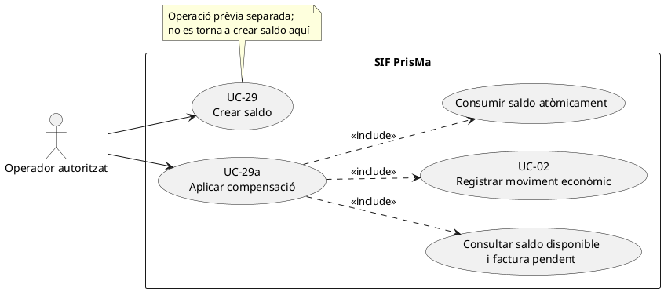
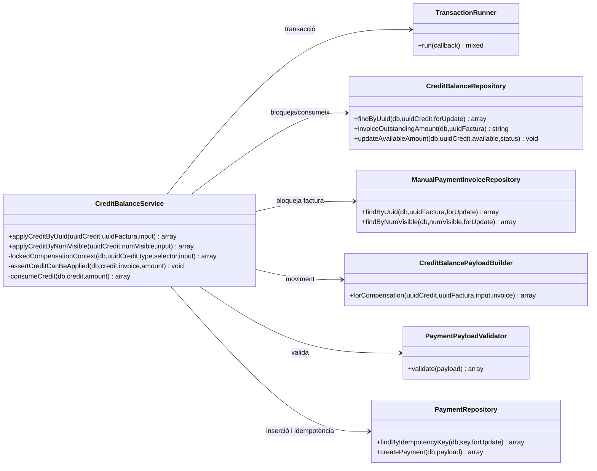
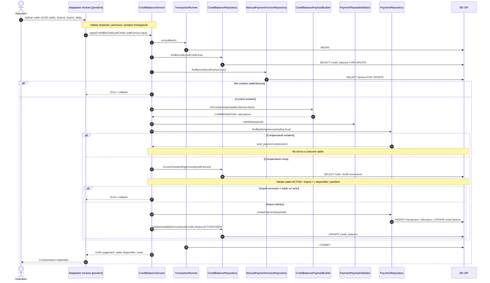

# UC-29a · Aplicar saldo com a compensació — fitxa i UML integrats

**Objectiu:** consumir un saldo existent per cobrir, totalment o parcialment, l'import pendent d'una factura SIF, amb un moviment `COMPENSATION`. No es crea una factura nova ni es fa cap transferència bancària. Relacions: UC-29 (saldo previ), UC-02 (comptabilització del moviment), UC-06 (decisió econòmica), UC-05 (rectificació si el servei facturat canvia).

**Estat:** servei, repositoris i proves disponibles; la comprovació de la titularitat creuada entre el saldo i la factura i la pantalla definitiva continuen pendents de contrast.

## 1. Fitxa de cas d'ús

| Camp | Especificació |
| --- | --- |
| Actor principal | Operador autoritzat. |
| Precondicions | Saldo `credit_balance` existent i `ACTIVE`, factura identificada per UUID o número visible, import pendent positiu, import de compensació positiu. |
| Entrades | `uuid_credit`, factura, `amount`/`import`, `movement_date`/`data_moviment`/`data`; `notes` i `allocation_type` opcionals. |
| Comprovacions existents | Bloqueig del saldo i de la factura; relectura del moviment per clau idempotent; saldo actiu; import no superior al saldo disponible **ni a l'import pendent de factura**. |
| Efecte econòmic | `payment_transaction` amb `TIPUS_MOVIMENT=COMPENSATION`, mètode `COMPENSACIO`, referència al saldo, una assignació `CREDIT_COMPENSATION`, consum de `credit_balance.IMPORT_DISPONIBLE` i recàlcul de l'estat de cobrament de factura. |
| Resultat | `uuid_payment`, `uuid_credit`, `uuid_factura`, `num_visible`, `import_disponible`, `credit_estat` i `idempotency_reused`. |

### 1.1. Flux principal implementat

1. `CreditBalanceService::applyCreditByUuid()` o `applyCreditByNumVisible()` obre una transacció de `TransactionRunner`.
2. `lockedCompensationContext()` bloqueja el saldo i la factura (`FOR UPDATE`) i construeix el moviment amb `CreditBalancePayloadBuilder::forCompensation()`.
3. El constructor crea la clau `COMPENSACIO|UUID_CREDIT:<uuid>|FACT:<número>|IMPORT:<quantitat>`, força `movement_type=COMPENSATION`, `method=COMPENSACIO`, `source_channel=INTRANET` i `provider_ref=uuid_credit`; `PaymentPayloadValidator` valida el payload.
4. Si existeix ja un `payment_transaction` amb la mateixa clau, es retorna el resultat reutilitzat **sense consumir de nou el saldo**.
5. Si és un moviment nou, `assertCreditCanBeApplied()` verifica `ESTAT=ACTIVE`, import disponible i pendent a la factura. Aquest últim es calcula com a màxim entre zero i total menys càrrecs/compensacions més devolucions.
6. `PaymentRepository::createPayment()` inscriu el moviment i l'assignació i actualitza `factura.ESTAT_COBRAMENT`.
7. `consumeCredit()` descompta l'import del saldo. Si queda `0.00`, marca `USED`; si resta import, `ACTIVE`. Es confirma **la mateixa transacció** per al moviment i el consum.

### 1.2. Alternatives, errors i límits concrets

| Cas | Comportament |
| --- | --- |
| S1. Aplicació parcial | Es conserva el saldo restant i l'estat `ACTIVE`; la factura pot passar a `PARTIAL`. |
| S2. Consum de tot el saldo | `IMPORT_DISPONIBLE=0.00` i estat `USED`; no implica que tota la factura estigui pagada si l'import pendent era superior. |
| S3. Cobertura total de factura | `PaymentStatusCalculator` recalcula `PAID` quan el total net cobreix exactament el total. |
| S4. Reintent mateix saldo/factura/import | La mateixa clau de compensació reutilitza el pagament; no torna a reduir el saldo. |
| E1. Saldo/factura desconegut o saldo no actiu | Rebuig. |
| E2. Import superior al saldo disponible o al pendent de factura | Rebuig abans de crear moviment. |
| E3. Error SQL duplicat concurrent | El servei obre una nova transacció i recupera el moviment per clau; no s'ha de consumir el saldo dues vegades. |
| **P1. Titularitat** | No es veu en `assertCreditCanBeApplied()` cap comprovació d'identitat entre `HOLDER_ID`/`HOLDER_NIF_CIF` i el receptor/pagador de la factura. És una validació funcional i de permisos pendent. |
| **P2. Idempotència de quantitats coincidents** | La clau es basa en saldo, factura i import; **dues aplicacions legítimes de la mateixa quantitat a la mateixa factura tenen la mateixa clau**. Cal decidir si es permeten i definir una referència d'operació diferenciada abans d'habilitar-les. |
| P3. Tipus d'assignació personalitzable | El builder permet `allocation_type` opcional; cal acotar al contracte funcional i no confiar en l'entrada del client sense autorització. |
| P4. Origen fiscal del saldo | El servei no emet una rectificativa ni verifica automàticament que l'origen del crèdit estigui fiscalment resolt; correspon al procés que el va crear. |

**Proves existents, no executades aquí:** `CreditBalanceServiceTest::testAppliesCreditAsCompensationAndConsumesAvailableBalanceOnce`, `testAppliesFullCreditByVisibleInvoiceNumberAndMarksCreditUsed`, `testRejectsApplyingMoreThanAvailableCredit`, `testRejectsApplyingMoreThanInvoiceOutstandingAmount`.

## 2. Diagrama UML de casos d'ús

## 3. Diagrama UML de classes — compensació

## 4. Diagrama de seqüència — aplicació del saldo

## 5. Traçabilitat

[Fitxa original UC-29a](../06-fitxes-funcionals/uc-029a.md) · [UC-29 Crear saldo](uc-029-crear-saldo.md) · [UC-02 Pagament](uc-002-registrar-cobrament-factura.md) · [CreditBalanceService](../../sif/src/Service/CreditBalanceService.php) · [CreditBalancePayloadBuilder](../../sif/src/Service/CreditBalancePayloadBuilder.php) · [CreditBalanceRepository](../../sif/src/Repository/CreditBalanceRepository.php) · [PaymentRepository](../../sif/src/Repository/PaymentRepository.php) · [CreditBalanceServiceTest](../../sif/tests/Integration/CreditBalanceServiceTest.php).

**No acredita:** titularitat validada, control d'operacions legítimes repetides, validació fiscal de l'origen, permisos i prova final de la pantalla.
