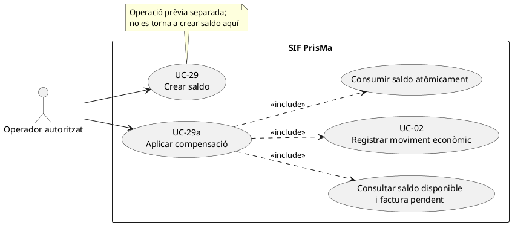
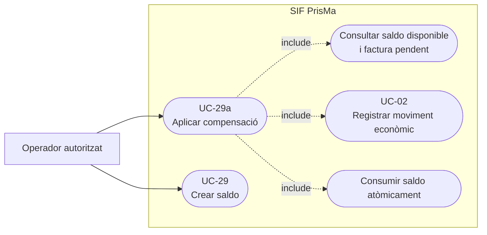
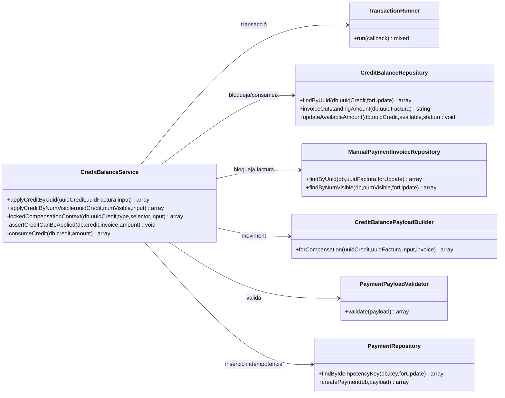
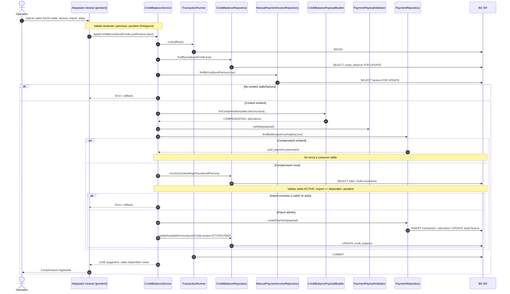
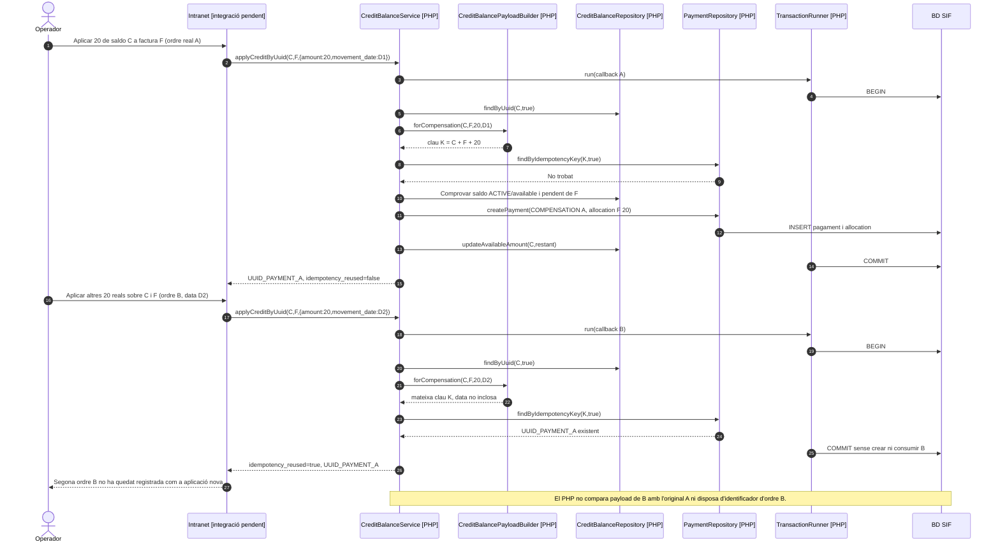
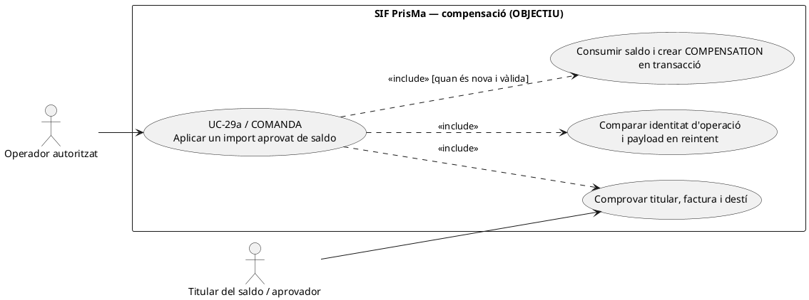
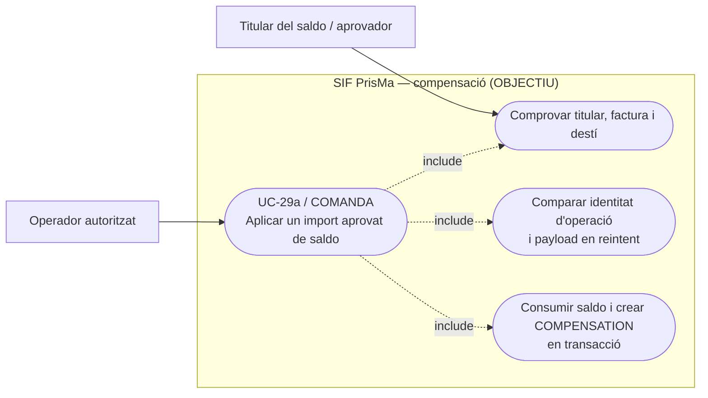
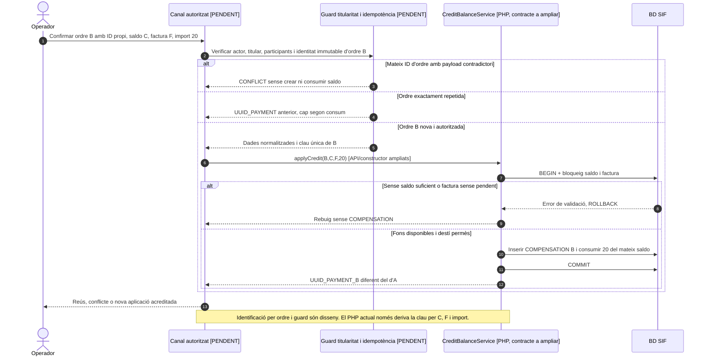

# UC-29a · Aplicar saldo com a compensació — fitxa i UML integrats

**Objectiu:** consumir un saldo existent per cobrir, totalment o parcialment, l'import pendent d'una factura SIF, amb un moviment `COMPENSATION`. No es crea una factura nova ni es fa cap transferència bancària. Relacions: UC-29 (saldo previ), UC-02 (comptabilització del moviment), UC-06 (decisió econòmica), UC-05 (rectificació si el servei facturat canvia).

**Estat:** servei, repositoris i proves disponibles; la comprovació de la titularitat creuada entre el saldo i la factura i la pantalla definitiva continuen pendents de contrast.

## 1. Fitxa de cas d'ús

| Camp | Especificació |
| --- | --- |
| Actor principal | Operador autoritzat. |
| Precondicions | Saldo `credit_balance` existent i `ACTIVE`, factura identificada per UUID o número visible, import pendent positiu, import de compensació positiu. |
| Entrades | `uuid_credit`, factura, `amount`/`import`, `movement_date`/`data_moviment`/`data`; `notes` i `allocation_type` opcionals. |
| Comprovacions existents | Bloqueig del saldo i de la factura; relectura del moviment per clau idempotent; saldo actiu; import no superior al saldo disponible **ni a l'import pendent de factura**. |
| Efecte econòmic | `payment_transaction` amb `TIPUS_MOVIMENT=COMPENSATION`, mètode `COMPENSACIO`, referència al saldo, una assignació `CREDIT_COMPENSATION`, consum de `credit_balance.IMPORT_DISPONIBLE` i recàlcul de l'estat de cobrament de factura. |
| Resultat | `uuid_payment`, `uuid_credit`, `uuid_factura`, `num_visible`, `import_disponible`, `credit_estat` i `idempotency_reused`. |

### 1.1. Flux principal implementat

1. `CreditBalanceService::applyCreditByUuid()` o `applyCreditByNumVisible()` obre una transacció de `TransactionRunner`.
2. `lockedCompensationContext()` bloqueja el saldo i la factura (`FOR UPDATE`) i construeix el moviment amb `CreditBalancePayloadBuilder::forCompensation()`.
3. El constructor crea la clau `COMPENSACIO|UUID_CREDIT:<uuid>|FACT:<número>|IMPORT:<quantitat>`, força `movement_type=COMPENSATION`, `method=COMPENSACIO`, `source_channel=INTRANET` i `provider_ref=uuid_credit`; `PaymentPayloadValidator` valida el payload.
4. Si existeix ja un `payment_transaction` amb la mateixa clau, es retorna el resultat reutilitzat **sense consumir de nou el saldo**.
5. Si és un moviment nou, `assertCreditCanBeApplied()` verifica `ESTAT=ACTIVE`, import disponible i pendent a la factura. Aquest últim es calcula com a màxim entre zero i total menys càrrecs/compensacions més devolucions.
6. `PaymentRepository::createPayment()` inscriu el moviment i l'assignació i actualitza `factura.ESTAT_COBRAMENT`.
7. `consumeCredit()` descompta l'import del saldo. Si queda `0.00`, marca `USED`; si resta import, `ACTIVE`. Es confirma **la mateixa transacció** per al moviment i el consum.

### 1.2. Alternatives, errors i límits concrets

| Cas | Comportament |
| --- | --- |
| S1. Aplicació parcial | Es conserva el saldo restant i l'estat `ACTIVE`; la factura pot passar a `PARTIAL`. |
| S2. Consum de tot el saldo | `IMPORT_DISPONIBLE=0.00` i estat `USED`; no implica que tota la factura estigui pagada si l'import pendent era superior. |
| S3. Cobertura total de factura | `PaymentStatusCalculator` recalcula `PAID` quan el total net cobreix exactament el total. |
| S4. Reintent mateix saldo/factura/import | La mateixa clau de compensació reutilitza el pagament; no torna a reduir el saldo. |
| E1. Saldo/factura desconegut o saldo no actiu | Rebuig. |
| E2. Import superior al saldo disponible o al pendent de factura | Rebuig abans de crear moviment. |
| E3. Error SQL duplicat concurrent | El servei obre una nova transacció i recupera el moviment per clau; no s'ha de consumir el saldo dues vegades. |
| **P1. Titularitat** | No es veu en `assertCreditCanBeApplied()` cap comprovació d'identitat entre `HOLDER_ID`/`HOLDER_NIF_CIF` i el receptor/pagador de la factura. És una validació funcional i de permisos pendent. |
| **P2. Idempotència de quantitats coincidents** | La clau es basa en saldo, factura i import; **dues aplicacions legítimes de la mateixa quantitat a la mateixa factura tenen la mateixa clau**. Cal decidir si es permeten i definir una referència d'operació diferenciada abans d'habilitar-les. |
| P3. Tipus d'assignació personalitzable | El builder permet `allocation_type` opcional; cal acotar al contracte funcional i no confiar en l'entrada del client sense autorització. |
| P4. Origen fiscal del saldo | El servei no emet una rectificativa ni verifica automàticament que l'origen del crèdit estigui fiscalment resolt; correspon al procés que el va crear. |

**Proves existents, no executades aquí:** `CreditBalanceServiceTest::testAppliesCreditAsCompensationAndConsumesAvailableBalanceOnce`, `testAppliesFullCreditByVisibleInvoiceNumberAndMarksCreditUsed`, `testRejectsApplyingMoreThanAvailableCredit`, `testRejectsApplyingMoreThanInvoiceOutstandingAmount`.

### 1.3. Revisió: el consum del crèdit ha de tenir destí d'inscripció — PENDENT

`CreditBalanceService` consumeix saldo i registra `COMPENSATION` **a la factura** en una mateixa transacció, però no conserva una fila quantitativa per cadascuna de les inscripcions beneficiàries quan una factura cobreix diverses persones. UC-29a ha de registrar `CREDIT → INSCRIPCIÓ` per cada import aplicat, amb `UUID_CREDIT`, `UUID_PAYMENT` i l'assignació a factura relacionats. La suma de les atribucions no pot superar el saldo consumit; cap consum de saldo no és un ingrés bancari nou. Cal validar titularitat del crèdit i permís d'aplicar-lo a cada participant.

[Model i reconciliació proposats](00-revisio-moviments-inscripcions.md).

### 1.4. Autorització, dues aplicacions legítimes i destinació real — contrast amb el xat original

**A-TITULAR — pagar amb saldo no és fer un descompte:** el cas d'ús consumeix fons/valor ja reconeguts en un `credit_balance` i registra un moviment `COMPENSATION`; no redueix automàticament el preu fiscal de la factura ni és un `CHARGE` bancari nou. Abans d'aplicar-lo a una factura d'empresa, grup, USOC o d'una altra persona, validar titular econòmic, consentiment i autorització de l'ús del saldo per a **cada inscripció beneficiària**; el servei actual comprova saldo i pendent de factura, però no acredita aquesta comprovació entre titulars.

**A-DOBLE — dos usos de mateix import sobre la mateixa factura:** la clau actual `COMPENSACIO|UUID_CREDIT:<uuid>|FACT:<num>|IMPORT:<quantitat>` tracta dues peticions d'import igual com a una sola operació. Això és correcte per a un reintent equivalent, però pot confondre dos usos legítims si el titular decideix aplicar 20 € avui i 20 € un altre dia a la mateixa factura. El contracte objectiu requereix una referència única/versionada **d'operació confirmada**, comparació del payload original i revalidació del saldo disponible, sense perdre la idempotència d'un reintent ni permetre dos consums simultanis dels mateixos diners. La nova referència d'operació no consta acreditada en el builder existent.

**A-CANVI — destí d'una compensació després de baixa o canvi:** si es crea un saldo per baixa i després s'aplica a una altra inscripció, conservar la traça `INSCRIPCIÓ_ORIGEN → CREDIT → INSCRIPCIÓ_DESTÍ` i els UUID_CREDIT/UUID_PAYMENT. Si el destinatari canvia de curs o es reactiva la baixa, no restaurar saldo consumit amb un simple UPDATE: cal classificar nous traspassos i efectes fiscals. Una compensació a factura de grup amb N participants requereix repartiment real, no atribució total a cadascú.

**A-ANTIC — revisió de saldo antic:** no es caduca automàticament un saldo perquè han passat cinc anys. Quan s'hagi determinat revisió manual `review_after`, l'operador ha de revisar titular, origen, disponible i possibles moviments previs abans d'autoritzar l'ús; `CreditBalanceService` per si sol no acredita que la pantalla mostri aquesta revisió.

### 1.5. Proves d'acceptació addicionals (no executades)

| ID | Escenari | Resultat exigible |
| --- | --- | --- |
| CO-01 | Aplicar saldo de titular empresa a factura alumne sense autorització | Denegar o requerir decisió explícita, sense consum automàtic. |
| CO-02 | Aplicar 20 € i posteriorment uns altres 20 € legítims a mateixa factura | Dos moviments diferenciats si hi ha saldo/pendent, no fusió per clau coincident. |
| CO-03 | Reintent del primer moviment de 20 € | Retornar el mateix UUID_PAYMENT sense segon consum del crèdit. |
| CO-04 | Saldo de baixa aplicat a inscripció nova | Traça origen→credit→destí i un sol consum monetari. |
| CO-05 | Saldo amb revisió manual pendent després de cinc anys | Revisió de titular/origen abans d'ús; cap expiració automàtica. |
| CO-06 | Factura de grup amb diverses inscripcions | Repartiment quantitatiu i autorització per cada participant; no atribuir el mateix saldo sencer N vegades. |
## 2. Diagrama UML de casos d'ús

### Vista de casos d’ús per a GitHub (Mermaid)

## 3. Diagrama UML de classes — compensació

## 4. Diagrama de seqüència — aplicació del saldo

### 4.1. Acció específica: repetir una compensació equivalent vs aplicar una segona quota real de mateix import

**Contracte verificat:** `CreditBalancePayloadBuilder::forCompensation()` deriva la clau de `UUID_CREDIT`, número visible de factura i import. **No incorpora data de moviment, identificador independent de l'ordre ni `allocation_type`**. `CreditBalanceService::applyCredit()` consulta aquesta clau *abans* de `assertCreditCanBeApplied()` i, en trobar-la, retorna el `UUID_PAYMENT` existent sense consumir saldo. Això és correcte per a una petició idèntica repetida, però una **segona compensació legítima de mateix import al mateix document** queda fusionada amb la primera encara que hi hagi saldo i deute pendents. La sortida reutilitzada porta `IMPORT_DISPONIBLE` i `ESTAT` del **saldo actual**, no un snapshot del saldo després de l'aplicació històrica original.

### 4.2. Acció objectiu: confirmar aplicació nova i reusar només la mateixa ordre

El contracte pendent requereix un identificador estable d'operació **diferent del fet que dos imports siguin iguals**; el servei ha de verificar que la clau usada anteriorment representa el mateix titular, saldo, factura, import, destinació, regla, data i autorització. Cada aplicació nova ha de seguir bloquejant el saldo i la factura en transacció, com fa el servei actual. La validació de titularitat ha de ser anterior al consum i abastar receptor/pagador real i les inscripcions de destí quan la factura és de grup.

### Vista de casos d’ús per a GitHub (Mermaid)

| ID de prova pendent | Escenari | Resultat requerit |
| --- | --- | --- |
| CO-07 | Ordres A i B diferents a C/F de 20 cadascuna, amb saldo i deute suficients | Dos UUID_PAYMENT i consum total 40, sense fusionar-les per import. |
| CO-08 | Reintent d'ordre A amb mateix ID i import/factura/titular | Reús de UUID_PAYMENT_A, sense nou consum. |
| CO-09 | Mateix ID d'ordre A però canvi de factura o data/origen material | Conflicte explícit abans de cap moviment. |
| CO-10 | Segona ordre B després de consumir el saldo per una altra operació | Rebuig per saldo insuficient, no reutilització casual d'A. |
| CO-11 | Reús d'A després que una altra compensació hagi modificat el saldo | Retornar identificador d'A i **distingir saldo actual de saldo posterior històric d'A**. |
## 5. Traçabilitat

[Fitxa original UC-29a](../06-fitxes-funcionals/uc-029a.md) · [UC-29 Crear saldo](uc-029-crear-saldo.md) · [UC-02 Pagament](uc-002-registrar-cobrament-factura.md) · [CreditBalanceService](../../sif/src/Service/CreditBalanceService.php) · [CreditBalancePayloadBuilder](../../sif/src/Service/CreditBalancePayloadBuilder.php) · [CreditBalanceRepository](../../sif/src/Repository/CreditBalanceRepository.php) · [PaymentRepository](../../sif/src/Repository/PaymentRepository.php) · [CreditBalanceServiceTest](../../sif/tests/Integration/CreditBalanceServiceTest.php).

**No acredita:** titularitat validada, control d'operacions legítimes repetides, validació fiscal de l'origen, permisos i prova final de la pantalla.
