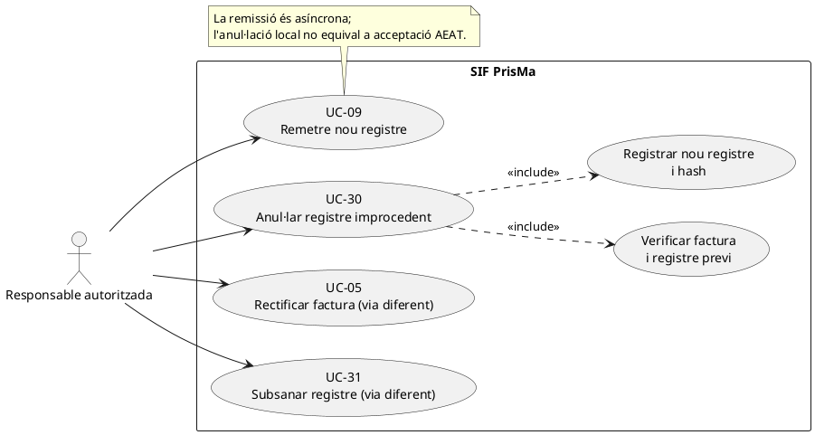
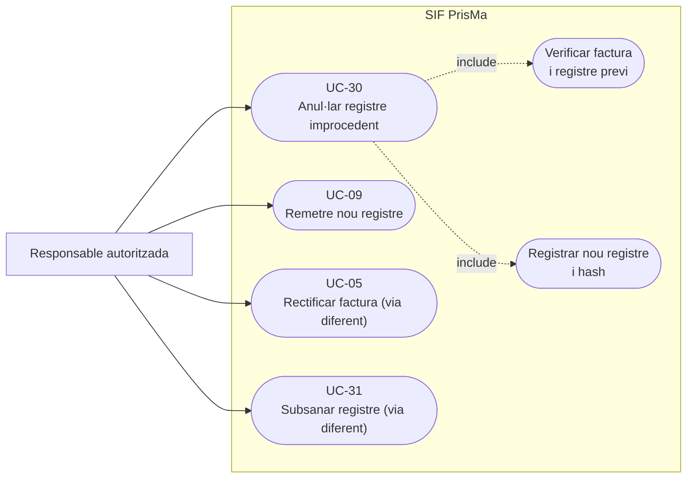
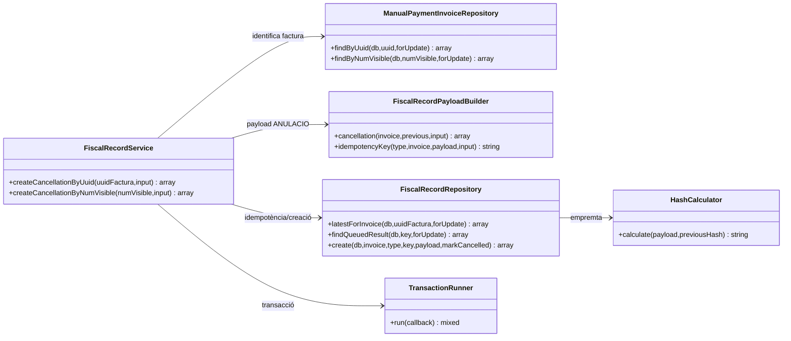
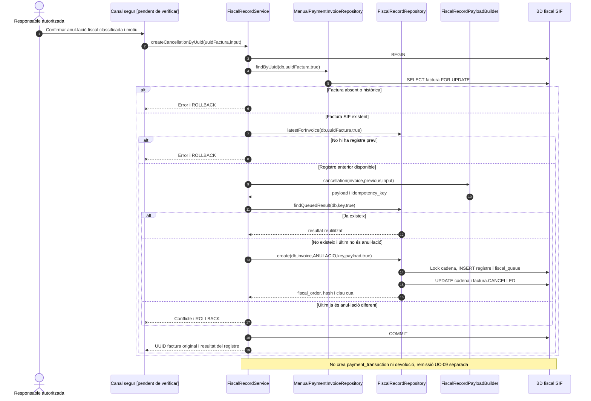

# UC-30 · Anul·lar un registre improcedent — fitxa i UML integrats

**Objectiu:** crear un **registre fiscal d'anul·lació** vinculat a una factura SIF quan s'ha classificat que el registre anterior és improcedent. **No és** donar de baixa una inscripció (UC-27/72), tornar diners (UC-28) ni emetre una factura rectificativa (UC-05). La decisió de classificació fiscal està **pendent de verificar al canal**.

**Estat de codi:** `FiscalRecordService::createCancellationByUuid()` i `createCancellationByNumVisible()`, `FiscalRecordPayloadBuilder::cancellation()` i `FiscalRecordRepository::create()` existeixen. La representació del document AEAT final i les diferents casuístiques de registre requereixen verificació; `FiscalQueueProcessor` i `SoapTransport` de proves són UC-09 separada.

## 1. Fitxa de cas d'ús

| Camp | Dada o regla específica |
| --- | --- |
| Actors | Responsable tècnica/operador amb autorització per a la correcció registral segons el model funcional. El servei PHP actual no prova l'autorització del canal que el crida. |
| Entrada | UUID o número visible de factura; `reason`/`motiu` no buit, `detail`, `created_by` i `reference` opcionals segons el builder. |
| Precondicions executables | Factura coneguda, no històrica `NO_VERIFACTU`, almenys un registre fiscal preexistent. La classificació de si correspon UC-30 en lloc d'UC-05/31 **és una precondició funcional externa**. |
| Identitat fiscal | La factura existent manté UUID i número visibles; el nou registre `TIPUS_REGISTRE=ANULACIO` rep un `FISCAL_ORDER` i hash nous, encadenats amb l'estat fiscal previ. |
| Efecte de dades | Afegeix fila a `factura_registres`, actualitza `fiscal_chain_state`, insereix `fiscal_queue` i canvia `factura.ESTAT_FACTURA=CANCELLED`. No esborra el registre original. |
| Sortida | UUID/número existents, `record_type=ANULACIO`, `fiscal_order`, hash, clau de cua i indicador de reutilització. |
| Efecte econòmic | Cap `payment_transaction`, `REFUND` ni moviment entre inscripcions per aquesta crida; s'ha de resoldre expressament la relació amb eventuals cobraments preexistents. |

### 1.1. Flux principal comprovat al servei

1. El canal ha de confirmar la classificació i autorització; **no existeix un classificador fiscal automàtic acreditat en `FiscalRecordService`.**
2. El servei obre transacció i localitza la factura original, per UUID o número visible, amb bloqueig; rebutja factura desconeguda o històrica `NO_VERIFACTU`.
3. Consulta l'últim `factura_registres` amb bloqueig; exigeix registre previ.
4. `FiscalRecordPayloadBuilder::cancellation()` construeix el payload `record_type=ANULACIO`, `aeat_record_type=RegistroAnulacion`, identificadors de factura, estat original, referència al registre anterior i motiu.
5. Deriva `IDEMPOTENCY_KEY` de `ANULACIO|REF:<referència>` si s'aporta, o de número de factura i motiu. Cerca l'entrada fiscal existent per aquesta clau: si existeix, **retorna el mateix registre**.
6. Si l'últim registre ja és `ANULACIO` i la nova clau és diferent, retorna conflicte, no crea una segona anul·lació independent.
7. `FiscalRecordRepository::create()` bloqueja la cadena, assigna `FISCAL_ORDER` nou, calcula hash, insereix el registre i el job fiscal, actualitza la cadena i marca la factura `CANCELLED` dins la mateixa transacció.
8. Retorna els identificadors del nou registre. **El job queda pendent de UC-09; la cancel·lació local no acredita que AEAT hagi rebut o acceptat el registre.**

### 1.2. Alternatives i riscos

| Cas | Resposta |
| --- | --- |
| Identificador factura no existent | Error abans de crear registre. |
| Factura històrica `NO_VERIFACTU` / `HISTORICAL` | Rebuig; el servei no afegeix retroactivament un registre fiscal nou sobre la fila històrica. |
| Sense registre fiscal previ | Rebuig de la petició. |
| Reintent amb mateixa clau | Recupera la cua/registre i retorna `idempotency_reused=true`. |
| Segona anul·lació amb un altre motiu | Conflicte si l'últim registre ja és `ANULACIO`. |
| Import cobrat abans d'anul·lar | El servei **no** retorna diners ni resol a qui pertanyen; s'ha de plantejar UC-28/29/71/72 si correspon. |
| Motiu inadequat o figura fiscal incorrecta | **Pendent**: validar si la causa exigeix UC-05 o UC-31 i justificar qui ho ha decidit; el builder només comprova que hi hagi motiu. |
| Generació/correcció del payload AEAT | El constructor local guarda `aeat_record_type=RegistroAnulacion`; cal verificar la congelació i compatibilitat real amb `RecordFactory`/`SoapTransport` i el procés de l'AEAT. No inferir que tot `PAYLOAD_JSON` és enviable. |

**Proves presents, NO executades:** `FiscalRecordServiceTest::testCreatesIdempotentCancellationAndMarksInvoiceCancelled`, `testRejectsHistoricalNoVerifactuInvoice` i `testRejectsDifferentSecondCancellation`.

### 1.3. El botó històric «anul·lar factura» no és un `RegistroAnulacion` — contrast amb la intranet

Al circuit antic, `.anula-factura` de `/alumnes/factura/` obre un modal amb `A TORNAR`, `DATA DEVOLUCIO` i observacions; `anularFactura()` genera una **factura històrica R negativa** a `web.factures` i actualitza el resum de les inscripcions. L'usuària distingeix aquesta factura R de la nova numeració A/R del SIF. **Aquest és el circuit de rectificació/devolució històric**, no una evidència que s'hagués d'emetre un `RegistroAnulacion` en cada clic del botó «anul·lar». La classificació entre UC-05, UC-28, UC-30 i UC-31 ha d'atendre al fet registral i al document original, no al nom de la classe CSS `.anula-factura`.

**A-CLASS — control objectiu abans d'UC-30:** el modal final haurà d'identificar `UUID_FACTURA`, `UUID_REGISTRE`/últim registre, estat de tramesa AEAT, causa concreta d'improcedència i operacions vinculades; exigir autorització i motiu abans d'encuar el registre nou. No invocar UC-30 per anul·lar una matrícula, per tornar un pagament o perquè l'usuària vol canviar nom/CIF en una factura encara existent. Aquests casos tenen expedients i documents propis, pendents de classificació fiscal correcta.

**A-FALLA — estat local vs estat extern:** `FiscalRecordService` pot inserir un registre `ANULACIO` i posar `factura.ESTAT_FACTURA=CANCELLED` localment, però la seva inserció en `fiscal_queue` no acredita que AEAT l'hagi acceptat. Una fallada de remissió s'ha de presentar com a estat separat de cua/AEAT, sense repetir un registre diferent ni esborrar el registre originari; una devolució bancària real, si existeix, es reconcilia a UC-28.

**Proves addicionals no executades:** clic de baixa d'una inscripció no crea `RegistroAnulacion`; rectificativa R negativa històrica no s'importa com una anul·lació de registre SIF; canvi de nom/CIF es classifica sense invocar automàticament UC-30; reintent idempotent del registre no altera cobraments; cua pendent/rebutjada no es mostra com a acceptació AEAT.
## 2. Diagrama UML de casos d'ús

### Vista de casos d’ús per a GitHub (Mermaid)

## 3. Subdiagrama de classes executable

## 4. Seqüència — nou registre d'anul·lació

## 5. Traçabilitat

[Fitxa base UC-30](../06-fitxes-funcionals/uc-030.md) · [UC-31](../06-fitxes-funcionals/uc-031.md) · [UC-05](uc-005-rectificar-factura.md) · [UC-09](uc-009-remetre-registre-aeat.md) · [FiscalRecordService](../../sif/src/Service/FiscalRecordService.php) · [FiscalRecordPayloadBuilder](../../sif/src/Service/FiscalRecordPayloadBuilder.php) · [FiscalRecordRepository](../../sif/src/Repository/FiscalRecordRepository.php) · [FiscalRecordServiceTest](../../sif/tests/Integration/FiscalRecordServiceTest.php).

**No acreditat:** desplegament, autorització del canal, selecció de la figura fiscal, remissió externa, prova executada o conseqüències econòmiques posteriors.
