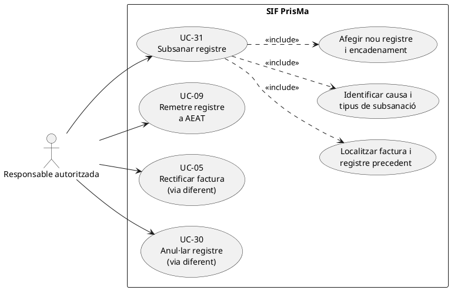
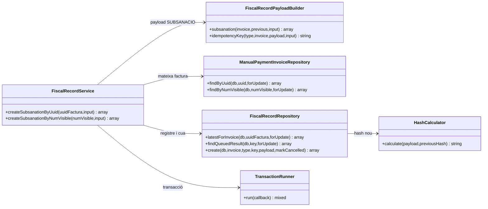

# UC-31 · Subsanar un registre fiscal — fitxa i UML integrats

**Àmbit:** generar **un nou registre de subsanació** sobre la mateixa factura fiscal, conservant l'anterior i l'encadenament. **No** equival a emetre una rectificativa econòmica (UC-05), anul·lar registre improcedent (UC-30), donar de baixa una inscripció (UC-27) ni retornar diners (UC-28). La decisió sobre la via procedent és un control funcional i fiscal **pendent de verificar al canal**.

**Estat de codi:** `FiscalRecordService::createSubsanationByUuid()`/`createSubsanationByNumVisible()`, `FiscalRecordPayloadBuilder::subsanation()` i `FiscalRecordRepository::create()` existeixen; aquest recorregut genera i encua un registre local. La remissió real és UC-09 separada, i el transport disponible al codi consultat està restringit a proves.

## 1. Fitxa específica

| Element | Regla |
| --- | --- |
| Actor principal | Responsable amb permís fiscal per decidir/classificar i confirmar correcció; autorització servidor/pantalla no acreditada pel servei. |
| Disparador | Es detecta una incidència en un registre que s'ha classificat com a subsanable sense una factura rectificativa. |
| Identitat | UUID o número visible de la **factura preexistent**; el nou registre no consumeix número de factura ni canvia `NUM_VISIBLE`. |
| Entrades requerides pel builder | `reason`/`motiu` no buit, `subsanation_kind`/`tipus_subsanacio` un de `SUBSANACION`, `RECHAZO_PREVIO`, `SIN_REGISTRO_PREVIO` (admet àlies `SUBSANACIO` i `SUBSANATION` → `SUBSANACION`). |
| Entrades opcionals | `correction_summary`/`resum_correccio`, `detail`, `created_by`, `reference`. |
| Persistència | Un nou `factura_registres` amb `TIPUS_REGISTRE=SUBSANACIO`, nou `FISCAL_ORDER` i hash; actualització de cadena i fila nova `fiscal_queue`. La factura original i el seu registre anterior no s'eliminen. |
| Resultat | Mateix UUID/número de factura, `record_type=SUBSANACIO`, `fiscal_order`, `hash`, clau de cua i reutilització idempotent. |

### 1.1. Flux principal verificat

1. La responsable determina el motiu, tipus de subsanació i informació que s'ha de corregir. El codi consultat **no conté** un classificador que decideixi de forma automàtica entre UC-05/30/31.
2. `FiscalRecordService` obre transacció, cerca i bloqueja la factura, i rebutja històriques `HISTORICAL`/`NO_VERIFACTU` o factura inexistent.
3. Consulta l'últim registre fiscal per a la factura; sense registre preexistent, falla.
4. `FiscalRecordPayloadBuilder::subsanation()` construeix payload d'identitat factura, context de l'últim registre, motiu i `subsanation_kind`; si el tipus no és reconegut, rebutja.
5. El servei forma `IDEMPOTENCY_KEY` des de la referència o el número/motiu/tipus i cerca un resultat fiscal ja en cua. Si existeix, retorna el mateix registre.
6. Si la factura té `ESTAT_FACTURA=CANCELLED`, no crea subsanació nova.
7. `FiscalRecordRepository::create()` bloqueja `fiscal_chain_state`, assigna nou ordre, calcula nou hash, crea registre `SUBSANACIO` i job de cua. No marca la factura `CANCELLED` ni modifica l'import cobrat.
8. Confirma i retorna el nou registre, **encara pendent de remissió UC-09**. No s'ha provat aquí l'adequació de la forma de payload emesa al transport AEAT per cada classe de subsanació.

### 1.2. Alternatives i observacions

| Cas | Comportament o pendent |
| --- | --- |
| Factura absent, històrica o sense registre previ | Rebuig sense afegir registre fiscal. |
| Factura ja marcada `CANCELLED` | Rebuig de subsanació nova. |
| Tipus de subsanació desconegut | Rebuig del constructor. |
| Mateixa referència/clau idempotent | Retorna el registre existent. |
| Mateix motiu però dades de correcció diferents, sense referència nova | **Risc de col·lisió semàntica:** la clau per defecte considera factura, motiu i tipus, però no necessàriament el contingut real corregit. Cal comparar payloads i registrar un identificador estable de correcció per distingir dos casos legítims. |
| `correction_summary` informat però cap camp fiscal corregit al payload | El builder consultat incorpora el resum i la identitat/registres previs, però no s'ha acreditat un mecanisme complet per reconstruir i congelar tots els camps fiscals corregits. No donar la subsanació per fiscalment resolta només perquè s'ha encuat. |
| Estat rebutjat per AEAT | UC-09 desa l'estat i resposta; la classificació de la reparació posterior és un cas separat, no reintentar una subsanació arbitràriament. |
| Incidència econòmica subjacent | UC-31 **no** registra ni reassigna diners; si cal retorn/traspàs, iniciar i correlacionar UC-28/71/72. |

**Proves localitzades, no executades:** `FiscalRecordServiceTest::testCreatesSubsanationWithSameInvoiceIdentifier`, `testAcceptsAllSupportedSubsanationKinds`, `testRejectsHistoricalNoVerifactuInvoice`.

## 2. Diagrama UML de casos d'ús



## 3. Subdiagrama de classes — nucli de subsanació existent



## 4. Diagrama de seqüència — crear un registre nou de subsanació

```mermaid
sequenceDiagram
autonumber
actor T as Responsable autoritzada
participant UI as Panell segur [pendent]
participant S as FiscalRecordService
participant IR as ManualPaymentInvoiceRepository
participant RR as FiscalRecordRepository
participant B as FiscalRecordPayloadBuilder
participant DB as BD SIF
T->>UI: Identificar factura, motiu i subsanation_kind
UI->>S: createSubsanationByNumVisible(numVisible,input)
S->>DB: BEGIN
S->>IR: findByNumVisible(numVisible,true)
IR->>DB: SELECT factura FOR UPDATE
alt Factura absent o històrica
 S--xUI: Error / ROLLBACK
else Factura SIF present
 S->>RR: latestForInvoice(uuidFactura,true)
 alt Registre previ absent
  S--xUI: Error / ROLLBACK
 else Registre previ disponible
  S->>B: subsanation(invoice,previous,input)
  alt Tipus/motiu invàlid
   B--xUI: Error / ROLLBACK
  else Payload preparat
   B-->>S: SUBSANACIO i referència al registre precedent
   S->>RR: findQueuedResult(idempotencyKey,true)
   alt Ja existeix el mateix registre
    RR-->>S: resultat preexistent
   else Factura marcada CANCELLED
    S--xUI: Conflicte
   else Nova subsanació
    S->>RR: create(db,invoice,SUBSANACIO,key,payload,false)
    RR->>DB: Lock cadena, INSERT registre i fiscal_queue
    RR->>DB: UPDATE fiscal_chain_state
    RR-->>S: UUID factura, nou fiscal_order i hash
   end
   S->>DB: COMMIT
   S-->>UI: Resultat; remissió UC-09 pendent
  end
 end
end
Note over S,DB: Cap nou pagament o moviment entre inscripcions
```

## 5. Traçabilitat

[Fitxa original UC-31](../06-fitxes-funcionals/uc-031.md) · [UC-30 anul·lació](uc-030-anul-lar-registre-improcedent.md) · [UC-05 rectificativa](uc-005-rectificar-factura.md) · [UC-09 remissió](uc-009-remetre-registre-aeat.md) · [FiscalRecordService](../../sif/src/Service/FiscalRecordService.php) · [FiscalRecordPayloadBuilder](../../sif/src/Service/FiscalRecordPayloadBuilder.php) · [FiscalRecordRepository](../../sif/src/Repository/FiscalRecordRepository.php) · [FiscalRecordServiceTest](../../sif/tests/Integration/FiscalRecordServiceTest.php).

**Pendent:** classificador fiscal, dades de correcció completes, autorització de panell, compatibilitat amb el transport i proves d'enviament reals.
