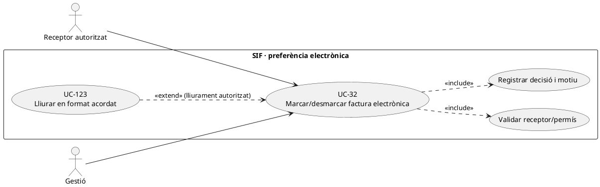
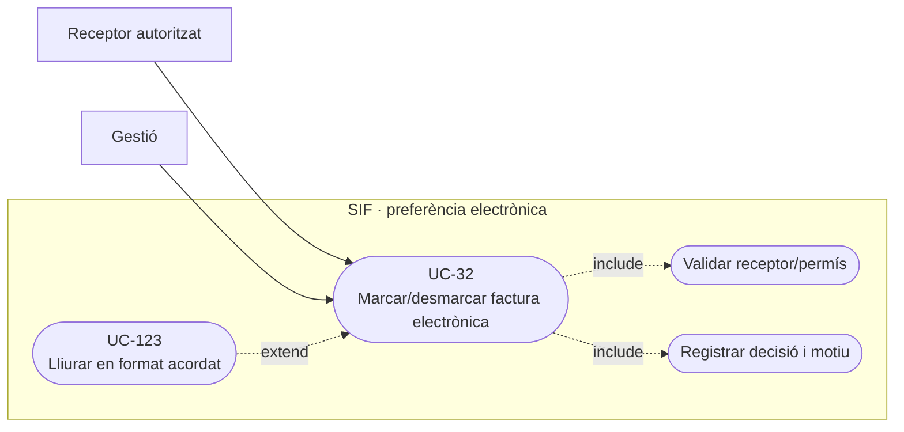
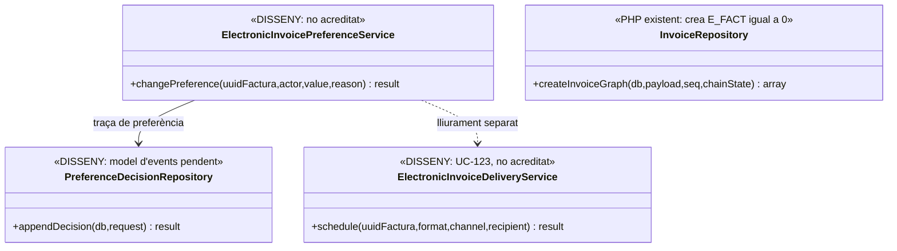
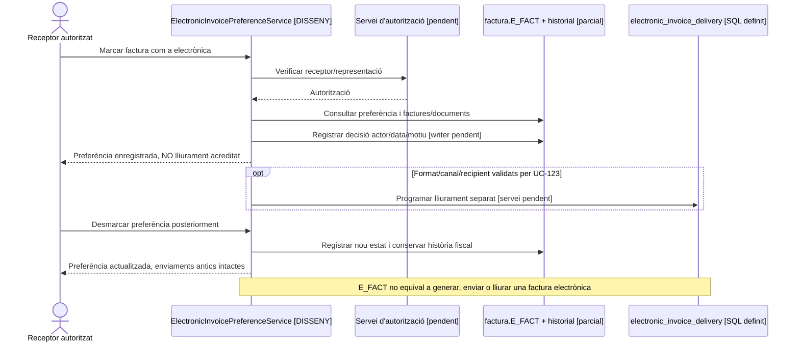

# UC-32 · Marcar o desmarcar factura electrònica

**Objectiu canònic:** gestionar la preferència o sol·licitud de factura electrònica com a **acció separada** amb usuari, data i motiu, sense reescriure factura fiscal. **No és** generar un document electrònic ni acreditar-ne el lliurament: aquests passos corresponen a UC-123.

## 1. Evidència i fitxa

`factura.E_FACT` existeix, però `InvoiceRepository::insertInvoice()` insereix el valor literal **`0`** en el moment d'emetre la factura, al costat d'`EMESA_ABANS_COBRAMENT` i `ESTAT_COBRAMENT`. **No s'ha acreditat** a `sif/src` un servei PHP de marcar/desmarcar amb actor, motiu i auditoria. `electronic_invoice_delivery` és una **taula SQL definida**, no un efecte automàtic d'`E_FACT=1`; conté format, versió, document, hash del destinatari, canal, estat i evidència de lliurament.

| Pas | Contracte |
| --- | --- |
| Actor | Receptor fiscal o representant autoritzat i operador amb permís. La persona inscrita no és automàticament el receptor de la factura d'una empresa/grup. |
| Entrada | `UUID_FACTURA`, receptor, estat actual de preferència, opció nova, canal/format sol·licitat quan es coneixen, actor, motiu, moment, identificador idempotent i correlació. |
| Precondició | Factura existent i permís del sol·licitant; comprovar preferència d'emissió/lliurament, no inferir consentiment d'un correu o de compartir `IDPAG`. |
| Efecte propi | Registrar **una decisió de lliurament o preferència** amb traça abans/després i data, sense modificar número, receptor fiscal original, línies, total, `factura_registres` ni cadena. Cal decidir si i com s'actualitza `E_FACT` de forma controlada; un `UPDATE` directe no és expedient complet. |
| Lliurament | UC-123 decideix format/canal/destinatari, crea document i registra resultat. `E_FACT=1` sol **no prova** que hi hagi PDF/XML, enviament o acceptació del receptor. |
| Economia | Cap `CHARGE`, `REFUND`, saldo ni assignació de fons per canviar una preferència documental. |

### Flux objectiu

1. Verificar identitat del receptor/representant i autorització sobre `UUID_FACTURA`; llegir preferència i lliuraments anteriors.
2. Registrar petició/decisió amb `REQUEST_ID`, actor, motiu i versió; si el mateix valor ja és vigent, retornar `NO_CHANGE` amb historial, no duplicar enviaments.
3. Si s'activa, determinar format, canal, destí i consentiment necessari segons el circuit real de l'entitat (UC-123), sense fingir que `E_FACT` el resol. Si es desactiva, preservar documents i proves de lliurament **ja emesos**.
4. Mantenir el document fiscal intacte; només un error real de la factura entra al circuit de correcció UC-05/74, no a UC-32.
5. Un canvi després d'haver iniciat un enviament no elimina intents/documentos ja generats: cancel·lar o reprogramar **els lliuraments pendents** segons política i conservar-ne traça.

### Alternatives de prova

| Cas | Resultat |
| --- | --- |
| Factura a empresa, alumne demana E_FACT | Validar poder de representació; no oferir el document fiscal complet sense autorització. |
| Marcar dues vegades | Un canvi d'estat efectiu i reús/`NO_CHANGE` al segon intent; no dos correus automàtics. |
| Desmarcar després d'un lliurament confirmat | Lliurament/document històrics es conserven; afecta només futures actuacions segons política. |
| Marcar E_FACT=1 sense format o receptor validads | Preferència pendent d'execució, **no** «factura electrònica enviada». |
| Emissió de factura nova | El PHP actual grava `E_FACT=0`; l'adaptador ha de definir com reflecteix la preferència, no assumir que el payload la insereix automàticament. |

**Pendents:** identitat i permisos, estat/versions de la sol·licitud, model de decisió auditable, integració amb UC-123 i proves del valor literal `E_FACT=0` a l'emissió.

### 1.1. Ubicació exacta i separació històrica de les dues marques — decisió del xat original

**Decisió explícita de PrisMa:** la funcionalitat «marcar/desmarcar que una factura passa a factura electrònica» s'ha d'oferir a **«Alumnes / Consulta - Edita - Anul·la factura»**, no com a conseqüència automàtica de «Generar factura abans de pagar». L'usuària identifica com a persones operadores d'aquesta acció Meriem, Adam i Pablo; el servei final ha de comprovar permisos al servidor i registrar usuari, data i motiu. Aquestes persones són la decisió organitzativa comunicada en el xat; no impliquen que s'hagin implementat ja els rols ni que cap usuari amb accés al PDF pugui canviar la marca.

**Dues dimensions independents:** `EMESA_ABANS_COBRAMENT=1` informa que s'ha emès **una factura real abans de l'ingrés**; `E_FACT=1` és la marca operativa «factura electrònica». Una factura prèvia **pot tenir** `EMESA_ABANS_COBRAMENT=1` i `E_FACT=0` i s'ha de poder marcar després per una acció separada i autoritzada. El xat explica que històricament les factures prèvies es feien amb `E_FACT=1`, perquè sempre es consideraven electròniques, però això ja **no** és una equivalència vàlida en el circuit desitjat. El valor literal inicial `E_FACT=0` de l'`InvoiceRepository` consultat concorda amb aquesta separació; encara no hi ha writer de canvi auditat acreditat.

**Acció i resultat visibles:** al modal de consulta s'ha de mostrar número/UUID i receptor de la factura, `E_FACT` actual, `EMESA_ABANS_COBRAMENT`, qui sol·licita el canvi i un botó separat de rectificar o de registrar devolució. Marcar/desmarcar no pot editar el total, receptor, factura original ni data d'emissió; tampoc acredita per si mateix que s'hagi generat o lliurat un format electrònic concret. La preparació, enviament i evidència de lliurament corresponen a UC-123; desmarcar després d'un lliurament ja fet no ha de suprimir-ne l'històric.

### 1.2. Proves d'acceptació de la marca a la pantalla (no executades)

| ID | Escenari | Resultat exigible |
| --- | --- | --- |
| EF-01 | Factura emesa abans de cobrar, sense petició de factura electrònica | `EMESA_ABANS_COBRAMENT=1`, `E_FACT=0`, factura real i deute independent. |
| EF-02 | Operador autoritzat marca E_FACT més tard | Un event auditat, mateixa factura/UUID/número, sense nou CHARGE ni rectificativa. |
| EF-03 | Persona inscrita intenta marcar E_FACT d'una factura d'empresa | Autorització sobre receptor comprovada al servidor; cap accés/edició per coincidència d'ID_INSC. |
| EF-04 | Mateixa marca guardada dues vegades | Segon intent sense duplicar event material o enviament; estat coherent. |
| EF-05 | E_FACT activat però document electrònic encara no enviat | Mostrar preferència/estat pendent; no etiquetar «lliurada» sense evidència d'UC-123. |
| EF-06 | Desmarcar després de lliurament acreditat | Conservació de document, traça i lliuraments anteriors; futures accions segons política. |
## 2. UML de casos d'ús

### Vista de casos d’ús per a GitHub (Mermaid)

## 3. UML de classes — absència de servei de preferència

## 4. UML de seqüència — marcar, desmarcar i document existent (DISSENY)

## 5. Traçabilitat

[UC-32 original](../06-fitxes-funcionals/uc-032.md) · [UC-123 lliurament original](../06-fitxes-funcionals/uc-123.md) · [UC-36 documents](uc-036-generar-consultar-documents.md) · [InvoiceRepository](../../sif/src/Repository/InvoiceRepository.php) · [Migració electronic_invoice_delivery](../../sif/database/migrations/2026_09_16_000005_add_operation_lifecycle_tables.sql).
