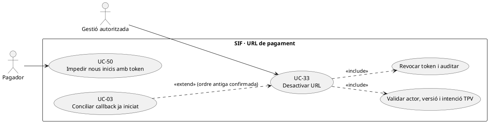
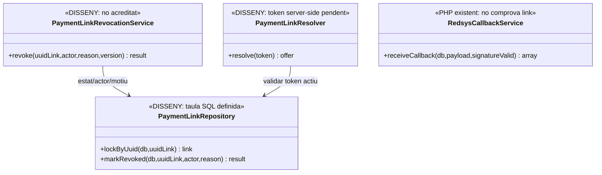
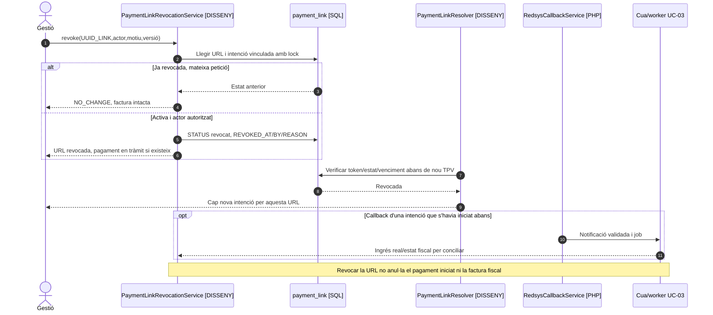

# UC-33 · Desactivar una URL de pagament sense tocar la factura

**Objectiu canònic:** deixar inutilitzable una URL per iniciar **pagaments nous**, amb actor, data i motiu, **sense esborrar ni alterar la factura emesa**. És una operació específica del cicle UC-50; la revocació del token **no equival** a anul·lació de factura, baixa acadèmica, devolució ni cancel·lació bancària.

## 1. Estat contrastat i fitxa específica

La migració defineix `payment_link.STATUS`, `REVOKED_AT`, `REVOKED_BY`, `REVOKE_REASON`, `REPLACED_BY_UUID`, `EXPIRES_AT` i `LAST_ACCESSED_AT`. **No s'ha acreditat un endpoint/servei PHP** que desactivi l'enllaç, validi l'actor, n'impedeixi el reús o sincronitzi la revocació amb una intenció Redsys activa. `RedsysCallbackService::assertMatchesIntent()` comprova import, divisa i terminal de la intenció, **no consulta `payment_link.STATUS`**.

| Dada | Regla |
| --- | --- |
| Actor i permís | Gestió autoritzada pel titular de l'operació i motiu; el posseïdor del token no obté automàticament permís per revocar una factura o operació aliena. |
| Identificació | `UUID_PAYMENT_LINK`, `UUID_OPERATION`, `UUID_INTENT/DS_ORDER` si s'ha iniciat TPV, estat de factura, import pendent real, actor, `REQUEST_ID`, correlació, motiu i versió/estat observats. |
| Precondició | Enllaç existent i titularitat comprovada; consultar pagaments **ja registrats o en procés** abans de declarar-lo «sense efecte». |
| Canvi propi | Transició de la URL a revocada amb `REVOKED_AT/BY/REASON` i event auditable; lectura/resolució del token ha de rebutjar nous intents. Reintentar la mateixa revocació és `NO_CHANGE`/reús, no nou moviment. |
| Dades invariants | La factura original manté `UUID_FACTURA`, número, línies, imports i estat AEAT; `payment_transaction` existent i les seves assignacions **no s'eliminen**. |
| Efecte del TPV iniciat | Revocar la URL no revoca automàticament la transacció de Redsys en tràmit. Si el callback confirma ingrés real després, registrar/conciliar el fet bancari, verificar si encara correspon al deute i tractar excedent o retorn en casos separats. |

### Flux objectiu i controls

1. Identificar URL i operació, verificar actor/estat/versió i comprovar si hi ha intenció activa, pagament real o saldo pendent. Registrar `REQUESTED` amb causa si el canal està integrat amb auditoria UC-86.
2. Bloquejar enllaç i operació durant la decisió; marcar la URL com a revocada amb instant, actor i motiu. Un enllaç ja revocat per la **mateixa operació** retorna resultat anterior; revocació contradictòria o versió obsoleta exigeix revisió.
3. El resolvedor d'UC-50 ha de comprovar **al servidor** l'estat abans de crear una **nova** intenció UC-63; ocultar el botó al frontend o eliminar un correu no és revocar.
4. Si existeix una intenció `DS_ORDER` iniciada quan la URL era vàlida, preservar-ne la traça. Si arriba callback signat, el worker no ha de crear **segon** cobrament/factura, i ha de conciliar ingrés, factura i valor pendent abans de decidir què fer.
5. Mostrar estat **URL revocada** separat de **factura pendent/pagada** i **pagament en tràmit/confirmat**. Per substituir URL, UC-121 prepara una oferta/enllaç nou amb acceptació i import coherent, no reedita la factura inicial.
6. Una petició de baixa o cancel·lació de matrícula és UC-72, que ha de classificar per separat factura i diners; no executar-la com a efecte implícit de prémer «desactivar URL».

### Variants de prova

| Escenari | Resultat esperat |
| --- | --- |
| URL activa i cap TPV iniciat | Revocació efectiva; nou accés denegat; cap `CHARGE` ni factura modificada. |
| URL ja revocada, mateix `REQUEST_ID` | `NO_CHANGE` i mateixa traça, sense segona actuació. |
| Revocació concurrent amb una nova petició de TPV | Lock/validació atòmica a definir: no permetre iniciar una ordre **després** que la revocació tingui efecte. |
| Revocació amb TPV ja iniciat | Comprovar resposta del banc i coordinar incidència; no prometre que la revocació impedirà el cobrament d'una ordre anterior. |
| Factura emesa abans de cobrar | Continua emesa i pendent fins a cobrament/correcció formal; sense esborrar número ni `fiscal_queue`. |
| Pagament real superior al deute per reintents d'URL | UC-104 classifica excedent i retorn/saldo, sense ocultar l'entrada duplicada real. |

**Bloquejants:** endpoint i token resolver, permisos, concurrència, consulta d'intenció activa, estats i idempotència d'URL, política de notificació i proves de callback tardà. Cap prova PHP executada.

## 2. UML de casos d'ús

## 3. UML de classes — revocació pendent

## 4. UML de seqüència — revocació i callback posterior

## 5. Traçabilitat

[UC-33 original](../06-fitxes-funcionals/uc-033.md) · [UC-50 cicle d'URL](uc-050-cicle-enllac-pagament.md) · [UC-61 import pendent original](../06-fitxes-funcionals/uc-061.md) · [UC-03 callback](uc-003-processar-cobrament-redsys-asincron.md) · [UC-104 excés](uc-104-gestionar-exces-cobrament.md) · [Migració `payment_link`](../../sif/database/migrations/2026_09_16_000004_add_commercial_operation_and_fiscal_fields.sql) · [RedsysCallbackService](../../sif/src/Service/RedsysCallbackService.php).
