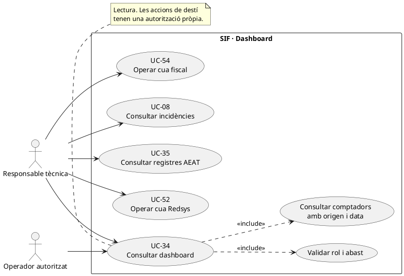
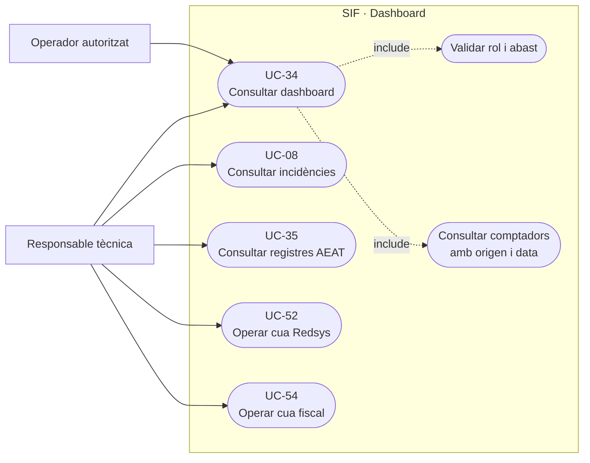
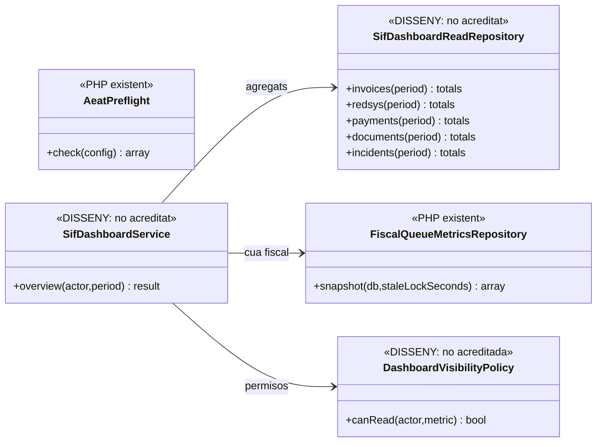
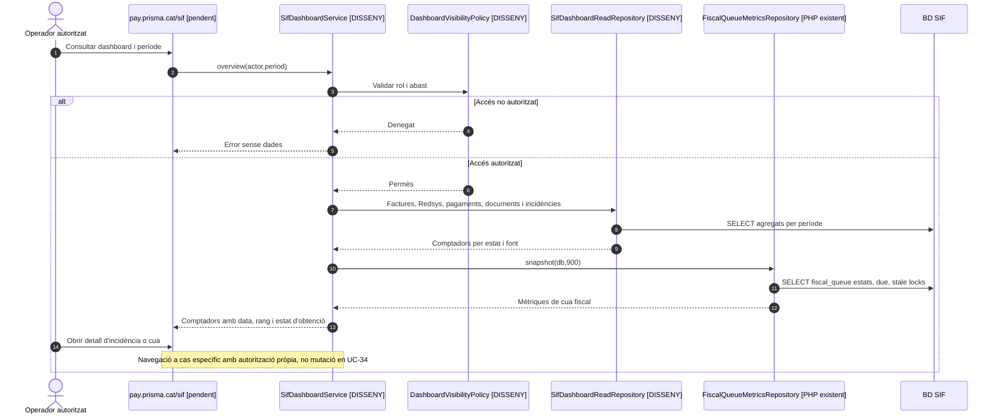

# UC-34 · Consultar el dashboard del SIF

**Àmbit:** obtenir una vista de **lectura i navegació** del SIF a `pay.prisma.cat/sif`: activitat de factura, cues Redsys i AEAT, incidències, cobrament i documents. **No** és el worker, la correcció fiscal, l'emissió de factura ni l'activació d'una versió; aquests són casos d'ús diferenciats.

**Estat verificat:** [disseny detallat del panell](../04-estat-final/25-panell-sif-pay-prisma.md); `FiscalQueueMetricsRepository::snapshot()` ofereix **mètriques agregades només de la cua fiscal**, i `sif/scripts/preflight-aeat-worker.php` calcula l'estat de preparació i algunes alertes CLI. No s'ha acreditat una classe/endpoint executable de dashboard que agregui totes les mètriques del panell, ni el control d'accés final de la ruta.

## 1. Fitxa específica

| Element | Contracte |
| --- | --- |
| Actors | Responsable tècnica i operadors segons rol. L'auditor només pot consultar dades del seu abast; suport no pot activar un retry o generar una factura per veure un indicador. |
| Entrada | Sessió/rol validats al servidor i interval temporal explícit per a comptadors de factures i pagaments. El rang «avui/mes/any» ha d'usar zona horària acordada i deixar clar el període de les mètriques. |
| Panell objectiu | Factures emeses avui/mes/any; registres AEAT pendents, acceptats/rebutjats/retry; incidències obertes; callbacks Redsys duplicats i pendents; pagaments no assignats; cua documental; última factura; estat de connexió/preflight AEAT; versió activa. |
| Mètrica fiscal **implementada** | `FiscalQueueMetricsRepository::snapshot(db,staleLockSeconds)` retorna `counts` (`PENDING`, `PROCESSING`, `RETRY`, `SENT`, `DEAD_LETTER`), `due`, `stale_locks` i `oldest_actionable_at`. **No** ofereix recompte d'acceptacions/rebuigs de registre, ni factures, ni pagaments. |
| Preflight implementat | `preflight-aeat-worker.php` combina `AeatPreflight` i mètriques per mostrar `ready_to_send`, alertes `DEAD_LETTER_THRESHOLD`, `DUE_QUEUE_THRESHOLD`, `STALE_WORKER_LOCK`. És un script **CLI**, no un endpoint públic de dashboard. |
| Sortida | Comptadors amb origen, instant d'actualització i rang, avisos de dades no disponibles, i enllaços a UC-07/08/35/52/54/55 segons permís. |
| Efecte | **Cap efecte de mutació** per obrir el panell o consultar una targeta; qualsevol acció operativa exigeix confirmació i permisos del cas d'ús de destí. |

### 1.1. Flux objectiu

1. L'usuari entra al panell SIF amb autenticació i autorització **al backend**; la intranet només ofereix enllaç/resum, no substitueix la font fiscal del SIF.
2. El servei de dashboard **pendent** consulta separat factures, registres/respostes AEAT, cues, pagaments i assignacions, incidències, documents i versió activa. No dedueix el número de factures cobrades del número de notificacions TPV.
3. Per la cua fiscal usa `FiscalQueueMetricsRepository::snapshot()` com a font d'agregats, però consulta `factura_registres.ESTAT_AEAT` per saber què està acceptat/rebutjat. **`fiscal_queue.STATUS=SENT` no vol dir acceptat.**
4. Per Redsys, separa notificació denegada/validada de feina `QUEUED`/`RETRY`/`PROCESSED`/`INCIDENT` i de `payment_transaction CHARGE` real. Un callback validat sense job processat no és factura cobrada.
5. Per documents, diferencia feina `document_job` de fitxer registrat a `factura_documents` i integritat efectiva de storage: tenir metadades no prova que el PDF sigui descarregable.
6. Mostra dades filtrades per rol/abast i enllaços a les pantalles detallades; errors de consulta es marquen com **mètrica no disponible**, no es converteixen en un zero aparentment sa.
7. Quan una targeta mostra incidència, navega a UC-08 o a la vista corresponent. **El dashboard mateix no executa** `issueInvoice`, `registerPayment`, `recoverStaleLocks` o `createSubsanation`.

### 1.2. Casos de prova i riscos

| Cas | Comportament |
| --- | --- |
| 3 jobs `SENT`, però 1 `REJECTED` | La targeta d'enviats i la de rebutjats es calculen amb fonts diferents; no presentar 3 registres acceptats. |
| Callback `VALIDATED` i job `RETRY` | No incrementar factures cobrades sense `UUID_PAYMENT`/moviment real. |
| Pagament extern únic sobre N inscripcions | Comptar una transacció bancària real; el detall de N atribucions s'ha d'obtenir del registre per inscripció proposat quan existeixi, sense multiplicar ingressos. |
| Job documental existent però fitxer físic absent | Indicador de document pendent o amb incidència, no «disponible». |
| Error de BD en una secció | Mostrar dada no disponible amb instant de la darrera lectura fiable; no substituir per 0. |
| Perfil auditor o suport | Cap botó accionable fora de permís i cap fuga de noms/dades de grup des del resum. |
| «AEAT connectada» segons preflight local | Mostrar comprovació local i data; no afirmar recepció/acceptació AEAT per un test de configuració. |

**Proves localitzades, no executades:** `FiscalQueueMetricsRepositoryTest` i script de preflight; no equivalen a proves de la pantalla agregadora ni del filtratge de dades per rol.

### 1.3. Indicadors del panell definit a PrisMa i la relació amb la intranet

**Ubicació i jerarquia documental.** El document `25-panell-sif-pay-prisma.md` fixa `pay.prisma.cat/sif` com a **panell fiscal oficial** i defineix el mòdul amb Dashboard, Factures, Pagaments i conciliació, Registres AEAT, Incidències, Documents, Versions, Evidències i go/no-go, Exportacions i Configuració. L'apartat `VERI*FACTU` de la intranet principal té una altra finalitat: **indicador de pendents, resum d'incidències i accessos al SIF**, no una segona base fiscal ni una pantalla on es resolgui oficialment una incidència. Els procediments assenyalen `pay.prisma.cat/sif/dashboard` i `GET /sif/dashboard/summary` com a **ruta/endpoint objectiu pendents de crear**, no com a prova d'un controlador desplegat.

**Fonts i unitats del resum.** Mostrar `factura` (emeses avui/mes/any i última factura), `factura_registres` (acceptats, rebutjats, pendents o acceptats amb errors **per registre**), `fiscal_queue` (pendents, due, processing, retry, sent i dead-letter **per job**), `errors_verifactu` (incidències obertes i prioritat), dades Redsys (callbacks rebuts, duplicats i pendents), `payment_transaction` i atribucions (ingressos reals no conciliats), `document_job/factura_documents` (feina i document verificat), i `sif_versions` (versió activa). **No multiplicar euros pel nombre de `fact_rels`, ni calcular acceptacions AEAT a partir de `SENT`.** Els registres històrics `NO_VERIFACTU` i els seus documents no són registres nous pendents de transport.

**Lectura amb error parcial.** El dashboard és una consulta de diverses fonts i cadascuna ha de conservar `instant_lectura`, abast temporal i estat `disponible / no disponible`; són **atributs funcionals proposats**, no camps acreditats d'un endpoint executable. Un error llegint `payment_transaction` no és «0 pagaments pendents»; un preflight AEAT favorable és **preparació local**, no prova d'acceptació remota. Les targetes poden dirigir a UC-35/54/81/80 segons permís, però la navegació no ha d'executar reintents ni modificacions.

### 1.4. Proves de resum multiorigen (no executades)

| ID | Escenari | Resultat exigible |
| --- | --- | --- |
| DB-01 | Tres jobs fiscals SENT; una resposta de registre REJECTED | 3 trameses finalitzades i 1 registre rebutjat, no «3 acceptats». |
| DB-02 | Una transferència per una factura amb tres participants | Una entrada real; cap triple comptabilització d'ingressos. |
| DB-03 | Mètrica documental `CREATED` però PDF físic absent | Document no disponible/incidència, no «PDF preparat». |
| DB-04 | Error de consulta d'una BD amb la resta sana | Mostrar font no disponible, no substituir per zero. |
| DB-05 | Usuari obre l'indicador a la intranet | Resum i enllaç amb autorització; cap mutació al SIF. |
| DB-06 | Auditor consulta panell | Només dades i rutes autoritzades, sense botons reals de retry/emissió. |

## 2. Diagrama UML de casos d'ús

### Vista de casos d’ús per a GitHub (Mermaid)

## 3. Diagrama de classes — nucli parcial i agregador objectiu

`AeatPreflight` s'executa en el script CLI existent; no es dibuixa com a dependència implementada d'un `SifDashboardService` que encara és disseny.

## 4. Seqüència — visualització sense operacions (DISSENY/PARCIAL)

## 5. Traçabilitat

[UC-34 original](../06-fitxes-funcionals/uc-034.md) · [Disseny del panell](../04-estat-final/25-panell-sif-pay-prisma.md) · [UC-08 incidències](uc-008-gestionar-incidencia-sif.md) · [UC-35 consulta fiscal](uc-035-consultar-registre-cadena-estat-aeat.md) · [FiscalQueueMetricsRepository](../../sif/src/Repository/FiscalQueueMetricsRepository.php) · [Script de preflight](../../sif/scripts/preflight-aeat-worker.php) · [UC-55 documents](uc-055-custodiar-reintentar-documents.md) · [Model de fons](00-revisio-moviments-inscripcions.md).
