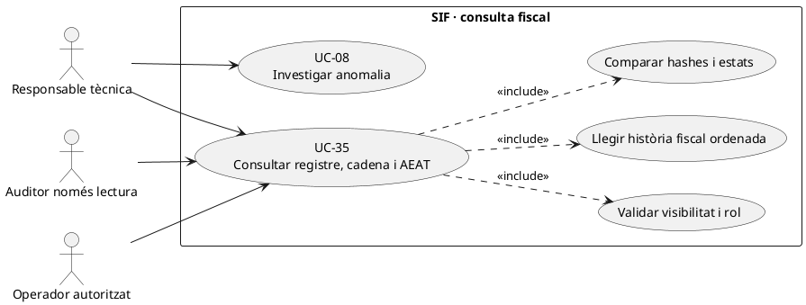
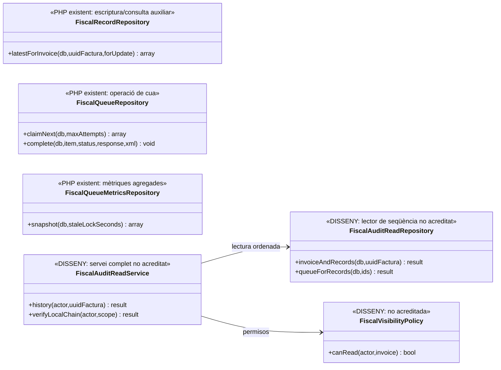

# UC-35 · Consultar registre fiscal, cadena i estat AEAT

**Finalitat:** oferir una vista de lectura d'una factura, els seus registres fiscals encadenats i les respostes AEAT per **registre individual**, sense modificar-los. És diferent d'UC-07 (consulta de factura/document), UC-09 (enviament) i UC-54 (operació de cua).

**Estat del codi:** `FiscalRecordRepository`, `FiscalQueueRepository`, `FiscalQueueMetricsRepository`, `factura_registres` i `fiscal_chain_state` permeten persistir/consultar dades del nucli. **No s'ha acreditat un endpoint de consulta segur i complet ni una interfície d'auditor desplegada** a `pay.prisma.cat/sif`. El transport SOAP del codi revisat és de proves: no s'infereix una resposta AEAT de producció de l'estat local.

## 1. Fitxa de cas d'ús

| Camp | Regla |
| --- | --- |
| Actors | Responsable tècnica, operador segons permís i auditor de només lectura dins del seu abast. |
| Entrada | Identificador inequívoc de factura o registre i actor autenticat. L'UUID **no** és credencial d'accés. |
| Dades de factura | `UUID_FACTURA`, `NUM_VISIBLE`, `ESTAT_FACTURA`, `ESTAT_COBRAMENT` i `ESTAT_AEAT` són estats **diferents**; un cobrament no demostra acceptació AEAT. |
| Dades de registre | Llista `factura_registres` per factura i ordre fiscal, amb `TIPUS_REGISTRE` (alta/anul·lació/subsanació), hash propi/anterior, payload congelat, dates i resposta AEAT individual quan existeix. |
| Dades de cua | `fiscal_queue.STATUS`, intents i errors d'enviament, sense reinterpretar `SENT` com a `ACCEPTED`. |
| Cadena | `fiscal_chain_state` permet comparar el cap de cadena/ordre i el registre corresponent; una coincidència local de hash no demostra per si sola recepció externa. |
| Accés i evidència | Filtrar payloads/identitats segons rol i conservar traça d'accés segons política; la lectura de l'auditor no pot reemetre, rectificar ni reintentar jobs. |

### 1.1. Flux objectiu de consulta

1. El canal verifica autenticació i permisos al servidor, restringeix la factura al seu abast i impedeix que un alumne accedeixi a payloads fiscals interns o dades d'altres persones.
2. Obté la factura i tots els registres vinculats ordenats per `FISCAL_ORDER`; diferencia el registre d'alta de qualsevol `ANULACIO` o `SUBSANACIO` posterior. **No** substitueix la seqüència històrica per l'últim estat únic de la factura.
3. Llegeix hash propi/anterior i els elements necessaris per comprovar la continuïtat local, incloent l'estat de la cadena. Qualsevol trencament és incidència UC-08; no «repara» la cadena modificant registres anteriors.
4. Consulta `fiscal_queue` per cada registre, distingint `PENDING`, `PROCESSING`, `RETRY`, `SENT` i `DEAD_LETTER`; les respostes `ACCEPTED`, `ACCEPTED_WITH_ERRORS` i `REJECTED` pertanyen al registre AEAT i no són estats equivalents de la cua.
5. Si el job consta `SENT` però la resposta individual és `REJECTED`, presenta **enviat però rebutjat**, amb evidència guardada. Si és `RETRY`, indica **remissió no confirmada**, sense inventar acceptació.
6. L'auditor pot consultar/exportar només els camps autoritzats; les decisions de reparació corresponen a UC-30/31/05 després de classificació, mai a una edició silenciosa d'UC-35.

### 1.2. Alternatives i riscos

| Situació | Resposta funcional |
| --- | --- |
| Factura encara amb job `PENDING` | Mostrar registre local emès i remissió pendent, no resultat AEAT. |
| `SENT + REJECTED` | Mostrar rebuig per registre i la resposta correlacionada; obrir/revisar incidència i decidir correcció pel cas d'ús pertinent. |
| `SENT + ACCEPTED_WITH_ERRORS` | Mostrar errors i estat individual, no etiquetar-ho com a acceptació neta. |
| `DEAD_LETTER` | Mostrar intents i causa tècnica, sense reenviament automàtic des d'una vista de lectura. |
| `ANULACIO` posterior | Conservar i mostrar l'alta original més el nou registre, ordre/hash i respostes propis; no esborrar la història. |
| Hash de cadena incorrecte | Bloquejar conclusions d'integritat, conservar evidències i derivar a auditoria/incidència. |
| Accés a factura de grup | La vista d'auditor/operador es restringeix al rol; no copiar la resposta fiscal completa a l'espai d'un alumne. |
| Falta resposta AEAT | Camp no disponible/incert; el fet que existeixi XML local no demostra remissió. |

**Proves pendents, no executades:** restriccions d'actor/rol, seqüència alta+anul·lació+subsanació, hash/ordre coherent i trencat, totes les combinacions de cua/AEAT, accés a factura de grup i exportació només lectura.

### 1.3. Dades concretes del panell «Registres AEAT» i accés auditor

**Vista definida al projecte.** `25-panell-sif-pay-prisma.md` preveu la consulta a `pay.prisma.cat/sif/registres-aeat` amb tipus de registre, hash, hash anterior, `FISCAL_ORDER`, data de creació/enviament, estat AEAT, resposta, errors, intents i proper retry. Els procediments defineixen filtres per període, estat AEAT, número i UUID i un `GET /api/fiscal-records` **objectiu**. La ruta encara no acredita controlador de consulta i permisos final implementats.

**Una factura, diversos registres.** Per a cada `UUID_FACTURA`, mostrar ordenats els registres d'alta, eventual anul·lació o subsanació **sense substituir-ne l'original**. La correlació de resposta local usa la parella `UUID_FACTURA + FISCAL_ORDER`; un resultat `SENT` de `fiscal_queue` mostra l'execució del transport i `factura_registres.ESTAT_AEAT` el resultat individual. Si una factura té una rectificativa en sèrie R, aquesta té **UUID i registre fiscal propis**, encara que comparteixin `FACTURA_RELACIONADA` en el llegat.

**Cadena local vs resposta remota.** La continuïtat de `HASH_ACTUAL/HASH_ANTERIOR` i l'estat de `fiscal_chain_state` constitueixen evidència d'integritat **local** quan la cadena es verifica sobre les dades congelades. Ni una comparació correcta de hash ni la presència d'XML de petició acredita que AEAT hagi acceptat el registre; mostrar «resposta pendent/incerta» quan no hi ha resposta correlacionada. Davant d'un trencament local, obrir incidència d'integritat i preservar els registres; no editar hashes anteriors des de la consulta.

**Auditor i accions.** El panell defineix els rols `AUDITOR_FISCAL` i `AEAT_READONLY` com a **només lectura**, amb accés limitat a registre, declaració, versió, documents i exportacions autoritzats. No donar-los operació de retry, rectificació, cobrament ni resolució d'incidència per poder veure una línia fiscal; `POST /api/fiscal-queue/{id}/retry` és una acció separada que exigeix rol operatiu, revisió del resultat extern incert i traça pròpia (UC-54/77).

### 1.4. Proves de consulta i atribució de resposta (no executades)

| ID | Escenari | Resultat exigible |
| --- | --- | --- |
| CAE-01 | Factura amb alta i registre d'anul·lació | Totes dues entrades visibles amb `FISCAL_ORDER` i hash individual. |
| CAE-02 | Job SENT amb resposta REJECTED | Mostrar «enviat però rebutjat», no acceptat. |
| CAE-03 | Hash local coherent però no hi ha resposta remota | Integritat local i remissió incerta/pendent, no acceptació inferida. |
| CAE-04 | Auditor només lectura intenta retry | Denegació de l'acció al servidor, sense canviar cua. |
| CAE-05 | Rectificativa R vinculada a factura A antiga | UUIDs/registres separats, sense fusió per agrupador llegat. |

## 2. UML de casos d'ús



## 3. UML de classes — repositoris reals i consulta objectiu



`FiscalRecordRepository::latestForInvoice()` ofereix el registre més recent, **no equival a una implementació acreditada d'història completa, verificació i filtratge de rols**.

## 4. Seqüència — consulta sense efectes (DISSENY/PARCIAL)

```mermaid
sequenceDiagram
autonumber
actor A as Auditor o responsable
participant UI as Panell SIF [pendent]
participant S as FiscalAuditReadService [DISSENY]
participant P as FiscalVisibilityPolicy [DISSENY]
participant R as FiscalAuditReadRepository [DISSENY]
participant DB as BD SIF
A->>UI: Consultar UUID_FACTURA
UI->>S: history(actor,UUID_FACTURA)
S->>P: canRead(actor,invoice)
alt Sense accés
 P-->>S: false
 S-->>UI: Denegat; cap dada fiscal
else Accés concedit
 P-->>S: true
 S->>R: invoiceAndRecords(UUID_FACTURA)
 R->>DB: SELECT factura + factura_registres ORDER BY FISCAL_ORDER
 R-->>S: Alta, anul·lació/subsanació i hashes originals
 S->>R: queueForRecords(registres)
 R->>DB: SELECT fiscal_queue, estats i respostes
 R-->>S: Estat de transport + resposta AEAT individual
 S->>S: Comprovar cadena local sense editar registres
 S-->>UI: Història fiscal, cua, hash i resposta diferenciats
end
Note over UI,DB: Consulta objectiu; no envia AEAT, no emet factura ni modifica pagaments
```

## 5. Fonts i traçabilitat

[UC-35 original](../06-fitxes-funcionals/uc-035.md) · [UC-09 remissió](uc-009-remetre-registre-aeat.md) · [UC-54 operació](uc-054-operar-cua-fiscal-respostes.md) · [UC-08 incidències](uc-008-gestionar-incidencia-sif.md) · [FiscalRecordRepository](../../sif/src/Repository/FiscalRecordRepository.php) · [FiscalQueueRepository](../../sif/src/Repository/FiscalQueueRepository.php) · [FiscalQueueMetricsRepository](../../sif/src/Repository/FiscalQueueMetricsRepository.php) · [Model general de classes](00-model-classes-general.md).
