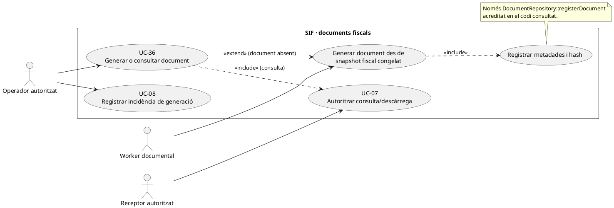
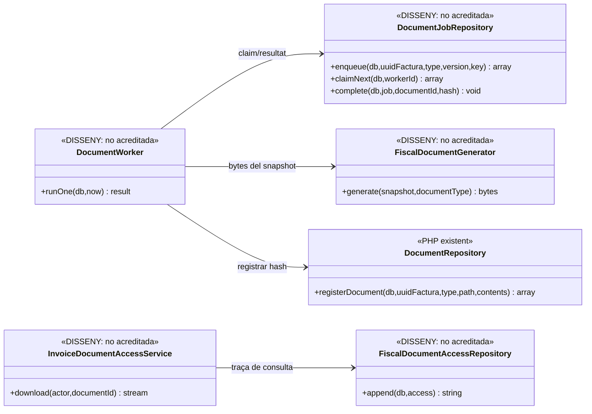
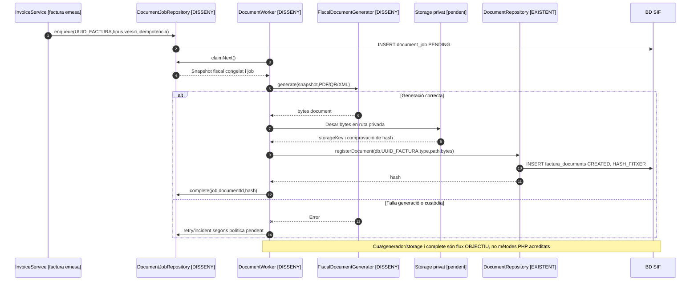
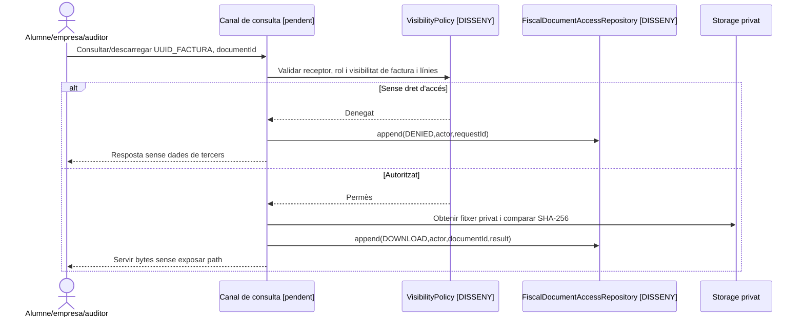

# UC-36 · Generar i consultar PDF, QR o XML — fitxa i UML

**Frontera:** generar un artefacte de la factura, registrar-ne la versió/hash i permetre'n la consulta autoritzada. **No** és emetre la factura (UC-01), enviar el registre XML a AEAT (UC-09), ni consultar una factura ja accessible (UC-07). Els documents es basen en un **snapshot fiscal congelat**: no s'han de regenerar silenciosament a partir de dades personals o preus del llegat que poden haver canviat.

**Estat del repositori revisat:** `DocumentRepository::registerDocument()` implementa **únicament la inserció de metadades i hash SHA-256 de contingut**. La migració de BD defineix `factura_documents`, `document_job` i `fiscal_document_access`. **No s'ha acreditat** una classe PHP completa de generació PDF/QR/XML, un worker `document_job` ni un endpoint de lliurament/autorització que escrigui `fiscal_document_access`. La disponibilitat de `XmlCodec` per als registres AEAT **no prova la generació del XML documental descarregable d'una factura**.

## 1. Fitxa funcional específica

| Element | Contracte verificat o objectiu |
| --- | --- |
| Actors | Procés SIF després d'una emissió/rectificativa; operador de facturació si autoritzat; alumne, empresa/responsable i auditor només per consulta sota UC-07. |
| Disparador | Factura immutable amb UUID existent; document pendent o sol·licitud de consulta d'un document que ja s'ha generat. |
| Tipus admesos pel repositori | `PDF`, `XML`, `QR`. `registerDocument(db,uuidFactura,type,path,contents)` converteix tipus a majúscules, rebutja altres tipus i limita el path a 255 caràcters. |
| Dades i verificació | `factura_documents`: `UUID_FACTURA`, `TIPUS`, `PATH_FITXER`, `HASH_FITXER`, `ESTAT=CREATED`, `CREATED_AT`; `HASH_FITXER=sha256(contents)`. **El repositori no desa els bytes en storage ni comprova que el path existeixi.** |
| Job documental dissenyat a BD | `document_job` amb UUID, `DOCUMENT_TYPE`, `IDEMPOTENCY_KEY`, `GENERATOR_VERSION`, `STATUS`, intents (màxim 5 per defecte), lock, `NEXT_ATTEMPT_AT`, FK opcional a `factura_documents`, `STORAGE_KEY`, hash i correlació. **L'esquema no implica que hi hagi worker PHP.** |
| Accés auditat dissenyat | `fiscal_document_access` preveu `ACTION`, `RESULT`, actor/rol/canal, fingerprint de token, request/correlation ID i data. La persistència executable d'aquest event **no està verificada**. |
| Efecte econòmic i fiscal | Crear o servir PDF/QR/XML **no crea factura nova, registre AEAT nou, CHARGE, REFUND ni saldo**. Fallar la generació posterior **no desfà la factura ja emesa**. |

### 1.1. Flux principal objectiu i punt implementat

1. UC-01/05 confirma la factura i congela línies, receptor, totals, data, sèrie/número i identificadors fiscals. El generador documental ha de treballar sobre aquesta versió, i no sobre informació viva del llegat.
2. L'orquestrador **proposat** enregistra un `document_job` per `UUID_FACTURA + DOCUMENT_TYPE + GENERATOR_VERSION`, amb clau idempotent que impedeixi emetre dues versions indistingibles pel mateix document. La migració admet aquests camps però no existeix writer/worker acreditat.
3. El generador **pendent** composa PDF amb representació/QR adequats a l'estat fiscal que pertoqui i, si es demana XML, el seu format documental. Abans de declarar una funció conforme a normativa, cal contrastar plantilla, QR, llegenda, estat AEAT i regles vigents amb especificacions oficials; aquest document no les valida.
4. S'escriuen els bytes en un storage privat i es comprova el seu hash. `DocumentRepository::registerDocument()` **sí que existeix** i inserta a `factura_documents` tipus, path, hash SHA-256 i estat `CREATED`, **però la seva crida no escriu el fitxer físic**.
5. El job objectiu s'enllaça amb `FACTURA_DOCUMENT_ID` i l'estat final; una fallada conserva `LAST_ERROR` i es reintenta segons política sense modificar factura fiscal.
6. UC-07 valida receptor, identitat/rol/abast i registra `VIEW`/`DOWNLOAD` a `fiscal_document_access` abans de servir bytes des de storage; la ruta interna no ha de ser pública. **L'endpoint/writer final encara no està acreditat.**

### 1.2. Escenaris alternatius i invariants

| Cas | Regla |
| --- | --- |
| Document no generat i factura emesa | La factura conserva UUID/NUM_VISIBLE/registre fiscal; el document queda pendent, es registra incidència UC-08/55 si cal, no es torna a emetre la factura. |
| Fallada d'escriptura de bytes però registre metadades creat | No considerar `ESTAT=CREATED` prova suficient de custòdia; comprovar existència/hash del fitxer, reparar amb job correlacionat. |
| Reintent amb mateixa clau idempotent | Reutilitzar el mateix resultat si els bytes i versió coincideixen; una sortida distinta s'investiga, no sobreescriure artefacte anterior sense traça. |
| Rectificativa | Té UUID, sèrie/número i document **propis**; la factura original conserva els seus artefactes. |
| Consulta de factura de grup | UC-07 impedeix servir a un participant un PDF complet amb dades d'altres participants sense permís explícit. |
| QR abans/ després de la resposta AEAT | Distingir l'estat del registre i la versió generada. No inferir que `SENT` significa `ACCEPTED`; els requisits exactes de QR/indicació fiscal requereixen validació oficial i del generador. |
| XML del registre vs XML del document | `XmlCodec` és la serialització de registres AEAT; no denominar-la generador universal de «XML de factura» sense un contracte verificat. |

**Proves localitzades, no executades ara:** `DocumentsAndIncidentsTest::testRegisterDocumentStoresImmutableHashOnly` valida tipus PDF, inserció de metadades i hash; no verifica generació PDF, permisos, storage segur ni cua `document_job`.

## 2. Diagrama UML de casos d'ús

## 3. Subdiagrama de classes: codi existent / proposta separada

**No s'afirma una classe «DocumentWorker» implementada per l'existència de `document_job` a SQL.** El mètode PHP verificat de `DocumentRepository` és `registerDocument`.

## 4. Seqüència A: generar artefacte (DISSENY/PARCIAL)

## 5. Seqüència B: consulta segura (DISSENY)

## 6. Traçabilitat

[UC-36 original](../06-fitxes-funcionals/uc-036.md) · [UC-07 consulta](uc-007-consultar-factura-estat-document.md) · [UC-55 original](../06-fitxes-funcionals/uc-055.md) · [DocumentRepository](../../sif/src/Repository/DocumentRepository.php) · [Migració documents/jobs/accessos](../../sif/database/migrations/2026_09_15_000003_add_functional_audit_control.sql) · [Migració taules SIF](../../sif/database/migrations/2026_06_02_000001_create_sif_core.sql) · [Test documental](../../sif/tests/Integration/DocumentsAndIncidentsTest.php).
