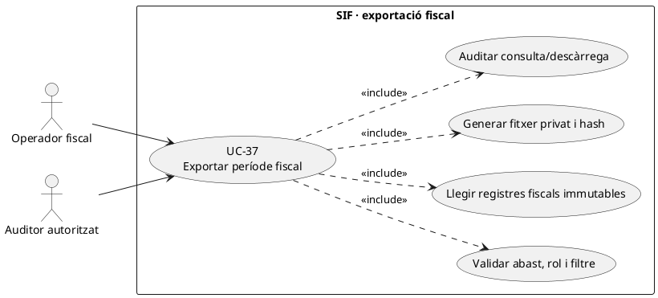
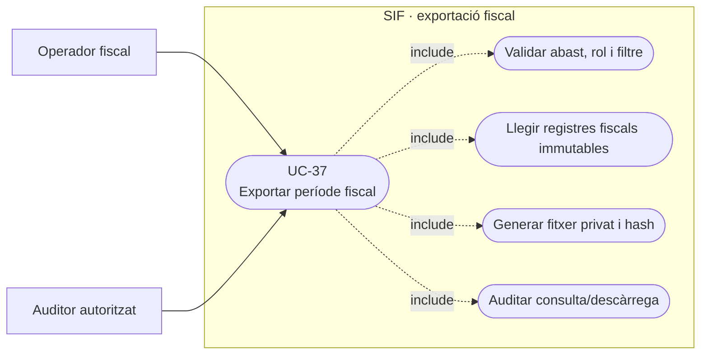
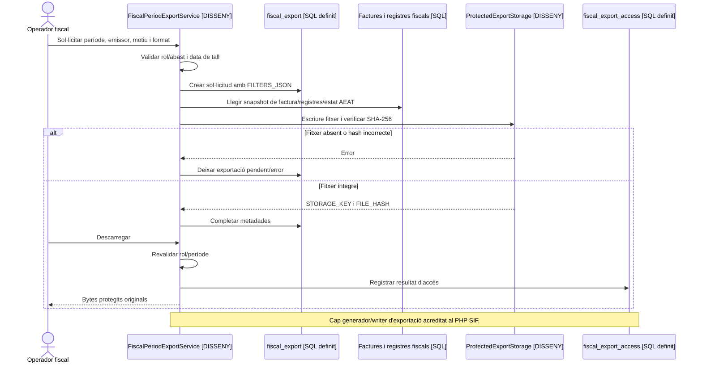

# UC-37 · Exportar un període fiscal sense alterar les factures

**Objectiu original:** format, hash, registre i permisos per decidir. **Estat [DISSENY].** La migració `2026_09_15_000003_add_functional_audit_control.sql` defineix `fiscal_export` i `fiscal_export_access`; no s'ha acreditat un generador PHP d'exportacions fiscals amb aquest circuit a `sif/src`. Exportar és llegir una fotografia verificable, no reemetre, corregir ni retransmetre factures.

## 1. Fitxa específica

| Element | Contracte |
| --- | --- |
| Actor | Operador fiscal o auditor amb rol, període i abast aprovats. Un accés de lectura al panell no concedeix per si sol dret a exportar totes les dades personals. |
| Entrada | Data d'inici/final amb zona i criteri temporal definit (emissió, registre o altra data aprovada), emissor/sèrie, tipus de registre, estat AEAT, factura/rectificativa, `REQUEST_ID`, motiu i correlació. Els filtres es preserven a `FILTERS_JSON`. |
| Font | `factura`, `factura_linia`, `factura_registres`, `factura_rectificacio`, cua i respostes AEAT segons format acordat. Conservar `ALTA`, `ANULACIO` i `SUBSANACIO` quan el criteri de l'exportació els inclou; no substituir història per l'estat actual de factura. |
| Persistència definida | `fiscal_export` guarda UUID, tipus, filtres, sol·licitant/rol, motiu, estat, `STORAGE_KEY`, `FILE_HASH` i correlació. `fiscal_export_access` permet registrar consulta/descàrrega o denegació, amb actor/rol/instant. **Cap writer/worker PHP acreditat.** |
| Fitxer | Format, versió, camps i codificació **pendents d'aprovació**; serialitzar valors originals, cèntims i relacions sense alterar import, número o hash fiscal. Custòdia privada i verificació de hash sobre bytes reals. |
| Efecte | Cap `CHARGE`, `REFUND`, modificació de `factura_registres`, `fiscal_chain_state`, numeració ni cua AEAT per crear o descarregar l'exportació. |

### Flux objectiu

1. Validar rol, motiu, període i emissor; previsualitzar volum, dades sensibles, registres pendents o en error i precisió del filtre temporal.
2. Crear/reutilitzar ordre `fiscal_export` amb conjunt de filtres **immutable** i referència de sol·licitud. Si mateixa clau amb filtres diferents, conflicte en lloc de reusar un fitxer no equivalent; el SQL no inclou clau d'idempotència, per tant la política/writer són pendents.
3. Llegir un snapshot coherent de factures, registres i estat remot **en el moment de tall**; anotar data de tall i estat de cua perquè un registre encara pendent no es presenti com a acceptat.
4. Construir fitxer de format aprovat, verificar cardinalitats, totals i hashes d'artefacte, desar-lo en storage privat; només després completar `STORAGE_KEY/FILE_HASH`.
5. En cada consulta o descàrrega, revalidar permisos i registrar `fiscal_export_access` amb resultat, sense exposar `STORAGE_KEY` com a URL pública.
6. Una exportació defectuosa genera una **nova versió de l'artefacte o una incidència**, mai un `UPDATE` dels registres fiscals per fer quadrar el fitxer.

**Proves pendents:** tall de període amb canvi d'hora, factures rectificades, anul·lació/subsanació en data posterior, cua encara pendent, canvi de rol durant una descàrrega, hash discordant, fitxer absent, dos exportadors concurrents i totals per emissor/sèrie.

### Exportació del període amb històrics, rectificatives i emissors separats

**Delimitació del conjunt de dades.** Les factures importades per UC-11 tenen `ESTAT_FACTURA=HISTORICAL`, `ESTAT_AEAT=NO_VERIFACTU` i `SOURCE_CHANNEL=MIGRACIO`: no contenen per això una `ALTA` a `factura_registres` ni estan incloses a la nova cadena. L'exportació de **registres fiscals generats pel SIF** i l'inventari de **factures històriques** són conjunts diferents, encara que es puguin presentar en un paquet conjunt quan ho exigeixi l'abast aprovat. No crear files AEAT, hash fiscal o resposta remota ficticis per completar una exportació que abasta anys anteriors al desplegament.

**Període i dues dates rellevants.** En una factura històrica, `DATA_EMISSIO` ha de representar la data original acreditada, mentre que la data d'importació és un fet tècnic posterior; en un registre nou `DATE_SENT` pot ser posterior a l'emissió i `ANULACIO/SUBSANACIO` poden pertànyer a un altre període. Cada exportació ha de declarar el criteri temporal (`DATA_EMISSIO`, data de creació de registre o data de remissió, segons el format aprovat) i el tall exacte. No ordenar una factura antiga amb la data actual perquè l'importador hagi acceptat el seu `issue_date` per defecte; abans de preparar l'informe, marcar aquesta fila com a data històrica no acreditada si no es va recuperar de l'origen.

**Agrupació per emissor, sèrie i origen.** La consulta històrica de l'Associació i la SL (UC-97) requereix identificar l'emissor **per document**: no exportar-los sota el CIF de l'emissor actiu pel sol fet que el SIF té un bloc `issuer` a la configuració. Si el model no permet acreditar l'emissor d'un històric, reflectir-lo a les incidències del paquet, no assignar-lo per la numeració aparent. L'informe de migració previst compara per **any/sèrie** comptatge, primer/últim número i imports; afegir separació per origen/emissor acreditat quan es combinin fonts de dues entitats.

**Relacions i PDFs.** Per exportar un document històric A/R, conservar cada `NUM_VISIBLE` i la seva `FACTURA_RELACIONADA`, però no usar l'agrupador antic com a substitut de la relació fiscal directa entre rectificativa nova i original. Adjuntar un PDF només si els bytes originals/còpia admissible s'han localitzat, etiquetat i verificat; el hash importat a `factura_documents` sense fitxer no és una prova d'integritat física. No exposar al participant de grup un paquet amb la factura completa de l'empresa per la mera existència de `fact_rels.VISIBLE_ALUMNE=1`.

### Proves addicionals d'abast d'exportació (no executades)

| ID | Escenari | Resultat exigible |
| --- | --- | --- |
| EX-37-01 | Export fiscal inclou una factura de `MIGRACIO/NO_VERIFACTU` | Inventari històric diferenciat; cap ALTA/acceptació AEAT inventada. |
| EX-37-02 | Factura emesa al desembre i remesa al gener | Filtre temporal explícit; el tall no barreja dates d'emissió i remissió. |
| EX-37-03 | Associació i SL comparteixen número en un any | Dues identitats documentals només si emissor/origen acreditats; cap consolidació cega. |
| EX-37-04 | Hash de document importat però arxiu absent | Estat de prova documental incomplet; no incloure com a PDF verificat. |
| EX-37-05 | Família històrica amb A i R | Inventari de tots dos documents; no reemplaçar l'A amb l'últim saldo. |
| EX-37-06 | Auditor exporta factura de grup sense permís complet | Aplicar autorització de receptor i abast a l'artefacte, no confiar en VISIBLE_ALUMNE. |

## 2. UML de casos d'ús

### Vista de casos d’ús per a GitHub (Mermaid)

## 3. UML de classes — model SQL vs generador pendent

## 4. UML de seqüència — exportació i descàrrega (DISSENY)

## 5. Traçabilitat

[UC-37 original](../06-fitxes-funcionals/uc-037.md) · [UC-84 paquet auditor original](../06-fitxes-funcionals/uc-084.md) · [UC-77 tramesa](uc-077-operar-enviament-aeat-retry-dead-letter.md) · [UC-80 accés fiscal](uc-080-servir-registrar-acces-document-fiscal.md) · [Esquema fiscal_export i fiscal_export_access](../../sif/database/migrations/2026_09_15_000003_add_functional_audit_control.sql).
