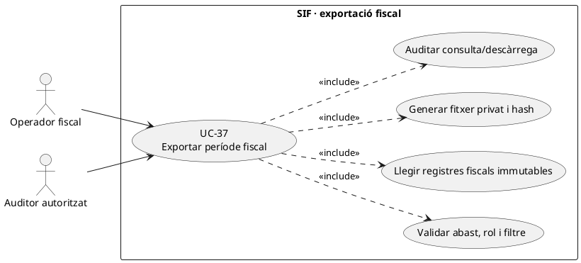
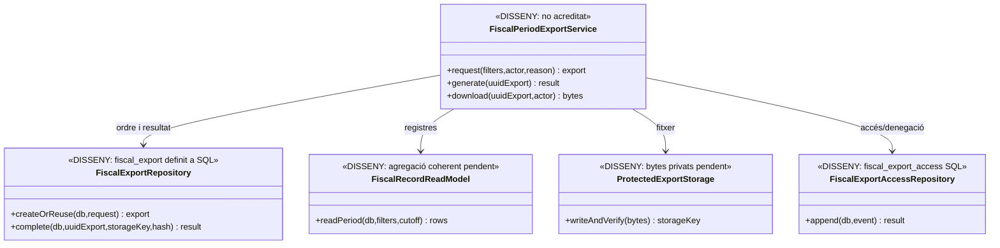
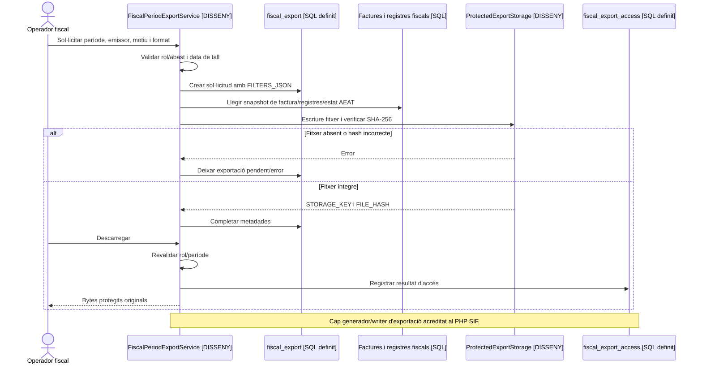

# UC-37 · Exportar un període fiscal sense alterar les factures

**Objectiu original:** format, hash, registre i permisos per decidir. **Estat [DISSENY].** La migració `2026_09_15_000003_add_functional_audit_control.sql` defineix `fiscal_export` i `fiscal_export_access`; no s'ha acreditat un generador PHP d'exportacions fiscals amb aquest circuit a `sif/src`. Exportar és llegir una fotografia verificable, no reemetre, corregir ni retransmetre factures.

## 1. Fitxa específica

| Element | Contracte |
| --- | --- |
| Actor | Operador fiscal o auditor amb rol, període i abast aprovats. Un accés de lectura al panell no concedeix per si sol dret a exportar totes les dades personals. |
| Entrada | Data d'inici/final amb zona i criteri temporal definit (emissió, registre o altra data aprovada), emissor/sèrie, tipus de registre, estat AEAT, factura/rectificativa, `REQUEST_ID`, motiu i correlació. Els filtres es preserven a `FILTERS_JSON`. |
| Font | `factura`, `factura_linia`, `factura_registres`, `factura_rectificacio`, cua i respostes AEAT segons format acordat. Conservar `ALTA`, `ANULACIO` i `SUBSANACIO` quan el criteri de l'exportació els inclou; no substituir història per l'estat actual de factura. |
| Persistència definida | `fiscal_export` guarda UUID, tipus, filtres, sol·licitant/rol, motiu, estat, `STORAGE_KEY`, `FILE_HASH` i correlació. `fiscal_export_access` permet registrar consulta/descàrrega o denegació, amb actor/rol/instant. **Cap writer/worker PHP acreditat.** |
| Fitxer | Format, versió, camps i codificació **pendents d'aprovació**; serialitzar valors originals, cèntims i relacions sense alterar import, número o hash fiscal. Custòdia privada i verificació de hash sobre bytes reals. |
| Efecte | Cap `CHARGE`, `REFUND`, modificació de `factura_registres`, `fiscal_chain_state`, numeració ni cua AEAT per crear o descarregar l'exportació. |

### Flux objectiu

1. Validar rol, motiu, període i emissor; previsualitzar volum, dades sensibles, registres pendents o en error i precisió del filtre temporal.
2. Crear/reutilitzar ordre `fiscal_export` amb conjunt de filtres **immutable** i referència de sol·licitud. Si mateixa clau amb filtres diferents, conflicte en lloc de reusar un fitxer no equivalent; el SQL no inclou clau d'idempotència, per tant la política/writer són pendents.
3. Llegir un snapshot coherent de factures, registres i estat remot **en el moment de tall**; anotar data de tall i estat de cua perquè un registre encara pendent no es presenti com a acceptat.
4. Construir fitxer de format aprovat, verificar cardinalitats, totals i hashes d'artefacte, desar-lo en storage privat; only després completar `STORAGE_KEY/FILE_HASH`.
5. En cada consulta o descàrrega, revalidar permisos i registrar `fiscal_export_access` amb resultat, sense exposar `STORAGE_KEY` com a URL pública.
6. Una exportació defectuosa genera una **nova versió de l'artefacte o una incidència**, mai un `UPDATE` dels registres fiscals per fer quadrar el fitxer.

**Proves pendents:** tall de període amb canvi d'hora, factures rectificades, anul·lació/subsanació en data posterior, cua encara pendent, canvi de rol durant una descàrrega, hash discordant, fitxer absent, dos exportadors concurrents i totals per emissor/sèrie.

## 2. UML de casos d'ús

## 3. UML de classes — model SQL vs generador pendent

## 4. UML de seqüència — exportació i descàrrega (DISSENY)

## 5. Traçabilitat

[UC-37 original](../06-fitxes-funcionals/uc-037.md) · [UC-84 paquet auditor original](../06-fitxes-funcionals/uc-084.md) · [UC-77 tramesa](uc-077-operar-enviament-aeat-retry-dead-letter.md) · [UC-80 accés fiscal](uc-080-servir-registrar-acces-document-fiscal.md) · [Esquema fiscal_export i fiscal_export_access](../../sif/database/migrations/2026_09_15_000003_add_functional_audit_control.sql).
