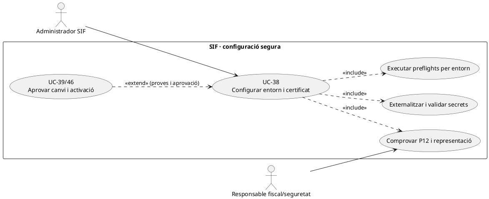
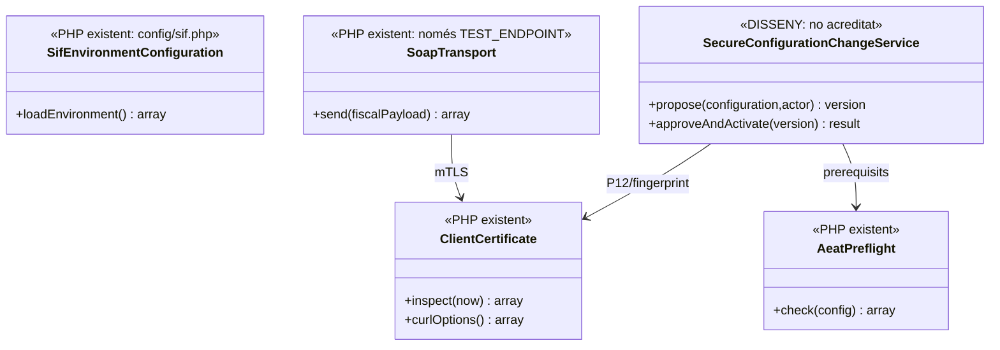

# UC-38 · Configurar el SIF i el certificat sense exposar secrets

**Objectiu original:** secrets i certificat fora del repositori; implementació pendent. **Estat [DISSENY/PARCIAL].** `sif/config/sif.php` carrega paràmetres des de variables d'entorn, però un fitxer de configuració i comprovacions locals no constitueixen un circuit complet de provisió, rotació, revocació i activació d'entorn.

## 1. Codi i contracte de configuració

`sif/config/sif.php` llegeix `SIF_ENV`, DSN/usuari/contrasenya de BD SIF i llegada, dades d'emissor i sèries, `SIF_REDSYS_MERCHANT_KEY`, i paràmetres AEAT: WSDL, endpoint, XSD, ruta/contrasenya del certificat, NIF emissor, ID/versió SIF i ID instal·lació, així com política de retry. Els valors de desenvolupament (inclòs NIF d'exemple) **no són una configuració productiva validada**.

`ClientCertificate::inspect()` comprova que el fitxer PKCS#12 és llegible **fora del repo/webroot**, que certificat/clau privada coincideixen i que la validesa temporal és correcta. El codi mateix adverteix que aquestes comprovacions locals **no acrediten confiança de l'AEAT, revocació ni representació**. `AeatPreflight::check()` comprova extensions, URLs HTTPS, XSD/certificat llegibles i camps no buits; tampoc comprova qualitat del contingut, identitat fiscal o connexió remota amb acceptació real. `SoapTransport` revisat **només admet l'endpoint AEAT de proves** i refusa un endpoint diferent; no deduir disponibilitat productiva.

## 2. Fitxa funcional

| Element | Contracte |
| --- | --- |
| Actor | Administrador SIF autoritzat, responsable de seguretat/certificat i responsable fiscal per a emissor i representació. |
| Entrada | Entorn `local/test/preproduction/production` segons política final, host/DB segregats, emissor real, sèries, referències opaques de secrets, certificat i fingerprint, dates de validesa, endpoint/WSDL/XSD, versió/instal·lació i `REQUEST_ID`. |
| Secret | Variables d'entorn o magatzem protegit segons entorn i permisos mínims; **no** copiar clau Redsys, password de BD, password del P12 o clau privada a Git, `PAYLOAD_JSON`, exportacions, logs o captures d'errors. |
| Certificat | Verificar fitxer, fingerprint, titular, habilitació/representació fiscal aplicable, cadena de confiança, venciment i revocació **amb un circuit aprovat**; el PHP existent només comprova una part d'aquests punts localment. |
| Canvi de configuració | Versionar artefacte/configuració (`sif_version.CONFIG_HASH` definida a SQL), actor, data, resultat de proves, pla de rollback i finestres de rotació; no activar secrets nous en worker i callback de manera inconsistent. |
| Integració | UC-39 preflights, UC-46/83 activació versionada; UC-77 transmet únicament quan la versió/entorn compleixen les condicions reals. `ready=true` local no substitueix una validació de l'AEAT. |
| Economia | Canviar certificat/endpoint no modifica factures ni genera pagaments; els registres pendents conserven identitat i hash, i el tractament de retries incerts requereix UC-77. |

### Flux i riscos

1. Preparar configuració **separada per entorn**, amb issuer/NIF/sèrie coherent amb empresa emissora i secrets fora de Git. No assumir que el valor local d'exemple és l'emissor autoritzat.
2. Comprovar permisos de fitxer, cicle de vida P12, cadena de confiança/representació segons procés extern aprovat i disponibilitat d'endpoint, WSDL i XSD. Registrar només fingerprint, caducitat i codi de resultat, mai password ni bytes de certificat.
3. Executar `AeatPreflight`, comprovacions de BD SIF/llegada i proves de l'entorn; diferenciar **preflight de presència** i prova de funcionalitat. Si falla, bloquejar activació, no editar registres fiscals per adaptar-los a una configuració incompleta.
4. Preparar canvi de versió/configuració i finestra de rotació amb worker drenat o estratègia segura per les transaccions en vol; conservar evidència de rollback.
5. Aprovar i activar només després del go/no-go UC-39 i la validació del transport **de l'entorn objectiu**. El `SoapTransport` actual restringit a test és un bloquejant de qualsevol afirmació d'enviament productiu amb aquesta classe.
6. Provar: P12 inaccessible/dins webroot, password incorrecta, clau/certificat discordants, caducitat/revocació, NIF emissor incorrecte, endpoint productiu rebutjat per `SoapTransport`, workers concurrents amb dos fingerprints, secrets en logs i rollback després de callback en curs.

### 2.1. Tres identitats que s'han de verificar a l'entorn abans del transport

**Entorn, emissor i certificat no són una sola dada.** `sif/config/sif.php` configura `SIF_ENV`, `issuer`, `aeat.issuer_nif`, `system_id/system_version/installation_id` i el P12 per referència de fitxer/contrasenya. `AeatPreflight::check()` només comprova que `issuer_nif` i identificadors **no són buits**, que WSDL/endpoint són URL HTTPS, que XSD i P12 són llegibles i que hi ha una contrasenya configurada; **no comprova en aquesta funció** igualtat entre NIF emissor de la factura, representació del certificat ni recepció remota de l'AEAT. El control objectiu verifica per cada entorn i emissor l'origen dels valors, la titularitat/representació acreditada del certificat i l'abast de la versió declarada, amb evidència de prova diferenciada.

**Fals positiu de configuració.** Configurar `certificate_password` amb text no buit o una ruta a un P12 llegible fa que passin els checks de presència corresponents sense acreditar que la contrasenya obri la clau, que el certificat estigui vigent o que s'accepti per al titular. `ClientCertificate::inspect()` cobreix comprovacions locals de fitxer/clau i validesa temporal, però no converteix una inspecció en acceptació per l'AEAT. El resultat del preflight i el de la inspecció de certificat han de registrar-se **per separat**, juntament amb la prova real del transport de l'entorn autoritzat quan el circuit productiu estigui disponible. El `SoapTransport` de la branca només admet l'endpoint de proves: no etiquetar el resultat com a verificació productiva.

**Canvi de certificat amb cues en vol.** Abans de canviar el P12/configuració, inventariar jobs `fiscal_queue` pendents, `PROCESSING`, `SENT` amb resposta individual incerta i el fingerprint configurat a **cada worker real**. El canvi de certificat **no altera** `UUID_FACTURA`, `FISCAL_ORDER`, hash fiscal ni payload ja congelat. Si falla l'enviament després de la rotació, preservar l'intent i classificar el resultat remot UC-77/81, no crear una altra factura o repetir registres per «reparar» la credencial. Un secret nou en HTTP i un d'antic al worker és un desplegament parcial, no configuració homogènia.

### 2.2. Proves de configuració no confoses amb conformitat (no executades)

| ID | Escenari | Resultat exigible |
| --- | --- | --- |
| CF-38-01 | NIF emissor d'exemple i P12 llegible | La presència de camps no autoritza emissió real; emisor/certificat pendents de contrast. |
| CF-38-02 | `certificate_password` no buida però incorrecta | Diferenciar preflight de presència i prova real d'obertura del P12. |
| CF-38-03 | Certificat aparentment vigent però representació no acreditada | No donar per validat l'ús per aquell emissor. |
| CF-38-04 | Canvi de P12 quan hi ha job AEAT `PROCESSING` | Conservar registre i intent original; gestionar resultat incert sense segon registre. |
| CF-38-05 | Worker antic i HTTP nou llegeixen referències de secret diferents | Estat parcial per procés; bloqueig del GO fins a contrast d'entorn. |
| CF-38-06 | Preflight local positiu amb transport limitat a endpoint test | Cap declaració de verificació d'enviament productiu. |

## 3. UML de casos d'ús



## 4. UML de classes — configuració carregada, governança pendent



## 5. UML de seqüència — certificat no apte (DISSENY/PARCIAL)

```mermaid
sequenceDiagram
actor A as Administrador
participant C as SecureConfigurationChangeService [DISSENY]
participant Env as config/sif.php [PHP]
participant P as AeatPreflight [PHP]
participant Cert as ClientCertificate [PHP]
participant G as Gate UC-39/46 [pendent]
A->>C: Proposar entorn, issuer, fingerprint i endpoint
C->>Env: Carregar referències de secrets i paràmetres
C->>P: check(config AEAT)
C->>Cert: inspect()
alt P12 invàlid, secrets absents o entorn no qualificat
 Cert-->>C: Fallada / validació incompleta
 C-->>A: Bloqueig d'activació, cap secret al log
else Preflight local correcte
 Cert-->>C: Fingerprint i caducitat
 P-->>C: ready=true local
 C->>G: Sol·licitar proves reals i aprovació formal
 G-->>A: Decisió d'activació o bloqueig
end
Note over C,G: El transport PHP revisat només admet TEST_ENDPOINT; el flux productiu no està acreditat.
```

## 6. Traçabilitat

[UC-38 original](../06-fitxes-funcionals/uc-038.md) · [UC-39 proves](../06-fitxes-funcionals/uc-039.md) · [UC-46 activació](../06-fitxes-funcionals/uc-046.md) · [UC-67 secrets original](../06-fitxes-funcionals/uc-067.md) · [config/sif.php](../../sif/config/sif.php) · [ClientCertificate](../../sif/src/Aeat/ClientCertificate.php) · [AeatPreflight](../../sif/src/Service/AeatPreflight.php) · [SoapTransport](../../sif/src/Aeat/SoapTransport.php).
