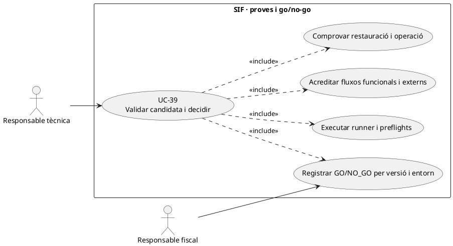
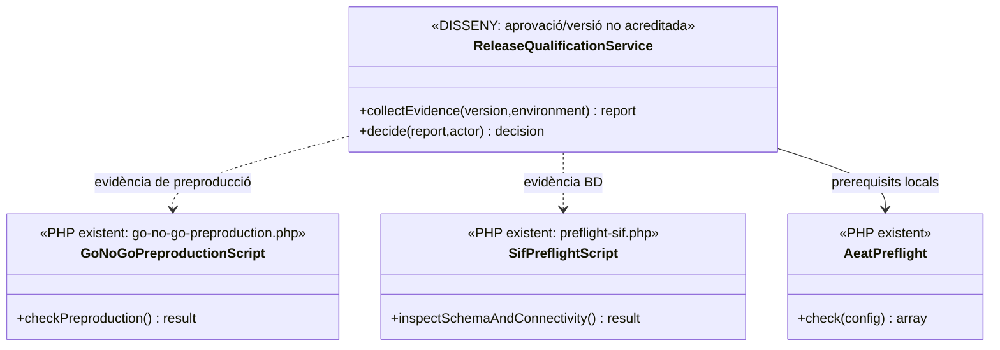

# UC-39 · Executar proves i decidir el go/no-go del SIF

**Objectiu original:** runner, preflights i gate disponibles; entorn real pendent. **Estat [BASE/PARCIAL].** El repositori té `sif/tests/run-tests.php`, `scripts/preflight-sif.php`, `scripts/preflight-aeat-worker.php` i `scripts/go-no-go-preproduction.php`. La presència de scripts **no acredita que s'hagin executat amb èxit en un entorn concret ni autoritza producció**.

## 1. Gate existent i límits

`go-no-go-preproduction.php` exigeix CLI i `SIF_ENV=test` o `preproduction`, comprova extensions, configuració, connectivitat SIF i llegada, esquema/migracions, existència de taules i seed de `fiscal_chain_state`, i presència dels circuits/fitxers de curs, pack, grup, regal, cobrament, rectificació i altres canals. **És un gate de preproducció**, no una aprovació de producció. L'existència d'un fitxer PHP no prova que el seu flux resolgui totes les variants funcionals o que els bancs/AEAT externs hagin respost correctament.

`AeatPreflight::check()` comprova extensions, URLs HTTPS, fitxers XSD/certificat i valors de configuració. `preflight-aeat-worker.php` consulta mètriques de cua i alerta davant `DEAD_LETTER`, volum pendent o locks antics. `SoapTransport` de la branca consultada només admet `TEST_ENDPOINT`. **No s'han executat ara el runner ni cap preflight sobre els entorns de PrisMa**; la fitxa especifica les proves i evidències que s'han de recollir en cada execució real.

## 2. Fitxa específica

| Fase | Contracte |
| --- | --- |
| Identificar versió | Fixar Git revision, hash de l'artefacte, hash de configuració **sense secrets**, versió BD, entorn, emissor i sèries; enllaçar a `sif_version` quan el writer de governança estigui disponible. |
| Gate tècnic | Executar runner i preflights en entorn aïllat, capturar comanda/versió, exit code, errors, durada i evidències. Un `schema_verified=true` no prova integritat de dades històriques ni format AEAT real. |
| Gate funcional | Proves per canals manual/Redsys/empresa/grup/pack/regal, factura abans de cobrar, fraccions, baixes i rectificatives, callbacks duplicats/tardans, idempotència i atribució individual de diners. El ledger individual segueix **proposta**, per tant aquestes proves no poden marcar-se com a passades globalment. |
| Gate AEAT | Validar certificat, endpoint **de l'entorn objectiu**, XML/respostes, cua i recuperació davant enviament incert; `SoapTransport` actual **bloqueja afirmar un enviament productiu**. |
| Gate operatiu | Custòdia real de PDF/QR/XML, permisos, exportació, auditoria, backup amb restauració verificada, alertes, incidències i conciliació SIF/llegat; SQL definit no acredita workers en funcionament. |
| Decisió | Responsable autoritzat registra `GO` o `NO_GO` **per entorn i versió** amb desviacions, evidències i risc residual. Les denominacions són estats objectiu, no enum DB acreditat. Cap deploy automàtic per la sola sortida `ok=true` d'un script. |

### Flux i proves de control

1. Congelar codi, migracions i configuració de la candidata. Preparar fonts de test segures i criteris de pas aprovats per cada canal, sense dades personals productives en entorn de proves.
2. Executar `tests/run-tests.php`, `preflight-sif.php`, preflights de canals i `go-no-go-preproduction.php`, conservar sortida completa i errors identificats. Si falla una comprovació, deixar bloqueig i no «arreglar» evidència canviant el nom del resultat.
3. Fer proves de concurrència i de fallades externes: dos workers, retry idempotent, timeout SOAP després d'acceptació remota, callback bancari duplicat i restauració de backup.
4. Revisar buits funcionals oberts de la matriu UML i els components no acreditats (ledger d'inscripció, control de places, outbox de correu, documents físics, autenticació del portal). Anotar **bloquejants per l'abast real** abans d'un GO.
5. Registrar decisió per versió i entorn amb autorització fiscal/tècnica. UC-46/83 només activa una versió quan el gate apropiat i la documentació requerida estan complets; `NO_GO` conserva versió anterior sense tornar a crear factures o cobraments.
6. Provar: no hi ha BD llegada, NIF d'exemple, preflight `ready=true` però SOAP rebutjat, prova parcial de pack i controlador d'enllaços absent, backup creat però impossible de restaurar, declaració no signada i reexecució del gate amb artefacte diferent.

### 2.1. El GO tècnic que retorna l'script no autoritza el desplegament productiu

**Lectura exacta de la sortida del CLI existent.** `sif/scripts/go-no-go-preproduction.php` construeix `go_no_go_decision=GO` si no falla cap comprovació del seu array, però retorna també `scope=technical_preflight_only` i **`production_authorized=false` en tots els resultats**. Entre els checks hi ha presència de fitxers/runner, extensions, configuració no buida, connexions amb les BDs, algunes taules i `fiscal_chain_state` sembrada; la presència dels fitxers `process-redsys-course.php` o de `factura_documents` **no és un cas d'acceptació de cobrament, document físic o transport AEAT**. A l'acta del gate, conservar el JSON original i el camp d'abast, sense traduir `GO` tècnic a «SIF apte per producció».

**Evidència per exercici, no per nom de script.** Fer correspondre cada escenari aprovat amb: commit i hash de l'artefacte executat, entorn, emissor, versió SQL real, fitxer de prova, dades fictícies, precondicions, resultat observat, artefacte/UUID generat i qui el valida. Diferenciar explícitament prova local, preproducció, integració web real, resposta externa i funcionament productiu. Un test que comprova idempotència de `InvoiceService` no demostra per si sol que `realitzaPagamentAutomatic.php` hagi deixat de ser emissor llegat, ni que el frontend impedeixi el doble cobrament per dues `DS_ORDER`.

**Bloquejants d'aquesta arquitectura que no són checks del GO actual.** Afegir resultats específics per autenticació de `public/api/factures/issue.php` i `payments/register.php`, control de plaça UC-115, ordre/descompte del pack UC-122, titular de grup UC-118, existència/hash del PDF UC-78, resposta AEAT per registre UC-35, recuperació de backup UC-85 i correspondència d'artefacte/declaració UC-83. Per a un circuit no desenvolupat, marcar `NOT_IMPLEMENTED` o `NOT_TESTED` **com a categories de l'acta**, no «PASS» perquè la taula SQL existeix o no hi ha errors registrats.

### 2.2. Proves del mateix gate (no executades)

| ID | Escenari | Resultat exigible |
| --- | --- | --- |
| GG-39-01 | El CLI retorna `GO` i `production_authorized=false` | Informe `GO` tècnic limitat a preproducció; cap autorització productiva. |
| GG-39-02 | Fitxer del worker existeix, però no hi ha execució Redsys externa provada | Circuit pendent de prova, no `PASS` per presència. |
| GG-39-03 | Documents `CREATED` a SQL però storage físic absent | Gate documental pendent/fallit i no document disponible. |
| GG-39-04 | Cua `SENT` amb registre AEAT `REJECTED` | Gate de transport/recepció no superat, tot i cua sense jobs due. |
| GG-39-05 | Runner aprovat per un commit i desplegament en un altre | Proves no transferibles sense revalidar hash, configuració i versions. |
| GG-39-06 | Un grup té tres inscrits i un sol cobrament real | Prova del valor extern i atribucions, cap triplicació d'ingressos. |

## 3. UML de casos d'ús



## 4. UML de classes — scripts reals i gate de decisió pendent



## 5. UML de seqüència — preflight correcte però GO bloquejat

```mermaid
sequenceDiagram
actor T as Responsable tècnica
actor F as Responsable fiscal
participant Q as ReleaseQualificationService [DISSENY]
participant G as go-no-go-preproduction.php [PHP]
participant A as AeatPreflight [PHP]
participant E as Evidències de proves i backup
T->>Q: Validar versió/hash/entorn preproducció
Q->>G: Executar gate CLI [execució externa controlada]
G-->>Q: Checks, fallades i exit code
Q->>A: check(config AEAT)
A-->>Q: ready local / checks
Q->>E: Reunir tests, resposta AEAT de proves i restauració verificada
alt Falta prova funcional o de restauració
 E-->>Q: Evidència incompleta
 Q-->>F: NO_GO o decisió pendent, sense activació
else Evidència completa per l'abast aprovat
 E-->>Q: Informe amb hashes i riscos
 F->>Q: Aprovar decisió per entorn i versió
 Q-->>T: Decisió registrada; UC-46/83 fa activació separada
end
Note over G,Q: No s'han executat aquests scripts ni proves d'entorn en aquesta revisió documental.
```

## 6. Traçabilitat

[UC-39 original](../06-fitxes-funcionals/uc-039.md) · [UC-38 configuració](uc-038-configurar-sif-certificat.md) · [UC-40 restauració original](../06-fitxes-funcionals/uc-040.md) · [UC-46 activació original](../06-fitxes-funcionals/uc-046.md) · [go-no-go-preproduction.php](../../sif/scripts/go-no-go-preproduction.php) · [preflight-sif.php](../../sif/scripts/preflight-sif.php) · [preflight-aeat-worker.php](../../sif/scripts/preflight-aeat-worker.php) · [tests/run-tests.php](../../sif/tests/run-tests.php).
