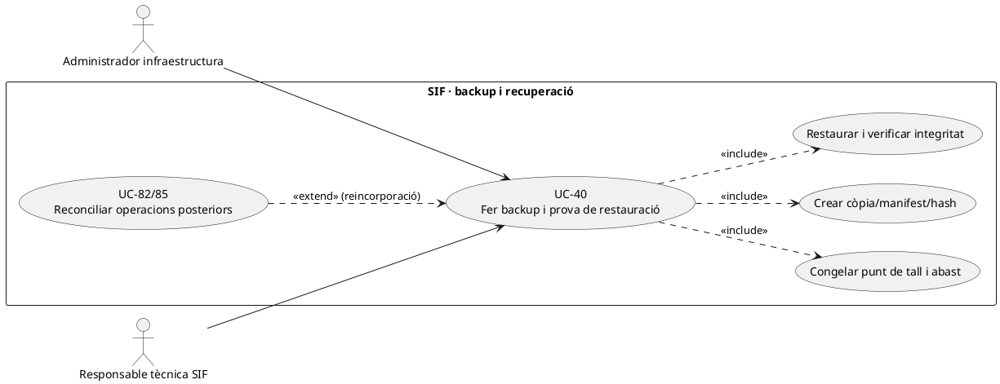
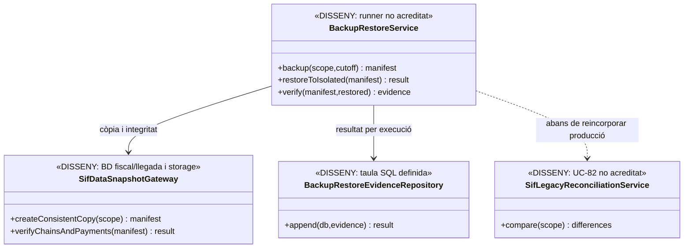
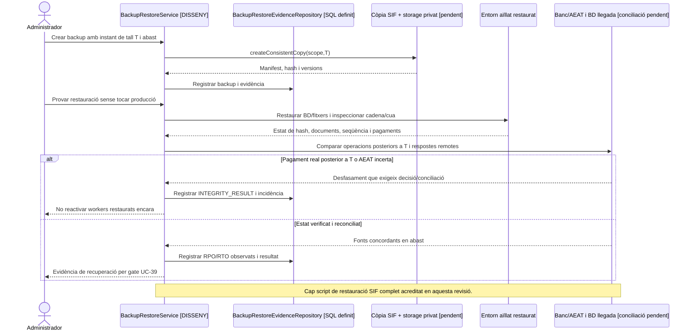

# UC-40 · Fer backup i restauració sense perdre traça fiscal

**Objectiu original:** procediment definit; execució i evidència pendents. **Estat [DISSENY].** La migració defineix `backup_restore_evidence` però no s'ha acreditat un backup/restore runner PHP complet del SIF ni una restauració verificada de les dues BDs i dels fitxers privats. Una còpia creada **no és** una restauració comprovada; UC-85 desenvolupa el procés transversal i els criteris RPO/RTO.

## 1. Fitxa específica

| Unitat | Contracte |
| --- | --- |
| Actor | Administrador autoritzat de BD/infraestructura i responsable tècnica; un perfil auditor de només lectura no pot executar restauracions. |
| Abast | `factura`, línies, `factura_registres`, `fiscal_sequence`, `fiscal_chain_state`, `fiscal_queue`, pagaments, assignacions, notificacions, incidents i taules de governança, més repositoris de bytes fiscals/evidència i dependències de BD llegada. No suposar que un dump MySQL conté els fitxers de PDF, P12 o evidència SOAP. |
| Còpia | Instant i punt de tall coherents, versió migracions, sistema origen/destí, xifrat i custòdia restringida, hash verificat, retenció, `BACKUP_REFERENCE` i `BACKUP_HASH`. **No** copiar certificats/claus privades en clar a un artefacte compartible. |
| Restauració | Entorn aïllat amb credencials pròpies, comprovació d'integritat, seqüència/cadena/hash fiscals, correlació de cua/registre, idempotència de Redsys, fitxers i permisos, i comparació amb fotografia d'origen. **No** restaurar un dump antic sobre producció viva sense pla de reconciliació de moviments posteriors. |
| Evidència SQL | `backup_restore_evidence`: `UUID_EVIDENCE`, `OPERATION_TYPE`, `ENVIRONMENT`, `SCOPE_JSON`, `BACKUP_REFERENCE/HASH`, `STATUS`, `RPO_MINUTES`, `RTO_MINUTES`, `INTEGRITY_RESULT`, executor, correlació i `EVIDENCE_JSON`. **No acredita que cap prova de restauració s'hagi executat.** |
| Efecte fiscal/econòmic | Backup/restore no emet factures ni genera `CHARGE/REFUND`. Davant un desfasament amb AEAT/banc o llegat, **reconciliar abans de reprendre cues/cobraments**, sense inventar o duplicar un registre d'emissió. |

### Flux objectiu

1. Definir finestra, objectius de recuperació i instant de tall: registrar versió del codi/BD, estat de workers i consistència entre BD fiscal, llegada i storage d'evidències.
2. Fer còpia consistent i protegida, conservar manifest per component i hash, i verificar que bytes i fitxers privats figuren al pla segons retenció. Registrar resultat a `backup_restore_evidence` mitjançant writer **pendent**.
3. Restaurar **en entorn separat**, executar migracions/inspecció amb versions corresponents i verificar documents/UUID/numeració, cadena de registres i que cada fila de cua correspon al seu `fiscal_order`. Comprovar pagaments i assignacions per factura.
4. Comparar punt de tall i operacions posteriors: callbacks Redsys, cobrament extern, enviament AEAT que podria haver tingut resposta remota, factura creada després del backup i edicions al llegat. Un snapshot antic no prova que un cobrament actual sigui inexistent.
5. Reconciliar UC-82/85 amb banc i AEAT **abans de permetre a un worker restaurat retransmetre o registrar operacions en vol**; qualsevol incertesa obre incidència UC-81.
6. Mesurar RPO/RTO **observats**, no només objectius declarats; conservar prova d'integritat i decisió de go/no-go UC-39, sense presentar `STATUS=SUCCESS` amb hashes incomplets.

**Proves pendents:** backup amb documents absents, corrupció hash, restaurar sense `fiscal_chain_state`, còpia amb job `PROCESSING`, timeout AEAT immediatament abans del backup, callback Redsys posterior al punt de tall, desalineació SIF/llegat, dades personals a un entorn de test i recuperació sense certificat productiu.

### 1.1. Inventari material del backup de PrisMa abans de donar-lo per complet

**Quatre conjunts físics separats.** La BD fiscal SIF conté `factura`, `factura_linia`, `factura_registres`, `fiscal_chain_state`, `fiscal_sequence`, `fiscal_queue`, pagaments, assignacions i metadades dels documents. Les inscripcions, `IDPAG`, estat acadèmic, contacte i agrupadors `FACTURA_RELACIONADA` viuen a la **BD web llegada**; els PDF/XML i evidències són **bytes al storage privat** quan s'han custodiat; el codi, migracions i configuració efectiva constitueixen el quart conjunt que permet interpretar i recuperar les dades. Un `mysqldump` d'una sola BD **no inclou** els altres tres conjunts. El P12 AEAT i les claus de pagament requereixen una estratègia de custòdia/reaprovisionament protegida, **no** copiar-los en clar dins del paquet de restauració.

**Consistència i manifest, no només nombre d'arxius.** El runbook pendent ha de registrar per component sistema/font, emissor quan pertoqui, punt de tall/versió, identificador d'artefacte, hash calculat sobre **bytes realment copiats**, permisos i resultat de lectura. Un `factura_documents.HASH_FITXER` a SQL sense el PDF físic no prova que s'hagi custodiat; `DocumentRepository::registerDocument()` només crea metadades i no escriu l'arxiu. En una còpia històrica, identificar per separat documents originals localitzats i PDFs reconstruïts, sense etiquetar els segons com a originals immutables.

**Restauració aïllada amb workers aturats.** Recuperar cada component en un destí de prova segregat i **sense crides a Redsys/AEAT productius**, verificar que els UUIDs, la seqüència fiscal i els hashes originals són llegibles i coherents, que cada factura/document existeix i que els vincles a `ID_INSC` es resolen amb la versió llegada restaurada. `MigrationRunner::inspect()` comprova esquema/ledger de migracions, però no prova la correspondència temporal entre els dos dumps ni la presència de PDFs. No activar el worker fiscal només perquè es poden fer `SELECT` a les taules.

**Continuïtat i dades externes posteriors.** UC-85 resol la reconciliació abans de reprendre producció: un callback Redsys, una devolució bancària o una resposta AEAT **posterior al punt de tall** segueixen existint encara que no figurin a la còpia. Una restauració que conserva `fiscal_queue.PENDING` pot tornar a enviar un registre ja rebut remotament; una BD web antiga pot tornar a mostrar deute ja cobrat. Registrar els deltes i el resultat per font abans de reobrir cap escriptor, sense generar una nova factura, un nou `CHARGE` o un `REFUND` per compensar la restauració.

### 1.2. Proves de completesa d'artefacte i prova de recuperació (no executades)

| ID | Escenari | Resultat exigible |
| --- | --- | --- |
| BK-40-01 | Dump SIF complet sense `web.inscripcions` | Backup d'abast parcial; no declarar recuperables els vincles `ID_INSC/IDPAG`. |
| BK-40-02 | `factura_documents` conté hash però falta PDF al storage | Manifest indica arxiu no custodiat i restauració documental incompleta. |
| BK-40-03 | Dump fiscal i dump web amb instants de tall diferents | Desfasament explícit i reconciliació per identificadors, no consistència presumpta. |
| BK-40-04 | Restauració de prova intenta connectar amb credencials productives | Bloqueig d'egress/segregació; no contacte real amb banc o AEAT. |
| BK-40-05 | Es recupera un job PENDING enviat a AEAT després del backup | Comprovar resultat extern abans del retry, no alta/registre duplicats. |
| BK-40-06 | Restore SQL correcte però codi/SQL de versions incompatibles | Resultat parcial; gate de versió abans de reprendre operacions. |

## 2. UML de casos d'ús

## 3. UML de classes — model SQL i execució pendent

## 4. UML de seqüència — restauració anterior a un pagament real

## 5. Traçabilitat

[UC-40 original](../06-fitxes-funcionals/uc-040.md) · [UC-85 continuïtat original](../06-fitxes-funcionals/uc-085.md) · [UC-39 go/no-go](uc-039-proves-gate-go-no-go.md) · [UC-82 conciliació](uc-082-reconciliar-sif-bd-llegada.md) · [UC-77 cua AEAT](uc-077-operar-enviament-aeat-retry-dead-letter.md) · [Esquema backup_restore_evidence](../../sif/database/migrations/2026_09_15_000003_add_functional_audit_control.sql).
