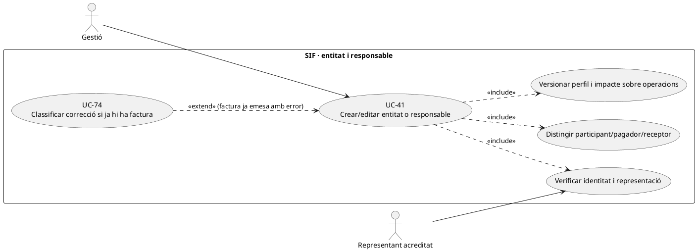
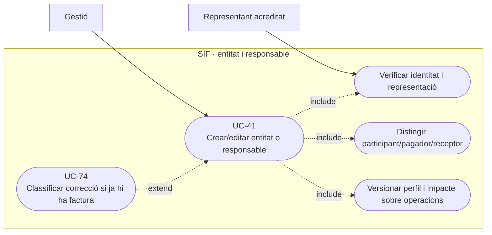
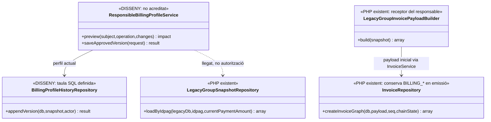
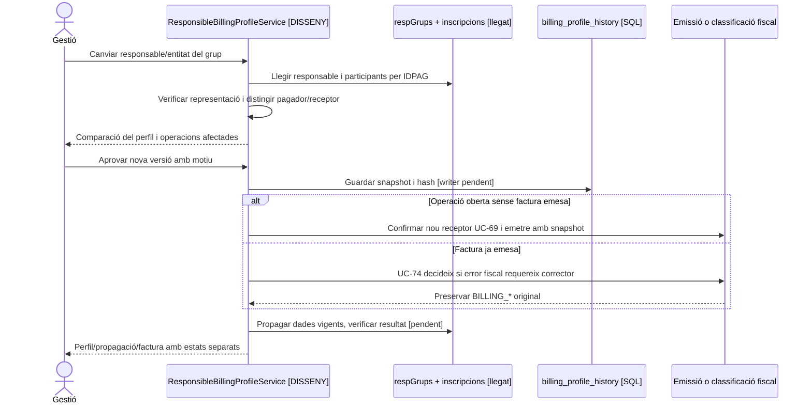

# UC-41 · Crear o editar entitat i responsable abans de facturar

**Propòsit del catàleg:** el canvi afecta les dades prèvies; la factura ja emesa **no s'edita**. Separar responsable de grup, participant, pagador i receptor fiscal és imprescindible.

## Evidència PHP i SQL

`LegacyGroupSnapshotRepository::loadByIdpag()` busca participants `TIPUS_INSC='G'` per `IDPAG` i obté el responsable de `respGrups` amb el mateix `IDPAG`. `LegacyGroupInvoicePayloadBuilder::billing()` construeix el **receptor fiscal** a partir de `NOM, COGNOMS, DNI, CORREU, ADRECA, Codi_Postal, Poblacio` del responsable; crea línies per inscrit i relacions `INSCRIPCIO` amb `visible_alumne=0`. Això **no prova** que el responsable que figura al llegat sigui sempre el pagador o receptor jurídicament correcte: cal confirmar el mandat i la identitat del receptor abans de l'emissió.

La taula `billing_profile_history` **està definida a SQL** amb subjecte, versió, snapshot, hash, vigència, motiu i actor; `personal_data_change_request` permet documentar peticions i propagació. **No s'ha acreditat** un servei PHP complet d'edició/versionat d'entitats i responsables que integri aquestes taules amb `respGrups`, permisos i congelament fiscal. `InvoiceRepository` registra `BILLING_*` de la factura emesa; no s'ha d'actualitzar per un canvi posterior del perfil.

## Contracte funcional

| Moment | Regla específica |
| --- | --- |
| Alta d'entitat | Registrar tipus de subjecte (persona/empresa, segons model aprovat), nom/raó social, identificació fiscal validada, adreça, contacte, representant, actor i origen. Un email de contacte **no demostra representació**. |
| Designar responsable de grup | Relacionar explícitament el responsable amb `IDPAG`, grup i participants, i verificar qui ha acceptat pagar i qui ha de ser el receptor fiscal. No inferir que cada alumne és deutor de la factura de grup. |
| Edició **abans** d'emetre | Versionar el perfil, mostrar comparativa abans/després, revalidar destinatari i snapshot UC-69/112; si canvien dades materials després de crear una intenció Redsys, no reutilitzar-ne `DS_ORDER` amb snapshot diferent. |
| Edició **després** d'emetre | Modificar només el perfil vigent per a futures operacions, conservant receptor i dades `BILLING_*` històriques. Un error del document original deriva a classificació UC-74/93, mai a `UPDATE factura`. |
| Pagaments i accés | Canviar responsable/entitat no reassigna `UUID_PAYMENT`, no crea `CHARGE/REFUND` ni dóna al participant permís sobre una factura d'empresa. La titularitat i els imports individuals requereixen decisió independent. |

### Flux proposat

1. L'operador cerca l'entitat i el grup pels **identificadors originals** i comprova duplicitats/conflictes UC-126; no fusiona responsables perquè comparteixin email o `IDPAG`.
2. Consulta operacions obertes, factures emeses, responsable llegat, participants, pagador i estat de cobrament. Presenta abans/després i identifica si l'edició afecta **perfil actual** o **factura ja emesa**.
3. Verifica documentació de representació i autorització; desa una versió de perfil amb hash/motiu i la petició de propagació (writers pendents). En un grup, comprova el receptor real **per operació** abans de congelar el payload.
4. Si l'operació és oberta, UC-69/112 aprova el nou snapshot i UC-01/04 emet després. Si la factura existeix, només UC-74 decideix document o registre corrector; la dada llegat canviada no altera retroactivament el fiscal.
5. Sincronitza el perfil vigent a la destinació autoritzada i verifica resultat; si falla `respGrups`, deixa incidència en lloc de presentar el receptor de la factura anterior com a modificat.

**Proves:** dues persones amb el mateix correu; empresa pagadora diferent de responsable acadèmic; tres inscrits i un receptor fiscal; canvi de NIF després de factura; ordre TPV antiga i perfil nou; dos operadors editant simultàniament; propagació llegada fallida.

### Pantalla llegada «Genera/Edita entitats»: camps, responsables i factura anterior

**Ruta i implementació identificades.** `/alumnes/genera-entitat/` carrega `alumnes-genera-entitat.php` i `alumnes-genera-entitat.js`; `ajax/alumnes/generaEntitats.php` invoca `creaEmpresa_Alumnes($rao,$cif,$adreca,$cp,$poble,$nomResp,$cogResp,$correu)`, el modal d'edició passa per `mostrarModalEditaEntitat_Entitats.php` i la modificació usa `actualitzaEditaEntitat.php` → `actualitzaEditaEntitat_Alumnes(...)`. La pantalla distingeix `CIF, RAO, ADRECA, CP, POBLACIO` de l'entitat de `NOM, COGNOMS, CORREU` de la **persona que la gestiona**. La consulta d'entitats combina `entitats` i `entitats_resp`; `updEntitatResp` pot tancar la vigència d'un responsable amb `DATAF=CURRENT_TIME`. Aquest és el circuit antic documentat, **no** prova que `billing_profile_history` s'empleni avui.

**Riscos puntuals que cal corregir en l'adaptador.** El formulari comprova camps obligatoris a JS i `tePermisEdicio`, però les fonts no acrediten validació de format fiscal/postal/correu ni detecció de duplicat per CIF al servidor. La creació envia `POST`; **l'edició envia `GET` amb CIF, adreça i correu a l'URL**. Cal passar la modificació a una acció autenticada i autoritzada al servidor, amb cos adequat, validació, comparació amb la versió activa i auditoria, sense considerar el control visual com a permís suficient. El modal rep `idEntitat` i `idResponsable`, però l'actualització posterior envia només `idEntitat`: **verificar com es resol el responsable destinatari** abans de donar per garantida la seva modificació i no inventar una cardinalitat única/obligatòria de responsables actius.

**Impacte sobre la factura prèvia.** A «Generar factura abans de pagar» l'entitat s'ha de seleccionar per **ID intern**, després carregar `CIF`, raó i domicili fiscals i congelar un snapshot de **receptor d'aquella operació**, separant-lo de `CORREU` del contacte que rebrà avisos. Si l'entitat ja figura en factures SIF, avisar que canviar-ne la fitxa afecta **futures** factures, no `factura.BILLING_*` ni els PDFs originals. Si la factura antiga ja contenia un CIF o una raó social erronis, derivar a UC-74/05 després de classificació; no «corregir-la» modificant `entitats`.

### Proves específiques de l'alta/edició llegada (no executades)

| ID | Escenari | Resultat exigible |
| --- | --- | --- |
| EN-41-01 | Crear entitat amb CIF duplicat o malformat | Validació i alerta al servidor abans de crear; no dependre només del JS. |
| EN-41-02 | Editar responsable amb `idResponsable` diferent del que és actiu | Identitat i vigència resoltes explícitament; no editar el contacte equivocat. |
| EN-41-03 | Canvi d'entitat enviat a URL amb dades fiscals | Ruta futura no accepta modificació via GET ni exposa dades en URL. |
| EN-41-04 | Contacte d'empresa diferent del receptor fiscal | Destinatari de comunicació validat i `BILLING_*` de l'entitat correctes. |
| EN-41-05 | Entitat amb factura emesa i modificació posterior de CIF | Perfil futur versionat; factura antiga intacta i classificació si contenia error. |

## UML de casos d'ús

### Vista de casos d’ús per a GitHub (Mermaid)

## UML de classes

## UML de seqüència — canvi abans o després d'emetre

## Traçabilitat

[UC-41 original](../06-fitxes-funcionals/uc-041.md) · [UC-69 confirmar receptor](uc-069-confirmar-congelar-dades-fiscals.md) · [UC-74 correcció](uc-074-classificar-correccio-fiscal.md) · [UC-126 identitat](uc-126-identitat-contacte-conflicte-sistemes.md) · [LegacyGroupSnapshotRepository](../../sif/src/Repository/LegacyGroupSnapshotRepository.php) · [LegacyGroupInvoicePayloadBuilder](../../sif/src/Service/LegacyGroupInvoicePayloadBuilder.php) · [Migració billing_profile_history](../../sif/database/migrations/2026_09_15_000003_add_functional_audit_control.sql) · [Migració personal_data_change_request](../../sif/database/migrations/2026_09_16_000005_add_operation_lifecycle_tables.sql).
