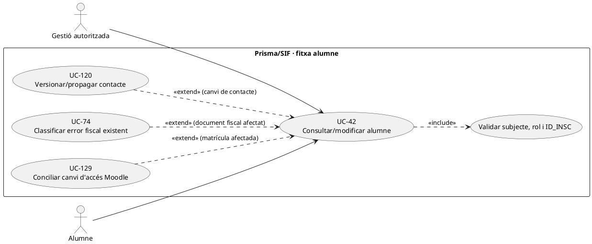
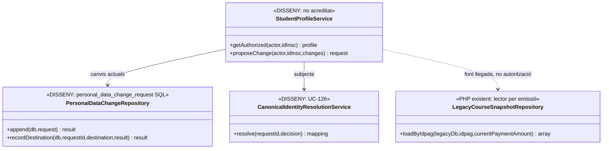
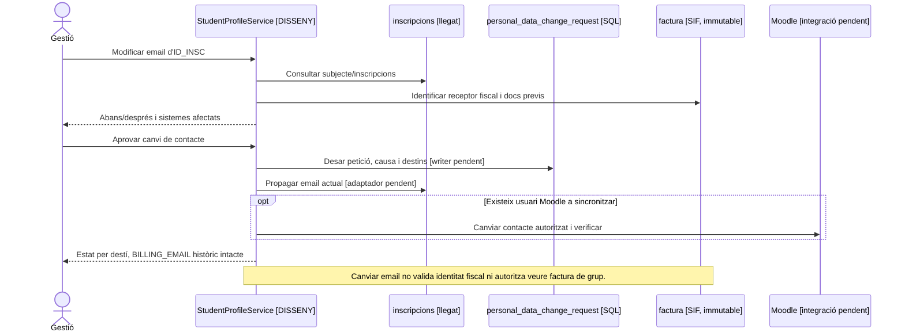

# UC-42 · Consultar i modificar la fitxa operativa d'un alumne

**Objectiu del catàleg:** fitxa operativa de l'alumne; els canvis amb impacte fiscal deriven a un flux específic. **Estat [DISSENY/PARCIAL].** No equiparar el perfil acadèmic, el participant de la factura i el receptor o pagador.

## Evidència contrastada

`LegacyCourseSnapshotRepository::loadByIdpag()` recupera camps de `inscripcions` (`ID`, `NOM`, `COGNOMS`, `DNI`, `CORREU`, adreça, `ANY/MES/CURS`, `FACTURA_RELACIONADA`, `A_PAGAR`, `PAGAMENT`, etc.) per construir **un snapshot d'emissió**, no una API completa de consulta/edició d'alumnes. `LegacySyncRepository::syncInscripcioSummary()` només escriu `FACTURA_RELACIONADA` amb `COALESCE` i concatena dades fiscals a `OBSERVACIONS`; **no modifica el perfil, comprova identitat ni actualitza Moodle**. `personal_data_change_request` està definida a SQL amb `SUBJECT_KEY`, `CHANGESET_JSON`, revisió i resultats de propagació; no s'ha acreditat un servei PHP complet de gestió de dades personals al SIF.

## Fitxa funcional

| Operació | Regla específica |
| --- | --- |
| Consultar | Autoritzar operador/alumne per **subjecte i `ID_INSC`**; veure inscripcions i estat acadèmic corresponents. Els documents de grup amb `VISIBLE_ALUMNE=0` i les dades de pagador empresa no són visibles pel sol fet de pertànyer al grup. |
| Modificar contacte | Previsualitzar valor original/nou de nom de contacte, email, telèfon o adreça segons origen verificat; UC-126 resol identitats amb emails compartits i UC-120 governa petició/versionat/propagació. |
| Modificar identificació fiscal | Distingir dada actual de l'alumne i **receptor d'una factura ja emesa**. Si s'ha emès factura, preservar `BILLING_*` i classificar error fiscal per UC-74/93; no editar directament la factura. |
| Modificar curs/edició/baixa | No és un canvi de perfil: remetre a UC-71/72/124/129, amb plaça, accés, factura i titularitat econòmica per inscripció. |
| Diners i consentiment | Editar la fitxa no crea `CHARGE/REFUND`, no traspassa saldo, no subscriu l'alumne a comunicacions comercials (UC-125) ni prova que `A_PAGAR` sigui l'import bancari real. |

### Flux proposat

1. Resoldre subjecte canònic i `ID_INSC` abans de mostrar dades; distingir rol de gestió i rol d'alumne sense exposar factures d'empresa.
2. Comparar perfil actual de Prisma, propostes i estat d'operacions obertes; registrar camp, font, motiu, actor i versió. La BD llegada pot tenir una adreça actual distinta de la que consta a la factura emesa.
3. Per contacte simple, aprovar UC-120 i propagar amb resultat per destinació; si hi ha conflicte d'identitat, UC-126 exigeix resolució abans de fusionar dades.
4. Si el camp afecta el receptor fiscal de document existent, **separar** correcció fiscal de perfil acadèmic; una factura original i el seu hash no es reescriuen. Si afecta Moodle, remetre a UC-129 i verificar matrícula real.
5. Després de cada canvi, rellegir destinacions i mostrar estat parcial/pendent; un `UPDATE inscripcions` o nota a `OBSERVACIONS` no certifica sincronització global.

**Proves:** dues matrícules i correu compartit, factura pagada per empresa, alumne sense dret a PDF grup, canvi de DNI després de factura, Moodle inaccessible, canvi acadèmic sense efecte econòmic, modificació concurrent del contacte.

### Pantalla real «Consulta - Modifica alumne» i accions que no són edicions personals

**Circuit recuperat.** `/alumnes/mostrar-alumne/` correspon a `alumnes-mostrar-alumne.php` i `Intranet::__mostrarPage_Alumnes_MostrarAlumne()`. La cerca passa per `buscarUsuaris()`/`searUserByParam()`, la llista per `mostrarTaulaUsuaris_Alumnes()`/`mostrarTaulaUsuaris2_Alumnes()` i la fitxa per `mostrarInformacioUsuari_Alumnes()`. `__mostrarDadesPersonals_resultatCerca()` i `guardarDadesPersonals_resultatCerca()` tracten dades personals; la documentació funcional antiga precisa que **aquestes edicions operatives només afecten inscripcions pendents de començar**. No suposar que una modificació del correu o DNI ha actualitzat totes les edicions, la BD fiscal o Moodle.

**Una fitxa amb subfluxos de naturalesa diferent.** La pantalla agrupa cursos pendents/actius/acabats/congelats, observacions i icones per veure la informació, canviar de curs, donar de baixa, consultar factura o certificat. Una icona atenuada al navegador **no és un bloqueig d'autorització al servidor**. El modal `guardarDadesPagament_modalsresultatCerca()` pot editar directament `A_PAGAR`, `PAGAMENT`, `DATA PAG`, `IDPAG`, `FRACCIO` i `FACTURA_RELACIONADA`: això **no és una edició personal** i s'ha de derivar a UC-62/02/73/74/105 segons el fet real. El canvi de curs i la baixa s'han de tramitar per UC-71/72 amb efectes fiscal/econòmic/acadèmic separats.

**Dada personal actual vs factura emesa.** Si s'edita `NOM/COGNOMS/DNI/ADRECA` de l'alumne que és **receptor fiscal** d'una factura ja emesa, presentar avís d'històric i conservar `factura.BILLING_*` i el PDF original. Si l'empresa és receptora d'una factura de grup, editar el DNI o correu d'un participant **no** el converteix en receptor ni li obre el PDF fiscal complet. La correcció d'un error de receptor/concepte fiscal és una decisió de UC-74/05, no `guardarDadesPersonals_resultatCerca()`. Si el canvi afecta accés acadèmic o Moodle, registrar-ne propagació per destinació, no donar-la per feta amb l'UPDATE de les inscripcions futures.

### Proves de fitxa multicanal (no executades)

| ID | Escenari | Resultat exigible |
| --- | --- | --- |
| AL-42-01 | Canviar correu amb una inscripció acabada i una de pendent | Mostrar abast real del canvi llegat i destins pendents, no assumir propagació universal. |
| AL-42-02 | Alumne de grup vol «Veure factura» d'empresa | Estat mínim autoritzat, no PDF complet per compartir inscripció/IDPAG. |
| AL-42-03 | Canviar DNI després de factura individual emesa | Perfil actualitzat segons procediment, factura original intacta i avís/expedient si hi ha error fiscal. |
| AL-42-04 | Modal de pagament modifica import sense moviment bancari | Derivar a ajust justificat; no crear CHARGE ni editar factura per l'UPDATE llegat. |
| AL-42-05 | Botó d'edició ocultat al navegador però endpoint invocat directament | Permisos de consulta i mutació verificats al servidor. |

## UML de casos d'ús

## UML de classes

## UML de seqüència — email actual amb factura antiga

## Traçabilitat

[UC-42 original](../06-fitxes-funcionals/uc-042.md) · [UC-120 dades personals](uc-120-canvi-dades-personals-propagacio.md) · [UC-126 identitat](uc-126-identitat-contacte-conflicte-sistemes.md) · [UC-129 Moodle](uc-129-reconciliar-prisma-moodle-matricules.md) · [UC-74 correcció](uc-074-classificar-correccio-fiscal.md) · [LegacyCourseSnapshotRepository](../../sif/src/Repository/LegacyCourseSnapshotRepository.php) · [LegacySyncRepository](../../sif/src/Repository/LegacySyncRepository.php) · [Migració personal_data_change_request](../../sif/database/migrations/2026_09_16_000005_add_operation_lifecycle_tables.sql).

## 8. Contrast visual i traça d'accions de la fitxa alumne

**Set captures de la pantalla real** `/alumnes/mostrar-alumne/` rebudes el 22/09/2026, indexades **sense publicar els originals amb dades personals**: [auditoria visual, matriu d'accions i 6 diagrames d'activitat actual/final](00-captures-auditoria-alumnes-consulta-modifica-2026-09-22.md).

La captura de la pàgina revela cerca bàsica/avançada, dades personals editables, inscripcions pendents/acabades, «Mostra tots els registres», observacions generals i icones per fila (consulta, canvi de curs, baixa, factura i certificat). Dues captures del modal «Dades del curs» mostren dades acadèmiques, personals de la **inscripció** i pagament separades; una altra mostra factura; i dues més mostren els formularis de baixa i de canvi de curs **abans d'executar-los**. No assumir que totes les imatges pertanyen a la mateixa inscripció, ni que un camp `PAGAMENT` a la UI constitueix un cobrament verificat.

**Traça del codi existent:** [`alumnes-mostrar-alumne.php` L47–48](../../codi-drive/intranet-actual/alumnes-mostrar-alumne.php#L47-L48) carrega el JS **minificat**; [JS llegible L821–900](../../codi-drive/intranet-actual/js/alumnes-mostrar-alumne.js#L821-L900) documenta el botó de tots els registres i els modals; [L1009–1115](../../codi-drive/intranet-actual/js/alumnes-mostrar-alumne.js#L1009-L1115) separa edició de dades d'inscripció de dades de pagament. Comparar el minificat servit i el JS llegible abans de donar per demostrada la coincidència de cada handler al desplegament. «Mostrar factura» és consulta UC-007, **no emissió fiscal**.

**Límits dels UC:** UC-042 comprèn consulta/edició de la fitxa operativa i observacions; les accions de baixes corresponen a UC-027/072; el canvi de curs/edició a UC-026/071; moviment de fons a UC-105 i factura a UC-007/074 segons el fet real. La casella de «No enviar correu» forma part dels formularis visibles, no acredita que s'hagi enviat o suprimit un correu. El modal «Previsualitza el canvi» és anterior a la confirmació i a l'execució: **cap canvi efectiu es pot donar per acreditat només amb aquesta captura**.

**Estat de completitud:** evidència visual indexada i diagrames per pantalla + subfluxos baixa/canvi; falta veure variants de cerca avançada, formularis d'edició i de confirmació, comprovar el desplegament, autorització per objecte i executar proves. No publicar les captures originals al GitHub públic, ni substituir dades personals dels originals per dades aparentment reals a la documentació.

